# 自然语言处理 阅读报告（Attention Is All You Need）

> group：龙浩泉、李宇哲、李乐琪
>
> 小组合作及分工：
>
> - 

## 一、背景介绍（background information）

### 1.1 自然语言处理技术及分类

#### 1.1.1 自然语言处理问题

自然语言处理是 

> 用计算机对自然语言的形、音、义等信息进行处理。即与字、词、句、篇章的输入、输出、识别、分析、理解、生成等的操作和加工

如何建模语言？

>人类语言是一种上下文相关的信息表达方式，因此要让机器能够处理自然源，就要先为其建立数学模型，这个模型被称为 `统计语言模型`
>
>- 即判断一个文字序列是否能够构成人类能理解并且有意义的句子

对于语言这种序列模型，每一个输入$x_t$与其前序的输入 $x_1,...x_{t-1}$有关，因此直接用mlp或者CNN这样的认为每个输入之间是独立的模型会失去输入之间的联系。

假设在单词级别对文本数据进行词元化
$$
P(x_1,...,x_T) = \Pi_{t=1}^{T}P(x_t|x_1,...,x_{t-1})
$$


- 任意一个输入词语$x_i$出现的概率都取决于它前面出现的所有词
- 但随着文本长度的增加，$P(x_t|x_1,...,x_{t-1})$与太多前序输入有关，很难计算，因此实际计算长假设每次输入词元的概率仅和其前序N个词元有关

$$
P(x_i|x_1,x_2,...,x_{i-1}) = P(x_i|x_{i-N+1},..,x_{i-1})
$$

这种假设即**markov假设**，对应的语言模型称为**N-gram模型**

高阶的语言模型需要用RNN、LSTM、GRU、Transfomer等模型去捕捉词语之间的长程依赖性

#### 1.1.2 自然语言处理技术分类

自然语言处理技术可分为

- 基础技术
- 应用技术

其中基础技术包括：

- 词法与句法分析、语义分析、语用分析、篇章分析等

应用技术包括：

- 机器翻译、信息检索、情感分析、自动问答、自动文摘、信息抽取、信息推荐与过滤、文本分类与聚类、文字识别等

**而transformer最初提出是基于nlp中的机器翻译问题**，但transformer架构后续在许多其他领域也有显著应用，作者在conclusion中预测到了这一点

### 1.2 机器翻译

**机器翻译（Machine Translation）**

> • 通过特定的计算机程序将一种书写形式或声音形式的自然语言，翻译成另一种书写形式或 声音形式的自然语言

方法

- 基于理性的研究方法——基于规则的方法
- 基于经验的研究方法——基于统计的方法
- 与深度学习相结合

而transformer属于与深度学习相结合，基于神经网络，使用编码器-解码器结构，并将原先主流的RNN，LSTM等layer替换成了self-attention机制，在encoder中使用了一种attention，在decoder中使用了两种attention，来解决英语——德语翻译（WMT2014）这个数据集问题

### 1.3 background in paper

在论文研究之前，主流的序列转换模型都是基于复杂的循环神经网络（RNN）或卷积神经网络（CNN），且都使用了 encoder-decoder架构。表现比较好的模型是通过attention机制把encoder和decoder连接。

而这篇文章是在做 sequence -> sequence 的生成，且之基于单独的attention机制，而完全避免使用RNN或者CNN

- RNN处理序列数据时，每个时间步的计算依赖于前一个时间步的隐藏状态，因此必须按时间步顺序执行，在分布式训练中的**关键路径**较长，导致并行化训练比较差

  现有GPU等硬件在处理大规模并行计算比较高效，但RNN是顺序计算的，无法充分利用硬件的并行计算能力。

  因此如果能够在encoder-decoder架构中避免使用RNN，会在训练时间上有不错的提升

  >LSTM和GRU相较于Transformer，只是引入了门控机制，缓解了RNN的梯度消失和梯度爆炸，并没有解决并行性差的问题，而transformer这种基于attention的机制，可以解决这一问题，具体原因在后续会有说明

- CNN

  CNN是通过kernel（卷积核）捕获局部特征，而attention机制能够捕捉序列中任意两个元素之间的依赖关系，相较于卷积层会更适合序列

  同样，self-attention允许对整个序列进行并行处理，但CNN的卷积操作需要在不同layer之间传递信息，如果要捕捉长距离依赖关系，需要多层layer，用多个pattern去捕捉，并行性交叉

  同时，长序列问题中，CNN可能出现长距离依赖问题，只基于attention的transformer会有更好的表现

#### RNN

>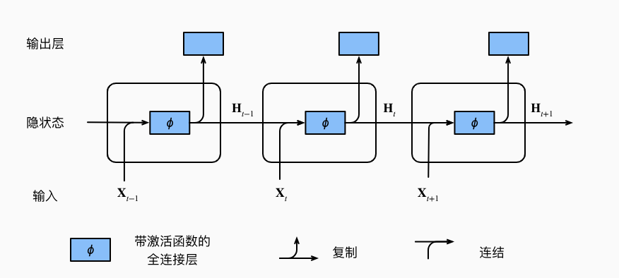
>
>具有隐状态的循环神经网络
>
>假设在时间步t 有小批量输入 $X_t \in R^{n \times d}$，为一个样本
>
>$H_t \in R^{n \times h}$表示时间步t的隐藏变量，同时保存起哪一个时间步的隐藏变量 $H_{t-1}$
>
>有两个可以学习的权重参数 $W_{hh} \in R^{h \times h}， W_{xh} \in R^{x \times h}$
>
>隐藏变量的计算 
>$$
>H_t = \phi(X_tW_{xh} + H_{t-1}W_{hh} + b_h)
>$$
>输出
>$$
>O_t = H_t W_{hq} + b_q
>$$

#### CNN

>卷积神经网络通过卷积层（Convolutional Layer）提取局部信息，池化层（Pooling Layer）做汇聚操作
>
>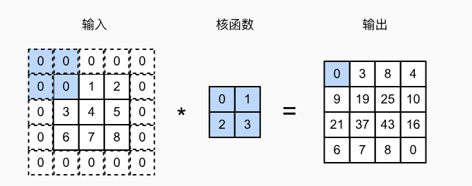
>
>比如这是一个卷积核的核函数，大小是 $2\times 2$，每个卷积层做互相关运算，用于提取pattern
>
>CNN通过卷积层（Convolutional Layer）和池化层（Pooling Layer）构建而成，具有对图像等二维数据进行特征提取和模式识别的能力

#### 注意力机制

>注意力机制源自心理学中的自主性提示和非自主性提示，映射到attention中，每一个意志线索是一个query，查询所有的键值对（key-value）
>
>value量度一个query和当前key的相似程度
>
>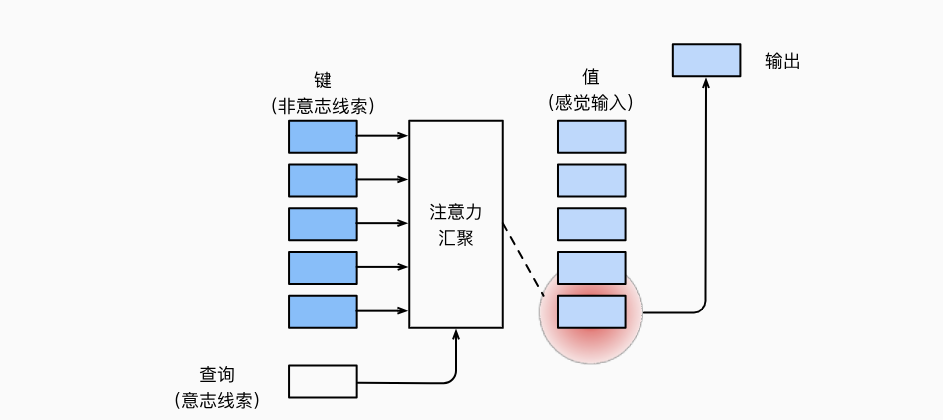
>
>transformer中用到了点积注意力和自注意力
>
>- 点积注意力：
>
>  计算查询向量和key之间的点积，然后将结果进行归一化得到注意力权重
>
>- 自注意力：
>
>  输入和输出都来自同一个新序列，用于建模序列内部的依赖关系

Transformer在WMT2014 英语-德语翻译任务上去得了 28.4的BLEU评分，在当时表现最好的模型的基础上提高了2个BELU评分

在WMT2014英语-发育翻译任务上去得了41.8个BLEU评分

原论文的实验是采用 8张 P100 训练了3.5天。由于我们并没有足够的资金租到相应的计算资源，所以我们是在单卡（3090）下训练其小数据集，至于分布式训练的方式和策略，会在后续有所探索，但并没有实际使用

#### BLEU

>BELU score是一种常用的机器翻译质量评估指标，用于衡量机器翻译结果与参考翻译之间的相似度。
>
>BLEU分数通过计算译文和参考翻译之间的n-gram重合程度来评估
>
>具体计算步骤
>
>- n-gram匹配
>
>  n-gram已经在1.1中有所说明，BLEU分数通过计算机器翻译结果中n-gram与参考翻译这种n-gram的匹配情况来评估翻译质量
>
>  比如在下面这个我们实际训练的结果中
>
>  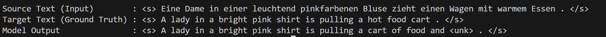
>
>  1-gram就是每个单词出现在参考翻译中的次数比如lady是1，而and是0
>
>- 精确度（precision）
>
>  计算译文中匹配的n-gram的数量与总-gram数量的比率。例如，1-gram精确度是译文中匹配的1-gram数量除以译文中总的1-gram的数量
>
>- 长度惩罚（Brevity Penalty，BP）
>
>  BLEU分数包含一个长度惩罚因子，以避免机器翻译通过生成果断的译文来获取高分
>
>  $ BP = \begin{cases}  1 & \text{if } c > r \\ e^{(1 - r/c)} & \text{if } c \leq r  \end{cases} $
>
>- BLEU分数计算
> $$
>  BLEU = BP \cdot \exp(\sum_{n=1}……{N}w_i\log p_n)
> $$
>
>  - $p_n$是n-gram精确度
>  - $w_n$是权重

### 1.4 transformer

transformer使用self-attention机制，将一个序列的不同位置联系起来，以计算序列的表示。

self-attention会在后续3.1 Architecture中详细说明

## 二、现有研究方法、局限性及研究优越性

### 2.1 论文背景下研究方法

机器翻译需要进行序列建模和转换，对于语言模型和机器翻译。transformer提出之前，多用 RNN、LSTM、GRU等模型，基于encoder-decoder架构进行研究

transformer提出之前，机器翻译领域主要采用

- 基于统计的方法
- 基于神经网络的方法

比如

- 统计机器翻译（SMT）：利用统计建模，大规模的双语平行语料进行训练
- 基于短语的机器翻译
- NMT，在神经网络框架爱喜爱进行机器翻译的方法，NMT直接将源语言句子映射到目标语言句子的过程作为一个端到端的神经网络模型进行学些和预测
- 基于记忆的神经机器翻译

### 2.2 论文背景下局限性

在Transformer提出之前，这些方法在处理长序列，长距离依赖关系，还有并行训练和时间等方面存在一定的局限性，原因在1.3节已经有过阐述

### 2.3 transformer的优越性

transformer完全使用self-attention机制计算其输入和输出表示，放弃了原有的RNN layer，从而提高的计算的可并行化

#### 为什么选择 self-attention

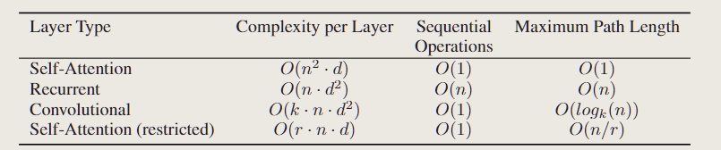

论文中比较了四种层下的计算复杂度、顺序计算（比较难并行化）、信息从一个数据点到另一个数据点的距离

对于self-attention的算法复杂度是 $o(n^2 \cdot d)$，顺序计算是$O(1)$的，所以比较好并行化，任何一个query和一个很远的key-value pair只需要一次计算就能将信息传递过来，因此，max-mum Path Length也是 $O(1)$的

相较于RNN的顺序计算是$O(n)$，难以并行化，而且对长序列的输入表达能力并不好

CNN的信息传递是$O(log_k(n))$的，会比RNN好一些

可以发现，self-attention对于处理长序列，和可并行化，信息的融合性比较好

>但attention对数据的假设做的更少，需要更大的模型和更多的数据才能训练处和RNN，CNN同样的效果，因此目前基于Transformer的模型通常比较大

### 2.4 现有机器翻译研究方法

在Transformer模型提出之后，机器翻译领域的研究方法主要集中在改进和优化Transformer模型及其各个组件

包括改进模型结果，使用多层和深层的模型，进行模型的压缩和加速，改进注意力机制，改善序列建模技术等

## 三、论文主要内容

### 3.1 Architecture（模型架构）

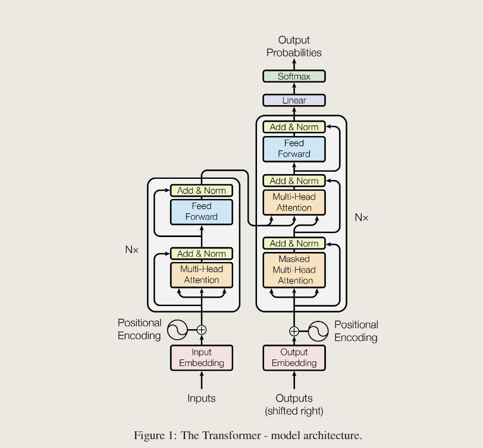

Transformer的模型结构如上，

encoder将符号表示的输入序列 $(x_1,...,x_n)$映射成一个连续表示的序列 $z = (z_1,...,z_n)$

给定z，decoder将一次生成一个字符，逐渐将所有的输出序列 $(y_1,...,y_m)$生成，每次在生成下一个字符时，将之前生成的符号作为附加输入

>这种模型叫自回归的（autoregressive models）
>
>序列需要预测 $P(x_t|x_{t-1},...x_1)$即$x_t$之前的所有的输入都对$P(x_t)$有影响，但在相当长的序列中$x_{t-1},..,x_1$可能是不必要的，我们只需要满足某个长度为$\tau$的时间跨度就可以了，即使用观测序列 $x_{t-1},...,x_{t-\tau}$，这就是自回归的
>
>这里论文中所说的auto-regressive是一种广义的，即当前数据的产生用到先前的数据

#### 3.1.1 word embedding（嵌入层）


##### embedding理解

word embedding是将输入序列中的单词转换为连续向量表示，使得模型可以处理和理解数据中的语义信息

有两个步骤

- 词元化tokenize+建立词汇表vocabulary
- 嵌入层：将输入序列中的每个单词索引映射到权重矩阵中的每一行，得到对应的embedding向量

>embedding是将高维空间的一个向量投射到低位空间
>
>- 如果将矩阵运算看做空间坐标系的变化，权重矩阵就是两个坐标系间映射的标准
>
>将token经过嵌入矩阵投射到潜空间，而潜空间是一个语义空间，可以衡量两个不同的token之间语义的差别，因此可以让后续的模型去处理
>
>机器翻译任务是需要得到两种不同语言的潜空间，在统一的潜空间上找到语义之间的联系从而实现翻译，保持语义一致
>
>嵌入之后，每一个向量的维度代表了一个独立的基础语义，从数学的角度，某个维度上值越大可能说明这个向量更接近某种语义

因此，经过word embedding之后，就可以将原始序列输入转化为可以表达语义的tensor，从而进行后续训练

而这两个嵌入矩阵也是需要学习的

##### embedding实现

```python
class Embeddings(nn.Module):
    def __init__(self, d_model, vocab):
        super(Embeddings, self).__init__()
        self.lut = nn.Embedding(vocab, d_model)
        self.d_model = d_model

    def forward(self, x):
        return self.lut(x) * math.sqrt(self.d_model)
```

前向传播方法中将嵌入向量以 $\sqrt{d_{model}}$进行缩放，从而将嵌入向量的数值范围调整到合适模型训练的初始阶段

在`EncoderDecoder`模块中对输入的序列数据直接进行embedding，从而可以进入后续模型计算

#### 3.1.2 encoder-decoder结构

##### 保留 encoder-decoder结构的原因

在人类进行语言翻译中，常将一两种语言对应于同一个实体

>比如中文的苹果，和英文的apple，会和这个具体的水果对应，从而联系语义

而机器翻译中，我们无法找到这样一种实体供机器去学习，只能用纯文本做对应，需要通过大量文本的上下文去确定词语词之间的关系

encoder和decoder中的code即是 语义关系，需要数字化之后，通过一种策略提前不同token之间的对应关系

>比如one-hot独热编码和tokenizer

Transformer依然保持 encoder-decoder结构

>引入encoder-decoder的结构是为了解决机器翻译的seq2seq问题中，输入语句的长短和输出语句的长短不同
>
>为了处理这种类型的输入和输出，我们可以通过encoder接受一个长度可变的序列作为输入，并将其转换为具有固定形状的编码状态
>
>通过decoder，将固定想合租那个的编码状态映射到长度可变的序列
>
>从而实现seq2seq中输入输出长度可变

##### encoder-decoder结构


原论文中

###### Encoder

Encoder是由6个完全相同的layer堆叠而成，每层有两个子层

- multi-head self-attention（多头自注意力）
- 前馈神经网络（实际上是一个mlp）

两个子层的每一层后采用残差连接（类似Resnet），然后进行layer normalization

>layer normalization 与 batch normalization的区别
>
>layer normalization是在层上做归一化，而batch normalization是在批量上做归一化
>
>BN：
>
>对于mini-batch中的每个特征，计算均值和方差并映射到 N~(0, 1)
>
>LN：
>
>对于每一个layer上的输入，计算每个样本的特征的均值和方差
>
>对于一个三维的tensor
>
>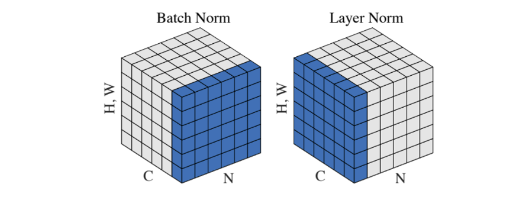
>
>在持续的序列中，每个样本的长度（sequence长度不同）会发生变化，如果每次以一个batch做切面，那么每个feature之间的空闲的位置需要用空填充，做归一化时会有很多填充的数据进行归一化，在样本长度变化比较大的时候，计算的是全局的均值和方差，因此算出来的方差和均值差别比较大。
>
>而layer norm对于每个样本求均值和方差，与其他的样本无关，所以sequence长度变化对均值和方差没有太多影响
>
>因此对于序列输入，用layer norm做归一化会好一点

###### Decoder

也由N = 6个完全相同的layer堆叠而成，除了每个编码器层中的两个子层之外，解码器还插入了第三个子层，对编码器的输出执行 multi-head attention

每个子层后面也使用残差连接和 layer normalization

##### encoderdecoder复现

encoder和decoder接收的是input和ouput经过embedding的数据

###### Encoder

```python
class Encoder(nn.Module):
    "Core encoder is a stack of N layers"

    def __init__(self, layer, N):
        super(Encoder, self).__init__()
        self.layers = clones(layer, N)
        self.norm = LayerNorm(layer.size)

    def forward(self, x, mask):
        "Pass the input (and mask) through each layer in turn."
        for layer in self.layers:
            x = layer(x, mask)
        return self.norm(x)
```

- 将layer模块clone N词得到一个包含N个相同层的列表
- 采用 layer norm做层归一化
- 前向传播用一个mask屏蔽无效的填充部分，或者未来信息，然后逐层传递

###### Decoder

```python
class Decoder(nn.Module):
    "Generic N layer decoder with masking."

    def __init__(self, layer, N):
        super(Decoder, self).__init__()
        self.layers = clones(layer, N)
        self.norm = LayerNorm(layer.size)

        def forward(self, x, memory, src_mask, tgt_mask):
            for layer in self.layers:
                x = layer(x, memory, src_mask, tgt_mask)
                return self.norm(x)
```

- `memory`是从编码器得到的输出
- `src_mask`是源语言序列的掩码
- `tgt_mask`是目标语言序列的掩码

#### 3.1.3 Attention

对transformer模型而言，attention机制是这个模型最重要的机制，论文采用了两种attention

- scaled Dot-Product Attention
- Multi-Head Attention

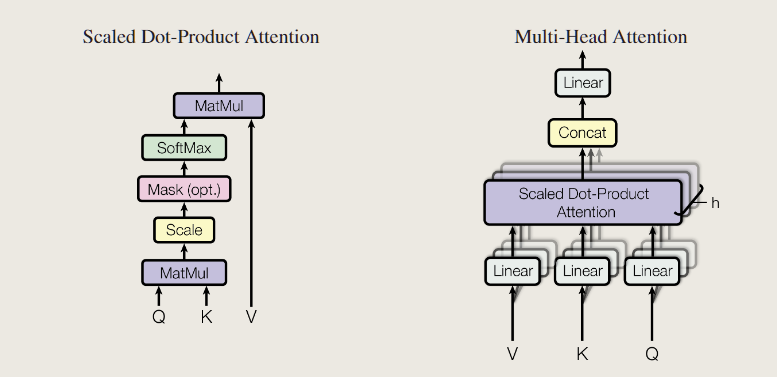

并在3处使用到了attention机制

##### 注意力机制

注意力是一个query和一些key-values对的映射，输出就是query在不同key上的权值和

>比如query在5个key上，与$k_2,k_3$比较相似，对应 $v_2,v_3$会大一些，其他的偏小

注意力机制的核心思想是计算一组注意力权重（attention weights），这些权重表示输入序列的各个部分对当前输出的重要程度。然后，通过加权求和的方式将这些重要部分的表示聚合起来，生成当前时刻的上下文向量（context vector）。

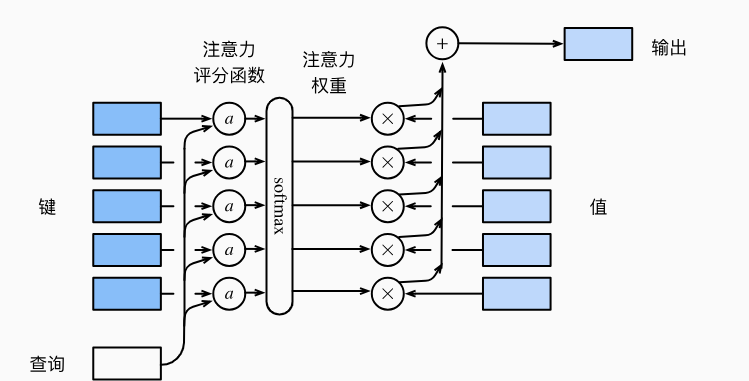

对于每一个查询 $q \in R^q$，m个键值对 $(k_1,v_1),...,(k_m,v_m)$

注意力汇聚函数f被表示成值的加权和

$f(q,(k_1,v_1),...,(k_m,v_m)) = \sum_{i=1}^{m}\alpha(q,k_i)v_i \in R^v$

而查询q和键$k_i$的注意力权重是通过注意力评分函数a将两个向量映射成标量，再讲过softmax运算得到
$$
\alpha(q,k_i) = softmax(a(q,k_i)) = \frac{\exp(a(q,k_i))}{\sum_{j=1}^m \exp(a(q,k_j))} \in  R
$$

##### 3.1.3.1 scaled Dot-Product Attention

使用点积可以得到计算效率更高的评分函数，点积操作要求查询和键具有相同的长度𝑑

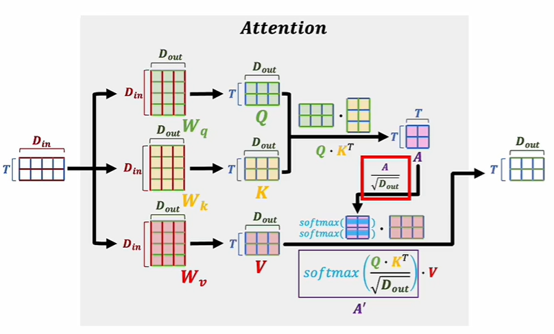

注意力机制要解决的是许多词出现在一起之后整体表现的语义，因此需要将多个词同时输入到模型，即输入矩阵D是一个多行的矩阵

将query写成一个矩阵 $Q$，key和value分别写成 $K$和 $V$

输入矩阵需要和三个矩阵 $W_q, W_k,W_v$矩阵想象成，得到三个矩阵 $Q,K,V$用于后续softmax计算
$$
Attention(Q,K,V) = softmax(\frac{QK^t}{\sqrt{d_k}})V
$$
$Q \cdot K^T$，相当于计算输入的词向量中两两之间的相关关系，经过softmax和缩放后变成(0, 1)之间的值，然后用这个得到的矩阵去修正输入的词向量矩阵V的每一个维度，当 $softmax(\frac{Q \cdot K^T}{\sqrt{D_{out}}})$计算出的矩阵某一个值 $A^`_{i,j}$比较大，说明第i个词向量和第j个词向量语义相似度比较大，就能用这个值来修正原先输入词向量矩阵V（经过一次变换）的每一维，从而表现出语义的相似性

缩放点积注意力机制比加性注意力机制的空间效率更高，同时快得多，因为可以用高度优化的矩阵乘法代码来实现

而缩放点积注意力机制除以 $\sqrt{d_k}$是为了让softmax的结果不要太向两端靠拢

对于$d_k$比较大时，softmax的结果会让点积的值比较大或者比较小，经过softmax之后接近1或者接近0，这样会导致梯度比较小，运行变慢，因此选择缩放而不是直接用点击注意力机制

而mask是为了避免在当前时刻看到以后时刻的输入，因此在scale之后做了一次mask

>对于$q_t$，应该只看到 $k_1,...,k_{t-1}$，不要用到后面的输入，但是输入是将所有的t都输入，所以需要用mask将后面的权重变成0，只会让t之间的值有效果

##### 3.1.3.2 Multi-Head Attention

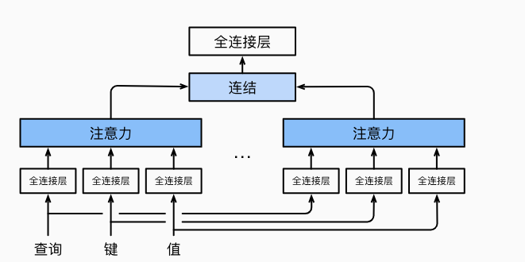

当给定相同的查询、键和值的集合时， 我们希望模型可以基于相同的注意力机制学习到不同的行为， 然后将不同的行为作为知识组合起来， 捕获序列内各种范围的依赖关系

dot-product里面可学的参数比较少，而多头注意力机制用到投影，可以去学习不同模式去匹配的相似函数

最后将多个输出连接起来通过一个mlp

论文中实际用到的h = 8，每次讲一个512维的输入（embedding之后）投影到一个64位的输出，经过注意力机制后，再连接通过mlp

计算公式
$$
MultiHead(Q,K,V) = Concat(head_1,...,head_h)W^O\\
where~head_i = Attention(QW_i^Q,KW_i^K,VW_i^V)
$$
相关代码实现如下

```python
class MultiHeadedAttention(nn.Module):
    def __init__(self, h, d_model, dropout=0.1):
        "Take in model size and number of heads."
        super(MultiHeadedAttention, self).__init__()
        assert d_model % h == 0
        # We assume d_v always equals d_k
        self.d_k = d_model // h
        self.h = h
        self.linears = clones(nn.Linear(d_model, d_model), 4)
        self.attn = None
        self.dropout = nn.Dropout(p=dropout)

    def forward(self, query, key, value, mask=None):
        "Implements Figure 2"
        if mask is not None:
            # Same mask applied to all h heads.
            mask = mask.unsqueeze(1)
        nbatches = query.size(0)

        # 1) Do all the linear projections in batch from d_model => h x d_k
        query, key, value = [
            lin(x).view(nbatches, -1, self.h, self.d_k).transpose(1, 2)
            for lin, x in zip(self.linears, (query, key, value))
        ]

        # 2) Apply attention on all the projected vectors in batch.
        x, self.attn = attention(
            query, key, value, mask=mask, dropout=self.dropout
        )

        # 3) "Concat" using a view and apply a final linear.
        x = (
            x.transpose(1, 2)
            .contiguous()
            .view(nbatches, -1, self.h * self.d_k)
        )
        del query
        del key
        del value
        return self.linears[-1](x)
```

##### 3.1.3.3 论文中注意力机制的应用

有三种不同的注意力层

###### encoder中的multiple-Head Attention

输入表示的是 key，value，query，同时key，value和query是同一个输入，即自注意力机制

输出是一个权重和，代表每个向量和别的向量的相似度

由于这里采用的是多头注意力机制，因此会学习出h个不同的投影

###### decoder中的masked multi-head attention

也是自注意力机制，在解码器中存在一个mask，使得当前时刻 $q_t$只会看到前t-1的信息，忽略后面的信息

###### decoder中的Multi-head attention

非自注意力层

key和value来自于encoder的输出，而query来自decoder上一个masked attention的输入

对解码器的每一个输出query，需要计算和编码器的输出的相似度

这里就体现出输出的翻译文本和输入的文本的相似度

>比如英文hello world翻译中文 你好 世界，对于解码器的中的 你 好这两个query会跟编码器中的 hello 的权重比较大

#### 3.1.4 Position-wise Feed-Forward Networks

实际上是一个两层线性层的mlp（全连接层），考虑注意力机制可能对复杂过程的拟合程度不够, 通过增加两层网络来增强模型的能力，实现一种语义汇聚

把同一个mlp对每一个输入序列中的token作用一次
$$
FFN(x) = max(0,xW_1 +b_1)W_2 +b_2
$$

- 先对输入进行一个线性变换

  $x' = W_1x + b_1$

- 非线性激活函数ReLU

  $x'' = ReLU(x')$

- 第二次线性变换

  $y = W_2x'' + b_2$

FFN是按每个位置独立进行的，在处理输入序列时，每个位置的输入向量都经过相同的前馈网络进行变换。对自注意力层的输出进行非线性变换，增强特征表示

相关代码实现如下

```python
class PositionwiseFeedForward(nn.Module):
    "Implements FFN equation."

    def __init__(self, d_model, d_ff, dropout=0.1):
        super(PositionwiseFeedForward, self).__init__()
        self.w_1 = nn.Linear(d_model, d_ff)
        self.w_2 = nn.Linear(d_ff, d_model)
        self.dropout = nn.Dropout(dropout)

    def forward(self, x):
        return self.w_2(self.dropout(self.w_1(x).relu()))
```

经过attention之后，序列信息已经被汇聚完成了，因此mlp只需要对每个单独的点运算就可以了

而RNN，需要传递序列信息，在每一个mlp不仅接受输入的序列，还需要上一个时刻的mlp的输出，一起作用于一个mlp层，从而传递序列之间的时序信息（把上一个时刻的输出传入下一个时刻做输入）

#### 3.1.5 Positional Encoding

attention机制并没有时序信息，输出是value的加权和，与序列信息无关。将一个序列任意打乱，attention无法察觉这种变化，而我们希望网络可以察觉到这种变化

因此positional encoding在输入里加入了时序的信息，每个词在不同的位置会有的不同的值

我们采用fourier变换中的sin，cos函数，对于一个512维度的输入向量，加入与位置有关的信息，从而将这种时序的信息向后续传递到模型中去

具体的公式如下
$$
PE_{(pos,2i)} = sin(pos/10000^{2i/d_{model}})\\
PE_{(pos, 2i+1)} = cos(pos/10000^{2i/d_{model}})
$$

- pos是不同token的位置
- i是维度

这样模型就可以通过相对位置来学习到时序信息

相关代码实现如下

```python
class PositionalEncoding(nn.Module):
    "Implement the PE function."

    def __init__(self, d_model, dropout, max_len=5000):
        super(PositionalEncoding, self).__init__()
        self.dropout = nn.Dropout(p=dropout)

        # Compute the positional encodings once in log space.
        pe = torch.zeros(max_len, d_model)
        position = torch.arange(0, max_len).unsqueeze(1)
        div_term = torch.exp(
            torch.arange(0, d_model, 2) * -(math.log(10000.0) / d_model)
        )
        pe[:, 0::2] = torch.sin(position * div_term)
        pe[:, 1::2] = torch.cos(position * div_term)
        pe = pe.unsqueeze(0)
        self.register_buffer("pe", pe)

    def forward(self, x):
        x = x + self.pe[:, : x.size(1)].requires_grad_(False)
        return self.dropout(x)
```

### 3.2 Training（训练策略）

## 四、实验结果与分析

### 4.1 数据集

### 4.2 对比模型

### 4.3 数据分析

### 4.4 复现结果

## 五、原论文transformer局限性及优化拓展

### 5.1 transformer局限性

### 5.2 VIT

### 5.3 对transformer开源代码的改进

## 六、Conclusion（总结）


