# 自然语言处理 阅读报告（Attention Is All You Need）

> group：龙浩泉、李宇哲、李乐琪
>
> 小组合作及分工：
>
> - 龙浩泉：实验报告六、七部分，以及：远程SSH服务器的环境配置，代码的分析理解、运行与结果复现，方法优化（VIT）的实现与对比
> - 李宇哲：实验报告 一、二、三部分，代码的分析理解
> - 李乐琪：实验报告四、五部分，代码的分析理解、运行与复现


## 一、背景介绍

### 1.1 自然语言处理技术

#### 1.1.1 自然语言处理问题

自然语言处理是 

> 用计算机对自然语言的形、音、义等信息进行处理。即与字、词、句、篇章的输入、输出、识别、分析、理解、生成等的操作和加工

如何建模语言？

>人类语言是一种上下文相关的信息表达方式，因此要让机器能够处理自然源，就要先为其建立数学模型，这个模型被称为 `统计语言模型`
>
>- 即判断一个文字序列是否能够构成人类能理解并且有意义的句子

对于语言这种序列模型，每一个输入$x_t$与其前序的输入 $x_1,...x_{t-1}$有关，因此直接用mlp或者CNN这样的认为每个输入之间是独立的模型会失去输入之间的联系。

假设在单词级别对文本数据进行词元化
$$
P(x_1,...,x_T) = \Pi_{t=1}^{T}P(x_t|x_1,...,x_{t-1})
$$


- 任意一个输入词语$x_i$出现的概率都取决于它前面出现的所有词
- 但随着文本长度的增加，$P(x_t|x_1,...,x_{t-1})$与太多前序输入有关，很难计算，因此实际计算长假设每次输入词元的概率仅和其前序N个词元有关

$$
P(x_i|x_1,x_2,...,x_{i-1}) = P(x_i|x_{i-N+1},..,x_{i-1})
$$

这种假设即**markov假设**，对应的语言模型称为**N-gram模型**

高阶的语言模型需要用RNN、LSTM、GRU、Transfomer等模型去捕捉词语之间的长程依赖性。


#### 1.1.2 自然语言处理技术分类

自然语言处理技术可分为

- 基础技术
- 应用技术

其中基础技术包括：

- 词法与句法分析、语义分析、语用分析、篇章分析等

应用技术包括：

- 机器翻译、信息检索、情感分析、自动问答、自动文摘、信息抽取、信息推荐与过滤、文本分类与聚类、文字识别等

**而transformer最初提出是基于nlp中的机器翻译问题**，但transformer架构后续在许多其他领域也有显著应用，作者在conclusion中预测到了这一点。


### 1.2 机器翻译

**机器翻译（Machine Translation）**

> 通过特定的计算机程序将一种书写形式或声音形式的自然语言，翻译成另一种书写形式或 声音形式的自然语言

* 方法：

  - 基于理性的研究方法——基于规则的方法

  - 基于经验的研究方法——基于统计的方法

  - 与深度学习相结合


而transformer属于与深度学习相结合，基于神经网络，使用编码器-解码器结构，并将原先主流的RNN，LSTM等layer替换成了self-attention机制，在encoder中使用了一种attention，在decoder中使用了两种attention，来解决英语——德语翻译（WMT2014）这个数据集问题。


### 1.3 论文研究背景

在论文研究之前，主流的序列转换模型都是基于复杂的循环神经网络（RNN）或卷积神经网络（CNN），且都使用了 encoder-decoder架构。表现比较好的模型是通过attention机制把encoder和decoder连接。

而这篇论文是在做 sequence -> sequence 的生成，且之基于单独的attention机制，而完全避免使用RNN或者CNN

- **RNN**

  - 处理序列数据时，每个时间步的计算依赖于前一个时间步的隐藏状态，因此必须按时间步顺序执行，在分布式训练中的**关键路径**较长，导致并行化训练比较差；

  - 现有GPU等硬件在处理大规模并行计算比较高效，但RNN是顺序计算的，无法充分利用硬件的并行计算能力；

  - 因此如果能够在encoder-decoder架构中避免使用RNN，会在训练时间上有不错的提升。


  >LSTM和GRU相较于Transformer，只是引入了门控机制，缓解了RNN的梯度消失和梯度爆炸，并没有解决并行性差的问题，而transformer这种基于attention的机制，可以解决这一问题，具体原因在后续会有说明

- **CNN**

  - CNN是通过kernel（卷积核）捕获局部特征，而attention机制能够捕捉序列中任意两个元素之间的依赖关系，相较于卷积层会更适合序列；
  - 同样，self-attention允许对整个序列进行并行处理，但CNN的卷积操作需要在不同layer之间传递信息，如果要捕捉长距离依赖关系，需要多层layer，用多个pattern去捕捉，并行性交叉；
  - 同时，长序列问题中，CNN可能出现长距离依赖问题，只基于attention的transformer会有更好的表现。


#### RNN

>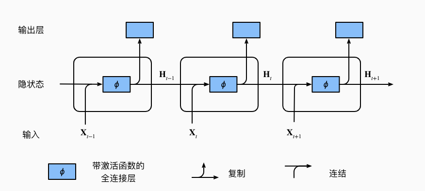
>
>* 具有隐状态的循环神经网络
>
>假设在时间步t 有小批量输入 $X_t \in R^{n \times d}$，为一个样本
>
>$H_t \in R^{n \times h}$表示时间步t的隐藏变量，同时保存起哪一个时间步的隐藏变量 $H_{t-1}$
>
>有两个可以学习的权重参数 ：
>$$
>W_{hh} \in R^{h \times h}， W_{xh} \in R^{x \times h}
>$$
>隐藏变量的计算 ：
>$$
>H_t = \phi(X_tW_{xh} + H_{t-1}W_{hh} + b_h)
>$$
>输出：
>$$
>O_t = H_t W_{hq} + b_q
>$$


#### CNN

>卷积神经网络通过卷积层（Convolutional Layer）提取局部信息，池化层（Pooling Layer）做汇聚操作
>
>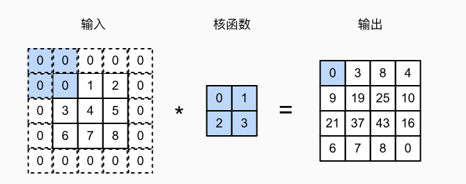
>
>比如这是一个卷积核的核函数，大小是 $2\times 2$，每个卷积层做互相关运算，用于提取pattern
>
>CNN通过卷积层（Convolutional Layer）和池化层（Pooling Layer）构建而成，具有对图像等二维数据进行特征提取和模式识别的能力


#### 注意力机制

>注意力机制源自心理学中的自主性提示和非自主性提示，映射到attention中，每一个意志线索是一个query，查询所有的键值对（key-value）
>
>value量度一个query和当前key的相似程度
>
>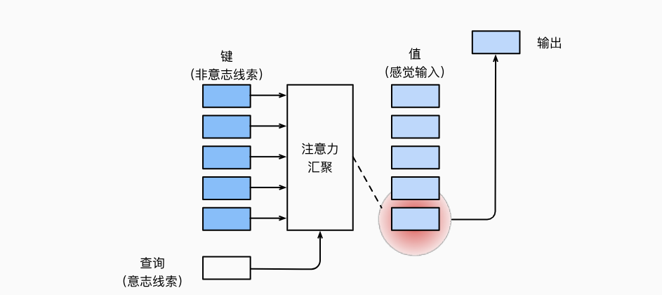
>
>transformer中用到了点积注意力和自注意力
>
>- 点积注意力：
>
>  计算查询向量和key之间的点积，然后将结果进行归一化得到注意力权重
>
>- 自注意力：
>
>  输入和输出都来自同一个新序列，用于建模序列内部的依赖关系


Transformer在WMT2014 英语-德语翻译任务上去得了 28.4的BLEU评分，在当时表现最好的模型的基础上提高了2个BELU评分；

在WMT2014英语-发育翻译任务上去得了41.8个BLEU评分；

原论文的实验是采用 8张 P100 训练了3.5天。由于我们并没有足够的资金租到相应的计算资源，所以我们是在单卡（3090）下训练其小数据集，至于分布式训练的方式和策略，会在后续有所探索，但并没有实际使用。

#### BLEU

>BELU score是一种常用的机器翻译质量评估指标，用于衡量机器翻译结果与参考翻译之间的相似度。
>
>BLEU分数通过计算译文和参考翻译之间的n-gram重合程度来评估
>
>具体计算步骤
>
>- n-gram匹配
>
>  n-gram已经在1.1中有所说明，BLEU分数通过计算机器翻译结果中n-gram与参考翻译这种n-gram的匹配情况来评估翻译质量
>
>  比如在下面这个我们实际训练的结果中
>
>  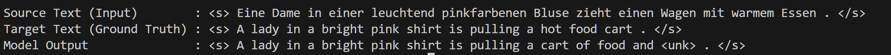
>
>  1-gram就是每个单词出现在参考翻译中的次数比如lady是1，而and是0
>
>- 精确度（precision）
>
>  计算译文中匹配的n-gram的数量与总-gram数量的比率。例如，1-gram精确度是译文中匹配的1-gram数量除以译文中总的1-gram的数量
>
>- 长度惩罚（Brevity Penalty，BP）
>
>  BLEU分数包含一个长度惩罚因子，以避免机器翻译通过生成果断的译文来获取高分
>
>  $ BP = \begin{cases}  1 & \text{if } c > r \\ e^{(1 - r/c)} & \text{if } c \leq r  \end{cases} $
>
>- BLEU分数计算
> $$
>  BLEU = BP \cdot \exp(\sum_{n=1}……{N}w_i\log p_n)
> $$
>
>  - $p_n$是n-gram精确度
>  - $w_n$是权重


### 1.4 transformer

transformer使用self-attention机制，将一个序列的不同位置联系起来，以计算序列的表示。

self-attention会在后续 *四、 模型架构* 一节中详细说明


## 二、传统方法局限与研究方法优势

### 2.1 论文背景下研究方法

机器翻译需要进行序列建模和转换，对于语言模型和机器翻译。transformer提出之前，多用 RNN、LSTM、GRU等模型，基于encoder-decoder架构进行研究

transformer提出之前，机器翻译领域主要采用

- 基于统计的方法
- 基于神经网络的方法

比如

- 统计机器翻译（SMT）：利用统计建模，大规模的双语平行语料进行训练
- 基于短语的机器翻译
- NMT，在神经网络框架爱喜爱进行机器翻译的方法，NMT直接将源语言句子映射到目标语言句子的过程作为一个端到端的神经网络模型进行学些和预测
- 基于记忆的神经机器翻译


### 2.2 论文背景下局限性

在Transformer提出之前，这些方法在处理长序列，长距离依赖关系，还有并行训练和时间等方面存在一定的局限性，原因在1.3节已经有过阐述。


### 2.3 transformer的优越性

transformer完全使用self-attention机制计算其输入和输出表示，放弃了原有的RNN layer，从而提高的计算的可并行化

* **为什么选择 self-attention**

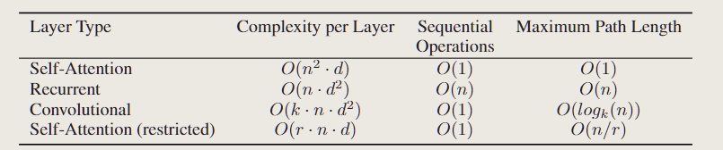

论文中比较了四种层下的计算复杂度、顺序计算（比较难并行化）、信息从一个数据点到另一个数据点的距离

对于self-attention的算法复杂度是 $o(n^2 \cdot d)$，顺序计算是$O(1)$的，所以比较好并行化，任何一个query和一个很远的key-value pair只需要一次计算就能将信息传递过来，因此，max-mum Path Length也是 $O(1)$的

相较于RNN的顺序计算是$O(n)$，难以并行化，而且对长序列的输入表达能力并不好

CNN的信息传递是$O(log_k(n))$的，会比RNN好一些

可以发现，self-attention对于处理长序列，和可并行化，信息的融合性比较好

>但attention对数据的假设做的更少，需要更大的模型和更多的数据才能训练处和RNN，CNN同样的效果，因此目前基于Transformer的模型通常比较大


### 2.4 现有机器翻译研究方法

在Transformer模型提出之后，机器翻译领域的研究方法主要集中在改进和优化Transformer模型及其各个组件

包括改进模型结果，使用多层和深层的模型，进行模型的压缩和加速，改进注意力机制，改善序列建模技术等。


## 三、模型架构

Transformer的模型结构如下：

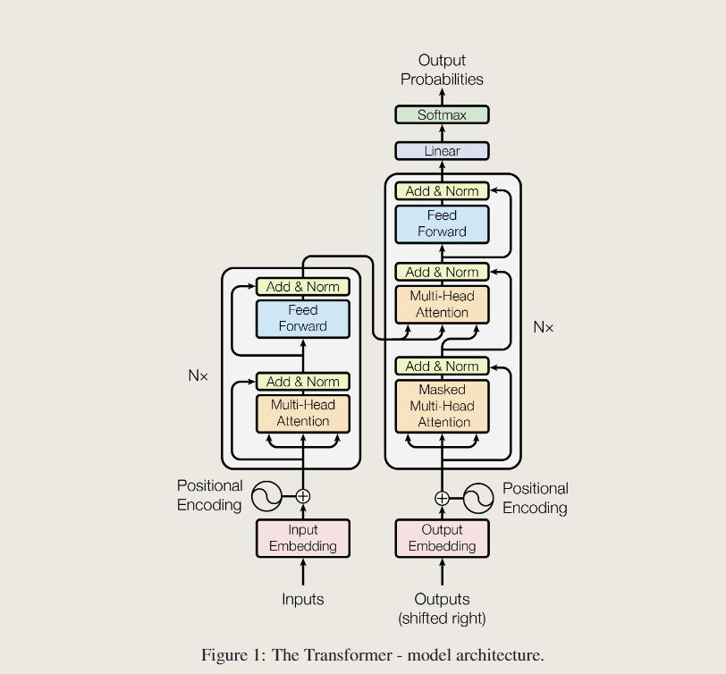

encoder将符号表示的输入序列 $(x_1,...,x_n)$映射成一个连续表示的序列 $z = (z_1,...,z_n)$

给定z，decoder将一次生成一个字符，逐渐将所有的输出序列 $(y_1,...,y_m)$生成，每次在生成下一个字符时，将之前生成的符号作为附加输入

>这种模型叫*自回归的（autoregressive models）*
>
>序列需要预测 $P(x_t|x_{t-1},...x_1)$即$x_t$之前的所有的输入都对$P(x_t)$有影响，但在相当长的序列中$x_{t-1},..,x_1$可能是不必要的，我们只需要满足某个长度为$\tau$的时间跨度就可以了，即使用观测序列 $x_{t-1},...,x_{t-\tau}$，这就是自回归的
>
>这里论文中所说的auto-regressive是一种广义的，即当前数据的产生用到先前的数据


### 3.1 word embedding 嵌入层


#### 3.1.1 原理

word embedding是将输入序列中的单词转换为连续向量表示，使得模型可以处理和理解数据中的语义信息

有两个步骤

- 词元化tokenize+建立词汇表vocabulary
- 嵌入层：将输入序列中的每个单词索引映射到权重矩阵中的每一行，得到对应的embedding向量

>embedding是将高维空间的一个向量投射到低位空间
>
>- 如果将矩阵运算看做空间坐标系的变化，权重矩阵就是两个坐标系间映射的标准
>
>将token经过嵌入矩阵投射到潜空间，而潜空间是一个语义空间，可以衡量两个不同的token之间语义的差别，因此可以让后续的模型去处理
>
>机器翻译任务是需要得到两种不同语言的潜空间，在统一的潜空间上找到语义之间的联系从而实现翻译，保持语义一致
>
>嵌入之后，每一个向量的维度代表了一个独立的基础语义，从数学的角度，某个维度上值越大可能说明这个向量更接近某种语义

因此，经过word embedding之后，就可以将原始序列输入转化为可以表达语义的tensor，从而进行后续训练

而这两个嵌入矩阵也是需要学习的


#### 3.1.2 实现

```python
class Embeddings(nn.Module):
    def __init__(self, d_model, vocab):
        super(Embeddings, self).__init__()
        self.lut = nn.Embedding(vocab, d_model)
        self.d_model = d_model

    def forward(self, x):
        return self.lut(x) * math.sqrt(self.d_model)
```

前向传播方法中将嵌入向量以 $\sqrt{d_{model}}$进行缩放，从而将嵌入向量的数值范围调整到合适模型训练的初始阶段

在`EncoderDecoder`模块中对输入的序列数据直接进行embedding，从而可以进入后续模型计算


### 3.2 encoder-decoder 结构

#### 3.2.1 保留原因

在人类进行语言翻译中，常将一两种语言对应于同一个实体

>比如中文的苹果，和英文的apple，会和这个具体的水果对应，从而联系语义

而机器翻译中，我们无法找到这样一种实体供机器去学习，只能用纯文本做对应，需要通过大量文本的上下文去确定词语词之间的关系

encoder和decoder中的code即是 语义关系，需要数字化之后，通过一种策略提前不同token之间的对应关系

>比如one-hot独热编码和tokenizer

Transformer依然保持 encoder-decoder结构

>引入encoder-decoder的结构是为了解决机器翻译的seq2seq问题中，输入语句的长短和输出语句的长短不同
>
>为了处理这种类型的输入和输出，我们可以通过encoder接受一个长度可变的序列作为输入，并将其转换为具有固定形状的编码状态
>
>通过decoder，将固定想合租那个的编码状态映射到长度可变的序列
>
>从而实现seq2seq中输入输出长度可变


#### 3.2.2 结构原理


##### Encoder

Encoder是由6个完全相同的layer堆叠而成，每层有两个子层

- multi-head self-attention（多头自注意力）
- 前馈神经网络（实际上是一个mlp）

两个子层的每一层后采用残差连接（类似Resnet），然后进行layer normalization

>layer normalization 与 batch normalization的区别
>
>layer normalization是在层上做归一化，而batch normalization是在批量上做归一化
>
>BN：
>
>对于mini-batch中的每个特征，计算均值和方差并映射到 N~(0, 1)
>
>LN：
>
>对于每一个layer上的输入，计算每个样本的特征的均值和方差
>
>对于一个三维的tensor
>
>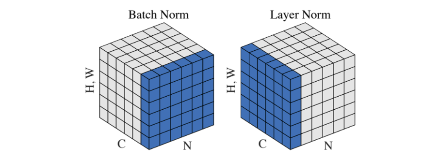
>
>在持续的序列中，每个样本的长度（sequence长度不同）会发生变化，如果每次以一个batch做切面，那么每个feature之间的空闲的位置需要用空填充，做归一化时会有很多填充的数据进行归一化，在样本长度变化比较大的时候，计算的是全局的均值和方差，因此算出来的方差和均值差别比较大。
>
>而layer norm对于每个样本求均值和方差，与其他的样本无关，所以sequence长度变化对均值和方差没有太多影响
>
>因此对于序列输入，用layer norm做归一化会好一点

##### Decoder

也由N = 6个完全相同的layer堆叠而成，除了每个编码器层中的两个子层之外，解码器还插入了第三个子层，对编码器的输出执行 multi-head attention

每个子层后面也使用残差连接和 layer normalization


#### 3.2.3 结构复现

encoder和decoder接收的是input和ouput经过embedding的数据。

##### Encoder

```python
class Encoder(nn.Module):
    "Core encoder is a stack of N layers"

    def __init__(self, layer, N):
        super(Encoder, self).__init__()
        self.layers = clones(layer, N)
        self.norm = LayerNorm(layer.size)

    def forward(self, x, mask):
        "Pass the input (and mask) through each layer in turn."
        for layer in self.layers:
            x = layer(x, mask)
        return self.norm(x)
```

- 将layer模块clone N词得到一个包含N个相同层的列表
- 采用 layer norm做层归一化
- 前向传播用一个mask屏蔽无效的填充部分，或者未来信息，然后逐层传递

##### Decoder

```python
class Decoder(nn.Module):
    "Generic N layer decoder with masking."

    def __init__(self, layer, N):
        super(Decoder, self).__init__()
        self.layers = clones(layer, N)
        self.norm = LayerNorm(layer.size)

    def forward(self, x, memory, src_mask, tgt_mask):
        for layer in self.layers:
            x = layer(x, memory, src_mask, tgt_mask)
        return self.norm(x)
```

- `memory`是从编码器得到的输出
- `src_mask`是源语言序列的掩码
- `tgt_mask`是目标语言序列的掩码


### 3.3 Attention 注意力机制

对transformer模型而言，attention机制是这个模型最重要的机制，论文采用了两种attention

- scaled Dot-Product Attention
- Multi-Head Attention

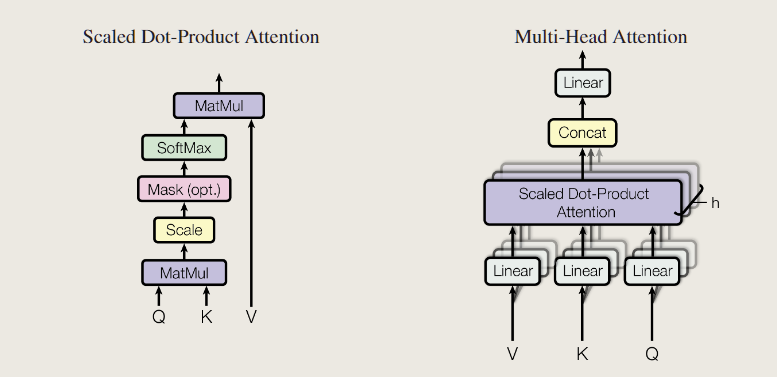

并在3处使用到了attention机制


#### 3.3.1 原理

注意力是一个query和一些key-values对的映射，输出就是query在不同key上的权值和

>比如query在5个key上，与$k_2,k_3$比较相似，对应 $v_2,v_3$会大一些，其他的偏小

注意力机制的核心思想是计算一组注意力权重（attention weights），这些权重表示输入序列的各个部分对当前输出的重要程度。然后，通过加权求和的方式将这些重要部分的表示聚合起来，生成当前时刻的上下文向量（context vector）。

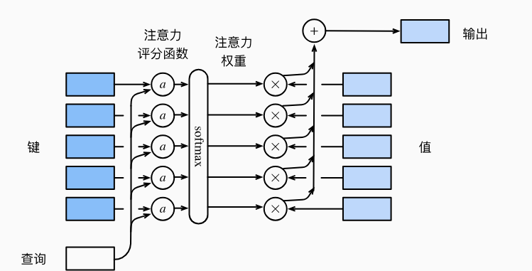

对于每一个查询 $q \in R^q$，m个键值对 $(k_1,v_1),...,(k_m,v_m)$

注意力汇聚函数f被表示成值的加权和

$f(q,(k_1,v_1),...,(k_m,v_m)) = \sum_{i=1}^{m}\alpha(q,k_i)v_i \in R^v$

而查询q和键$k_i$的注意力权重是通过注意力评分函数a将两个向量映射成标量，再讲过softmax运算得到
$$
\alpha(q,k_i) = softmax(a(q,k_i)) = \frac{\exp(a(q,k_i))}{\sum_{j=1}^m \exp(a(q,k_j))} \in  R
$$


#### 3.3.2  scaled Dot-Product Attention

使用点积可以得到计算效率更高的评分函数，点积操作要求查询和键具有相同的长度𝑑

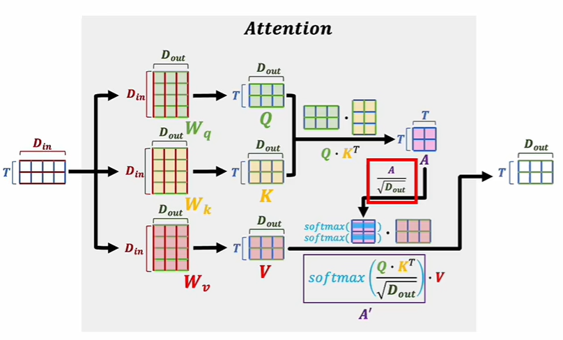

注意力机制要解决的是许多词出现在一起之后整体表现的语义，因此需要将多个词同时输入到模型，即输入矩阵D是一个多行的矩阵

将query写成一个矩阵 $Q$，key和value分别写成 $K$和 $V$

输入矩阵需要和三个矩阵 $W_q, W_k,W_v$矩阵想象成，得到三个矩阵 $Q,K,V$用于后续softmax计算
$$
Attention(Q,K,V) = softmax(\frac{QK^t}{\sqrt{d_k}})V
$$
$Q \cdot K^T$，相当于计算输入的词向量中两两之间的相关关系，经过softmax和缩放后变成(0, 1)之间的值，然后用这个得到的矩阵去修正输入的词向量矩阵V的每一个维度，当 $softmax(\frac{Q \cdot K^T}{\sqrt{D_{out}}})$计算出的矩阵某一个值 $A^`_{i,j}$比较大，说明第i个词向量和第j个词向量语义相似度比较大，就能用这个值来修正原先输入词向量矩阵V（经过一次变换）的每一维，从而表现出语义的相似性

缩放点积注意力机制比加性注意力机制的空间效率更高，同时快得多，因为可以用高度优化的矩阵乘法代码来实现

而缩放点积注意力机制除以 $\sqrt{d_k}$是为了让softmax的结果不要太向两端靠拢

对于$d_k$比较大时，softmax的结果会让点积的值比较大或者比较小，经过softmax之后接近1或者接近0，这样会导致梯度比较小，运行变慢，因此选择缩放而不是直接用点击注意力机制

而mask是为了避免在当前时刻看到以后时刻的输入，因此在scale之后做了一次mask

>对于$q_t$，应该只看到 $k_1,...,k_{t-1}$，不要用到后面的输入，但是输入是将所有的t都输入，所以需要用mask将后面的权重变成0，只会让t之间的值有效果


#### 3.3.3 Multi-Head Attention

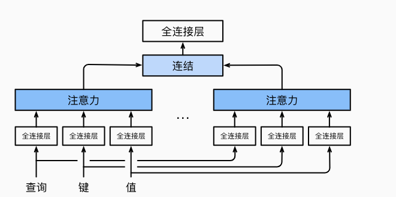

当给定相同的查询、键和值的集合时， 我们希望模型可以基于相同的注意力机制学习到不同的行为， 然后将不同的行为作为知识组合起来， 捕获序列内各种范围的依赖关系

dot-product里面可学的参数比较少，而多头注意力机制用到投影，可以去学习不同模式去匹配的相似函数

最后将多个输出连接起来通过一个mlp

论文中实际用到的h = 8，每次讲一个512维的输入（embedding之后）投影到一个64位的输出，经过注意力机制后，再连接通过mlp

计算公式
$$
MultiHead(Q,K,V) = Concat(head_1,...,head_h)W^O\\
where~head_i = Attention(QW_i^Q,KW_i^K,VW_i^V)
$$
相关代码实现如下

```python
class MultiHeadedAttention(nn.Module):
    def __init__(self, h, d_model, dropout=0.1):
        "Take in model size and number of heads."
        super(MultiHeadedAttention, self).__init__()
        assert d_model % h == 0
        # We assume d_v always equals d_k
        self.d_k = d_model // h
        self.h = h
        self.linears = clones(nn.Linear(d_model, d_model), 4)
        self.attn = None
        self.dropout = nn.Dropout(p=dropout)

    def forward(self, query, key, value, mask=None):
        "Implements Figure 2"
        if mask is not None:
            # Same mask applied to all h heads.
            mask = mask.unsqueeze(1)
        nbatches = query.size(0)

        # 1) Do all the linear projections in batch from d_model => h x d_k
        query, key, value = [
            lin(x).view(nbatches, -1, self.h, self.d_k).transpose(1, 2)
            for lin, x in zip(self.linears, (query, key, value))
        ]

        # 2) Apply attention on all the projected vectors in batch.
        x, self.attn = attention(
            query, key, value, mask=mask, dropout=self.dropout
        )

        # 3) "Concat" using a view and apply a final linear.
        x = (
            x.transpose(1, 2)
            .contiguous()
            .view(nbatches, -1, self.h * self.d_k)
        )
        del query
        del key
        del value
        return self.linears[-1](x)
```


#### 3.3.4 论文中的应用

**注意力层**（三种）

* **encoder中的multiple-Head Attention**

  输入表示的是 key，value，query，同时key，value和query是同一个输入，即自注意力机制

  输出是一个权重和，代表每个向量和别的向量的相似度

  由于这里采用的是多头注意力机制，因此会学习出h个不同的投影

* **decoder中的masked multi-head attention**

  也是自注意力机制，在解码器中存在一个mask，使得当前时刻 $q_t$只会看到前t-1的信息，忽略后面的信息

* **decoder中的Multi-head attention**

**非自注意力层**

key和value来自于encoder的输出，而query来自decoder上一个masked attention的输入

对解码器的每一个输出query，需要计算和编码器的输出的相似度

这里就体现出输出的翻译文本和输入的文本的相似度

>比如英文hello world翻译中文 你好 世界，对于解码器的中的 你 好这两个query会跟编码器中的 hello 的权重比较大


### 3.4 Position-wise Feed-Forward Networks

实际上是一个两层线性层的mlp（全连接层），考虑注意力机制可能对复杂过程的拟合程度不够, 通过增加两层网络来增强模型的能力，实现一种语义汇聚

把同一个mlp对每一个输入序列中的token作用一次
$$
FFN(x) = max(0,xW_1 +b_1)W_2 +b_2
$$

- 先对输入进行一个线性变换

  $x' = W_1x + b_1$

- 非线性激活函数ReLU

  $x'' = ReLU(x')$

- 第二次线性变换

  $y = W_2x'' + b_2$

FFN是按每个位置独立进行的，在处理输入序列时，每个位置的输入向量都经过相同的前馈网络进行变换。对自注意力层的输出进行非线性变换，增强特征表示

相关代码实现如下

```python
class PositionwiseFeedForward(nn.Module):
    "Implements FFN equation."

    def __init__(self, d_model, d_ff, dropout=0.1):
        super(PositionwiseFeedForward, self).__init__()
        self.w_1 = nn.Linear(d_model, d_ff)
        self.w_2 = nn.Linear(d_ff, d_model)
        self.dropout = nn.Dropout(dropout)

    def forward(self, x):
        return self.w_2(self.dropout(self.w_1(x).relu()))
```

经过attention之后，序列信息已经被汇聚完成了，因此mlp只需要对每个单独的点运算就可以了

而RNN，需要传递序列信息，在每一个mlp不仅接受输入的序列，还需要上一个时刻的mlp的输出，一起作用于一个mlp层，从而传递序列之间的时序信息（把上一个时刻的输出传入下一个时刻做输入）。


### 3.5 Positional Encoding

attention机制并没有时序信息，输出是value的加权和，与序列信息无关。将一个序列任意打乱，attention无法察觉这种变化，而我们希望网络可以察觉到这种变化

因此positional encoding在输入里加入了时序的信息，每个词在不同的位置会有的不同的值

我们采用fourier变换中的sin，cos函数，对于一个512维度的输入向量，加入与位置有关的信息，从而将这种时序的信息向后续传递到模型中去

具体的公式如下
$$
PE_{(pos,2i)} = sin(pos/10000^{2i/d_{model}})\\
PE_{(pos, 2i+1)} = cos(pos/10000^{2i/d_{model}})
$$

- pos是不同token的位置
- i是维度

这样模型就可以通过相对位置来学习到时序信息

相关代码实现如下

```python
class PositionalEncoding(nn.Module):
    "Implement the PE function."

    def __init__(self, d_model, dropout, max_len=5000):
        super(PositionalEncoding, self).__init__()
        self.dropout = nn.Dropout(p=dropout)

        # Compute the positional encodings once in log space.
        pe = torch.zeros(max_len, d_model)
        position = torch.arange(0, max_len).unsqueeze(1)
        div_term = torch.exp(
            torch.arange(0, d_model, 2) * -(math.log(10000.0) / d_model)
        )
        pe[:, 0::2] = torch.sin(position * div_term)
        pe[:, 1::2] = torch.cos(position * div_term)
        pe = pe.unsqueeze(0)
        self.register_buffer("pe", pe)

    def forward(self, x):
        x = x + self.pe[:, : x.size(1)].requires_grad_(False)
        return self.dropout(x)
```


## 四、 训练策略

### 4.1 训练策略概述

在Transformer模型的训练过程中，我们主要关注如何有效地优化模型参数以提高模型的泛化能力。训练策略包括：初始化模型参数、选择合适的优化器和学习率调度、定义损失函数，以及具体的训练过程和细节。


### 4.2 硬件和时间表

* 论文

论文在一台有8个NVIDIA P100 GPU的机器上训练模型，使用文中所述的超参数，每个训练步骤大约需要0.4秒。论文中总共训练了100,000步或12小时的基础模型。对于大模型，步骤时间为1.0秒。大模型被训练了30万步（3.5天）。

* 复现

我们复现论文使用的硬件设施为：

```
========实例配置========
核数：16
内存：30 GB
磁盘：23% 6.9G/30G
显卡：NVIDIA GeForce RTX 3090, 1
```


### 4.3 训练数据和预处理

#### 4.3.1 **数据集介绍**

论文使用了WMT 2014英语-德语（English-German）进行训练和评估。该数据集是机器翻译领域的标准数据集，广泛用于模型的训练和性能比较。从此数据集上提取了*训练数据集*、*验证数据集*、*测试数据集*。其中训练数据集中包含数百万对英德句子对，这些句子对用于训练模型，以使模型能够学习从英语到德语的翻译。

本次复现论文使用的是 Multi30k 数据集，它是一个小型的英语-德语平行语料库，包含了来自 Flickr30k 图像描述数据集的英语句子和它们的德语翻译。Multi30k 数据集包含约3万个训练句子、1,014个验证句子和1,000个测试句子。由于其相对较小的规模，Multi30k数据集被广泛用于评估小型翻译模型的性能，同时也是进行快速实验和原型开发的理想选择。


#### 4.3.2 **数据预处理**

数据在输入到模型之前需要经过预处理，包括分词、标注等。

* **加载分词器**

> 加载英语和德语的 *spaCy* 分词器模型，如果模型未下载，则通过命令行下载模型。``spacy_de`` 和``spacy_en``是 *spaCy* 语言处理流水线对象，包含对文本进行处理的各种功能，如分词、词性标注、命名实体识别等。

```python
def load_tokenizers():
    # 加载 spaCy 分词器模型：德语和英语
    try:
        spacy_de = spacy.load("de_core_news_sm")
    except IOError:
        os.system("python -m spacy download de_core_news_sm")
        spacy_de = spacy.load("de_core_news_sm")

    try:
        spacy_en = spacy.load("en_core_web_sm")
    except IOError:
        os.system("python -m spacy download en_core_web_sm")
        spacy_en = spacy.load("en_core_web_sm")

    return spacy_de, spacy_en
```

* **分词**

> ``tokenize(text, tokenizer)`` 函数对输入文本进行分词，将文本分割成单词；并生成分词后的令牌序列，用于构建词汇表。
>
> `yield_tokens(data_iter, tokenizer, index)` 函数是一个生成器，它接受数据迭代器和分词器作为输入，并根据索引对文本进行预处理和分词。

```python
def tokenize(text, tokenizer):      
    # 分词，text是文本字符串
    # tokenizer是用于分词的spaCy语言处理对象（分词器）
    return [tok.text for tok in tokenizer.tokenizer(text)]

def yield_tokens(data_iter, tokenizer, index):  
    # 生成器，data_iter是数据迭代器，tokenizer是分词器，index是索引
    for from_to_tuple in data_iter:
        yield tokenizer(from_to_tuple[index])
```

* **构建词汇表**

  定义``build_vocabulary(spacy_de, spacy_en)`` 函数：

  ```python
  def build_vocabulary(spacy_de, spacy_en)
  ```

  * 定义分词方法

    ```python
    def tokenize_de(text):
        return tokenize(text, spacy_de)
        def tokenize_en(text):
            return tokenize(text, spacy_en)
    ```

  * 使用`torchtext`库中的`Multi30k`模块加载数据集

    ```python
        print("Building German Vocabulary ...")
        train, val, test = datasets.Multi30k(language_pair=("de", "en"))    # 加载数据集
    ```

  * 使用`torchtext`库的`build_vocab_from_iterator`函数构建词汇表，并添加特殊标记`<s>`, `</s>`, `<blank>`, `<unk>`

    ```python
        vocab_src = build_vocab_from_iterator(
            yield_tokens(train + val + test, tokenize_de, index=0),
            min_freq=2,
            specials=["<s>", "</s>", "<blank>", "<unk>"],
        )   # 构建德语词汇表
    ```

    > 以德语词汇表为例，英语词汇表同理。

  * 设置默认索引序列

    ```python
        # 设置默认索引
        vocab_src.set_default_index(vocab_src["<unk>"])     
        vocab_tgt.set_default_index(vocab_tgt["<unk>"])
    
        return vocab_src, vocab_tgt
    ```


> 为了节省时间并避免重复构建词汇表，``load_vocab(spacy_de, spacy_en)`` 函数将词汇表保存到文件中，并在需要时加载。

```python
# 加载词汇表
def load_vocab(spacy_de, spacy_en):
    if not exists("vocab.pt"):
        vocab_src, vocab_tgt = build_vocabulary(spacy_de, spacy_en)
        torch.save((vocab_src, vocab_tgt), "vocab.pt")
    else:
        vocab_src, vocab_tgt = torch.load("vocab.pt")
    print("Finished.\nVocabulary sizes:")
    print(len(vocab_src))
    print(len(vocab_tgt))
    return vocab_src, vocab_tgt
```

通过以上步骤，我们可以确保数据被适当地预处理和分词，并构建了高质量的词汇表。这些预处理步骤有助于提高模型的性能和泛化能力。


### 4.4 **批处理与掩码**

#### 4.4.1 批处理

**批处理（*Batch*）**是将数据划分为小块进行处理的一种技术。在Transformer模型中，批处理有着重要作用：

> * **提高训练效率**：
>
>   - 将数据划分为小批次进行处理，能够充分利用硬件资源，提高训练效率；
>
>   - 减少模型训练时所需的内存空间，使得模型能够处理更大规模的数据。
>
> * **加速计算**：
>
>   - 批处理可以利用矩阵运算的并行性，加速模型的前向传播和反向传播过程；
>
>   - 通过同时处理多个样本，可以提高GPU的利用率，加速训练过程，缩短训练时间。
>
> * **稳定优化**：
>
>   - 批处理可以减少每个参数更新的噪声，使得优化更加稳定；
>
>   - 通过计算每个批次的梯度平均值而不是单个样本的梯度，可以减少梯度的方差，从而更加平滑地更新模型参数。

定义 ``Batch`` 类：

```python
class Batch:
    """Object for holding a batch of data with mask during training."""

    def __init__(self, src, tgt=None, pad=2):  # 2 = <blank>
        self.src = src 	
        # src的大小是[batch_size, seq_len]
        self.src_mask = (src != pad).unsqueeze(-2)
        # src_mask的大小是[batch_size, 1, seq_len]，musk运算时自动扩张
        # [batch_size, seq_len, seq_len]  
        # src_musk(i,j,k)表示batch第i个句子的第j个词和第k个词的分数是否清零。
        if tgt is not None:
            self.tgt = tgt[:, :-1]	#去除结束符号<end>
            self.tgt_y = tgt[:, 1:]	#去除开始符号<start>
            self.tgt_mask = self.make_std_mask(self.tgt, pad)	
            # tgt_mask的大小是[batch_size, 1, seq_len]
            self.ntokens = (self.tgt_y != pad).data.sum()
            # 统计非pad的词汇数

```

#### 4.4.2 掩码

**掩码（*Mask*）**用于在模型训练过程中隐藏填充标记和未来词标记，以确保模型在处理序列数据时能够正确地考虑到这些标记的影响：

> * **遮蔽填充标记**：
>
>   - 填充标记（*padding token*）通常不包含实际的信息，只是为了使输入序列对齐到相同长度。因此，在自注意力机制中，需要将填充标记对应的注意力分数置为负无穷大，从而在softmax计算中被忽略；
>
>   - 通过掩码，可以避免模型在注意力计算时考虑到填充标记，从而提高模型的效率和性能。
>
> * **遮蔽未来词标记**：
>
>   - 在解码器端，为了确保模型在生成每个词时只使用其之前的词，需要将当前词之后的词在注意力计算中进行掩码。这样可以避免模型在生成词时获取未来词的信息，保证了模型的自回归性质；
>
>   - 通过掩码，可以确保模型按顺序生成序列，避免了信息泄露和错误生成的问题。

 ``Batch`` 类中 ``make_std_mask``方法：

```python
    @staticmethod	#静态方法，不需要实例化就可以调用，不需要self参数
    def make_std_mask(tgt, pad):
        "Create a mask to hide padding and future words."
        # 如果tgt=pad，相当于占位符，我们强制要求所有分配给占位符的attention分数是-1e9
        # 所以我们直接musk
        tgt_mask = (tgt != pad).unsqueeze(-2)
        # 去掉占位符
        tgt_mask = tgt_mask & subsequent_mask(tgt.size(-1)).type_as(
            tgt_mask.data
        )
        # 去掉这个词汇之后的词汇
        # &运算表示满足上述任何一个条件attention就应该被清零
        
        return tgt_mask
```

对*batch*中数据做进一步处理，转换为模型可接受的张量格式，并进行填充操作

* 定义

  ```python
  def collate_batch(      
      batch,             
      src_pipeline,       # 源语言管道函数
      tgt_pipeline,       # 目标语言管道函数
      src_vocab,          # 源语言词汇表
      tgt_vocab,			# 目标语言词汇表
      device,             # 设备
      max_padding=128,    # 最大填充长度
      pad_id=2,           # 填充标记
  ):
  ```

* 添加标记

  ```python
      bs_id = torch.tensor([0], device=device)  # <s> token id 起始标记
      eos_id = torch.tensor([1], device=device)  # </s> token id 结束标记
  ```

* 处理源语言（目标语言类似）

  ```python
  	for (_src, _tgt) in batch:
          processed_src = torch.cat(
              [
                  bs_id,      # <s> token id
                  torch.tensor(
                      src_vocab(src_pipeline(_src)),
                      dtype=torch.int64,
                      device=device,
                  ),
                  eos_id,     # </s> token id
              ],
              0,
          )
  ```

  > 使用PyTorch的`torch.cat`函数，将多个张量按指定维度拼接起来，生成处理后的源语言张量；添加起始和结束标记，以提示模型句子的开始和结束；并且指定了数据类型（*dtype*）和存储设备（*device*）。

* 源语言填充（目标语言类似）

  ```python
      src_list.append(
          # warning - overwrites values for negative values of padding - len
          pad(
              processed_src,
              (
                  0,
                  max_padding - len(processed_src),
              ),
              value=pad_id,
          )
      )
  ```

* 堆叠张量并返回

  ```python
      # 列表中的所有张量堆叠为一个批处理张量，确保所有句子的长度一致
      src = torch.stack(src_list)
      tgt = torch.stack(tgt_list)
      return (src, tgt)
  ```

  

### 4.5 优化器和学习率调度

论文使用 *Adam* 优化器，因为它能够自动调整学习率，适应不同参数的更新需求。取参数 $\beta_1=0.9$, $\beta_2=0.98$, $\epsilon=10^{-9}$，来构建学习率调度器，公式为： 
$$
lrate=d_{model}^{−0.5}⋅min⁡(step\_num^{−0.5},step\_num⋅warmup\_steps^{−1.5})
$$
这相当于在第一个 *warmup_steps* 训练步骤中线性增加学习率，此后按步骤数的反平方根比例减少。训练中使用 *warmup_steps = 4000*.

这样选取确保了在训练初期模型能快速调整参数以适应训练数据，同时在训练后期通过降低学习率使模型能够稳定收敛，最终达到较好的性能。

代码实现如下：

```python
def rate(step, model_size, factor, warmup):
    """
    we have to default the step to 1 for LambdaLR function
    to avoid zero raising to negative power.
    """
    if step == 0:
        step = 1
    return factor * (
        model_size ** (-0.5) * min(step ** (-0.5), step * warmup ** (-1.5))
    ) 
```

> ``rate``随``step``、``warmup``以及``model_size``变化趋势：


### 4.6 正则化与损失函数

#### 4.6.1 **交叉熵损失函数**

论文使用了交叉熵损失函数，这个函数在分类任务中广泛使用，尤其在自然语言处理任务中的序列生成任务如机器翻译中。对于每个时间步，模型生成一个概率分布，该分布表示生成每个词的概率。交叉熵损失衡量了模型生成的概率分布与真实分布之间的差异。

公式表示为：
$$
\text{Cross-Entropy Loss} = - \sum_{i=1}^{N} y_i \log(p_i)
$$
其中：

- $$y_i$$ 是真实标签的独热编码（*one-hot encoding*）。
- $$p_i$$ 是模型预测的概率分布。

对于序列到序列的任务，我们在每个时间步计算交叉熵损失，并对所有时间步的损失取平均值。

代码实现：

```python
import torch
import torch.nn as nn

# 定义损失函数
criterion = nn.CrossEntropyLoss(ignore_index=padding_idx)

# 示例：计算损失
def compute_loss(predictions, targets):
    """
    计算交叉熵损失
    :param predictions: 模型的预测结果, 形状为 (batch_size, seq_len, vocab_size)
    :param targets: 真实标签, 形状为 (batch_size, seq_len)
    :return: 损失值
    """
    # 将预测结果进行重塑，使其符合交叉熵损失函数的输入要求
    predictions = predictions.view(-1, predictions.size(-1))  # (batch_size * seq_len, vocab_size)
    targets = targets.view(-1)  # (batch_size * seq_len)
    
    # 计算损失
    loss = criterion(predictions, targets)
    return loss
```

> 在模型训练过程中，每一步都要计算当前批次的损失，然后通过反向传播算法更新模型的参数。

交叉熵损失函数的优越性在于：

1. **简洁明了：**其公式简单，容易实现。
2. **稳定性：**在处理概率分布时表现稳定，能有效避免数值不稳定的问题。
3. **广泛应用：**在分类和序列生成任务中表现优异，被广泛应用于各类自然语言处理任务中。


#### 4.6.2 **正则化**

在论文的基础上，我们实现了额外的正则化（*Regularization*）来增强模型的表现。具体来说，我们使用了标签平滑（Label Smoothing），通过改变目标标签的分布，使模型在训练过程中对每个词的预测更加不确定，从而提高模型的泛化能力。

* **标签平滑（*Label Smoothing*）**

标签平滑是一种正则化技术，旨在避免模型过于自信地预测一个标签，从而提高模型的泛化性能。在标准的交叉熵损失中，目标标签是一个独热编码（*one-hot encoding*），即正确标签的概率为1，其他标签的概率为0。而标签平滑则将目标标签的概率分布进行平滑处理，使得正确标签的概率稍小于1，其他标签的概率稍大于0。

真实标签分布 $P_{smooth}$ 被定义：
$$
P_{smooth}(y_i) = (1 - \epsilon) \cdot P_{one-hot}(y_i) + \epsilon / K
$$
其中：

- $\epsilon$ ：标签平滑参数
- $K$ ：类别数
- $P_{one-hot}$ ：one-hot编码的真实标签分布。

我们在训练过程中使用了标签平滑值 $\epsilon_{ls} = 0.1$。这种方法虽然会降低模型的困惑度（*perplexity*），因为模型会变得更加不确定，但可以提高模型的准确性和 BLEU 得分。

具体实现标签平滑的方法是通过 *Kullback-Leibler* 散度损失（*KLDivLoss*），而不是使用标准的交叉熵损失。

代码实现如下：

```python
class LabelSmoothing(nn.Module):
    "Implement label smoothing."

    def __init__(self, size, padding_idx, smoothing=0.0):
        super(LabelSmoothing, self).__init__()
        self.criterion = nn.KLDivLoss(reduction="sum")  # 损失函数，使用 Kullback-Leibler 散度作为损失函数
        self.padding_idx = padding_idx      # 填充标记的索引，用于在计算损失时忽略填充部分
        self.confidence = 1.0 - smoothing   # 真实标签的置信度
        self.smoothing = smoothing          # 平滑值
        self.size = size                    # 标签的大小（维度）
        self.true_dist = None               # 真实标签的分布

    # 前向传播函数
    def forward(self, x, target):
        assert x.size(1) == self.size
        true_dist = x.data.clone()
        true_dist.fill_(self.smoothing / (self.size - 2))
        true_dist.scatter_(1, target.data.unsqueeze(1), self.confidence)
        true_dist[:, self.padding_idx] = 0
        mask = torch.nonzero(target.data == self.padding_idx)
        if mask.dim() > 0:
            true_dist.index_fill_(0, mask.squeeze(), 0.0)
        self.true_dist = true_dist
        return self.criterion(x, true_dist.clone().detach())
```

> 在 ``LabelSmoothing`` 类中定义方法 ``forward(self, x, target)`` ，负责计算带有标签平滑的损失值：
>
> * 进行尺寸检查
> * 创建并初始化标签分布
> * 填充正确标签的置信度
> * 处理填充标记
> * 保存真实标签分布
> * 计算损失

标签平滑的好处在于：

1. **防止过拟合**：通过减少模型对单个标签的置信度，标签平滑能有效防止模型过拟合；
2. **提高泛化性能**：标签平滑使模型在未知数据上的表现更加稳健，提升泛化性能；
3. **优化训练过程**：通过使用KL散度损失，模型的训练过程更加平滑和稳定。


#### 4.6.3 散度损失函数

*Kullback-Leibler* 散度损失（*KLDivLoss*）函数是用于衡量两个概率分布之间的差异的一种损失函数。在深度学习中，通常用于衡量模型生成的概率分布与真实分布之间的差异。其原理是通过计算两个概率分布之间的 *KL散度* 来衡量它们之间的相似性或差异性。

*KL*散度是信息论中的一个概念，用于衡量一个概率分布相对于另一个概率分布的“距离”。对于两个离散概率分布*P*和*Q*，*KL*散度的计算公式如下：
$$
D_{KL}(P || Q) = \sum_{i} P(i) \log \frac{P(i)}{Q(i)}
$$


其中，$P(i)$ 和 $Q(i)$ 分别表示两个概率分布在第 $i$ 个事件上的概率。

* 两种损失函数对比

> 相对于交叉熵损失函数，*KLDivLoss* 的不同之处在于，交叉熵损失函数是衡量两个概率分布之间的“距离”，而*KLDivLoss*是衡量两个概率分布之间的“差异性”。具体来说，交叉熵损失函数关注的是预测分布与真实分布之间的交叉熵，而 *KLDivLoss* 关注的是预测分布相对于真实分布的KL散度。

* *KLDivLoss*的优越性

> KLDivLoss相对于交叉熵损失函数的优越性在于，它更加灵活，能够处理不同分布之间的关系，而不仅限于预测分布与真实分布之间的匹配。因此，在某些情况下，特别是当模型输出的是概率分布而不是类别标签时，KLDivLoss可以更好地反映模型的性能。


### 4.7 训练过程和细节

训练过程包括数据加载、模型的前向传播、损失计算、反向传播、参数更新以及学习率调度等步骤。

#### 4.7.1 **训练状态跟踪**

首先，定义了一个`TrainState`类来跟踪训练过程中一些关键指标：

```python
class TrainState:
    """Track number of steps, examples, and tokens processed"""
    step: int = 0  			# 当前epoch中的步数
    accum_step: int = 0  	# 累计的梯度积累步数
    samples: int = 0  		# 使用的样本总数
    tokens: int = 0  		# 处理的tokens总数
```


#### 4.7.2 **训练周期（*epoch）***

定义`run_epoch`函数运行每个训练周期（*epoch*），包括前向传播、损失计算、反向传播和参数更新，定义如下：

```python
def run_epoch(
    data_iter,  	# 迭代器,每次迭代返回一个batch,这个batch是一个Batch对象,包含src,tgt,pad
    model,      	# 待训练模型
    loss_compute,   # 损失计算方法
    optimizer,      # 优化器，更新模型参数
    scheduler,      # 学习率调度器
    mode="train",   # 训练模式 or “train + log”（训练模式并记录日志）
    accum_iter=1,   # 累计迭代次数
    train_state=TrainState(),
):
    """Train a single epoch"""
```

* 初始化参数

  ```python
      start = time.time() # 记录开始时间
      total_tokens = 0
      total_loss = 0
      tokens = 0
      n_accum = 0
  ```

* 前向传播与损失计算

  ```python
      for i, batch in enumerate(data_iter):
          out = model.forward(
              batch.src, batch.tgt, batch.src_mask, batch.tgt_mask
          )
          loss, loss_node = loss_compute(out, batch.tgt_y, batch.ntokens)
          # loss_node = loss_node / accum_iter
  ```

* 训练状态更新

  ```python
          if mode == "train" or mode == "train+log":
              loss_node.backward()    # 调用 backward 方法计算损失关于参数的梯度
              train_state.step += 1   # 记录步数
              train_state.samples += batch.src.shape[0]   # 记录样本数
              train_state.tokens += batch.ntokens  # 记录token数
              if i % accum_iter == 0:
                  optimizer.step()    # 更新参数
                  optimizer.zero_grad(set_to_none=True)   # 梯度清零
                  n_accum += 1
                  train_state.accum_step += 1
              scheduler.step()    # 更新学习率
  
          total_loss += loss
          total_tokens += batch.ntokens
          tokens += batch.ntokens
  ```

* 打印日志、训练信息

  ```python
          if i % 40 == 1 and (mode == "train" or mode == "train+log"):
              lr = optimizer.param_groups[0]["lr"]
              elapsed = time.time() - start
              print(
                  (
                      "Epoch Step: %6d | Accumulation Step: %3d | Loss: %6.2f "
                      + "| Tokens / Sec: %7.1f | Learning Rate: %6.1e"
                  )
                  % (i, n_accum, loss / batch.ntokens, tokens / elapsed, lr)
              )   # 打印日志
              start = time.time()
              tokens = 0
          del loss
          del loss_node
      return total_loss / total_tokens, train_state
  ```

  > 每运行一定 ``step`` ，便会打印日志信息，如：
  >
  > 


#### 4.7.3 **训练工作函数**

``train_worker`` 函数负责在单个GPU上进行模型训练，定义如下：

```python
def train_worker(
    gpu,
    ngpus_per_node,
    vocab_src,      # 源语言词汇表
    vocab_tgt,      # 目标语言词汇表
    spacy_de,
    spacy_en,
    config,         # 配置字典，包含训练参数
    is_distributed=False,   # 是否分布式训练
):
```

> 函数包含：
>
> * 初始化设置：
>   * 设置GPU设备。
>   * 定义模型架构，包括编码器、解码器和生成器。
>   * 定义损失函数，这里使用了标签平滑（Label Smoothing）技术。
>   * 创建数据加载器，包括训练集和验证集的数据加载器。
>   * 定义优化器（Adam优化器）和学习率调度器（LambdaLR调度器）。
> * **训练和验证循环**：
>   - 循环遍历每个epoch，进行训练和验证。
>   - 在每个epoch中，通过调用`run_epoch`函数来执行一个epoch的训练和验证过程。
>   - 训练过程中，采用梯度累积的方式进行参数更新，并通过学习率调度器动态调整学习率。
>   - 每个epoch结束后，保存模型的状态。
> * **GPU利用率和模型状态保存**：
>   * 在每个epoch结束后，显示GPU利用率。
>   * 在主进程中保存模型的状态。

同时定义了分布式训练函数``train_distributed_model``。


## 五、实验结果与分析

### 5.1 论文结果

论文在WMT 2014英语到德语和英语到法语的翻译任务上进行了实验。实验结果表明，Transformer模型在BLEU评分上均取得了显著优于对比模型的结果。具体来说，在英语到德语的翻译任务上，Transformer模型达到了28.4的BLEU评分，比当时的最佳结果提高了超过2个BLEU点。在英语到法语的翻译任务上，Transformer模型在训练了3.5天后，达到了41.8的BLEU评分，刷新了单模型的最佳成绩。


### 5.2 对比模型

在机器翻译领域，RNN及其变种如LSTM和GRU一直是主流模型。这些模型通过循环结构捕捉序列中的依赖关系，但存在两个主要问题：

* 无法有效处理长距离依赖关系
* 难以实现高效的并行计算

为了解决这些问题，研究者们提出了基于CNN的模型，如ByteNet和FairSeq，这些模型通过卷积操作捕捉局部特征，但同样存在难以捕捉长距离依赖关系的问题。

Transformer架构的提出，旨在解决上述问题。它完全基于自注意力机制，能够在所有位置之间建立直接的联系，从而有效捕捉长距离依赖关系。同时，由于Transformer的计算过程不依赖于前一时刻的计算结果，因此可以实现高效的并行计算。


### 5.3 复现结果

#### 5.3.1 训练结果

本次实验中使用 Multi30k 数据集复现了论文结果，以下是第零周期（Epoch 0）和最后一个周期（Epoch 7）的训练日志输出：

```python
# 加载数据集
Vocabulary sizes:
8317
6384
```

```python
# 第零周期
[GPU0] Epoch 0 Training ====
Epoch Step:      1 | Accumulation Step:   1 | Loss:   7.61 | Tokens / Sec:  2465.8 | Learning Rate: 5.4e-07
Epoch Step:     41 | Accumulation Step:   5 | Loss:   7.38 | Tokens / Sec:  3829.8 | Learning Rate: 1.1e-05
Epoch Step:     81 | Accumulation Step:   9 | Loss:   6.95 | Tokens / Sec:  4032.1 | Learning Rate: 2.2e-05
Epoch Step:    121 | Accumulation Step:  13 | Loss:   6.60 | Tokens / Sec:  3973.4 | Learning Rate: 3.3e-05
Epoch Step:    161 | Accumulation Step:  17 | Loss:   6.41 | Tokens / Sec:  3978.0 | Learning Rate: 4.4e-05
Epoch Step:    201 | Accumulation Step:  21 | Loss:   6.22 | Tokens / Sec:  3957.2 | Learning Rate: 5.4e-05
Epoch Step:    241 | Accumulation Step:  25 | Loss:   6.16 | Tokens / Sec:  4010.9 | Learning Rate: 6.5e-05
Epoch Step:    281 | Accumulation Step:  29 | Loss:   6.02 | Tokens / Sec:  3776.2 | Learning Rate: 7.6e-05
Epoch Step:    321 | Accumulation Step:  33 | Loss:   5.88 | Tokens / Sec:  3951.3 | Learning Rate: 8.7e-05
Epoch Step:    361 | Accumulation Step:  37 | Loss:   5.60 | Tokens / Sec:  4089.8 | Learning Rate: 9.7e-05
Epoch Step:    401 | Accumulation Step:  41 | Loss:   5.33 | Tokens / Sec:  4241.4 | Learning Rate: 1.1e-04
Epoch Step:    441 | Accumulation Step:  45 | Loss:   5.19 | Tokens / Sec:  3891.9 | Learning Rate: 1.2e-04
Epoch Step:    481 | Accumulation Step:  49 | Loss:   4.81 | Tokens / Sec:  3705.6 | Learning Rate: 1.3e-04
Epoch Step:    521 | Accumulation Step:  53 | Loss:   4.57 | Tokens / Sec:  4065.9 | Learning Rate: 1.4e-04
Epoch Step:    561 | Accumulation Step:  57 | Loss:   4.51 | Tokens / Sec:  4114.3 | Learning Rate: 1.5e-04
Epoch Step:    601 | Accumulation Step:  61 | Loss:   4.32 | Tokens / Sec:  4112.3 | Learning Rate: 1.6e-04
Epoch Step:    641 | Accumulation Step:  65 | Loss:   4.32 | Tokens / Sec:  4081.6 | Learning Rate: 1.7e-04
Epoch Step:    681 | Accumulation Step:  69 | Loss:   4.19 | Tokens / Sec:  4130.6 | Learning Rate: 1.8e-04
Epoch Step:    721 | Accumulation Step:  73 | Loss:   4.26 | Tokens / Sec:  4119.8 | Learning Rate: 1.9e-04
Epoch Step:    761 | Accumulation Step:  77 | Loss:   4.23 | Tokens / Sec:  4059.4 | Learning Rate: 2.0e-04
Epoch Step:    801 | Accumulation Step:  81 | Loss:   4.02 | Tokens / Sec:  4085.5 | Learning Rate: 2.2e-04
Epoch Step:    841 | Accumulation Step:  85 | Loss:   4.08 | Tokens / Sec:  4113.0 | Learning Rate: 2.3e-04
Epoch Step:    881 | Accumulation Step:  89 | Loss:   4.08 | Tokens / Sec:  4152.6 | Learning Rate: 2.4e-04
| ID | GPU | MEM |
------------------
|  0 | 11% | 29% |
[GPU0] Epoch 0 Validation ====
(tensor(3.9010, device='cuda:0'), <__main__.TrainState object at 0x14a750266070>)
```

```python
# 第七周期（最后周期）
[GPU0] Epoch 7 Training ====
Epoch Step:      1 | Accumulation Step:   1 | Loss:   1.00 | Tokens / Sec:  3479.8 | Learning Rate: 5.5e-04
Epoch Step:     41 | Accumulation Step:   5 | Loss:   0.89 | Tokens / Sec:  4120.2 | Learning Rate: 5.5e-04
Epoch Step:     81 | Accumulation Step:   9 | Loss:   0.89 | Tokens / Sec:  4062.8 | Learning Rate: 5.5e-04
Epoch Step:    121 | Accumulation Step:  13 | Loss:   0.91 | Tokens / Sec:  4037.1 | Learning Rate: 5.5e-04
Epoch Step:    161 | Accumulation Step:  17 | Loss:   0.97 | Tokens / Sec:  3650.3 | Learning Rate: 5.5e-04
Epoch Step:    201 | Accumulation Step:  21 | Loss:   1.20 | Tokens / Sec:  3703.5 | Learning Rate: 5.5e-04
Epoch Step:    241 | Accumulation Step:  25 | Loss:   1.05 | Tokens / Sec:  3798.1 | Learning Rate: 5.4e-04
Epoch Step:    281 | Accumulation Step:  29 | Loss:   0.99 | Tokens / Sec:  4196.5 | Learning Rate: 5.4e-04
Epoch Step:    321 | Accumulation Step:  33 | Loss:   0.97 | Tokens / Sec:  4178.9 | Learning Rate: 5.4e-04
Epoch Step:    361 | Accumulation Step:  37 | Loss:   1.07 | Tokens / Sec:  4177.1 | Learning Rate: 5.4e-04
Epoch Step:    401 | Accumulation Step:  41 | Loss:   1.00 | Tokens / Sec:  4085.0 | Learning Rate: 5.4e-04
Epoch Step:    441 | Accumulation Step:  45 | Loss:   1.01 | Tokens / Sec:  3785.2 | Learning Rate: 5.4e-04
Epoch Step:    481 | Accumulation Step:  49 | Loss:   1.13 | Tokens / Sec:  3722.8 | Learning Rate: 5.3e-04
Epoch Step:    521 | Accumulation Step:  53 | Loss:   0.97 | Tokens / Sec:  3926.1 | Learning Rate: 5.3e-04
Epoch Step:    561 | Accumulation Step:  57 | Loss:   1.15 | Tokens / Sec:  4078.5 | Learning Rate: 5.3e-04
Epoch Step:    601 | Accumulation Step:  61 | Loss:   0.91 | Tokens / Sec:  4113.8 | Learning Rate: 5.3e-04
Epoch Step:    641 | Accumulation Step:  65 | Loss:   1.04 | Tokens / Sec:  4229.8 | Learning Rate: 5.3e-04
Epoch Step:    681 | Accumulation Step:  69 | Loss:   1.35 | Tokens / Sec:  4072.1 | Learning Rate: 5.3e-04
Epoch Step:    721 | Accumulation Step:  73 | Loss:   1.01 | Tokens / Sec:  4147.8 | Learning Rate: 5.3e-04
Epoch Step:    761 | Accumulation Step:  77 | Loss:   0.82 | Tokens / Sec:  4159.1 | Learning Rate: 5.2e-04
Epoch Step:    801 | Accumulation Step:  81 | Loss:   1.03 | Tokens / Sec:  4116.5 | Learning Rate: 5.2e-04
Epoch Step:    841 | Accumulation Step:  85 | Loss:   1.11 | Tokens / Sec:  4164.7 | Learning Rate: 5.2e-04
Epoch Step:    881 | Accumulation Step:  89 | Loss:   1.13 | Tokens / Sec:  4209.2 | Learning Rate: 5.2e-04
| ID | GPU | MEM |
------------------
|  0 | 33% | 33% |
[GPU0] Epoch 7 Validation ====
(tensor(1.4455, device='cuda:0'), <__main__.TrainState object at 0x14a750266070>)
```

可以从结果中明显观察到：

1. 损失 *Loss* 有持续降低的趋势，初始为7.61，在 *Epoch1*中降到4.08，在训练结束降至1.13，正确率显著提高，表明模型在 *Epoch7*的训练后能够更好地拟合验证集；同时 *Loss* 在 *Epoch7* 中无规律波动在 1 附近，说明模型已经进行充分训练，得到最优结果。
2. 学习率 Learning Rate 先增后减，在 Epoch 3 Step 281 达到峰值 $8.1×10^{-4}$ ，符合设定：

```python
[GPU0] Epoch 3 Training ====
......
Epoch Step:    241 | Accumulation Step:  25 | Loss:   1.89 | Tokens / Sec:  4329.7 | Learning Rate: 8.0e-04
Epoch Step:    281 | Accumulation Step:  29 | Loss:   2.10 | Tokens / Sec:  4276.3 | Learning Rate: 8.1e-04
Epoch Step:    321 | Accumulation Step:  33 | Loss:   1.82 | Tokens / Sec:  4233.8 | Learning Rate: 8.0e-04
Epoch Step:    361 | Accumulation Step:  37 | Loss:   1.93 | Tokens / Sec:  4338.3 | Learning Rate: 8.0e-04
......
```

3. 训练过程中GPU利用率出现了一定波动，例如，从第一周期到第二周期，GPU利用率从11%上升29%，通常在第三周期时上升38%，之后又降至10%，最终在第七周期达到了33%。这种波动可能是由于训练过程中不同批次的数据特性以及模型参数的变化引起的。GPU利用率保持在合理范围内，表明模型训练过程中的计算资源消耗较为合理


以下是一些实例输入输出，展现训练翻译结果：

```
# Example 1
Source Text (Input)        : <s> Ein älterer Mann sitzt im Freien vor einem großen Banner mit der Aufschrift „ <unk> <unk> <unk> <unk> “ auf einer Bank . </s>
Target Text (Ground Truth) : <s> An older man is sitting outside on a bench in front a large banner that says , " <unk> <unk> <unk> <unk> . " </s>
Model Output               : <s> An elderly man sits outside in front of a large banner that says " <unk> " <unk> " on a bench . </s>
```

```
# Example 2
Source Text (Input)        : <s> Eine Frau und ein Junge auf einer Bühne lachen mit einem Zelt im Hintergrund . </s>
Target Text (Ground Truth) : <s> A woman and a boy on stage laughing with a tent in the background . </s>
Model Output               : <s> A woman and a boy are laughing with a tent in the background . </s>
```

```
# Example 3
Source Text (Input)        : <s> Eine junge <unk> überprüft , ob sie neue <unk> von Kunden erhalten hat . </s>
Target Text (Ground Truth) : <s> A young clerk looking for new <unk> from <unk> . </s>
Model Output               : <s> A young female <unk> is checking out new customers . </s>
```

#### 5.3.2 可视化

我们直接看例子，颜色深浅表示注意力大小。


encode部分的德语self-attention。整体围绕主对角线分布。说明自己还是最关注自己。


英语和德语的cross attention，可以看到各个语言的语序大体遵循同样的时序。整体围绕主对角线分布。


## 六、原论文transformer局限性及优化拓展

### 5.1 transformer局限性

虽然Transformer模型在自然语言处理等任务中取得了显著的成果，但它也存在一些局限性，下面是其中一些主要的局限性：

1. **计算资源需求高：** Transformer模型通常需要大量的计算资源来进行训练和推理。由于其复杂的模型结构和大量的参数，需要较大的模型容量和较长的训练时间。这限制了Transformer模型在资源受限的环境中的应用。
2. **序列长度限制：** Transformer模型在处理长序列时存在困难。由于自注意力机制的复杂性，随着序列长度的增加，模型的计算和存储需求呈现二次增加。因此，对于非常长的序列（例如长文档或长时间序列），Transformer可能会面临内存限制和效率问题。
3. **缺乏逐步推理能力：** Transformer模型是一次性对整个输入序列进行处理的，无法在生成序列时逐步推理。这意味着它无法模拟人类逐步思考和生成的过程。在某些任务中，逐步生成的能力可能是必需的，例如机器翻译中的解码过程。
4. **对输入顺序敏感：** Transformer模型对输入序列的顺序是敏感的。虽然自注意力机制可以捕捉序列中的长距离依赖关系，但对于涉及上下文顺序的任务（如语言理解），输入序列的顺序可能对模型的性能产生重要影响。这也导致Transformer模型对于处理具有时间依赖性的任务（如视频处理或连续动作预测）相对困难。
5. **数据需求量大：** Transformer模型通常需要大量的标记数据进行训练，尤其是在预训练阶段。这对于某些领域或特定任务可能是一个挑战，因为获取大规模标记数据可能是困难或昂贵的。

### 5.2 transformer 在 计算机视觉的应用

#### 5.2.1 VIT

Visual Transformer（ViT）是一种在计算机视觉领域应用的模型，它将图像分割成小块，并通过卷积神经网络（CNN）对每个小块进行特征提取。这些小块被视为独立的"token"，然后被输入到Transformer模型中进行处理。这个过程可以被看作是将整个图像转化为一个向量表示的过程，其中每个小块都对应一个"token"。在这个过程中，通过使用多层感知机（MLP）对特征进行线性转换，得到了每个小块的向量表示。

总的来说，ViT模型将图像分割成小区域，然后通过CNN提取特征。这些区域被看作是独立的"token"，并通过Transformer模型进行处理。这个过程将整个图像转化为一个向量表示，其中每个小区域对应一个"token"。这种方法使得ViT能够在计算机视觉任务中进行端到端的学习和预测，并取得了令人瞩目的成果。


#### 5.2.2 diffusion

在当前火爆的文生图模型中，vit作为核心模块被嵌入到Unet当中，用来预测diffusion的噪声。


attention模块的花费时间是比较大的（83%）。


### 5.3 对transformer的加速

经过笔者的分析，transformer的时间复杂度大约是

$token-length*N^2*层数$

这种复杂度在输入长度变长的时候将面临很大的挑战。实际上这种场景是很常见的，比如大语言模型可能需要阅读很长的文本并给出总结，再比如vit中一个图片被分成了非常多的小token。

为了减少token来加速，有两种常见的思路，分别是删除与合并

##### 1.token_prune(剪枝)

> 在实践中，Transformer 模型的高效部署具有挑战性，因为它们的推理成本包括内存占用、延迟和功耗，这些成本与输入序列长度呈二次方关系。为了解决这个问题，我们提出了一种称为学习令牌修剪 （LTP） 的新型令牌缩减方法，该方法在输入序列通过转换器层时自适应地删除不重要的令牌。具体而言，LTP 会修剪注意力分数低于阈值的令牌，在训练期间会学习每一层的值。

核心思想是：如果这个token没有任何人去注意，那么它就是不重要的。

##### 2.token merging(合并)

> 本文中，我们通过合并冗余标记来利用生成图像中的自然冗余来加速扩散模型。在对 Token Merging （ToMe） 进行了一些特定于扩散的改进后，我们的 ToMe for Stable Diffusion 可以将现有 Stable Diffusion 模型中的token数量减少多达 60%，同时无需任何额外训练即可生成高质量的图像。在此过程中，我们将图像生成速度提高了 2×并将内存消耗降低了 5.6×。

token merging实际上就是把比较类似的token合并了。从而减少了总的token数目。


##### 3.实验

笔者选取了token merging的代码并在我们的实验环境下进行了实验。在这里我们只进行简单的演示。


这里让模型生成一张student of university of science and technology of china的照片。

>  tomesd.apply_patch(model, ratio=0.5)

阅读论文得知，这个设置减少了中间层25%的tokens。这是因为图片的冗余信息比较多，如果是语言模型可能不能删掉这么多。

优化前执行31s


优化后执行25s


图片效果依然非常好，左边为优化前，右边为优化后。


## 七、Conclusion（总结）

在本次调研过程中，我们不仅深入阅读了《Attention is All You Need》这篇论文的每一个部分，还结合代码实现详细了解了Transformer的实现细节。同时，我们还发现了哈佛大学开源的实现——"The Annotated Transformer"，以及一个适用于小规模数据集的multi30k数据集，使得我们可以在15min左右的时间就完成一次训练，这大大提高了我们的探索效率。

在调研过程中，我们明确分工，每位组员都高效地贡献了自己的力量，使得最终的报告内容非常丰富。我们对Transformer的动机、实现和扩展都进行了全面而详细的描述。

Transformer作为一种重要的人工智能模型，在本次调研中获得了特殊的关注。相信这次调研对于每位组员都带来了丰厚的收获。


