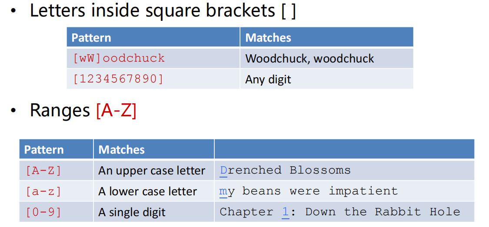
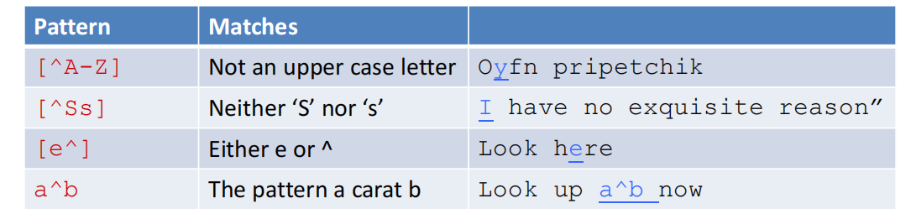
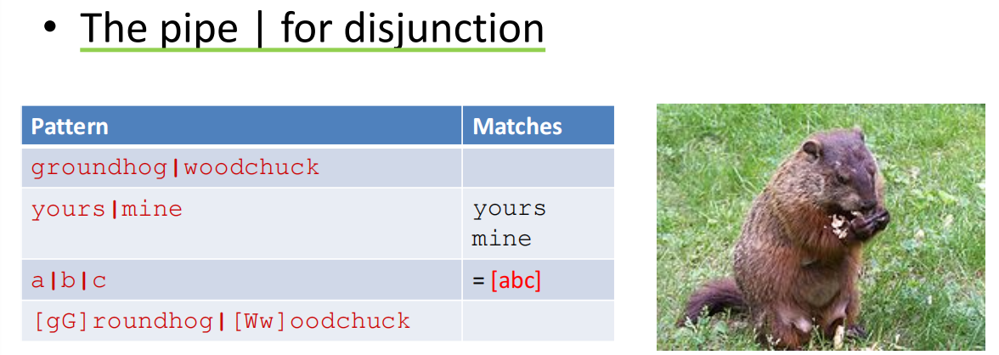
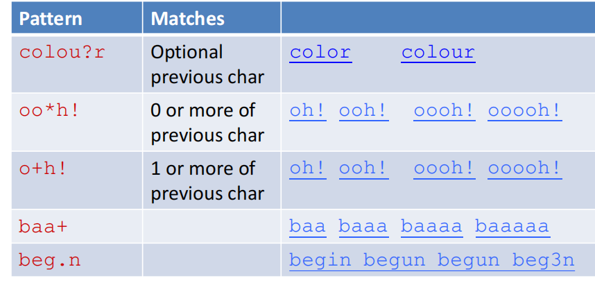
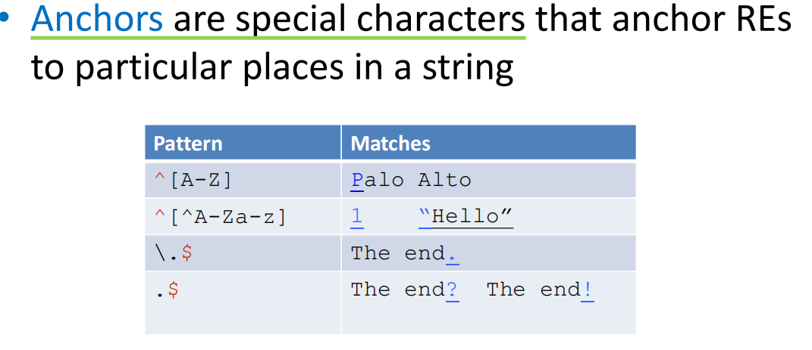
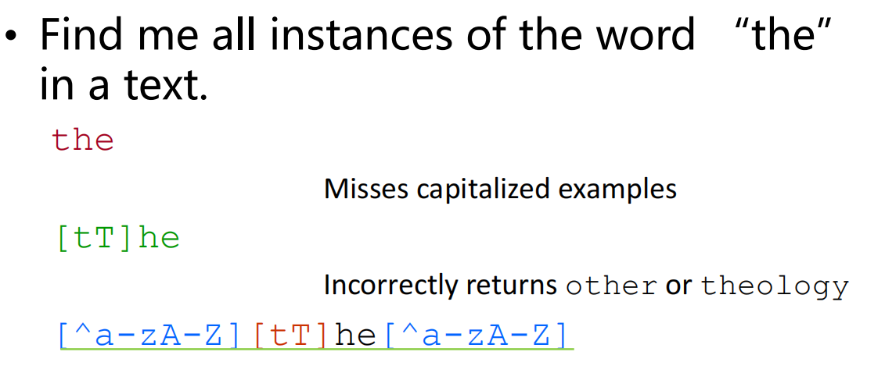
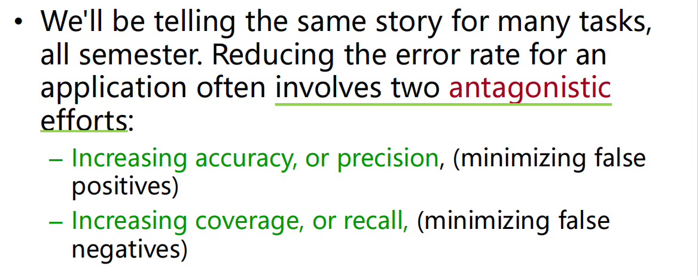

## Lecture 1

### 自然语言处理概述与课程介绍

#### overview

自然语言处理：

- 用计算机对自然语言的形、音、义等信息进行处理，即对字、词、句、篇章的输入、输出、识别、分析、理解、生成等的操作和加工

两个流程：

- 自然语言理解：计算机能够理解自然语言文本的意义
- 自然语言生成：计算机能够以自然语言文本来表达给定的意图

自然语言处理表现形式：

- 机器翻译、文本摘要、文本分类、文本校对、信息抽取、语音合成、语音识别等

#### nlp技术分类

##### nlp基础技术

##### nlp应用技术

###### 机器翻译

通过特定的计算机程序将一种书写形式或声音形式的自然语言，翻译成另一种书写形式或 声音形式的自然语言

方法：

- 基于理性的研究方法——基于规则的方法
- 基于经验的研究方法——基于统计的方法
- 与深度学习结合

###### 信息检索

#### 人工智能三个阶段

### 正则表达式（Regular Expression）

**regular expression(正则表达式)** 

- 在一个特定语句中某些字符串类的一种形式
- 需要一个 **模式（pattern）**作为匹配的规则
- 需要一个 **语料库（corpus）**作为模式中文本集合的来源

>本质上是 按照一个规则，在一段文本中匹配满足规则的字符串

**disjunction（析取）**

在 `[ ]`内的字符表示可以匹配的对象

否定词 `^`在析取中的作用

- 只有在 []的开头出现的 `^`才表示否定的作用

`|`表示 连接，在一个析取内表示两个可能的结果都可以

- 比如上述第一个pattern中，既可以匹配 `groundhog` 也可以匹配 `woodchuck`

一些其他符号

- `?`表示pattern中的上一个char可选的
- `*`表示 pattern中的上一个char匹配0次或多次
- `+`表示pattern中的上一个char匹配1次或多次
- `.`表示匹配任意一个char一次

**Anchors（锚号）**

`^`和 `$`

只有在pattern的开头和结尾处才有作用，表示匹配串的开头和结尾

**一个例子**

>这里需要注意的是 ，我们的target只是 the或者The，某个单词中间带the是不应该被匹配的，因此需要在pattern的两端加上 `[^a-zA-Z]`

**Errors**

两种错误类型

- False positives：匹配那些我们不应该匹配的对象，比如 there，then，other不应该被当成the匹配
- False negatives：没有匹配那些我们需要匹配的对象，比如 The没有匹配

### 有限状态自动机（Finite State Automata）

### 分词（Word Segmentation）