## 2023年

### 判断题：

>**没有智能体可以在一个完全不可观察的环境中理性地工作。**（正确）
>
>- 理由：在一个完全不可观察的环境中，智能体无法获取任何信息，因此无法进行理性的决策。
>
>**如果对搜索树中的每一步的代价都增加一个正数 CCC，则一致代价（Uniform Cost）搜索算法可能会给出不一样的搜索路径。**（错误）
>
>- 理由：一致代价搜索算法选择的是代价最小的路径。如果所有路径的代价都增加了相同的正数 CCC，则相对顺序不会改变，最终的路径也不会改变。
>
>**如果 h1(s)h_1(s)h1(s) 和 h2(s)h_2(s)h2(s) 是两个 A* 算法的可采纳（Admissible）启发式函数，则它们的平均值 h3(s)=12h1(s)+12h2(s)h_3(s) = \frac{1}{2} h_1(s) + \frac{1}{2} h_2(s)h3(s)=21h1(s)+21h2(s) 也必然是可采纳的。**（正确）
>
>- 理由：可采纳的启发式函数是不会高估实际代价的，因此它们的平均值也不会高估实际代价，仍然是可采纳的。
>
>**在贝叶斯网络中，已知随机变量 A 和 B 互相独立（ALB），对任意新的变量 C，仍然成立 A⊥B∣CA \bot B \mid CA⊥B∣C。**（错误）
>
>- 理由：如果 A 和 B 互相独立，但在给定 C 的条件下，A 和 B 可能会变得不独立，这取决于变量之间的具体关系。
>
>**针对包含一些噪声数据点的非线性分类数据，使用具有松弛变量（Slack Variable）的 SVM 创建软间隔（Soft Margin）分类器。对其中控制错误分类惩罚程度的惩罚参数 CCC 选择较小的值，通常会减少训练数据的过拟合（overfitting）。**（正确）
>
>- 理由：较小的 CCC 值会减少对误分类的惩罚，从而使模型变得更加柔和，减少过拟合。

### 选择题

#### T1

对于线性核函数（Linear Kernel）的支持向量机（SVM），分类边界应为线性边界，即一条直线。我们需要在图中找到具有线性分界线的分类结果。

- 边界明显是曲线，因此不是线性边界。
- **B**：边界是直线，因此是线性边界。
- **C**：边界是直线，因此是线性边界。
- **D**：边界是曲线，因此不是线性边界。
- **E**：边界明显是曲线，因此不是线性边界。
- **F**：边界明显是曲线，因此不是线性边界。

### 修正后的答案

所以，使用线性核的SVM对应的可能结果是 **B 和 C**。

#### T2

### 给定命题 PPP 和 QQQ，下列情况哪种是公式 ¬P∨Q→¬P∧Q\neg P \lor Q \rightarrow \neg P \land Q¬P∨Q→¬P∧Q 的模型？

我们需要验证公式 ¬P∨Q→¬P∧Q\neg P \lor Q \rightarrow \neg P \land Q¬P∨Q→¬P∧Q 在四种情况下的真假性。公式 ¬P∨Q→¬P∧Q\neg P \lor Q \rightarrow \neg P \land Q¬P∨Q→¬P∧Q 可以用真值表的方法逐一验证每种情况下公式的真值。

#### 真值表方法验证公式

| PPP  | QQQ  | ¬P\neg P¬P | ¬Q\neg Q¬Q | ¬P∨Q\neg P \lor Q¬P∨Q | ¬P∧Q\neg P \land Q¬P∧Q | ¬P∨Q→¬P∧Q\neg P \lor Q \rightarrow \neg P \land Q¬P∨Q→¬P∧Q |
| ---- | ---- | ---------- | ---------- | --------------------- | ---------------------- | ---------------------------------------------------------- |
| F    | F    | T          | T          | T                     | F                      | F                                                          |
| F    | T    | T          | F          | T                     | T                      | T                                                          |
| T    | F    | F          | T          | F                     | F                      | T                                                          |
| T    | T    | F          | F          | T                     | F                      | F                                                          |

由真值表可以看出，公式 ¬P∨Q→¬P∧Q\neg P \lor Q \rightarrow \neg P \land Q¬P∨Q→¬P∧Q 在下列情况下为真：

- P=false,Q=trueP = \text{false}, Q = \text{true}P=false,Q=true
- P=true,Q=falseP = \text{true}, Q = \text{false}P=true,Q=false

所以答案是：

B, C

#### T3

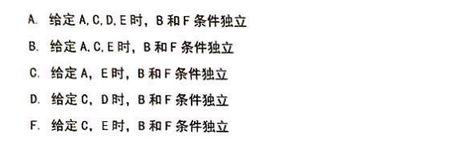

>#### 给定 A,C,D,EA, C, D, EA,C,D,E 时，BBB 和 FFF 条件独立。
>
>- 路径：B→D→E→FB \rightarrow D \rightarrow E \rightarrow FB→D→E→F
>- 在给定 DDD 和 EEE 时，路径 B→D→E→FB \rightarrow D \rightarrow E \rightarrow FB→D→E→F 被 DDD 和 EEE 封闭。
>- 因此，给定 A,C,D,EA, C, D, EA,C,D,E 时，BBB 和 FFF 条件独立。
>
>#### B. 给定 A,C,EA, C, EA,C,E 时，BBB 和 FFF 条件独立。
>
>- 路径：B→D→E→FB \rightarrow D \rightarrow E \rightarrow FB→D→E→F
>- 在给定 EEE 时，路径 B→D→E→FB \rightarrow D \rightarrow E \rightarrow FB→D→E→F 被 EEE 封闭。
>- 因此，给定 A,C,EA, C, EA,C,E 时，BBB 和 FFF 条件独立。
>
>#### C. 给定 A,EA, EA,E 时，BBB 和 FFF 条件独立。
>
>- 路径：B→D→E→FB \rightarrow D \rightarrow E \rightarrow FB→D→E→F
>- 在给定 EEE 时，路径 B→D→E→FB \rightarrow D \rightarrow E \rightarrow FB→D→E→F 被 EEE 封闭。
>- 因此，给定 A,EA, EA,E 时，BBB 和 FFF 条件独立。
>
>#### D. 给定 C,DC, DC,D 时，BBB 和 FFF 条件独立。
>
>- 路径：B→D→E→FB \rightarrow D \rightarrow E \rightarrow FB→D→E→F
>- 在给定 DDD 时，路径 B→D→E→FB \rightarrow D \rightarrow E \rightarrow FB→D→E→F 被 DDD 封闭。
>- 因此，给定 C,DC, DC,D 时，BBB 和 FFF 条件独立。
>
>#### E. 给定 C,EC, EC,E 时，BBB 和 FFF 条件独立。
>
>- 路径：B→D→E→FB \rightarrow D \rightarrow E \rightarrow FB→D→E→F
>- 在给定 EEE 时，路径 B→D→E→FB \rightarrow D \rightarrow E \rightarrow FB→D→E→F 被 EEE 封闭。
>- 因此，给定 C,EC, EC,E 时，BBB 和 FFF 条件独立。
>
>### 结论
>
>所有选项都是正确的，给定的条件都使得 BBB 和 FFF 条件独立。要选择“哪种说法一定正确”，所有的选项都是正确的。这可能是一个出题错误，所有选项都满足条件独立。
>
>如果必须选择一个答案，可以选择 **A, B, C, D, E**，因为它们都满足条件独立性。

#### T4

#### 解答：

A. **预测一个信用卡交易是欺诈还是合法**（适合分类学习算法）

- 这是一个典型的二分类问题，可以使用分类算法来预测交易是否为欺诈。

B. **预测明天下多少雨**（不适合分类学习算法）

- 这是一个回归问题，因为需要预测一个连续的数值。

C. **预测手写字符图像所表示的字母**（适合分类学习算法）

- 这是一个多分类问题，可以使用分类算法来识别手写字符图像所表示的字母。

D. **根据客户的购买模式将客户数据库分成不同的簇（Cluster），其中簇的性质由计算机自动确定，而不是以任何方式由人类提供**（不适合分类学习算法）

- 这是一个聚类问题，而不是分类问题。适合使用聚类算法如 K-means。

**因此，适合分类学习算法的任务是 A 和 C。**

#### T5

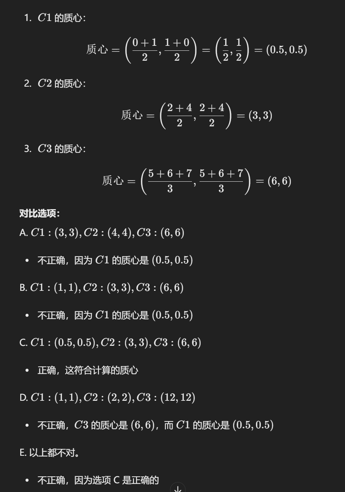

### Question3：

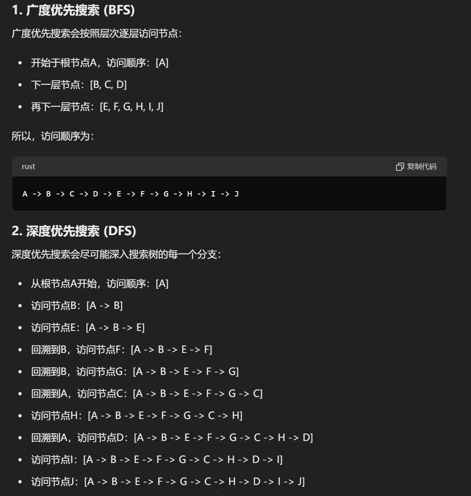

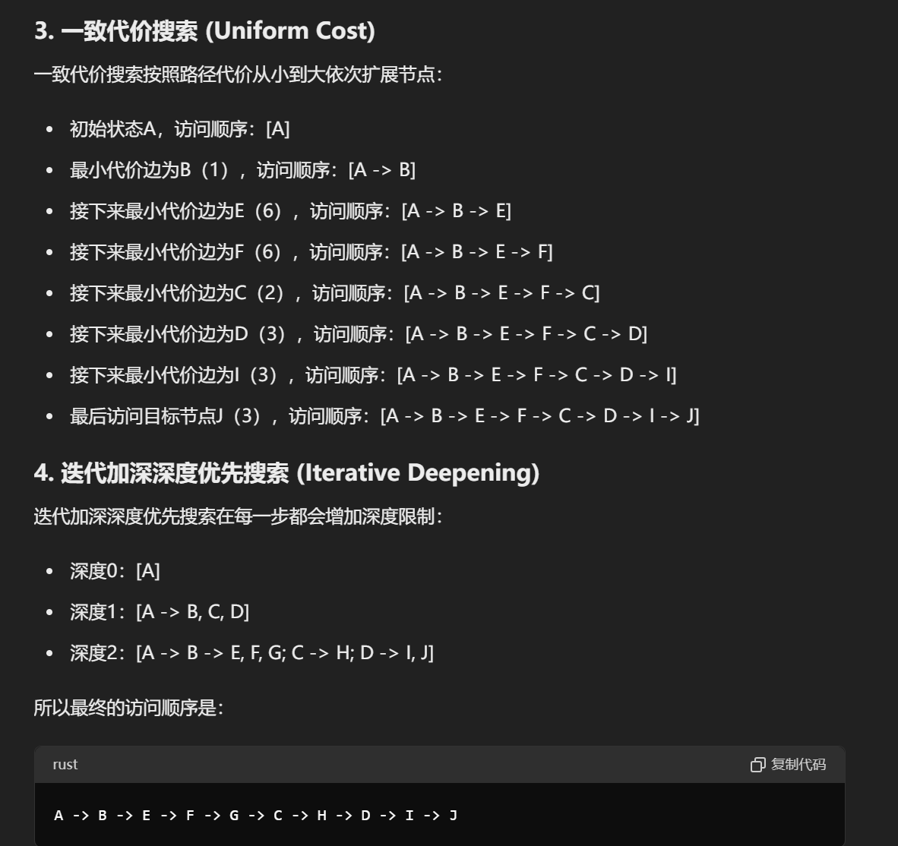

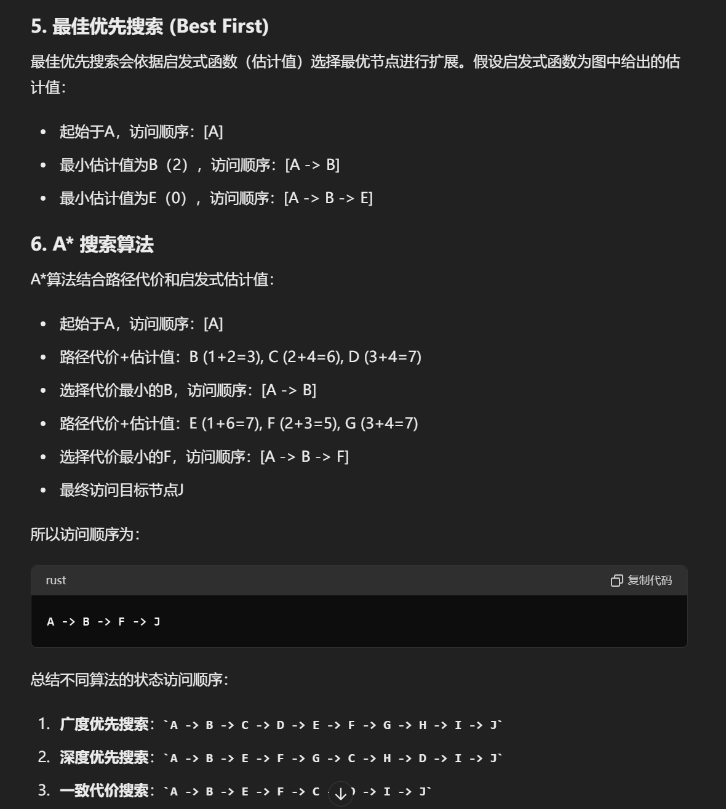

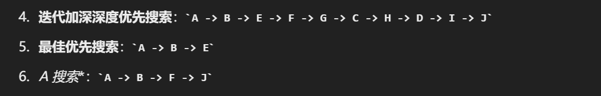

### Question5：

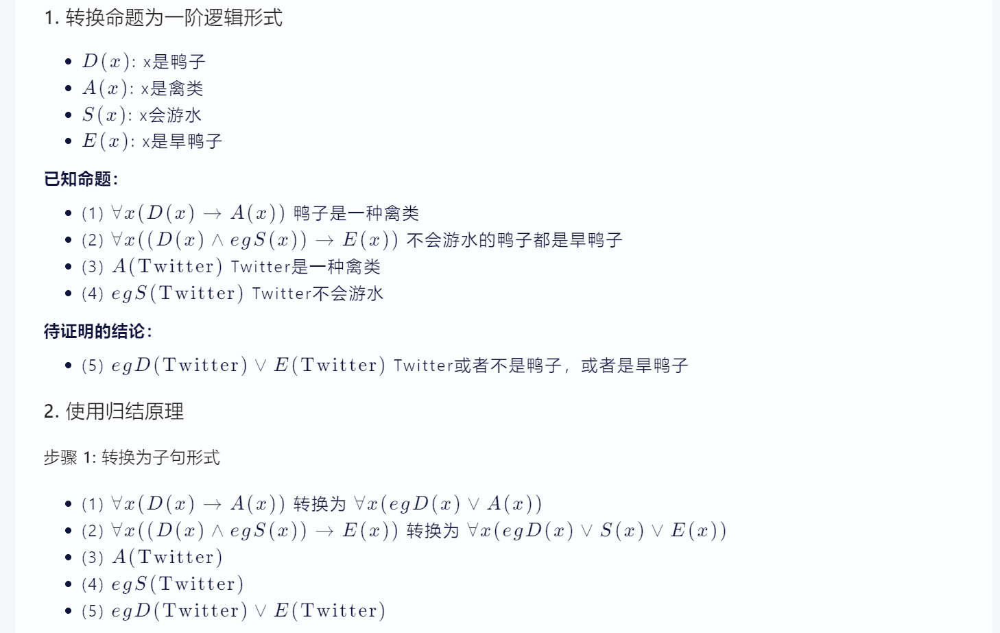

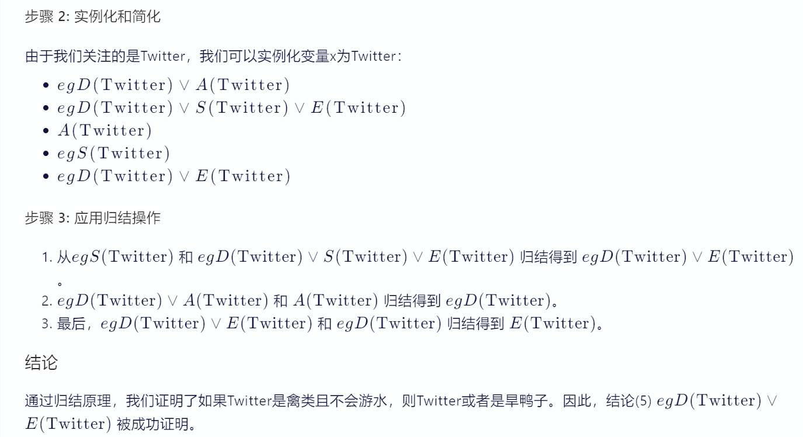

### Question7：

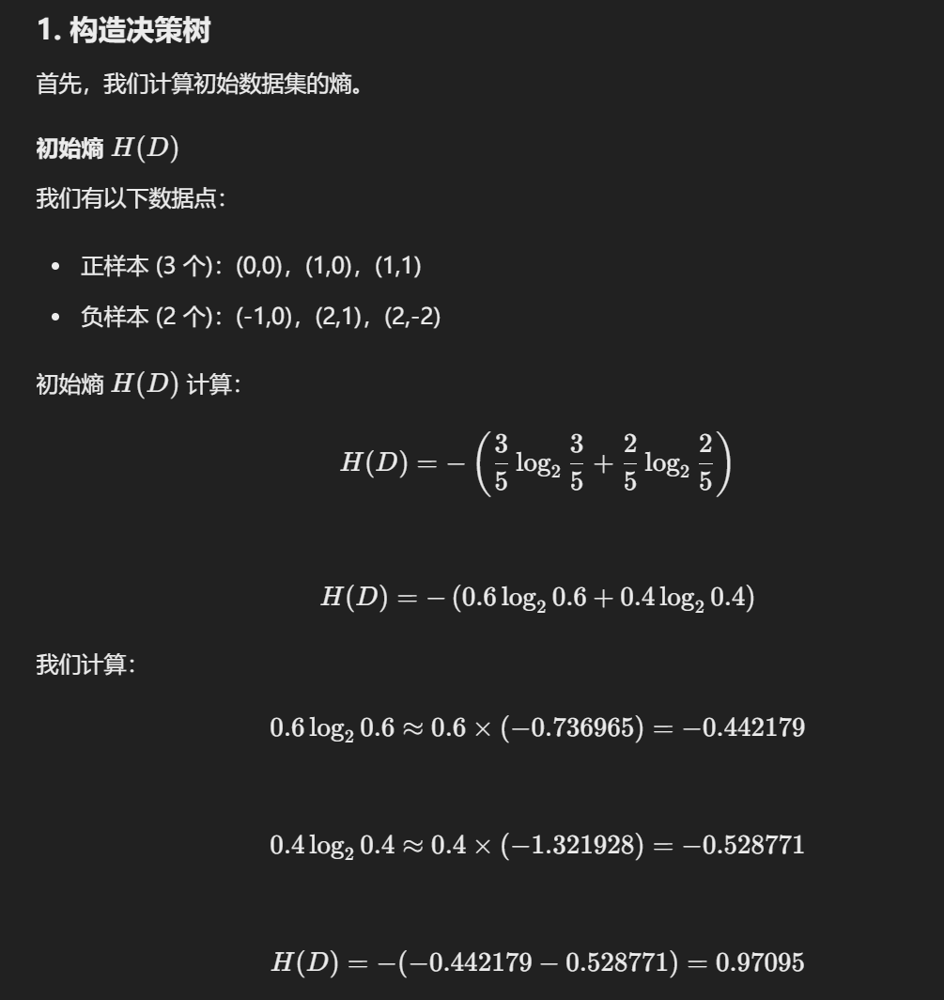

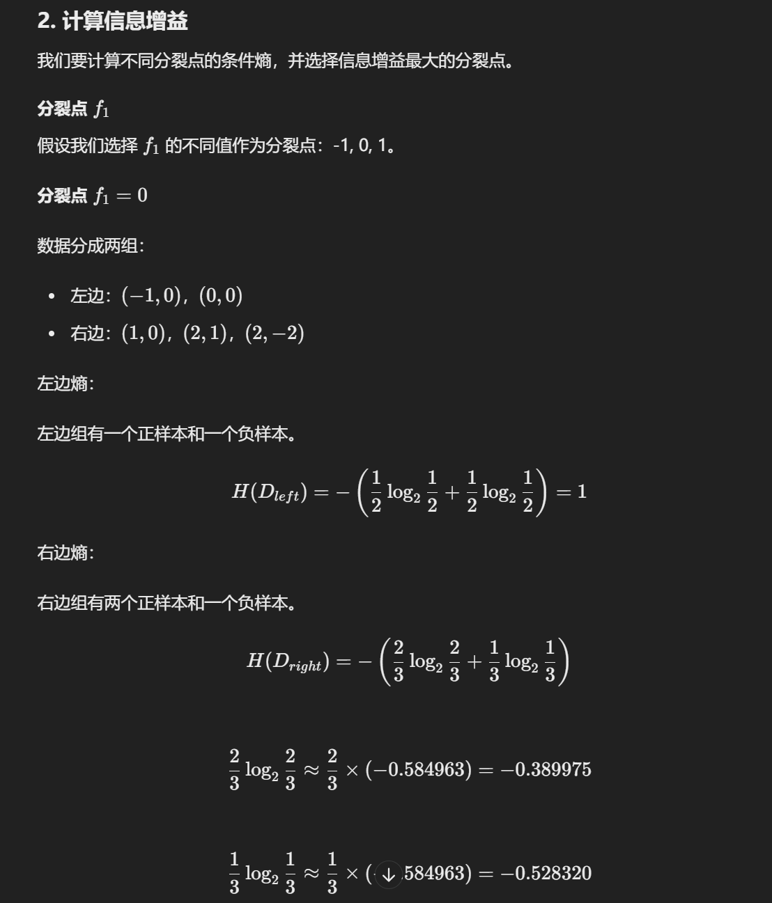

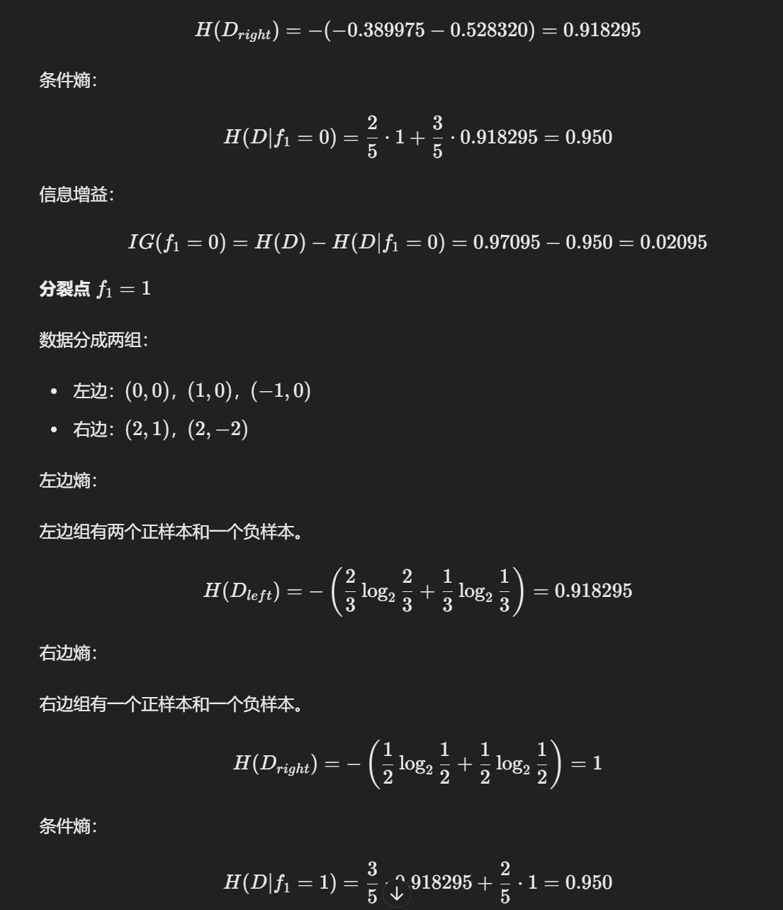

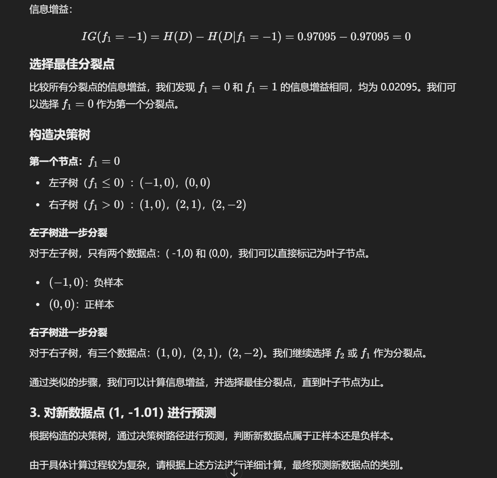

### Question8：

**若当前模型为软间隔支持向量机（Soft Margin SVM），现额外有一个点不能被 SVM 正确分类且远离决策边界，如果将该点加入到训练集重新训练，原 SVM 的决策边界会受到影响吗？为什么？**

#### 解答：

软间隔支持向量机通过引入松弛变量允许一些误分类，以便最大化决策边界的间隔。以下是详细解释：

1. **远离决策边界**：既然新点远离决策边界，它对支持向量的影响很小，因为支持向量机的决策边界主要由支持向量决定，这些支持向量是那些距离决策边界最近的点。
2. **不能被正确分类**：这个新点的引入可能会增加一些误分类的代价，但由于它远离决策边界，不会成为新的支持向量。
3. **软间隔 SVM**：软间隔 SVM 允许一些误分类以获得更好的分类效果。由于新点远离决策边界，它对支持向量的影响较小。

综上，虽然新点不能被正确分类且远离决策边界，但因为它不影响当前的支持向量集，因此对决策边界的影响不大。

### 问题 2

**若当前模型为线性最小二乘分类（Least Squares Classification），现额外有一个点不能被该模型正确分类且远离决策边界，如果将该点加入到训练集重新训练，最小二乘分类的决策边界会受到影响吗？为什么？**

#### 解答：

线性最小二乘分类是一种基于最小化误差平方和的分类方法。以下是详细解释：

1. **远离决策边界**：即使新点远离决策边界，最小二乘分类会试图最小化所有点的误差平方和。这意味着每个数据点都会对模型的参数产生影响。
2. **误差平方和**：新点如果误差较大，会显著增加整体的误差平方和。因此，即使新点远离决策边界，它依然会对决策边界的参数产生较大的影响。
3. **模型重训练**：加入新点后，最小二乘分类的目标是最小化所有数据点的误差平方和，因此会调整决策边界以尽可能减少整体误差。

综上，虽然新点远离决策边界，但由于最小二乘分类最小化整体误差平方和的性质，这个新点会对模型的参数产生较大的影响，进而改变决策边界。

### 问题 3

**从问题 1 和 2 中，哪一个模型受到这些样本的影响更大？请解释原因。（提示：可以从损失函数的角度考虑）**

#### 解答：

比较软间隔支持向量机（SVM）和线性最小二乘分类（Least Squares Classification）：

1. **软间隔 SVM**：
   - 目标是最大化间隔，同时允许一定的误分类，通过引入松弛变量来处理误分类。
   - 误分类的点对模型影响有限，特别是那些远离决策边界的点。
2. **线性最小二乘分类**：
   - 目标是最小化所有点的误差平方和。
   - 任何点的误差都会对整体误差平方和产生影响，尤其是那些误差较大的点（即远离决策边界的点）。

因此，从损失函数的角度来看，**线性最小二乘分类（Least Squares Classification）** 受新点影响更大。因为它最小化的是所有数据点的误差平方和，任何一个点的较大误差都会显著影响整体误差，而 SVM 的目标是最大化间隔，对远离决策边界的点不敏感。

###  现额外有一个点能被 SVM 正确分类且远离决策边界，如果将该点加入到训练集重新训练，SVM 的决策边界会受到影响吗？为什么？

#### 解答：

对于硬间隔支持向量机，决策边界主要由支持向量决定。这些支持向量是那些位于间隔边界上的点。因为新增的点能被正确分类且远离决策边界，所以它不会成为新的支持向量，对决策边界的影响很小甚至没有影响。

### 3. 现额外有一个点不能被当前的 SVM 正确分类且远离决策边界，如果将该点加入到训练集并将硬间隔支持向量机扩展为软间隔支持向量机（Soft Margin SVM），SVM 的决策边界会受到影响吗？为什么？

#### 解答：

在软间隔支持向量机中，允许一些误分类以获得更好的分类效果。虽然这个新点远离决策边界且不能被正确分类，它会引入松弛变量，增加误分类的代价。

具体影响如下：

- **误分类代价**：软间隔 SVM 会引入一个松弛变量来处理误分类的点，这个变量会增加目标函数的值。
- **决策边界**：由于增加了误分类的代价，SVM 会调整决策边界以平衡间隔最大化和误分类代价最小化。这可能会导致决策边界发生变化。

因此，尽管新点远离决策边界，软间隔 SVM 仍会因为引入松弛变量而调整决策边界，使其对新点的误分类进行某种补偿。

## 2021

### Question6

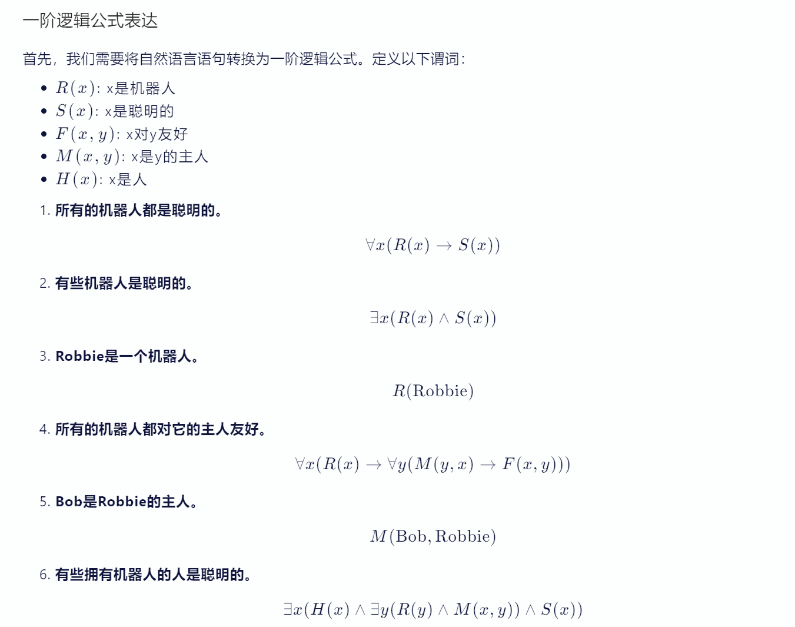

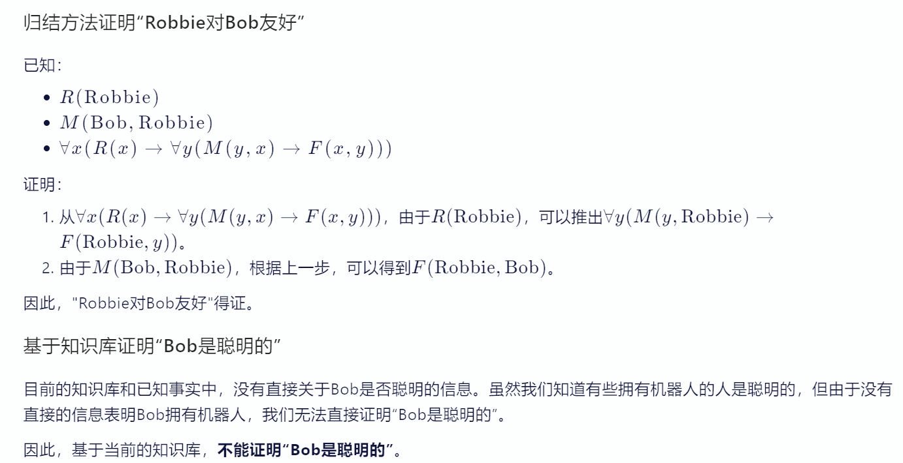

### Question7：

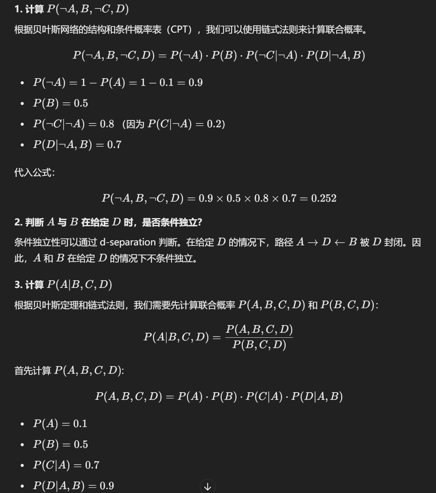

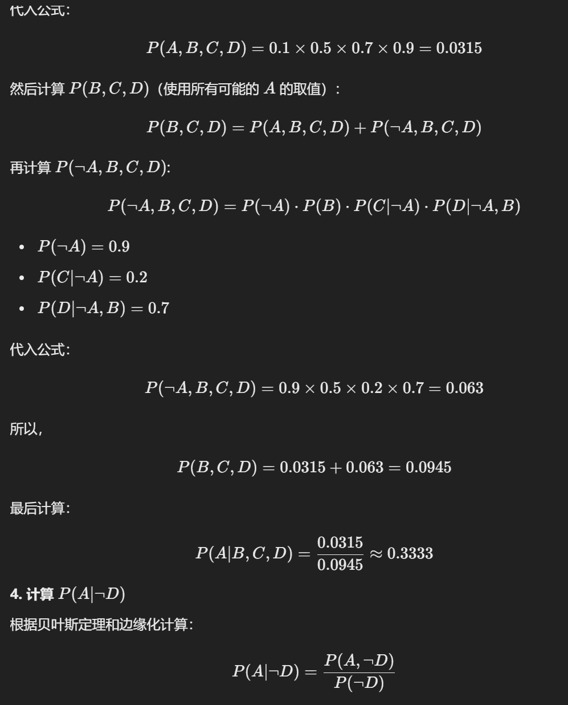

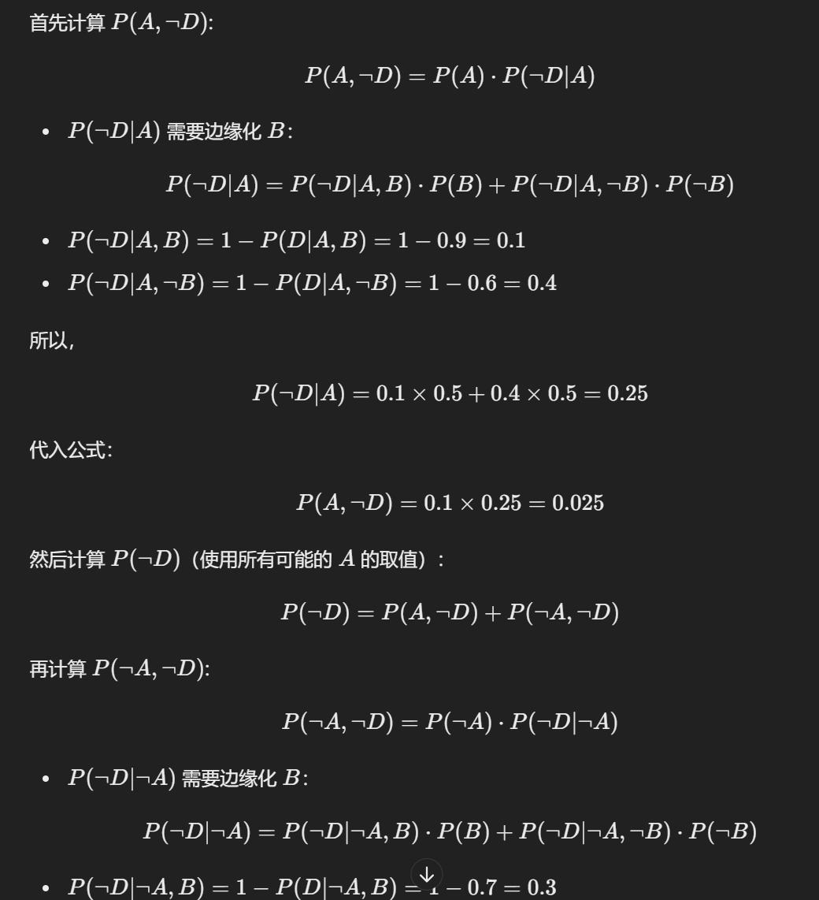

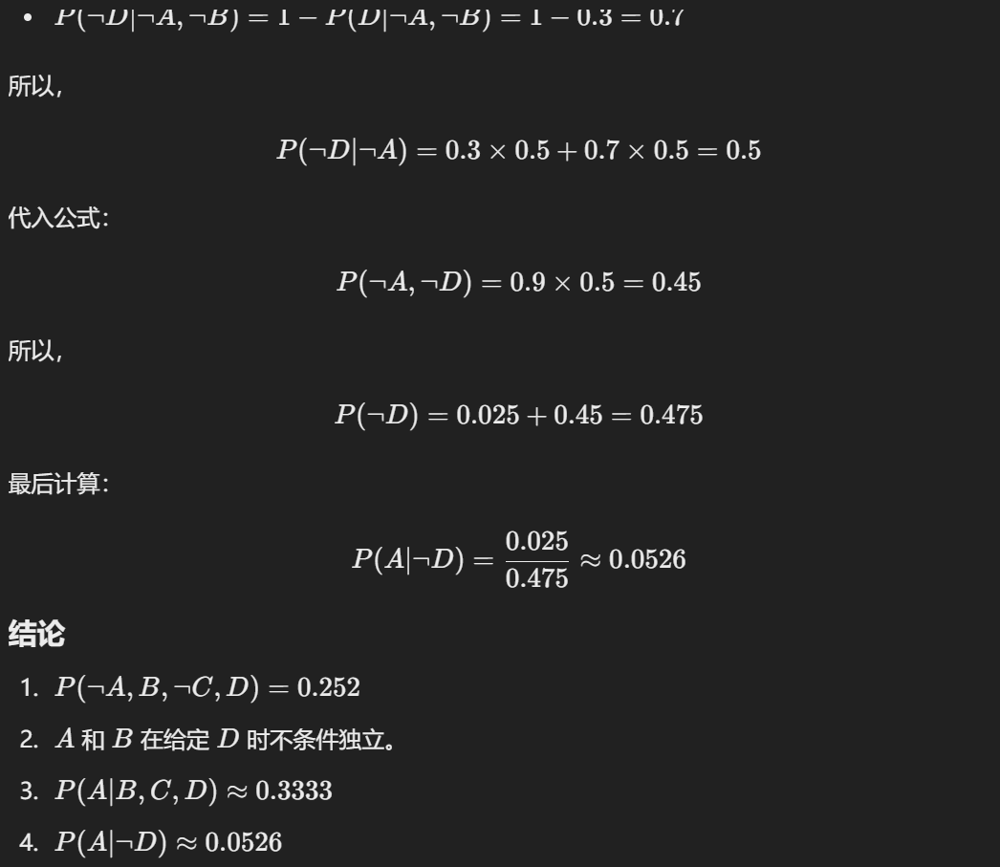

>d-separation 是贝叶斯网络中用于判断变量之间是否条件独立的一种方法。通过d-separation，可以确定在给定一些条件变量的情况下，其他变量是否条件独立。
>
>贝叶斯网络中的变量通过有向无环图（DAG）来表示，d-separation 的基本思想是通过图结构来判断信息是否能够通过某些路径传播。具体地，d-separation 定义了三种路径的情况，来判断变量之间的条件独立性。
>
>#### 三种路径类型
>
>1. **串联结构（Serial/Chain Structure）**:
>   - 形式： A→B→CA \rightarrow B \rightarrow CA→B→C 或 A←B←CA \leftarrow B \leftarrow CA←B←C
>   - 条件独立性：给定中间节点 BBB 后，AAA 和 CCC 条件独立。
>   - 示例：在路径 A→B→CA \rightarrow B \rightarrow CA→B→C 中，如果知道 BBB，则 AAA 和 CCC 条件独立。
>2. **分叉结构（Diverging Structure）**:
>   - 形式： A←B→CA \leftarrow B \rightarrow CA←B→C
>   - 条件独立性：给定父节点 BBB 后，AAA 和 CCC 条件独立。
>   - 示例：在路径 A←B→CA \leftarrow B \rightarrow CA←B→C 中，如果知道 BBB，则 AAA 和 CCC 条件独立。
>3. **聚合结构（Converging Structure，亦称v-结构或Collider）**:
>   - 形式： A→B←CA \rightarrow B \leftarrow CA→B←C
>   - 条件独立性：给定中间节点 BBB 的任何后代后，AAA 和 CCC 不条件独立。如果不考虑 BBB 或其后代，AAA 和 CCC 条件独立。
>   - 示例：在路径 A→B←CA \rightarrow B \leftarrow CA→B←C 中，如果不知道 BBB 及其后代，AAA 和 CCC 条件独立。
>
>### d-separation 的判断步骤
>
>1. **确定路径**：在贝叶斯网络中找到从一个变量到另一个变量的所有可能路径。
>2. **检查每条路径**：根据三种路径类型的规则，检查路径是否被给定条件变量阻断。
>3. **判断条件独立性**：如果所有路径都被阻断，则变量条件独立；如果至少有一条路径未被阻断，则变量不条件独立。

## 2020:

### 判断题

>### 广度优先搜索是代价一致搜索的特例。
>
>- **正确**。广度优先搜索可以看作是一致代价搜索的特例，其中每一步的代价都是相同的，因此代价一致搜索会等价于广度优先搜索。
>
>### 2. 深度优先搜索扩展的结点个数不会少于使用可采纳启发式的 A* 搜索算法。
>
>- **错误**。深度优先搜索在最坏情况下可能扩展更多的节点，因为它可能探索到搜索空间的很深的部分，而A*算法利用可采纳的启发式函数能够更有效地引导搜索，从而可能扩展更少的节点。
>
>深度优先搜索（DFS）和 A* 搜索算法在扩展节点个数上的比较需要考虑算法的特性。
>
>- **深度优先搜索（DFS）**：
>  - DFS 不考虑路径的代价，只是沿着路径不断深入，直到找到一个解决方案或者达到最大深度。如果路径很深且解在较浅的深度上，DFS 可能会扩展大量不必要的节点。
>  - DFS 的优点是占用内存较少，但可能会陷入深层的搜索，扩展大量节点。
>- **A\* 搜索算法**：
>  - A* 搜索利用启发式函数 h(n)h(n)h(n) 来估计从节点 nnn 到目标的代价，并使用总代价 f(n)=g(n)+h(n)f(n) = g(n) + h(n)f(n)=g(n)+h(n) 来引导搜索，其中 g(n)g(n)g(n) 是从起点到 nnn 的实际代价。
>  - 如果启发式函数是可采纳的（即永远不会超过实际代价），A* 搜索将保证找到最优解，同时通常会扩展较少的节点，因为启发式函数可以有效地引导搜索。
>
>综上所述，深度优先搜索（DFS）扩展的节点个数可能会远多于使用可采纳启发式的 A* 搜索算法，特别是在启发式函数良好的情况下。因此，原命题“深度优先搜索扩展的结点个数不会少于使用可采纳启发式的 A* 搜索算法”是 **错误** 的。
>
>### 3. 在命题逻辑中，以下关系成立：A⇔B⊨¬A∨BA \Leftrightarrow B \models \neg A \lor BA⇔B⊨¬A∨B。
>
>- **正确**。如果 A⇔BA \Leftrightarrow BA⇔B 成立，那么 AAA 和 BBB 在逻辑上是等价的，这意味着 ¬A∨B\neg A \lor B¬A∨B 是一个重言式，因此 A⇔B⊨¬A∨BA \Leftrightarrow B \models \neg A \lor BA⇔B⊨¬A∨B 成立。
>
>### 4. 越复杂的模型越能有效地发现数据中的规律。
>
>- **错误**。过于复杂的模型可能会过拟合数据，捕捉到噪声而不是实际的规律。因此，模型的复杂度需要和数据的复杂度匹配，过于复杂的模型不一定能有效地发现数据中的规律。
>
>### 5. 主成分分析 (PCA) 可以起到去噪的作用。
>
>- **正确**。PCA 通过提取数据中的主要成分并忽略次要成分，可以有效地去除噪声，从而起到去噪的作用。

### 选择题：

>- **深度优先搜索**：不保证找到最优解，因为它可能会陷入很深的子树中而不检查更浅的解。
>- **广度优先搜索**：保证找到最优解，因为它逐层检查所有可能的解。
>- **迭代深化搜索**：结合了深度优先搜索和广度优先搜索的优点，保证找到最优解。
>- **遗传算法**：不保证找到最优解，因为它是一种启发式方法，依赖于随机过程。
>
>因此，必然可以得到最优解的算法是广度优先搜索和迭代深化搜索。
>
>**答案：C**
>
>### 2. 以下哪一阶逻辑语句和语义上正确地表达了“每一个孩子都爱自己的母亲或父亲”：
>
>A. ∀x (Child(x)→Loves(x,Mother(x))∨Loves(x,Father(x)))\forall x \ (Child(x) \rightarrow Loves(x, Mother(x)) \lor Loves(x, Father(x)))∀x (Child(x)→Loves(x,Mother(x))∨Loves(x,Father(x)))
>
>B. ∀x (Child(x)∨Loves(x,Mother(x))∨Loves(x,Father(x)))\forall x \ (Child(x) \lor Loves(x, Mother(x)) \lor Loves(x, Father(x)))∀x (Child(x)∨Loves(x,Mother(x))∨Loves(x,Father(x)))
>
>C. ∀x (Child(x)∧(Loves(x,Mother(x))∨Loves(x,Father(x))))\forall x \ (Child(x) \land (Loves(x, Mother(x)) \lor Loves(x, Father(x))))∀x (Child(x)∧(Loves(x,Mother(x))∨Loves(x,Father(x))))
>
>D. ∀x (Child(x)→(Loves(x,Mother(x))∧Loves(x,Father(x))))\forall x \ (Child(x) \rightarrow (Loves(x, Mother(x)) \land Loves(x, Father(x))))∀x (Child(x)→(Loves(x,Mother(x))∧Loves(x,Father(x))))
>
>#### 解答：
>
>- A 选项正确表达了“每一个孩子都爱自己的母亲或父亲”。
>- B 选项语义不正确。
>- C 选项是合取而不是条件语句，不正确。
>- D 选项表达的是“每个孩子都同时爱母亲和父亲”，不正确。
>
>**答案：A**
>
>### 3. 搜索下列公理集，其中不含合一的是（ ）：
>
>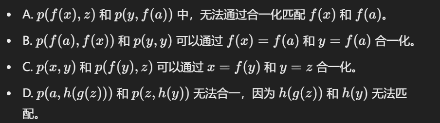
>
>**答案：A 和 D**
>
>### 4. 搜索引擎会观察用户在返回的搜索结果中点击了哪个网页，通过这种方式学习更好地搜索排序规则。如果搜索引擎学习是针对某个任务 T，随着经验的累积提高性能标准 P，那么在搜索引擎的何种 T 中，任务是什么？
>
>A. 对用户的查询返回一个有序的网页列表
>
>B. 观察用户在返回的搜索结果中点击了哪个网页
>
>C. 搜索引擎返回的结果的准确度
>
>D. 以上皆不是
>
>#### 解答：
>
>观察用户在返回的搜索结果中点击了哪个网页，搜索引擎的任务是对用户的查询返回一个有序的网页列表，从而提高返回结果的准确度。
>
>**答案：A**
>
>### 5. 考虑一个三维空间当中心以 wTx+b=0w^T x + b = 0wTx+b=0 为分类超平面的支持向量机，其中 w=(1,2,3)Tw = (1, 2, 3)^Tw=(1,2,3)T，b = 4，以下哪些正例点（即 y = 1）将被正确分类？
>
>A. x=(−2,−3,4)Tx = (-2, -3, 4)^Tx=(−2,−3,4)T
>
>B. x=(−1,−3,0)Tx = (-1, -3, 0)^Tx=(−1,−3,0)T
>
>C. x=(−4,−5,3)Tx = (-4, -5, 3)^Tx=(−4,−5,3)T
>
>D. x=(−4,−3,1)Tx = (-4, -3, 1)^Tx=(−4,−3,1)T
>
>#### 解答：
>
>验证每个点是否满足 wTx+b>0w^T x + b > 0wTx+b>0：
>
>1. x=(−2,−3,4)Tx = (-2, -3, 4)^Tx=(−2,−3,4)T
>
>   wTx+b=1(−2)+2(−3)+3(4)+4=−2−6+12+4=8>0w^T x + b = 1(-2) + 2(-3) + 3(4) + 4 = -2 - 6 + 12 + 4 = 8 > 0wTx+b=1(−2)+2(−3)+3(4)+4=−2−6+12+4=8>0
>
>   正确分类。
>
>2. x=(−1,−3,0)Tx = (-1, -3, 0)^Tx=(−1,−3,0)T
>
>   wTx+b=1(−1)+2(−3)+3(0)+4=−1−6+0+4=−3<0w^T x + b = 1(-1) + 2(-3) + 3(0) + 4 = -1 - 6 + 0 + 4 = -3 < 0wTx+b=1(−1)+2(−3)+3(0)+4=−1−6+0+4=−3<0
>
>   未正确分类。
>
>3. x=(−4,−5,3)Tx = (-4, -5, 3)^Tx=(−4,−5,3)T
>
>   wTx+b=1(−4)+2(−5)+3(3)+4=−4−10+9+4=−1<0w^T x + b = 1(-4) + 2(-5) + 3(3) + 4 = -4 - 10 + 9 + 4 = -1 < 0wTx+b=1(−4)+2(−5)+3(3)+4=−4−10+9+4=−1<0
>
>   未正确分类。
>
>4. x=(−4,−3,1)Tx = (-4, -3, 1)^Tx=(−4,−3,1)T
>
>   wTx+b=1(−4)+2(−3)+3(1)+4=−4−6+3+4=−3<0w^T x + b = 1(-4) + 2(-3) + 3(1) + 4 = -4 - 6 + 3 + 4 = -3 < 0wTx+b=1(−4)+2(−3)+3(1)+4=−4−6+3+4=−3<0
>
>   未正确分类。

### Question7：

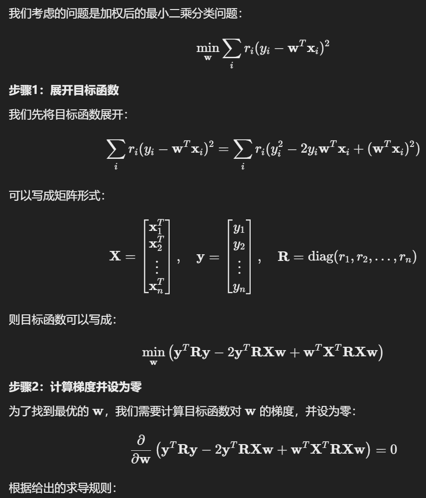

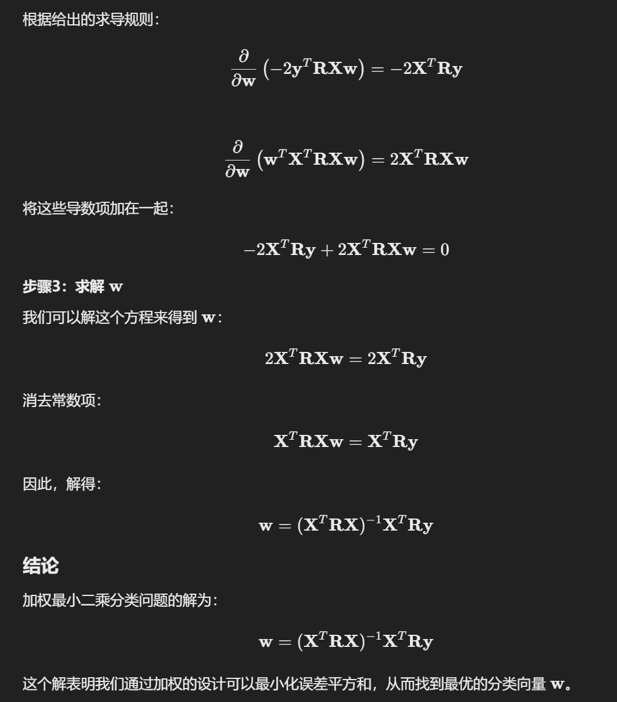

### Question8：

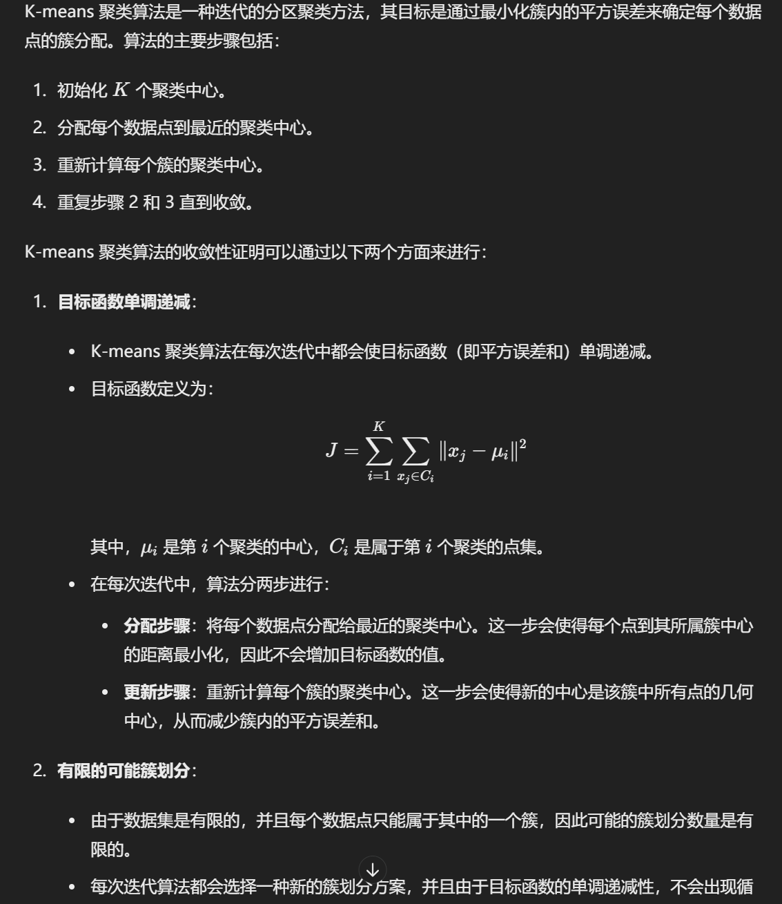

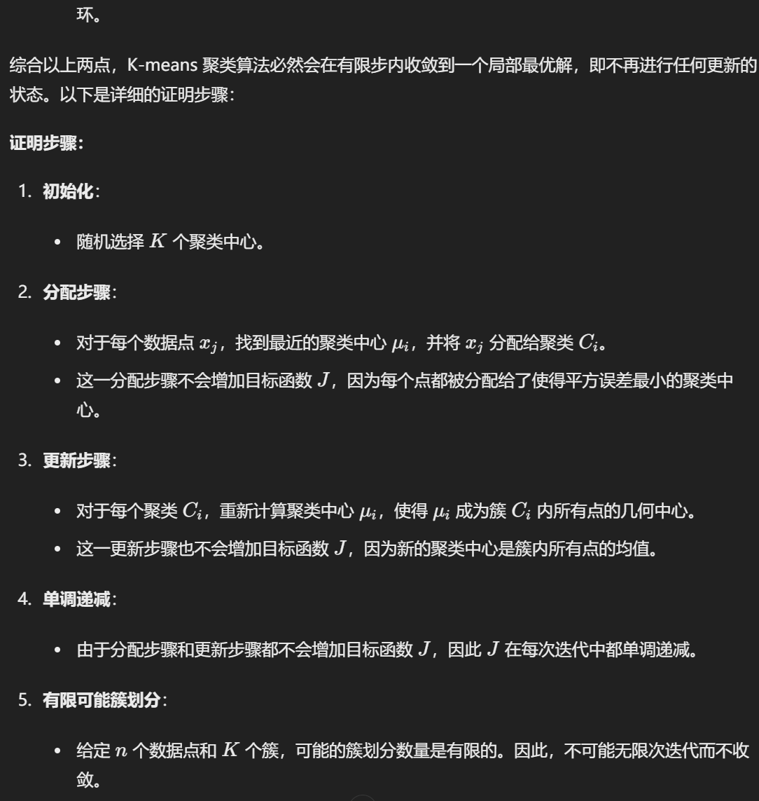

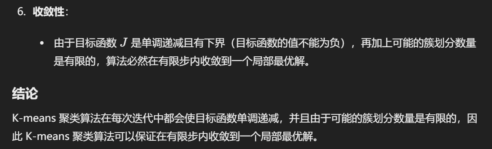

### Question6：

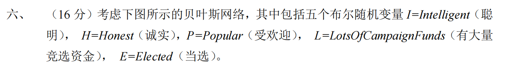

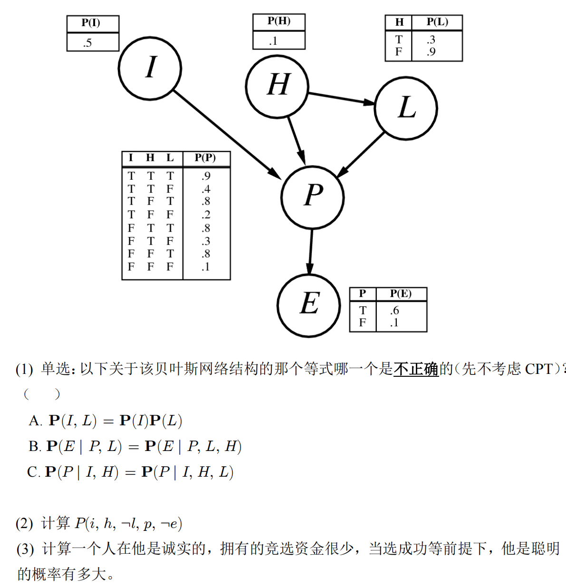

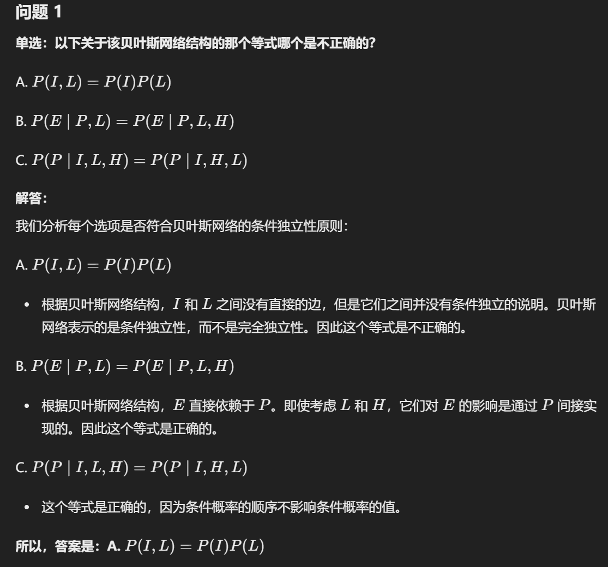

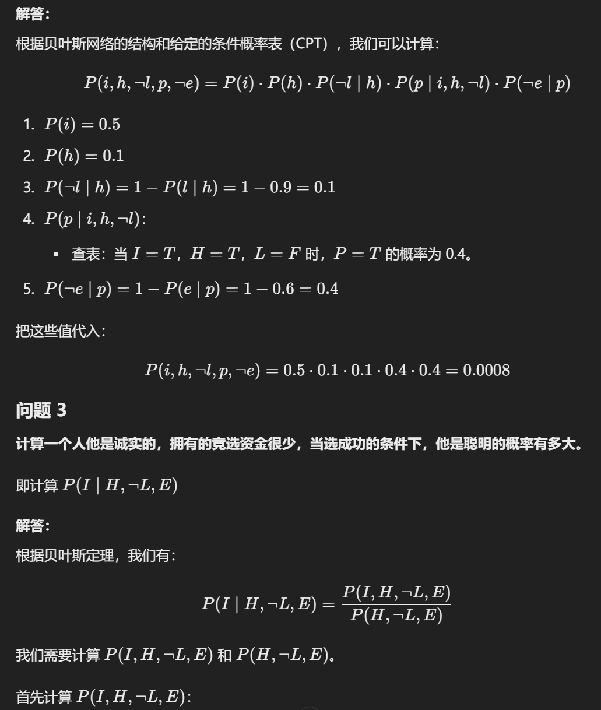

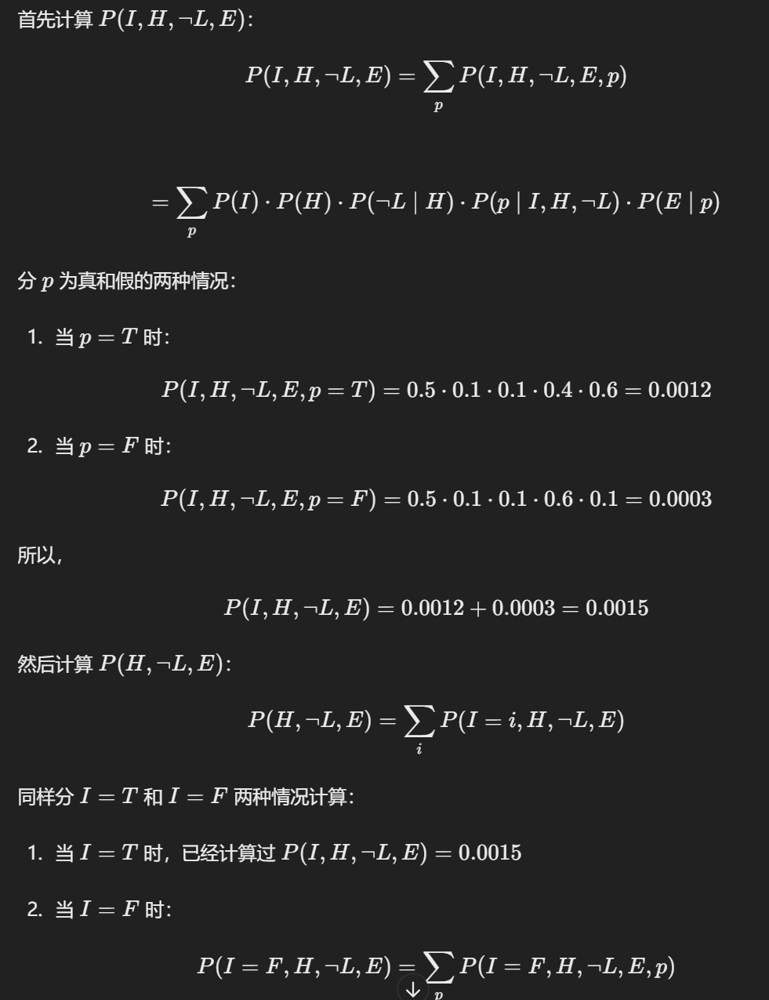

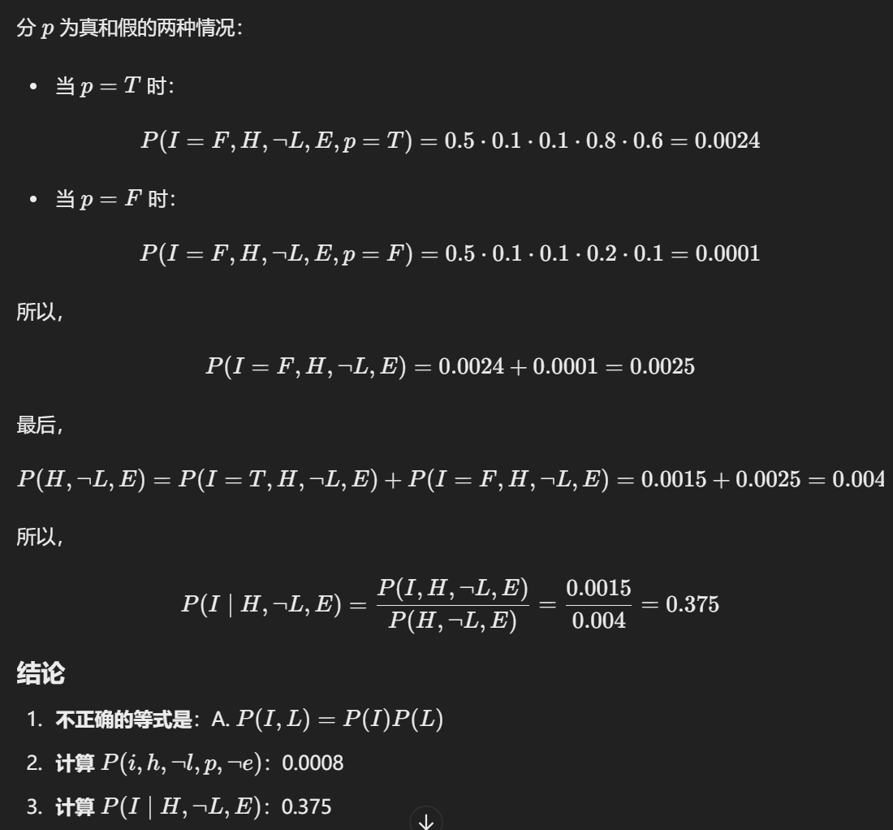