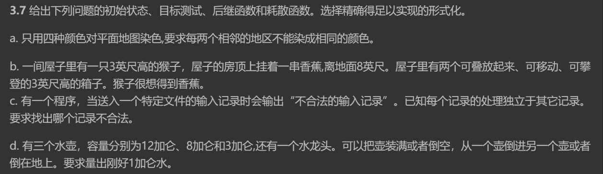
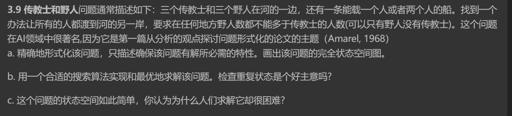

## Hw 1 

### T1(3.7 a,b,d)

#### Question:

#### Answer:

##### a.

- 初始状态：

  没有一个地区被染色

- 目标测试：

  所有地区都被染色，且相邻的两个地区不能被染成相同的颜色

- 后继函数：

  对一个地区着色

- 耗散函数：

  着色的方案数

##### b.

- 初始状态：

  最初屋子里的状态，没有堆叠任何箱子

- 目标测试：

  猴子得到了香蕉

- 后继函数：

  攀登上箱子

  将一个箱子移动到一个地方

  将一个箱子放在另一个箱子上面

- 耗散函数：

  动作的数量

##### d.

- 初始状态：

  所有的水壶里的水为：0加仑，0加仑，0加仑

- 目标测试：

  对一组水壶中水的容量 $[x,y,z],x+y+z = 1加仑$

- 后继函数

  对一组 $[x,y,z]$， 通过对一个水壶倒满水产生 $[12,y,z],[x,8,z],[x,y,3]$

  通过对其中一个水壶将其中水倒空产生： $[0,y,z],[x,0,z],[x,y,0]$

  从一个壶将水倒到另一个壶中

- 耗散函数

  动作的数量

### T2(3.9)

#### Question:

#### Answer:

##### a.

state：

一个六元组：

- 河的左岸的传教士、野人和船的数量
- 河的右岸传教士、野人和船的数量

goal：

- 达成：3个野人在河的左岸，另外3个传教士在河的右岸

cost function：

- action的次数

successor function：

- 将一个人或者两个人从河的一岸运输到另一岸

限制：

- 任何state下，某一岸的野人数$\leq$传教士人数 或 没有传教士

##### b.

采用A*算法求解该问题

state：

- 用一个三元组表示：(m, c, b)

  m表示左岸的传教士人数

  c表示左岸的野人数量

  b为0表示船在左岸，b为1表示船在右岸

  这样右岸的情况可以用 (3-m,3-c,!b)表示，不需要额外存储

定义启发式函数h(n) = m + c，表示剩余左岸的传教士和野人的总和

定义状态转移函数

- 传教士数量 $\geq$ 野人数量 或 传教士数量为0

A*算法

- 初始化一个 `priority_queue` open_queue，将初始状态 (3,0,1)加入其中，优先级按照

  f(n) = g(n) + h(n)排序，g(n)为已经花费的步数

- 初始化一个集合 `closed_queue` 用于存储已经expanded的状态

- 循环执行

  - 从`open_queue`中取出优先级最高的状态，标记为 `current_state`
  - 如果 `current_state = targeted_state`，return solution
  - else，将`current_state` 加入 `closed_queue`，生成后继
  - 对于每个后继
    -  如果存在`closed_queue`，舍弃
    - else，计算h和g，加入`open_queue`

- `open_queue`为空时，无解，返回null，否则，从目标状态开始回溯，找到一个最优的路径

可以检查重复状态，采用一个 `closed_queue`来标记重复状态并检查时舍弃重复状态，因为这个问题的重复状态很多，所以可以考虑检查重复状态

##### c.

每次的action要么不满足限制条件，要么会产生重复的状态，branch的数量很多

