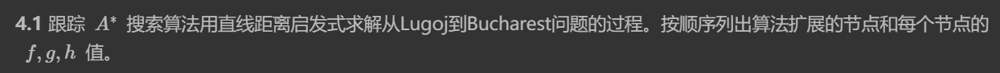
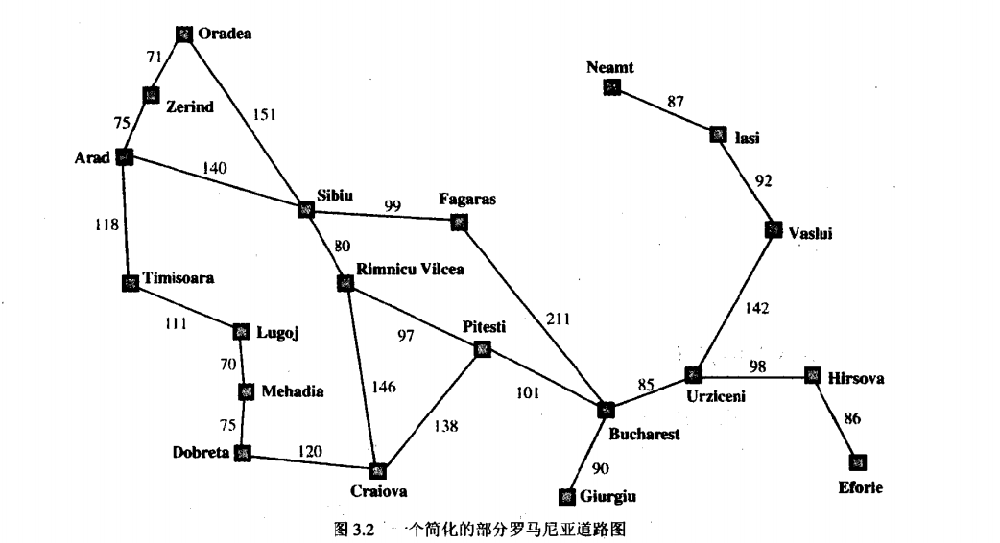
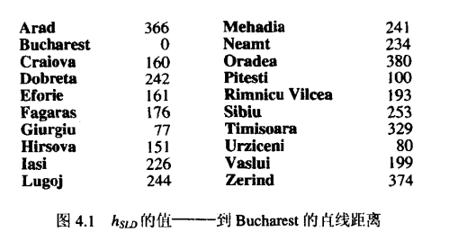

## Hw 2

PB21111653 李宇哲

### T1(4.1)

#### Question：

#### Answer：

Lugoj $\rightarrow$ Bucharest

- Lugoj：g = 0, h = 244, f = g + h = 244

- Mehadia：g = 70，h = 241，f = g + h = 311

  Timisoara：g = 111， h = 329， f = g + h = 440

- Timisoara：g = 111， h = 329， f = g + h = 440

  Lugoj：g = 140， h = 244，f = g + h = 384

  Dobreta：g = 145， h = 242， f = g + h = 387

- Timisoara：g = 111， h = 329， f = g + h = 440

  Dobreta：g = 145， h = 242， f = g + h = 387

  Timisoara：g = 251， h = 329， f = g + h = 580

  Mehadia：g = 210， h = 241， g = g + h = 451

- Timisoara：g = 111， h = 329， f = g + h = 440

  Mehadia：g = 210， h = 241， f = g + h = 451

  Timisoara：g = 251， h = 329， f = g + h = 580

  Mehadia：g = 220， h = 241， f = g + h = 461

  Craiova：g = 265， h = 160， f = g + h = 425

- 以下用首字母做简写，f = g + h

- T：440 = 111 + 329

  M： 451 = 210 + 241

  M:	461 = 220 + 241

  P:	503 = 403 + 100

  T:	580 = 251 + 329

  R:	604 = 411 + 193

  D： 627 = 385 + 242

- M： 451 = 210 + 241

  M：461 = 220 + 241

  L:	466 = 222 + 244

  P:	503 = 403 + 100

  T:	580 = 251 + 329

  R:	604 = 411 + 193

  D:	627 = 385 + 242

- M：461 = 220 + 241

  L：466 = 222 + 244

  P：503 = 401 + 100

  L：524 = 280 + 244

  D：527 = 285 + 242

  T：580 = 251 + 329

  A：595 = 229 + 366

  R：604 = 411 + 193

  D：627 = 385 + 242

- L：466 = 222 + 244

  P：503 = 403 + 100

  L：524 = 280 + 244

  D：527 = 285 + 242

  L：534 = 290 + 244

  D：537 = 295 + 242

  T：580 = 251 + 329

  A：595 = 229 + 366

  R： 604 = 411 + 193

  D：627 = 385 + 242

- P：503 = 403 + 100

  L：524 = 280 + 244

  D：527 = 285 + 242

  M：533 = 292 + 241

  L：534 = 290 + 244

  D：537 = 295 + 242

  T：580 = 251 + 329

  A：595 = 229 + 366

  R：604 = 411 + 193

  D：627 = 385 + 242

  T：662 = 333 + 329

- B：504 = 504 + 0

  L：524 = 280 + 244

  D：527 = 285 + 242

  M：533 = 292 + 241

  L：534 = 290 + 244

  D：537 = 295 + 242

  T：580 = 251 + 329

  A：595 = 229 + 366

  R：604 = 411 + 193

  D：627 = 385 + 242

  T：662 = 333 + 329

  R：693 = 500 + 193

  C：701 = 541 + 160

### T2(4.2)

#### Question：

#### Answer：

- $w = 0,f(n) = 2g(n)$是 uniform-cost search（一致代价搜索）
- $w = 1,f(n) = g(n) + h(n)$ 是A* search(A星搜索)
- $w = 2, f(n) = 2h(n)$是 greedy best-first search

$f(n) = (2-w)[g(n) + \frac{w}{2-w}h(n)]$

$w \leq 1$，$\frac{w}{2-w}h(n) \leq h(n)$，因此是最优的

### T3(4.6)

#### Question：

#### Answer：

启发函数 $h(n) = h_1 +h_2$

- 用曼哈顿距离量度放错的每块游戏板的位置和正确的位置的距离，$h_1$是横坐标，$h_2$是纵坐标

假设 $h(n) \leq h^*(n) + c$，$G_2$是一个次优解，即 $g(G_2) > C^* + c$

对任何一个状态n和最优解

$f(n) = g(n) + h(n) \leq g(n) + h^*(n) +c \leq C^* +c \leq g(G_2)$

因此A*算法返回的解的耗散比最优解的耗散多出的部分也不会超过c

### T4(4.7)

#### Question：

#### Answer：

如果一个启发式函数时一致的，即对任何一个节点n和它的所有通过动作a产生的后继$n'$，有

$h(n) \leq c(n,a,n') + h(n')$

假设一个最短路径上有k个节点

k = 1时，n‘就是目标节点，因此有 $h(n) \leq c(n,a,n')$

对于归纳情况，如果n’在最短路径上距离目标节点k的位置

$h(n) \leq c(n,a,n') + h(n') \leq c(n,a,n') +h^*(n') = h^*(n)$

因此h(n)举例目标节点k+1步，且也是可采纳的

非一致的可采纳启发式：

h(n)在每个搜索状态上返回一个随机的估计值