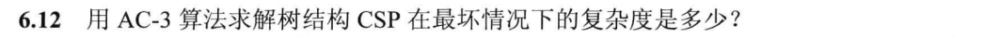

## Hw 3

PB21111653 李宇哲

### 6.5

#### Question：

分别用 改为 同时用

#### Answer：

- 将$C_3$取值为1
- 选择F，F的取值只有1
- 选择$C_2$的值，选为0
- $C_1$选为0
- O必须是一个偶数，为O选为4
- R只剩下一个选择，为8
- T只剩一个选择，T为7
- U必须小于9，选为6
- W只能选择3

一个solution是

- F：1
- T：7
- O：4
- W：3
- U：6
- R：8

### 6.11

#### Question：

#### Answer：

运行 AC-3算法

- 删除 WA-SA，将green从 SA中删除
- 删除 SA-V,将red从SA中删除，现在SA取指只有blue
- 将NT-WA删除，将green从NT中删除
- 将NT-SA删除，blue从NT中删除，只留下red
- 将NSW-SA删除，将blue从NSW中删除
- 将NSW-V删除，将red从NSW中删除，只留下green
- 删除Q-NT，将red从Q中删除
- 删除Q-SA，将blue从Q中删除
- 删除Q-NSW，将green从Q中删除，Q则没有可以取的值

因此{WA=red, V=blue}不相容

### 6.12

#### Question：

#### Answer：

树结构中，没有一个弧会被考虑不止一次，所以AC-S在最坏情况下的复杂度是

$O(ED)$

- E是边数
- D是最大域的大小

