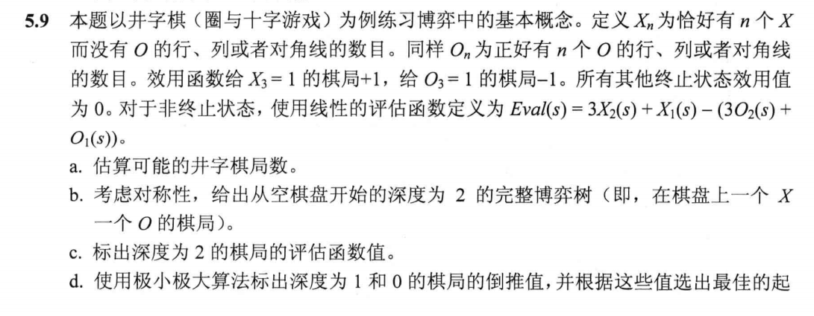
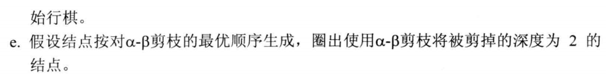
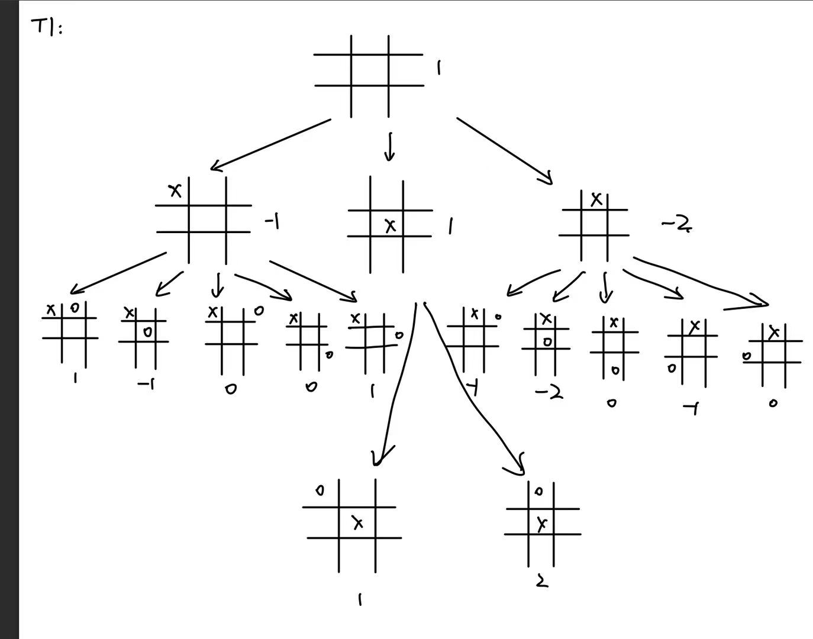
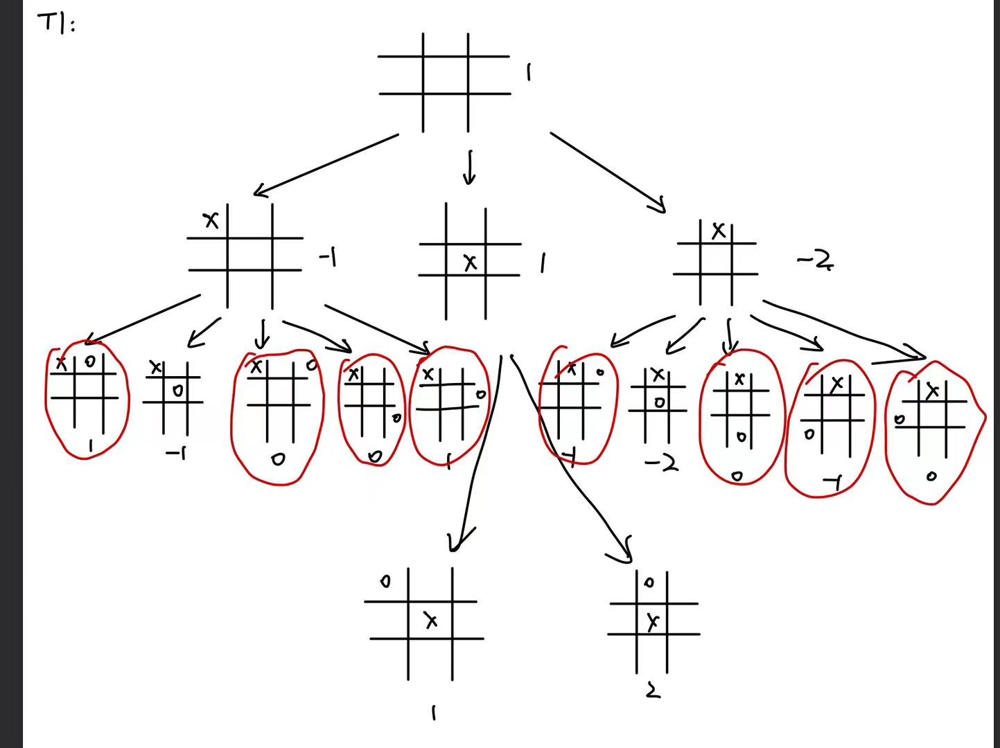
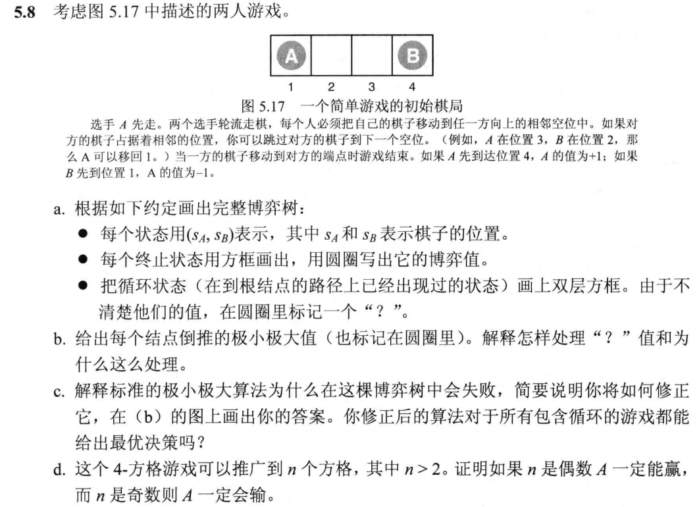
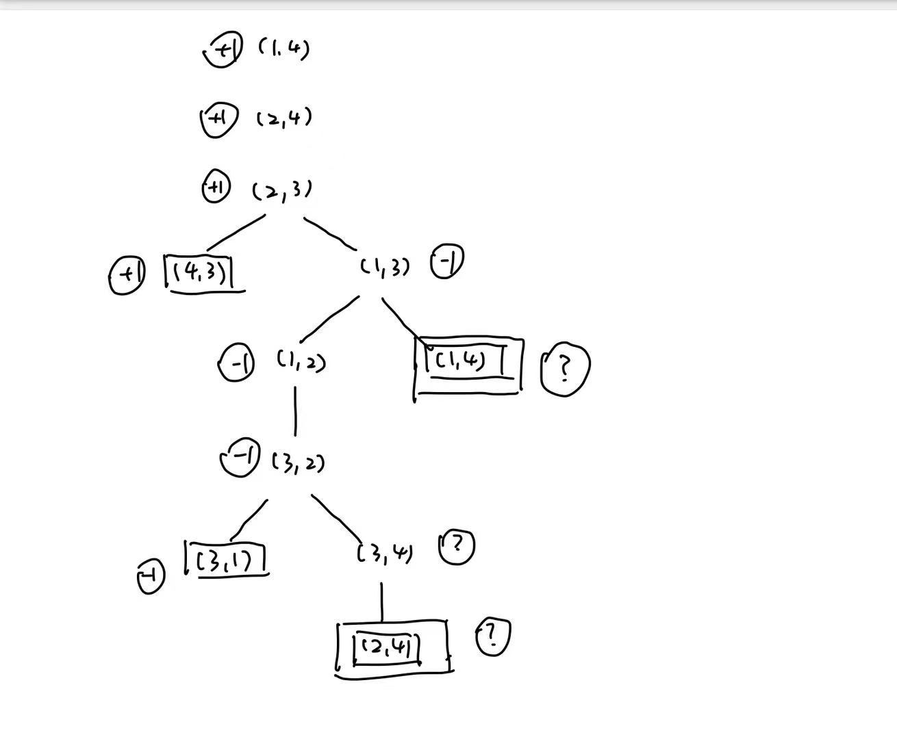
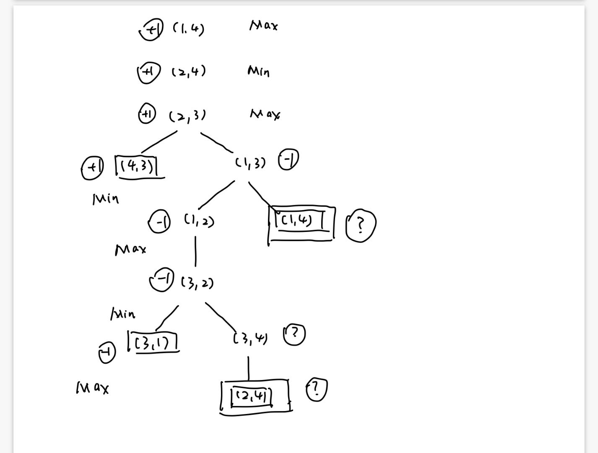
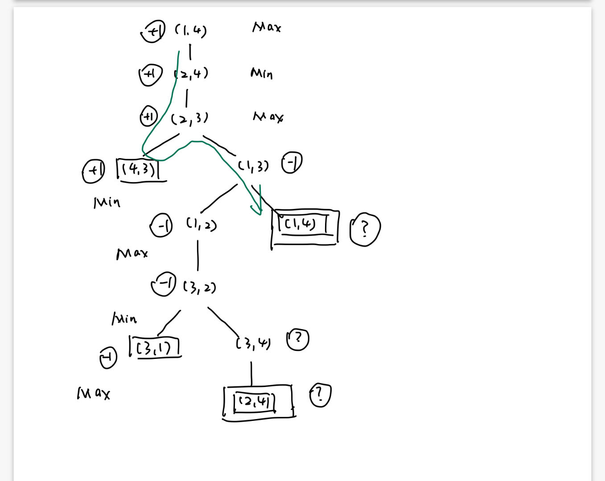
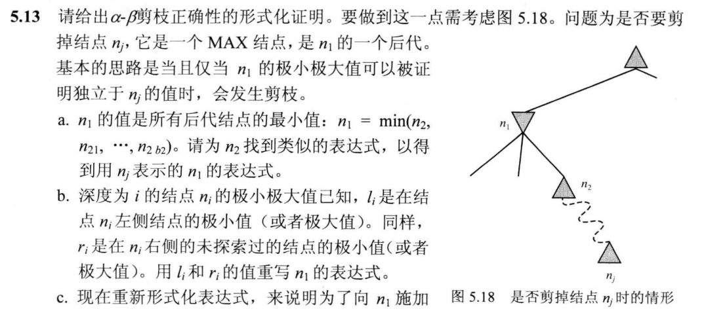
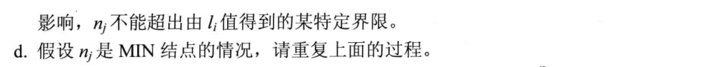

## HW4

### T1

#### Question：

#### Answer：

##### a.

每个块有三种可能，棋盘的总可能情况不超过 $3^9$，路径总数不超过$9!$

##### b.c.d.

最优起始行棋：正中央

##### e.

### T2

#### Question：

#### Answer：

##### a.

##### b.

？在 {-1, 1}中取值

- Min（-1，？） = -1
- Max（1，？）  =  1

##### c.

标准的极大极小值算法会重复绿色路径陷入死循环

可以通过添加一个bool数组记录所有state是否被visit

不能保证解决所有问题，? 可能会有平局出现

##### d.

pf:

对于 (1,n) ，next state是 (2,n) , (2, n-1)

- 因此 若n-2时A/B由必胜策略，则 n时也有必胜策略

递归到 n = 3/4情况

n = 3时， $(1,3)\rightarrow (2,3)\rightarrow (2,1)$，B有必胜策略

n = 4时，$(1,4)\rightarrow (2,4)\rightarrow (2,3)\rightarrow (4,3)$，A有必胜策略

### T3

#### Question：

#### Answer：

##### a.

$n_2 = Max(n_3,n_{31},...,n_3b_3)$，继续展开直到 $n_j$

##### b.

$n_1 = Min(l_2,r_2,n_2) = Max(l_2,r_2,Max(l_3,r_3,n_3))$，继续展开，直到$n_j$

##### c.

$n_{2k-1} = Min(l_{2k},r_{2k},Max(l_{2k+1},r_{2k+1},n_{2k+1}))$

$n_1 = Min(l_2,...,Min(l_4,...,Min,...,Min(l_j,...)))$

$n_j \leq Min(l_2,...l_j)$才会对$n1_1$施加影响

##### d.

$n_j \geq Max(l_3,...,l_j)$才会对 $n_1$施加影响

