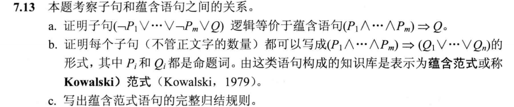

## HW5

### T1（7.13）

#### Question：

#### Answer：

##### a.

$$
(\neg P_1 \vee ... \vee \neg P_m \vee Q) \\
\equiv ((\neg P_1 \vee ... \vee \neg P_m) \vee Q)\\
\equiv (\neg(\neg P_1 \vee ...\vee \neg P_m))\rightarrow Q \\
\equiv (\neg \neg(P_1 \wedge ... \wedge P_m)) \rightarrow  Q\\
\equiv ((P_1 \wedge ... \wedge P_m) \rightarrow Q)
$$

##### b.

每一个字句都有正文字和负文字，使用$P_i$和$Q_i$代表符号，

将所有的负文字写为$\neg P_1, \neg P_2, \dots,\neg P_m$

将所有正文字写为$Q_1, Q_2, \dots, Q_n$，

子句为：

 $$ (\neg P_1 \vee \neg P_2 \vee \cdots \vee P_m\vee Q_1\vee Q_2\vee \cdots\vee Q_n) $$ 令$Q = Q_1\vee Q_2\vee \cdots\vee Q_n$，

由(a)，子句可以写作$(P_1 \wedge \cdots \wedge P_m) \rightarrow Q$

即： $$ (P_1 \wedge \cdots \wedge P_m) \rightarrow (Q_1\vee \cdots\vee Q_n) $$

### (c)

##### c.

对于原子语句$p_i, q_i, s_i, t_i$，其中$p_j=q_k$: $$ (p_1 \wedge\cdots \wedge p_j\wedge \cdots \wedge p_n ) \rightarrow (s_1 \vee \cdots \vee s_l ) \ \frac{(t_1 \wedge\cdots \wedge t_o ) \rightarrow (q_1 \vee\cdots \vee q_k\vee \cdots \vee q_m ) }{(p_1 \wedge\cdots \wedge p_j\wedge \cdots \wedge p_n \wedge t_1 \wedge\cdots \wedge t_o ) \rightarrow (s_1 \vee \cdots \vee s_l \vee q_1 \vee\cdots \vee q_k\vee \cdots \vee q_m )} $$

### T2

#### Question：

 证明前向链接算法的完备性。

#### Answer：

算法到达不动点之后，不会出现新的推理

考虑 inferred 表的最终状态，参与推理过程的每个符号为 true，其他为 false，把推理表看做一个逻辑模型m

原始KB中每个限定子句在M中都为真：

- 假设存在某个子句 $a_1 \wedge ... \wedge a_k \rightarrow b$在m中为false
- 则 $a_1 \wedge ... \wedge a_k$在m中为true，b在m中为false
- 与算法已经到达一个不动点矛盾，因此KB中每个确定子句在该模型中都为真

m是KB的一个模型

如果 $KB |= q$，q在KB的所有模型中必为true，包括m

q在m中为真 即在inferred 表中为真，因此每一个被蕴含的语句q必然会被算法推导出来

