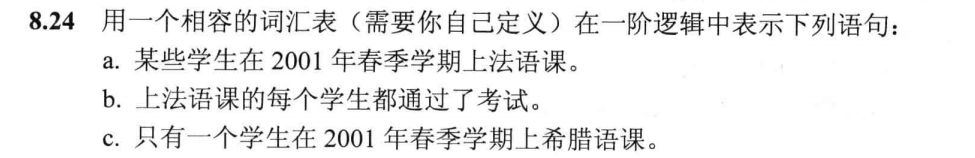
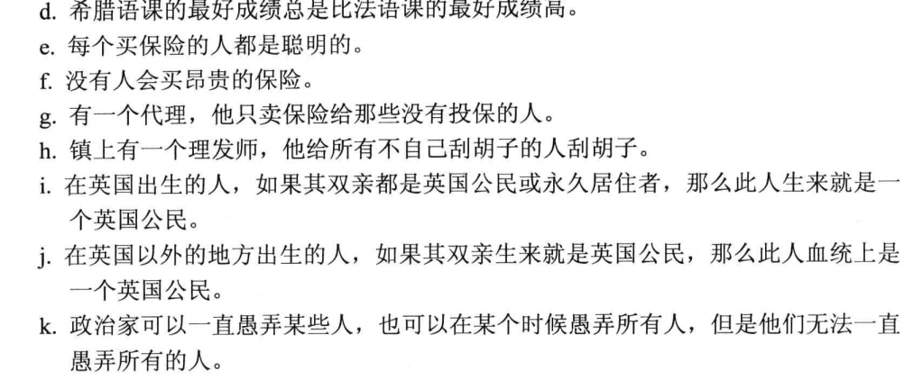
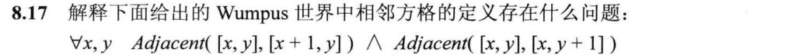
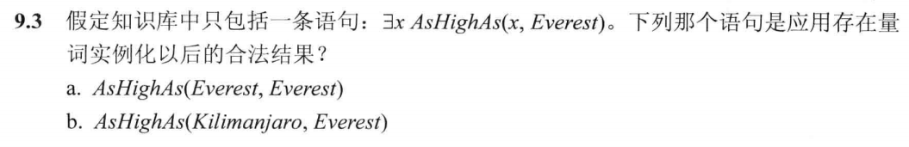
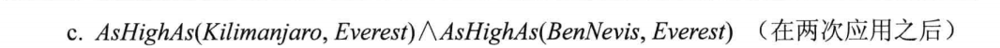
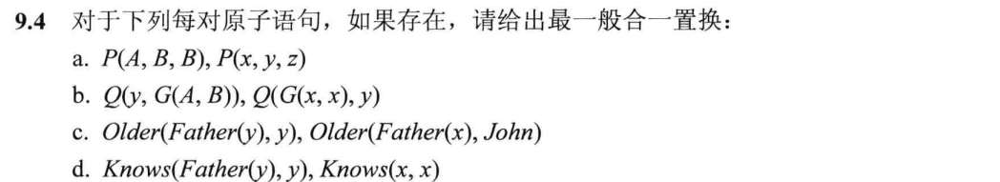
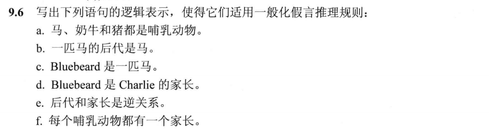
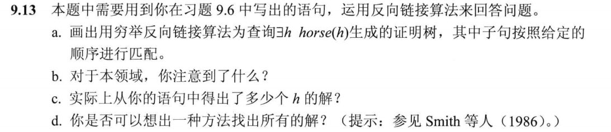
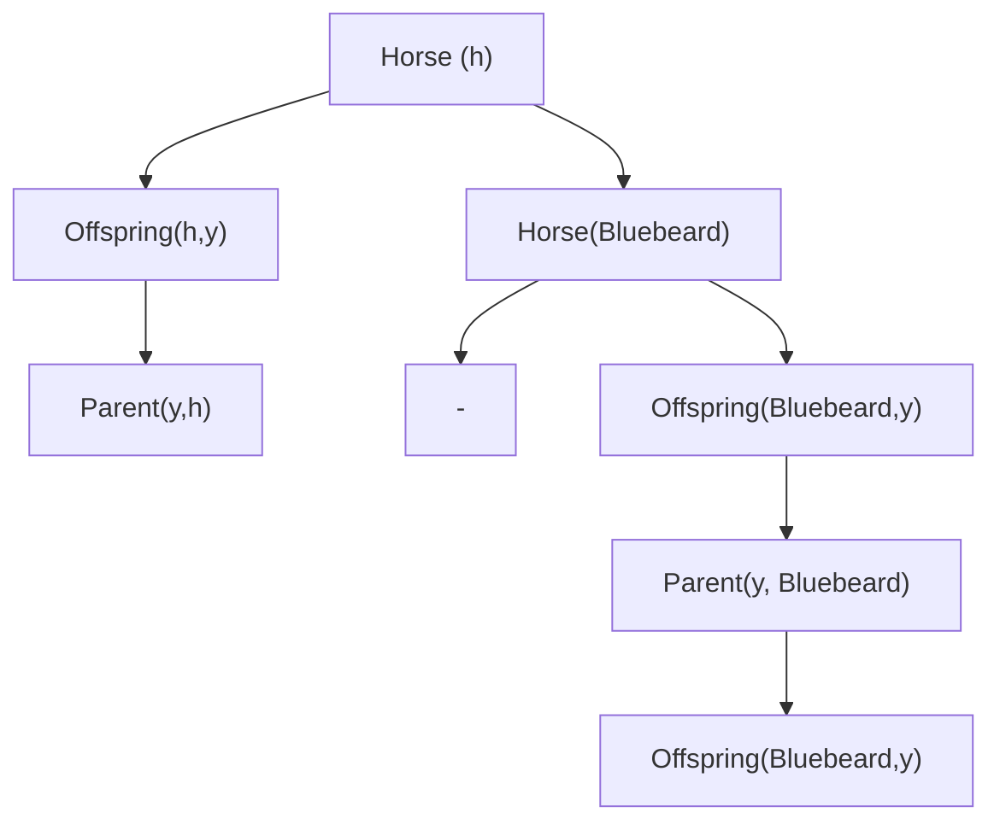

## HW6

### 8.24(a-k)

#### Question：

#### Answer：

词汇表

Takes(x, c, s)：学生x 在学期s上课程c

Pass(x, c, s)：学生x在学期s通过了课程c

Score(x, c, s)：学生x在学期s的课程c成绩

x > y：x比y大

F，G：代表法语课和希腊语课

Subject(c, f)

Buy(x,y,z)：x从z购买了y

Sell(x,y,z)：x把y卖给z

Shave：x给y刮胡子

Born(x, c)：x在c国家出生

Parent(x,y)：x是y的父母

Citizen(x,c,r)：x由于r原因是y国家的人

Resident(x, c)：x住在c国家

Fool(x,y,t)：x在时间t愚弄了y

Student(x)，Person(x)，Man(x)，Barber(x)，Expensive(x)，Agent(x)，Insured(x)，Smart(x), Politician(x)

##### a.

$\exists x~Student(x) \bigwedge Take(x,F,Spring2001)$

##### b.

$\forall x,s~ Student(x) \bigwedge Take(x,F,s) \Rightarrow Pass(x,F,s)$

##### c.

$\exists x ~Student(x) \bigwedge Take(x,G,Spring2001) \bigwedge \forall y~y \ne x \Rightarrow \lnot Take(y,G,Spring2001)$

##### d.

$\forall s ~\exists y~Score(x,G,s) > Score(y,F,s)$

##### e.

$\forall x~Person(x) \bigwedge (\exists y,z~Policy(y) \bigwedge Buy(x,y,z)) \Rightarrow Smart(x)$

##### f.

$\forall x,y,z ~Person(x) \bigwedge Policy(y) \bigwedge Expensive(y) \Rightarrow \lnot Buy(x,y,z)$

##### g.

$\exists x ~Agent(x) \bigwedge \forall y,z ~Policy(y) \bigwedge Sell(x,y,z) \Rightarrow (Person(z) \bigwedge \lnot Insured(z))$

##### h.

$\exists x ~Barber(x) \bigwedge \forall y ~Man(y) \bigwedge \lnot Shave(y,y) \Rightarrow Shave(x,y)$

##### i.

$\forall x ~Person(x) \bigwedge Born(x,UK) \bigwedge (\forall y~Parent(y,x) \Rightarrow ((\exists r~Citizen(y,UK,r)) \bigwedge Resident(y,UK))) \Rightarrow Citizen(x,UK,Birth)$

##### j.

$\forall x~Person(x) \bigwedge \lnot Born(x, UK) \bigwedge (\exists y ~Parent(y,x) \bigwedge Citizen(y,UK,Birth)) \Rightarrow Citizen(x,UK,Descent)$

##### k.

$$
\forall x ~Politician(x) \Rightarrow \\
(\exists y ~\forall t ~Person(y) \bigwedge  Fool(x,y,t)) \bigwedge\\
(\exists t \forall y ~Person(y) \Rightarrow Fool (x,y,t)) \bigwedge\\
\lnot (\forall t~\forall y Person(y) \Rightarrow Fool (x,y,t))
$$

### 8.17

#### Question：

#### Answer：

没有定义 

$Adjacent([x,y],[x-1,y])$和 $Adjacent([x,y],[x,y-1])$

### 9.3

#### Question：

#### Answer：

b,c是合法的

### 9.4

#### Question：

#### Answer：

##### a.

{x/A, y/B, z/B}

##### b.

不存在

##### c.

{x/John, x/John}

##### d.

不存在

### 9.6

#### Question：

#### Answer：

##### a.

$Horse(x) \Rightarrow Mammal(x)$

$Cow(x) \Rightarrow Mammal(x)$

$Pig(x) \Rightarrow Mammal(x)$

##### b.

$Offspring(x,y) \bigwedge Horse(y) \Rightarrow Horse(x)$

##### c.

$Horse(Bluebeard)$

##### d.

$Parent(Bluebeard,Charlie)$

##### e.

$Offspring(x,y) \Rightarrow Parent(y,x)$

$Parent(x,y) \Rightarrow Offspring(y,x)$

##### f.

$Mammal(x) \Rightarrow Parent(G(x), x)$

### 9.13(a,b,c)

#### Question：

#### Answer：

##### a.

##### b.

这是一个无限循环

##### c.

两个解

Bluebeard和Carlie都是horse

