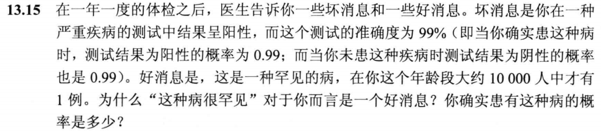
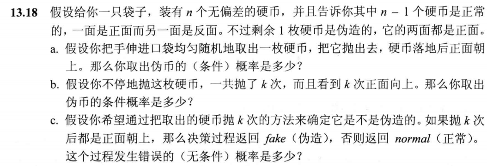
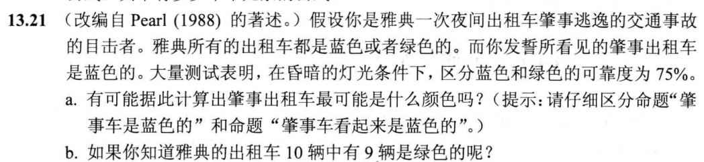
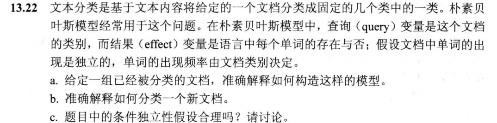
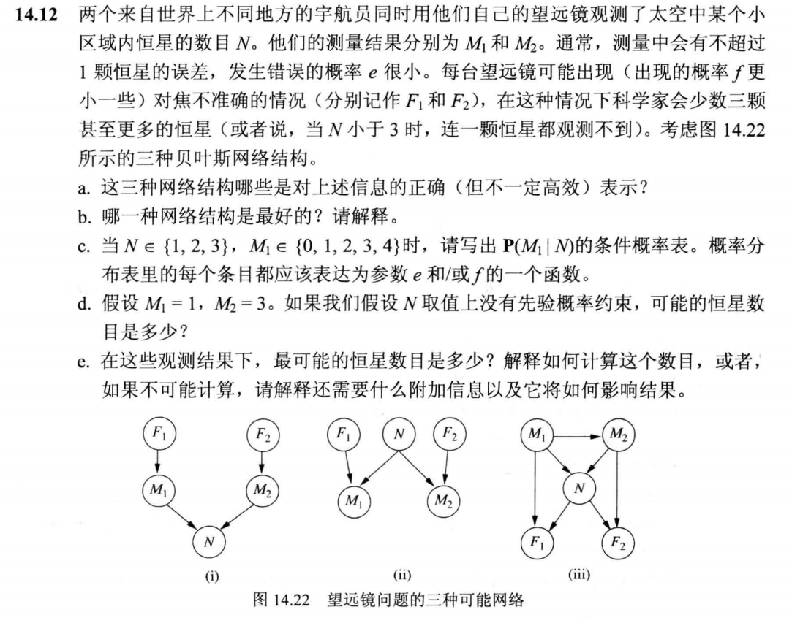
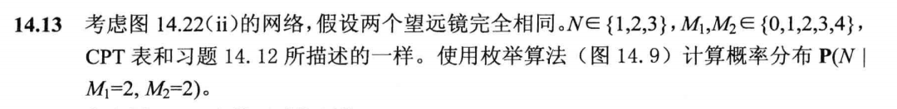

## Hw 7

PB21111653 李宇哲

### T1 (13.15)

#### Question：

#### Answer：

$P(test |disease) = 0.99$

$P(\lnot test | \lnot disease) = 0.99$

$P(disease) = 0.0001$

因为 

$P(disease|test) = \frac{P(test|disease) P(disease)}{P(test|disease)P(disease) + P(test | \lnot disease)P(\lnot disease)}$

这种病很罕见说明 $P(disease)$很小，即分子小，所以得病的概率 $P(disease|test)$比较小

$P(disease|test) = \frac{0.99 \times 0.0001}{0.99\times 0.0001 + 0.01 \times 0.9999} =0.009804$

### T2 (13.18)

#### Question：

#### Answer：

##### a.

$P(Fake |heads) = \frac{2}{2 + n-1} = \frac{2}{n+1}$

##### b.

$P(Fake|heads) = \frac{2^k }{2^k + n-1}$

##### c.

$P(heads | \lnot fake)P(\lnot fake) = \frac{n-1}{2^k n}$

### T3 (13.21)

#### Question：

#### Answer：

##### a.

设 肇事车是蓝色的 为事件B，肇事者看起来是蓝色的为事件A

$P(A |B) = 0.75$, $ P(\lnot A | \lnot B) = 0.75$

不可能根据目前信息计算出肇事出租车最可能是什么颜色的，需要一个先验概率，即雅典的出租车蓝色或者绿色的比例

##### b.

$P(B |A ) = \frac{0.075}{0.075 + 0.225} = 0.25$

$P(\lnot B |A ) = \frac{0.225}{0.075 + 0.225} = 0.75$

所以更有可能是绿色的

### T4 (13.22)

#### Question：

#### Answer：

##### a.

这样的模型需要 

- 先验概率 $P(Category)$
- 条件概率 $P(Word_i | Category)$

对于每个领域（category）， $P(Category = c)$表示属于领域c的所有文档的概率

$P(Word_i = true | Category = c)$为包含单词i的类别c文档的概率

##### b.

判断任意一个给定的单词是否出现在某个文档的分类中，选择概率最高的那一个类别

##### c.

不合理

某一个特定的单词，比如 `computer science`出现的概率 可能比 `computer` 和 `science`这两个单词概率乘积高

### T5 (14.12)

#### Question：

#### Answer：

##### a.

（ii）和（iii）是对上述信息的正确表示

##### b.

（ii）是最好的网络结构

##### c.

|           | N = 1       | N = 2       | N = 3       |
| --------- | ----------- | ----------- | ----------- |
| $M_1 = 0$ | f + e(1- f) | f           | f           |
| $M_1 = 1$ | (1-2e)(1-f) | e(1-f)      | 0.0         |
| $M_1 = 2$ | e(1-f)      | (1-2e)(1-f) | e(1-f)      |
| $M_1 = 3$ | 0.0         | e(1-f)      | (1-2e)(1-f) |
| $M_1 = 4$ | 0.0         | 0.0         | e(1-f)      |

##### d.

N = 2, 4，或者 $N \geq 6$

##### e.

最可能的 恒星数目 $N = 2$

不可能计算，需要知道先验分布 $P(N)$

### T6 (14.13)

#### Question：

#### Answer：

$P(N | M_1 = 2,M_2 = 2) = \alpha \sum_{f_1,f_2} P(f_1,f_2,N,M_1=2,M_2=2) = \alpha \sum_{f_1,f_2} P(f_1)P(f_2)P(N)P(M_1 = 2|f_1, N) P(M_2 = 2 |f_2, N)$

唯一可能的情况是 $f_1 = f_2 = false$

$P(N | M_1 = 2, M_2 = 2) = \alpha(1-f)(1-f)<p_1,p_2,p_3><e,(1-2e),e><e,(1-2e),e> = \alpha' <p_1e^2, p_2(1-2e)^2, p_3e^2>$

