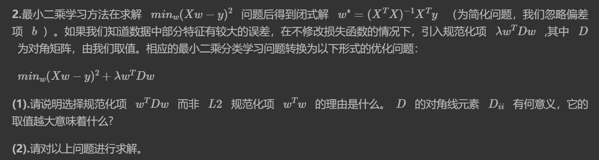
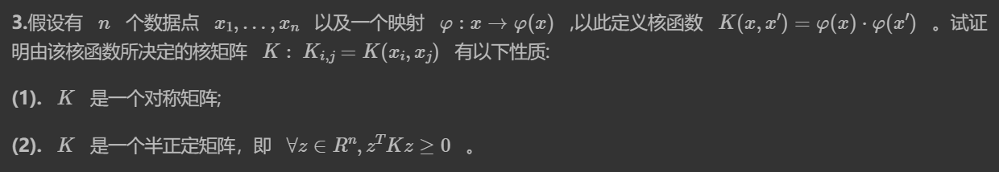
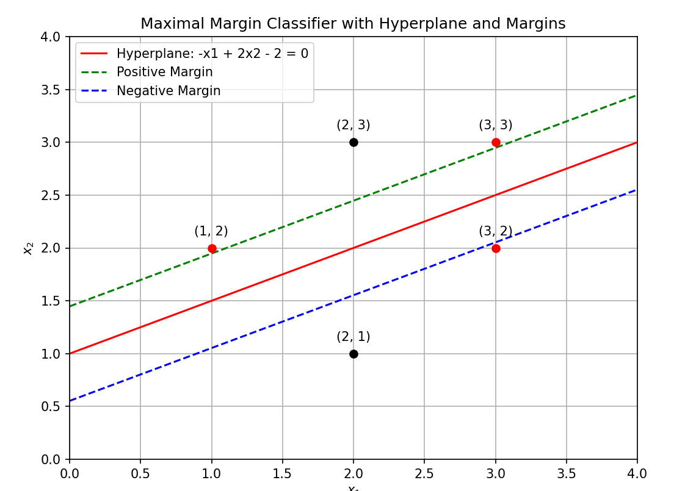
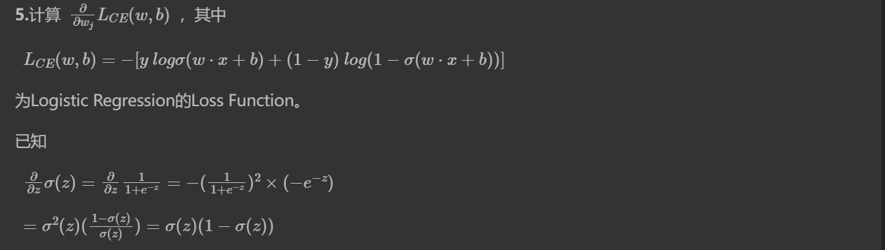

## HW8

###### PB21111653 李宇哲

### T1

#### Question：

试证明对于不含冲突数据集（即特征向量完全相同但标记不同）的训练集，必存在与训练集一致（即训练误差为 0）的决策树。

#### Answer：

用递归的方式构建一课与训练集一致的决策树

首先，选择一个划分属性，将数据集根据该属性划分为若干个子集，然后再每个子集中递归构建决策树，直到所有子集中的数据都属于同一类别或者无法再次选择划分属性为止

由于数据集不含冲突数据，每个子集的数据都属于同一类别，递归构建决策树时，每个叶子结点都属于一个数据的类别，且每个叶子结点的数据集都只包含属于该类别的数据

每个叶子节点对应于一个数据的类别，而且每个非叶子节点对应于一个划分属性，将数据集划分为若干个子集。由于数据集不含冲突数据，因此在每个子集中，所有的数据都属于同一类别。这样的决策树可以将每个特征向量映射到其正确的类别，训练误差为 0。

### T2

#### Quesiton：

#### Answer：

##### (1)

选择规范化项$w^TDw$的原因是，可以对不同特征的权重进行不同程度的约束，从而避免某些特征对预测结果的贡献过大

取值越大表示该特征的权重受到的约束越强，即该特征对预测结果的贡献更小

##### (2)

$$ \min_w\left(|Xw-y|^2+\lambda w^TDw\right) $$ 为了求解上述优化问题，我们可以先对$w$进行展开： $$ w=\begin{bmatrix}w_1 w_2\ \cdots\ w_d \end{bmatrix} $$ 其中，$d$为特征的数量。则有： 
$$
\begin{aligned} \lambda w^TD w &=\lambda\sum_{i=1}^d w_i^2D_{ii}\\ \ &=w^T\begin{bmatrix}\lambda D_{11} & 0 & \cdots & 0 \ 0 & \lambda D_{22} & \cdots & 0 \ \vdots & \vdots & \ddots & \vdots \ 0 & 0 & \cdots & \lambda D_{dd}\end{bmatrix}w\ \\ & =w^T\Lambda w\end{aligned}
$$
其中，$\Lambda$即为第二步中的对角矩阵，其对角线元素为$\lambda D_{ii}$。

此时问题转化为求解： 
$$
\min_w\left(|Xw-y|^2+w^T\Lambda w\right)
$$
 对$w$求导，令导数为0，可得：  $X^TXw - X^Ty+\Lambda w=0 \ w^*=(X^TX+\Lambda)^{-1}X^Ty $

### T3

#### Question：

#### Answer：

##### (1)

证明：

对于 ∀𝑖,𝑗∈[𝑛]，对于矩阵$K$我们有： 
$$
\begin {align} K_{i, j} &= \varphi(x_i) \cdot \varphi(x_j) \ \\&= \varphi(x_j) \cdot \varphi(x_i) \ \\&= K_{j, i} \end {align}
$$
 因此$K$是对称矩阵

##### (2)

将$K$做矩阵展开，并把二次型写为和式

 $$ \begin {align} z^TKz &= \sum_{i = 1}^n\sum_{j=1}^nz_iK_{i, j}z_j \ \\&= \sum_{i = 1}^n\sum_{j=1}^nz_i\varphi(x_i)^T\varphi(x_j)z_j \ \\&= \sum_{i = 1}^nz_i\varphi(x_i)^T \sum_{j=1}^nz_j\varphi(x_j) \ \\&= ||\sum_{i = 1}^nz_i\varphi(x_i)||^2 \ \\&\ge 0 \end {align} $$ 

### T4

#### Question：

#### Answer：

最大间隔分离超平面也就是以下问题的条件极值问题： $$ min_{\boldsymbol w, b}\frac12||\boldsymbol w||^2 \ \ \ subject\ to \ \forall i, y_i(\boldsymbol w^T\boldsymbol x_i+b) \ge 1 $$ 将数据点代入约束条件，得到： $$ \begin{aligned} &y_1 (\boldsymbol{w}^T \boldsymbol{x}_1 + b) \geq 1 \ &y_2 (\boldsymbol{w}^T \boldsymbol{x}*2 + b) \geq 1 \ &y_3 (\boldsymbol{w}^T \boldsymbol{x}\ *3 + b) \geq 1 \ &y_4 (\boldsymbol{w}^T \boldsymbol{x}\ *4 + b) \geq 1 \ &y_5 (\boldsymbol{w}^T \boldsymbol{x}\ *5 + b) \geq 1 \end{aligned} $$ 显然这个问题是一个二维问题，因此可以将$\boldsymbol{w}$表示为$\boldsymbol{w} = (w_1, w_2)^T$。再将上面的约束转化为等式约束，令拉格朗日乘子$\alpha_i \geq 0$可以得到： $$ L=\frac12(w_1^2+w_2^2)+\sum \ *{i=1}^5\alpha_i(1-y_i(\boldsymbol{w}^T \boldsymbol{x}\ *i + b)) $$ 将上述等式代入原优化问题，得到： $$ \begin{aligned} \max\ *{\boldsymbol{\alpha}} &\quad \sum\ *{i=1}^n \alpha_i - \frac{1}{2} \sum\ *{i=1}^n \sum *{j=1}^n \alpha_i \alpha_j y_i y_j \boldsymbol{x}_i^T \boldsymbol{x} *j \ \text{s.t.} \\&\quad \sum *{i=1}^n \alpha_i y_i = 0 \ &\quad \alpha_i \geq 0, \quad i=1, 2, \ldots, n \end{aligned} $$ 经过求解，得到$w_1=-1, w_2=2, b=-2$，因此最大间隔分离超平面的解析式为： $$ x^{(1)} -2x^{(2)} +2 = 0 $$ 分类决策函数为： $$ f(\boldsymbol{x}) = \text{sign}(x^{(1)} -2x^{(2)} +2) $$ 支持向量为： $$ \boldsymbol{x}_1 = (1, 2)^T \ \boldsymbol{x}_3=(3, 3)^T \ \boldsymbol{x}_5=(3, 2)^T $$ 图像如下

### T5

#### Question：

#### Answer：

根据链式法则，可以得到： $$ \frac{\partial}{\partial w_j}L_{CE}(w,b) = \frac{\partial}{\partial \sigma}L_{CE}(w,b)\cdot \frac{\partial\sigma}{\partial z}\cdot\frac{\partial z}{\partial w_j} $$ 首先计算第一项： $$ \frac{\partial L_{CE}(w,b)}{\partial \sigma} = -\left(\frac{y}{\sigma(w\cdot x + b)} - \frac{1-y}{1-\sigma(w\cdot x + b)}\right) $$ 然后计算第二项： $$ \frac{\partial \sigma}{\partial z} = \sigma(z)(1-\sigma(z)) $$ 然后计算第三项： $$ \frac{\partial z}{\partial w_j} = \frac{\partial}{\partial w_j}(w\cdot x + b) = x_j $$ 代入原式可以得到： $$ \frac{\partial}{\partial w_j}L_{CE}(w,b) = - \left(\frac{y}{\sigma(w\cdot x + b)} - \frac{1-y}{1-\sigma(w\cdot x + b)}\right) \cdot \sigma(w\cdot x + b)(1-\sigma(w\cdot x + b)) \cdot x_j $$ 最后化简一下得到： $$ \frac{\partial}{\partial w_j}L_{CE}(w,b) = (\sigma(w\cdot x + b) - y) \cdot x_j $$ 

### T6

#### Question：

#### Answer：

该算法最后会收敛，证明需要针对算法的两个步骤作证明：

- 算法第一步会找到将所有的点定位到距离其最近的中心点，处理后会让其距离中心点的距离更小，这样更新的距离一定会比这个点上次的距离要短，因此所有点和中心点的距离在这一步必定减小。

- 算法第二步重新确定了每个聚类的中心点，我们需要证明：对于任意聚类$A$和其中的点$a_1, ..., a_n$，定义其新中心点$C(A) = \frac1A \sum_{i = 1}^na_n$，则对于任意的点$x$， ∑𝑖=1𝑛|𝑎𝑖−𝐶(𝐴)|2≤∑𝑖=1𝑛|𝑎𝑖−𝑥|2。

  下面来对右边的的式子进行变换： 
  $$
  \begin {align} \sum_i |a_i-x|^2 &= \sum_i|a_i-C(A)+C(A) - x|^2 \ \\&= \sum_i |a_i-C(A)|^2 + \sum_i (a_i-C(A))\cdot (C(A)-x) +\sum_i|C(A)-x|^2 \ \\&= \sum_i |a_i-C(A)|^2 + (C(A)-x) \cdot \sum_i (a_i-C(A)) + |A||C(A)-x|^2 \
  
  \\&= \sum_i |a_i-C(A)|^2 + |A||C(A)-x|^2 \ \\&\ge \sum_i |a_i-C(A)|^2
  
  \end {align}
  $$
  倒数第二步用到了$\sum_i (a_i-C(A)) = 0$，定理得证

