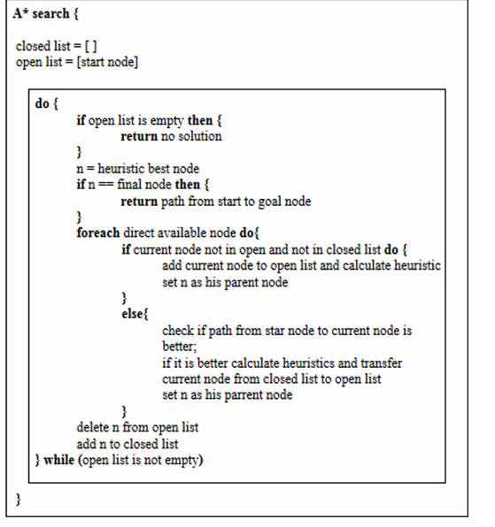
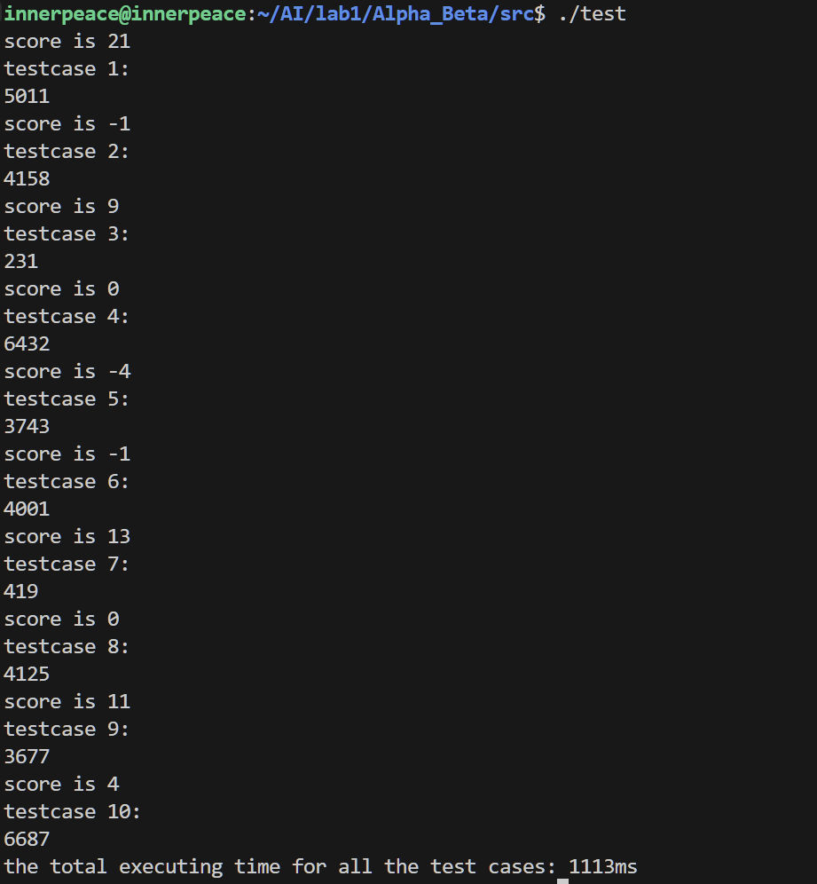

# 人工智能基础 Lab 1 Report

###### PB21111653

## Part1 Astar

### 算法实现过程

#### 问题描述


#### Astar算法伪代码



#### 状态构建及数据结构

每个state由一个三元组构成，<x_location, y_location, supply>

- `x_location`表示横坐标位置
- `y_location`表示纵坐标位置
- `supply`表示当前状态的物资剩余量

>物资需要被纳入考虑，对于两个位置相同的状态，可能由于前序状态的不同导致supply并不相同，所以搜索空间的每个state应该是一个三元组`tuple`

##### `Search_Cell`

```c++
struct Search_Cell
{
    int h;
    int g;
    int x, y;            // location
    Search_Cell *parent; // 父节点位置，追踪路径
    int supply;          // 剩余物资
    // pair<int, int> direction;   // 移动方向

    Search_Cell(int x, int y, int g, int h, int supply, Search_Cell *parent = nullptr)
        : x(x), y(y), g(g), h(h), supply(supply), parent(parent) {}

    int f() const { return g + h; } // compute f(n) = g(n) + h(n) 评价函数
    // TODO: 定义搜索状态
};
```

- 每个搜索结点新加入parent追踪上一步位置
- `supply`作为剩余物资
- `x，y`两个表示当前坐标
- 定义计算评价函数的方式 `f()`

##### CompareF

由于搜索状态简单由 g + h决定，还需要考虑两个不同状态的`supply`情况，所以需要修改`CompareF`，在f相同的情况下，优先选择物资剩余量更大的位置

```c++
struct CompareF
{
    bool operator()(const Search_Cell *a, const Search_Cell *b) const
    {
        if(a->f() == b->f())
            return a->supply < b->supply;
        return a->f() > b->f();
        // return (a->g + a->h) > (b->g + b->h); // 较小的 g + h 值优先级更高
    }
};
```

##### 数据结构选择

```c++
 priority_queue<Search_Cell *, vector<Search_Cell *>, CompareF> open_list;
vector<pair<int, int>> direction_lists;
map<tuple<int, int, int>, int> cost_map;
```

- `open_list`用优先队列，维护最小成本的搜索节点用于下一次搜索
- `direction_list`用于构建路径`way`
- 用一个三元组到权重的映射`cost_map`保留所有状态的权重情况

#### 启发式函数

采用简单的 曼哈顿距离，后续会证明其一致性和可满足性

```c++
int Heuristic_Funtion(int x1, int y1, int x2, int y2)
{
    // 曼哈顿距离
    return abs(x1 - x2) + abs(y1 - y2);
}
```

#### 具体实现

```c++
void Astar_search(const string input_file, int &step_nums, string &way)
{
    ifstream file(input_file);
    if (!file.is_open())
    {
        cout << "Error opening file!" << endl;
        return;
    }

    string line;
    getline(file, line); // 读取第一行
    stringstream ss(line);
    string word;
    vector<string> words;
    while (ss >> word)
    {
        words.push_back(word);
    }
    int M = stoi(words[0]); // 行数
    int N = stoi(words[1]); // 列数
    int T = stoi(words[2]); // T天份额，代表初始能走几步
    // cout << M << " " << N << " " << T << endl;
    pair<int, int> start_point; // 起点
    pair<int, int> end_point;   // 终点
    Map_Cell **Map = new Map_Cell *[M];
    // 加载地图
    for (int i = 0; i < M; i++)
    {
        Map[i] = new Map_Cell[N];
        getline(file, line);
        stringstream ss(line);
        string word;
        vector<string> words;
        while (ss >> word)
        {
            words.push_back(word);
        }
        for (int j = 0; j < N; j++)
        {
            Map[i][j].type = stoi(words[j]);
            if (Map[i][j].type == 3)
            {
                start_point = {i, j};
            }
            else if (Map[i][j].type == 4)
            {
                end_point = {i, j};
            }
        }
    }
    // 以上为预处理部分
    // ------------------------------------------------------------------

    priority_queue<Search_Cell *, vector<Search_Cell *>, CompareF> open_list;
    vector<Search_Cell *> close_list;

    vector<pair<int, int>> direction_lists;
    Search_Cell *start = new Search_Cell(start_point.first, start_point.second, 0, Heuristic_Funtion(start_point.first, start_point.second, end_point.first, end_point.second), T);
    open_list.push(start);
    // search_cell->g = 0;
    // search_cell->h = 0; // Heuristic_Funtion();
    // open_list.push(search_cell);
    map<tuple<int, int, int>, int> cost_map;
    cost_map[{start_point.first, start_point.second, T}] = 0;

    // end_point location
    int end_x = end_point.first;
    int end_y = end_point.second;

    while (!open_list.empty())
    {
        // TODO: A*搜索过程实现
        auto *current_node = open_list.top();
        open_list.pop();
        int cur_x = current_node->x;
        int cur_y = current_node->y;
        // cout << cur_x << " " << cur_y << " " << current_node->supply << endl;
        // find a solution
        if (cur_x == end_x && cur_y == end_y)
        {
            // 打印路径way
            int pre_x = current_node->x;
            int pre_y = current_node->y;
            current_node = current_node->parent;
            if(current_node != nullptr)
                step_nums ++;
            while (current_node != nullptr)
            {
                step_nums++;
                if (current_node->x - pre_x == 1)
                    direction_lists.push_back({-1, 0});
                else if (current_node->x - pre_x == -1)
                    direction_lists.push_back({1, 0});
                else if (current_node->y - pre_y == 1)
                    direction_lists.push_back({0, -1});
                else if (current_node->y - pre_y == -1)
                    direction_lists.push_back({0, 1});
                pre_x = current_node->x;
                pre_y = current_node->y;
                current_node = current_node->parent;
            }
            break;
        }

        if (current_node->supply <= 0)
            continue;
        // if not find a solution
        // add new state to the open_list if legal
        vector<pair<int, int>> directions = {{0, 1}, {1, 0}, {0, -1}, {-1, 0}};
        for (auto dir : directions)
        {
            int next_x = cur_x + dir.first;
            int next_y = cur_y + dir.second;
            if (next_x >= 0 and next_x < M and next_y >= 0 and next_y < N and Map[next_x][next_y].type != 1)
            {
                int new_g = current_node->g + 1;
                int new_supply = current_node->supply - 1;
                if (Map[next_x][next_y].type == 2)
                    new_supply = T;

                tuple<int, int, int> next_state = {next_x, next_y, new_supply};
                if (cost_map.find(next_state) == cost_map.end() || new_g < cost_map[next_state])
                {
                    cost_map[next_state] = new_g;
                    int new_h = Heuristic_Funtion(next_x, next_y, end_x, end_y);
                    Search_Cell *next_node = new Search_Cell(next_x, next_y, new_g, new_h, new_supply, current_node);
                    open_list.push(next_node);
                }
            }
        }
    }

    // ------------------------------------------------------------------
    // TODO: 填充step_nums与way
    // step_nums = -1;
    // way = "";
    // cout << direction_lists.size() << endl;
    for(auto it = direction_lists.rbegin(); it != direction_lists.rend(); it++)
    {   
        if(it->first == 0 and it->second == 1)
            way = way + "R";
        else if(it->first == 0 and it->second == -1)
            way = way + "L";
        else if(it->first == 1 and it->second == 0)
            way = way + "D";
        else 
            way = way + "U";
    }
    // ------------------------------------------------------------------
    // 释放动态内存
    for (int i = 0; i < M; i++)
    {
        delete[] Map[i];
    }
    delete[] Map;
    while (!open_list.empty())
    {
        auto temp = open_list.top();
        delete[] temp;
        open_list.pop();
    }
    for (int i = 0; i < close_list.size(); i++)
    {
        delete[] close_list[i];
    }

    return;
}
```

结束预处理部分后，首先将start结点加入`open_list`和`cost_map`

```c++
Search_Cell *start = new Search_Cell(start_point.first, start_point.second, 0, Heuristic_Funtion(start_point.first, start_point.second, end_point.first, end_point.second), T);
open_list.push(start);
map<tuple<int, int, int>, int> cost_map;
    cost_map[{start_point.first, start_point.second, T}] = 0;
```

按优先队列从cost较小的结点开始搜索，扩展状态空间

```c++
while (!open_list.empty())
    {
        // TODO: A*搜索过程实现
        auto *current_node = open_list.top();
        open_list.pop();
        int cur_x = current_node->x;
        int cur_y = current_node->y;
    // ...
}
```

如果当前状态是最终状态（即end_point），结束搜索，通过parent回溯，打印一条路径

```c++
// find a solution
if (cur_x == end_x && cur_y == end_y)
{
    // 打印路径way
    int pre_x = current_node->x;
    int pre_y = current_node->y;
    current_node = current_node->parent;
    if (current_node != nullptr)
        step_nums++;
    while (current_node != nullptr)
    {
        step_nums++;
        if (current_node->x - pre_x == 1)
            direction_lists.push_back({-1, 0});
        else if (current_node->x - pre_x == -1)
            direction_lists.push_back({1, 0});
        else if (current_node->y - pre_y == 1)
            direction_lists.push_back({0, -1});
        else if (current_node->y - pre_y == -1)
            direction_lists.push_back({0, 1});
        pre_x = current_node->x;
        pre_y = current_node->y;
        current_node = current_node->parent;
    }
    break;
}
```

如果当前节点的供给不够了，放弃当前状态的搜索，重新从open_list中取结点

```c++
if (current_node->supply <= 0)
            continue;
```

如果当前结点不是`end_point`，进行状态更新和状态空间的扩展

```c++
// if not find a solution
// add new state to the open_list if legal
vector<pair<int, int>> directions = {{0, 1}, {1, 0}, {0, -1}, {-1, 0}};
for (auto dir : directions)
{
    int next_x = cur_x + dir.first;
    int next_y = cur_y + dir.second;
    if (next_x >= 0 and next_x < M and next_y >= 0 and next_y < N and Map[next_x][next_y].type != 1)
    {
        int new_g = current_node->g + 1;
        int new_supply = current_node->supply - 1;
        // 2说明是补给站，将supply加满
        if (Map[next_x][next_y].type == 2)
            new_supply = T;

        tuple<int, int, int> next_state = {next_x, next_y, new_supply};
        if (cost_map.find(next_state) == cost_map.end() || new_g < cost_map[next_state])
        {
            cost_map[next_state] = new_g;
            int new_h = Heuristic_Funtion(next_x, next_y, end_x, end_y);
            Search_Cell *next_node = new Search_Cell(next_x, next_y, new_g, new_h, new_supply, current_node);
            open_list.push(next_node);
        }
    }
}
```


### 实验结果

在10个测试样例和一个讲义样例上的运行结果如下

`output_0`


`output_1`


`output_2`


`output_3`


`output_4`


`output_5`


`output_6`


`output_7`


`output_8`


`output_9`

```txt
252
UUUUUUUUUUUUURRRRRRRRRRRRRRRRRRRRRRRRRRRRRDDDDDDDDDDDDDDLLDDDDDDDDDDDDDLLLLLLLLLLLLLLLLLLLLLLLLLUUUUUUUUUUUUURRUUUUUUUUUURRRRRRRRRRRRRRRRRRRRRDDDDDDDDDDLLDDDDDDDDDLLLLLLLLLLLLLLLLLUUUUUUUUURRUUUUUURRRRRRRRRRRRRDDDDDDLLDDDDDLLLLLLLLLUUUUURRUURRRRRDDLLDL

```

`output_10`

```txt
198
RRRRRRRRRRRRRRRRRRRRRRRRRRRRRRRRUUUURRURUUURRUURUURRUUURURURRRRURRRURURUUURUURRUURRRRRURRRRUURURUURRUUUUUURUUURURUURRRUURRUURUURURUUUURURURUURUUURURURURURUURURUUUUUUUURUUURURRUUUURUUURURRRURUUUUUUUU

```

### admissible及consistent性质

#### admissible

曼哈顿距离 $h(x_1,x_2,y_1,y_2) = |x_1 - x_2| + |y_1 - y_2| $

计算的事在一个没有障碍的上下左右四个方向自由移动的网格中，从一个点到另一个点的最短步长，即使实际路径由于限制变长，启发式函数给出的值仍是最短路径长度的下界

因此选择曼哈顿距离作为启发式函数是admissible的

#### consistent

对于曼哈顿距离， $c(n,n') = 1$，$n'$是从点n的直接邻居

对于两个相邻结点 $h(n)-h(n') \leq 1$

因此 

$h(n) \leq h(n')+1 = c(n,n') + h(n')$，满足consistent

### A*优化效果

统计采用启发式函数和不采用启发式函数时，算法对每个样例的执行时间

统计结果如下

采用启发式函数：


不采用启发式函数：


python绘制图像如下


对前9个case单独绘制图像如下


可见，采用启发式函数后，算法执行时间相较于一致代价搜索算法，程序运行时间较短。而在状态空间比较大时，优化效果更显著


## Part2 Alpha-Beta 剪枝

### 算法实现过程

首先，我部分重构了一些函数，把原先`board`二位棋盘x和y交换了一下位置，来方便后续更符合逻辑的实现，以下的`Pao`、`Xiang`、`Jiang`、`Shi`、`Bing`的合法动作实现都可以直接按照

- $x \in [0,9]$
- $y \in [0,8]$


#### 棋子的合法动作

##### 生成马的合法动作

增加了拌马脚逻辑

```c++
// 拌马脚
if (board[x + dx[i] / 2][y + dy[i] / 2] != '.')
    continue;
```

经过 输出测试，在 `6.txt`样例确实对上方红色马的移动方向有所限制

##### 生成炮的合法动作

炮的逻辑主要在于，可以上下左右移动，且可以跨一个棋子吃子

由上下左右一共四个方向

```c++
int directions[4][2] = {{0, 1}, {1, 0}, {0, -1}, {-1, 0}};
```

遍历四个方向，每次以步长step从1开始移动，并用一个bool变量 `Jumped`判断这时是否已经经过一个棋子

```c++
for (int dir = 0; dir < 4; dir++)
{
    bool Jumped = false;
    for (int step = 1;; step++)
    {
        int nx = x + directions[dir][0] * step;
        int ny = y + directions[dir][1] * step;
        if (nx < 0 or nx >= sizeX or ny < 0 or ny >= sizeY)
            break;
        char target = board[nx][ny];
        if (target == '.')
        {
            if (!Jumped)
            {
                Move cur_move = {x, y, nx, ny, 0};
                PaoMoves.push_back(cur_move);
            }
        }
        else
        {
            if (!Jumped)
                Jumped = true;
            else
            {
                bool cur_color = (target >= 'A' && target <= 'Z');
                if (cur_color != color)
                {
                    Move cur_move = {x, y, nx, ny, 0};
                    PaoMoves.push_back(cur_move);
                }
                break;
            }
        }
    }
}
```

棋子的移动分数

```c++
for (int i = 0; i < PaoMoves.size(); i++)
{
    if (color)
    {
        PaoMoves[i].score = PaoPosition[PaoMoves[i].next_y][9 - PaoMoves[i].next_x] - PaoPosition[y][9 - x];
        red_moves.push_back(PaoMoves[i]);
    }
    else
    {
        PaoMoves[i].score = PaoPosition[PaoMoves[i].next_y][PaoMoves[i].next_x] - PaoPosition[y][x];
        black_moves.push_back(PaoMoves[i]);
    }
}
```

- 注意这时候因为`PaoPosition`是一个$9\times 10$的棋盘，是反过来的，所以需要把y和x交换位置
- 同时，对于红方，需要映射到上方去查表

##### 生成相的合法动作

相是田字格走的，同时中间位置如果有棋子则不能移动，所以是一共四个方向，进行是否可以移动的检测

```c++
std::vector<Move> XiangMoves;
// TODO:
int dx[] = {2, 2, -2, -2};
int dy[] = {2, -2, 2, -2};
for (int i = 0; i < 4; i++)
{
    int nx = x + dx[i];
    int ny = y + dy[i];
    // std::cout << nx << " " << ny << std::endl;
    // 过河了
    if((x < 5 and nx >= 5) or (x >= 5 and nx < 5))
        continue;
    if (nx >= 0 and nx < sizeX and ny >= 0 and ny < sizeY)
    {
        char target = board[nx][ny];
        // 检查是否合法，即中间田字格中间是否有棋子
        if (board[x + dx[i] / 2][y + dy[i] / 2] == '.')
        {
            if (target == '.' or is_enemy(target, color))
            {
                Move cur_move = {x, y, nx, ny, 0};
                XiangMoves.push_back(cur_move);
            }
        }
    }
}
```

评估分数函数

```c++
for (int i = 0; i < XiangMoves.size(); i++)
{
    if (color)
    {
        XiangMoves[i].score = XiangPosition[XiangMoves[i].next_y][9 - XiangMoves[i].next_x] - XiangPosition[y][9 - x];
        red_moves.push_back(XiangMoves[i]);
    }
    else
    {
        XiangMoves[i].score = XiangPosition[XiangMoves[i].next_y][XiangMoves[i].next_x] - XiangPosition[y][x];
        black_moves.push_back(XiangMoves[i]);
    }
}
```

和炮的逻辑一样

##### 生成士的合法动作

士移动也有四个方向，同时需要判断对边界做判断。

```c++
std::vector<Move> ShiMoves;
// TODO:
int dx[] = {1, 1, -1, -1};
int dy[] = {1, -1, 1, -1};
int limitX1 = color ? 7 : 0;
int limitX2 = color ? 9 : 2;
int limitY = 3;
for (int i = 0; i < 4; i++)
{
    int nx = x + dx[i];
    int ny = y + dy[i];
    if (nx >= limitX1 and nx <= limitX2 and ny >= limitY and ny <= limitY + 2)
    {
        char target = board[nx][ny];
        if (target == '.' or is_enemy(target, color))
        {
            Move cur_move = {x, y, nx, ny, 0};
            ShiMoves.push_back(cur_move);
        }
    }
}
```

评估分数逻辑函数

```c++
for (int i = 0; i < ShiMoves.size(); i++)
{
    if (color)
    {
        ShiMoves[i].score = ShiPosition[ShiMoves[i].next_y][9 - ShiMoves[i].next_x] - ShiPosition[y][9 - x];
        red_moves.push_back(ShiMoves[i]);
    }
    else
    {
        ShiMoves[i].score = ShiPosition[ShiMoves[i].next_y][ShiMoves[i].next_x] - ShiPosition[y][x];
        black_moves.push_back(ShiMoves[i]);
    }
}
```

和炮还有相的逻辑一样

##### 生成兵的合法动作

兵移动的逻辑

- 首先判断是否过河，不过河只能向前移动
- 如果已经过河，可以尝试左右移动一格

```c++
std::vector<Move> BingMoves;
// TODO:
int forward = color ? -1 : 1;
int midline = color ? 5 : 4;
// 先看是否能forward
if (x + forward >= 0 and x + forward < sizeX)
{
    char target = board[x + forward][y];
    if (target == '.' or is_enemy(target, color))
    {
        Move cur_move = {x, y, x + forward, y, 0};
        BingMoves.push_back(cur_move);
    }
}
// 如果已经过河，尝试左右移动
if ((color and x < midline) or (!color and x > midline))
{
    int sideways[] = {-1, 1};
    for (int side : sideways)
    {
        if (y + side >= 0 and y + side < sizeY)
        {
            char target = board[x][y + side];
            if (target == '.' or is_enemy(target, color))
            {
                Move cur_move = {x, y, x, y + side, 0};
                BingMoves.push_back(cur_move);
            }
        }
    }
}
```

评估分数逻辑和上述一样

```c++
for (int i = 0; i < BingMoves.size(); i++)
{
    if (color)
    {
        BingMoves[i].score = BingPosition[BingMoves[i].next_y][9 - BingMoves[i].next_x] - BingPosition[y][9 - x];
        red_moves.push_back(BingMoves[i]);
    }
    else
    {
        BingMoves[i].score = BingPosition[BingMoves[i].next_y][BingMoves[i].next_x] - BingPosition[y][x];
        black_moves.push_back(BingMoves[i]);
    }
}
```

##### 生成将的合法动作

将可以走上下左右四个位置，同时有一个田字格的限制

```c++
std::vector<Move> JiangMoves;
// std::cout << x << " " << y << " " << std::endl;
// TODO:
int dx[] = {0, 1, 0, -1};
int dy[] = {1, 0, -1, 0};
// 离开9宫格，不合法
int limitX1 = color ? 7 : 0;
int limitX2 = color ? 9 : 2;
int limitY = 3;
for (int i = 0; i < 4; i++)
{
    int nx = x + dx[i];
    int ny = y + dy[i];
    if (nx >= limitX1 and nx <= limitX2 and ny >= limitY and ny <= limitY + 2)
    {
        char target = board[nx][ny];
        if (target == '.' or is_enemy(target, color))
        {
            Move cur_move = {x, y, nx, ny, 0};
            JiangMoves.push_back(cur_move);
        }
    }
}
```

评估分数逻辑和上述一样

```c++
for (int i = 0; i < JiangMoves.size(); i++)
{
    if (color)
    {
        JiangMoves[i].score = JiangPosition[JiangMoves[i].next_y][9 - JiangMoves[i].next_x] - JiangPosition[y][9 - x];
        red_moves.push_back(JiangMoves[i]);
    }
    else
    {
        JiangMoves[i].score = JiangPosition[JiangMoves[i].next_y][JiangMoves[i].next_x] - JiangPosition[y][x];
        black_moves.push_back(JiangMoves[i]);
    }
}
```

#### 棋盘分数评估

棋盘分数由两种分数决定

- 棋子价值
- 棋力评估

最终的分数是 max玩家 - min玩家

棋子位置本身的价值由`board`的位置，和不同棋子类型的二维数组表决定

棋力评估由 `piece_values`棋子本身的属性决定

下面是具体实现

```c++
int red_score = 0;
int black_score = 0;
for (auto &piece : pieces)
{
    char piecechar = board[piece.init_x][piece.init_y];
    int x = piece.init_x;
    int y = piece.init_y;
    // 根据类型获取价值
    switch (piecechar)
    {
        case 'k':
            black_score += JiangPosition[y][x];
            black_score += piece_values["Jiang"];
            break;
        case 'a':
            black_score += ShiPosition[y][x];
            black_score += piece_values["Shi"];
            break;
        case 'r':
            black_score += JuPosition[y][x];
            black_score += piece_values["Ju"];
            break;
        case 'c':
            black_score += PaoPosition[y][x];
            black_score += piece_values["Pao"];
            break;
        case 'n':
            black_score += MaPosition[y][x];
            black_score += piece_values["Ma"];
            break;
        case 'b':
            black_score += XiangPosition[y][x];
            black_score += piece_values["Xiang"];
            break;
        case 'p':
            black_score += BingPosition[y][x];
            black_score += piece_values["Bing"];
            break;
        case 'K':
            red_score += JiangPosition[y][9 - x];
            red_score += piece_values["Jiang"];
            break;
        case 'A':
            red_score += ShiPosition[y][9 - x];
            red_score += piece_values["Shi"];
            break;
        case 'R':
            red_score += JuPosition[y][9 - x];
            red_score += piece_values["Ju"];
            break;
        case 'C':
            red_score += PaoPosition[y][9 - x];
            red_score += piece_values["Pao"];
            break;
        case 'N':
            red_score += MaPosition[y][9 - x];
            red_score += piece_values["Ma"];
            break;
        case 'B':
            red_score += XiangPosition[y][9 - x];
            red_score += piece_values["Xiang"];
            break;
        case 'P':
            red_score += BingPosition[y][9 - x];
            red_score += piece_values["Bing"];
            break;
        default :
            break;
    }
}
return red_score - black_score;
```

#### 构建新棋盘

根据当前棋盘和动作构建新棋盘

- 先将棋子放置到新位置
- 然后再清楚初始位置
- 计算评估函数，并创建新节点（也是一个棋盘），表示一个新的状态

```c++
GameTreeNode *updateBoard(std::vector<std::vector<char>> cur_board, Move move, bool color)
{
    // TODO:

    // 放置棋子到新位置
    cur_board[move.next_x][move.next_y] = cur_board[move.init_x][move.init_y];
    // 清除初始位置
    cur_board[move.init_x][move.init_y] = '.';
    ChessBoard newChessBoard;
    newChessBoard.initializeBoard(cur_board);
    int evaluation_score = newChessBoard.evaluateNode();
    // std::cout << evaluation_score <<std::endl;
    GameTreeNode *newNode = new GameTreeNode(!color, cur_board, evaluation_score);
    return newNode;
}
```

#### alpha-beta剪枝

##### 伪代码


##### 代码实现

```c++
if (depth == 0 || node.isTerminate())
    {
        return node.getEvaluationScore();
    }
    // TODO: alpha-beta剪枝过程
    std::vector<Move> move_list = node.getBoardClass().getMoves(isMaximizer);
    std::vector<std::vector<char>> cur_board = node.getBoardClass().getBoard();
    
    if(move_list.empty())
    {
        return node.getEvaluationScore();
    }
    Move cur_move = move_list[0];
    if (isMaximizer)
    {
        int max_eval =std::numeric_limits<int>::min();
        for(const Move &step : move_list)
        {
            std::unique_ptr<GameTreeNode> child_node(node.updateBoard(cur_board, step, isMaximizer));
            int score = alphaBeta(*child_node, alpha, beta, depth - 1, false);
            max_eval = std::max(max_eval, score);
            if(score > alpha)
            {
                alpha = score;
                cur_move = step;
            }
            // alpha = std::max(alpha, score);
            if(beta <= alpha)
                break;  // 剪枝
        }
        node.best_move = cur_move;
        return max_eval;
    }
    else
    {
        int min_eval = std::numeric_limits<int>::max();
        for(const Move& step : move_list)
        {
            std::unique_ptr<GameTreeNode> child_node(node.updateBoard(cur_board, step, isMaximizer));
            int score = alphaBeta(*child_node, alpha, beta, depth - 1, true);
            min_eval = std::min(min_eval, score);
            if(score < beta)
            {
                beta = score;
                cur_move = step;
            }
            // beta = std::min(beta, score);
            if(alpha >= beta)
                break;
        }
        node.best_move = cur_move;
        return min_eval;
    }
```

- 用智能指针做新结点的生成来管理内存，来避免层数过大时，递归深度过大导致stack overflow
- 其他算法的流程与伪代码大致相同

### 实验结果

重构了 `test.cpp`来实现生成测试结果

重构的代码如下

```c++
int test(int index)
{
    std::string file_base = "../";
    std::string input_file = file_base + "input/" + std::to_string(index) + ".txt";
    std::string output_file = file_base + "output/" + std::to_string(index) + ".txt";
    std::ifstream file(input_file);
    std::vector<std::vector<char>> board;

    std::string line;
    int n = 0;
    while (std::getline(file, line))
    {
        std::vector<char> row;

        for (char ch : line)
        {
            row.push_back(ch);
        }
        board.push_back(row);
        n++;
        if (n >= 10)
            break;
    }
    file.close();
    std::cout << "enter here1!" << std::endl;
    GameTreeNode root(true, board, std::numeric_limits<int>::min());

    std::cout << "finish create and start alphabeta" << std::endl;
    auto start = std::chrono::high_resolution_clock::now();
    alphaBeta(root, std::numeric_limits<int>::min(), std::numeric_limits<int>::max(), 3, true);
    auto end = std::chrono::high_resolution_clock::now();
    Move result = root.best_move;
    std::cout << "score is " << root.best_move.score << std::endl;
    std::cout << "finish alphabeta " << std::endl;

    // 代码测试
    ChessBoard _board = root.getBoardClass();
    std::vector<std::vector<char>> cur_board = _board.getBoard();

    for (int i = 0; i < cur_board.size(); i++)
    {
        for (int j = 0; j < cur_board[0].size(); j++)
        {
            std::cout << cur_board[i][j];
        }
        std::cout << std::endl;
    }

    std::vector<Move> red_moves = _board.getMoves(true);
    std::vector<Move> black_moves = _board.getMoves(false);
    std::ofstream output(output_file);
    output << cur_board[result.init_x][result.init_y] << "\n";
    output << " (" << result.init_x << "," << result.init_y << ") \n (" << result.next_x << "," << result.next_y << ")";

    std::cout << "tsetcase " << std::to_string(index) << ":" << std::endl;

    std::ofstream red_file(file_base + "evaluation/red_" + std::to_string(index) + ".txt");
    std::ofstream black_file(file_base + "evaluation/black_" + std::to_string(index) + ".txt");
    for (int i = 0; i < red_moves.size(); i++)
    {
        red_file << "init: " << red_moves[i].init_x << " " << red_moves[i].init_y << std::endl;
        red_file << "next: " << red_moves[i].next_x << " " << red_moves[i].next_y << std::endl;
        red_file << "score " << red_moves[i].score << std::endl;
    }
    red_file.close(); // 关闭文件
    for (int i = 0; i < black_moves.size(); i++)
    {
        black_file << "init: " << black_moves[i].init_x << " " << black_moves[i].init_y << std::endl;
        black_file << "next: " << black_moves[i].next_x << " " << black_moves[i].next_y << std::endl;
        black_file << "score " << black_moves[i].score << std::endl;
    }
    black_file.close(); // 关闭文件
    return std::chrono::duration_cast<std::chrono::milliseconds>(end - start).count();
}

int main()
{
    int time = 0;
    for (int i = 1; i < 11; i++)
    {
        // std::cout << time << std::endl;
        time += test(i);
    }
    std::cout << "the total executing time for all the test cases: " << time << "ms" << std::endl;
    return 0;
}
```

结果如下

注意这个实验结果是按照 

`init_location`：(`init_x`, `init_y`)

`next_location`：(`next_x`, `next_y`)

- 这里的 (x,y)对应的是 $10 \times 9$的棋盘，不是原先的y和x倒过来的结果
- 以下的结果是三层博弈树的结果

#### 1.txt

```txt
R (1,1) (1,4)
```

#### 2.txt

```
R (5,3) (0,3)
```

#### 3.txt

```
N (2,1) (3,3)
```

#### 4.txt

```
R (8,1) (0,1)
```

#### 5.txt

```
C (3,4) (3,0)
```

#### 6.txt

```
R (0,4) (0,5)
```

#### 7.txt

```
P (3,4) (2,4)
```

#### 8.txt

```
R (2,1) (0,1)
```

#### 9.txt

```
C (1,4) (3,4)
```

#### 10.txt

```
C (4,6) (4,4)
```

5层博弈树的结果如下

```
R (1,1) (1,4)
R (5,3) (0,3)
K (9,4) (9,5)
R (8,1) (0,1)
N (3,1) (2,3)
C (9,2) (1,2)
P (3,4) (2,4)
R (2,4) (2,6)
C (1,4) (3,4)
R (3,5) (3,8)
```

### 实验分析

#### 效率分析

在采用 $\alpha - \beta$剪枝和不采用（普通的maxmin）后，生成的博弈树结点个数和执行时间如下

- 默认是 `depth = 3`

不采用 $\alpha - \beta$剪枝


采用 $\alpha - \beta$剪枝



可以发现，采用剪枝之后，执行时间大幅度下降，且博弈树结点个数更少，效率更好

随着depth的增加，剪枝的效果会更好

下面是对于 depth = 3得到的每个样例执行时间变化和结点个数变化

时间变化如下


博弈树结点数量变化如下


可以从上图看见 $\alpha-\beta$剪枝的显著优化效果

#### 评估函数的设计

评估函数主要考虑了棋力评估和棋子价值两方面，具体的函数实现在 算法实现过程的 棋盘分数评估已经展示

- 棋力评估：主要是棋子根据不同种类，在棋盘位置的分数
- 棋子价值评估，还要考虑棋子种类本身的价值

