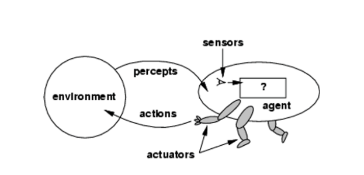
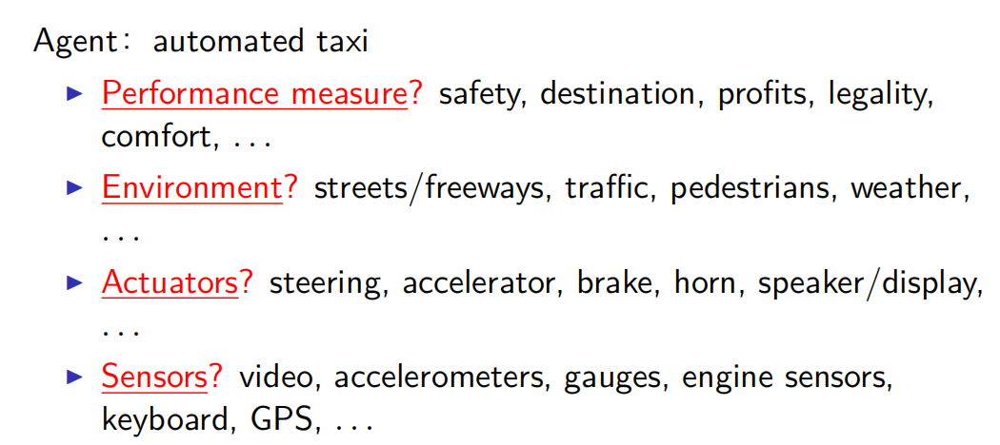

## Chapter 2 智能Agent

### 2.1 Agent 和 环境

Agent通过**感知器（tensor）**感知**环境（environment）**并通过**执行器（actuator）**对所处的环境产生影响

- **感知（percept）**表示任何给定时刻Agnet的感知输入

- **感知序列**是该Agent所收到的所有输入数据的完整历史

  Agent在任何给定时刻的行动选择依赖于到那个时刻为止该Agent的整个感知序列，而不是它感知不到的东西

- Agent函数描述了 Agent的行为，它将任意给定感知序列映射为行动

- Agent函数通过 **Agent程序** 实现，Agent函数是抽象的数学描述，agent程序则是具体实现，它在一些物理系统内部运行

### 2.2 好的行为：理性的概念

理性Agent：做事正确的Agent，从概念上讲，Agent函数表格的每一项都填写正确

做正确的事：通过 **性能度量** 表述，它对环境状态的任何给定序列进行评估

- 说的是环境状态而不是 Agent状态
- 从Agent的角度定义其性能是否成功达到，Agent可以达到完美理性，它只需要欺骗自己说环境是完美的

#### 2.2.1 理性

理性的判断依赖于以下四个方面

- 定义成功标准的性能度量
- Agent对环境的先验知识
- Agent可以完成的行动
- Agent截止到此时的感知序列

对于每一个可能的感知序列，根据已知的感知序列提供的证据和Agent具有的先验知识，理性Agent应该选择能够使其度量最大化的行动

#### 2.2.2 全知者、学习和自主性

理性与全知

- 一个全知的Agent明确地知道它的行动产生的实际结果并且做出相应的动作
- 理性不等于完美。理性是使期望的性能最大化，而完美是使实际的性能最大化
- 对理性的定义不要求全知，因为理性的选择只依赖于到当时为止的感知序列

为了修改未来的感知信息而采取行动（信息收集），是理性的重要部分

理性Agent还需要从它感知的信息中尽可能学习

- Agent依赖于设计人员的先验知识而不是它自身的感知信息，这种情况我们会说该Agent缺乏自主性。
- 理性Agent应该是自主的，它应该学习，以弥补不完整的或者不正确的先验知识

### 2.3 环境的性质

#### 2.3.1 任务环境的规范描述

任务环境（PEAS描述）

- Performance （性能）
- Environment（环境）
- Actuators（执行器）
- Sensors（传感器）

>example
>
>

#### 2.3.2 任务环境的性质

完全可观察的与部分可观察的

- 如果Agent的传感器在每个时间点上都能获取环境的完整状态，那么我们就说任务环境是完全可观察的。如果传感器能够检测所有与行动决策相关的信息，那么该任务环境是有效完全可观察的

单Agent与多Agent

- 区别另一个对象是仅仅是一个随机行动的对象还是Agent，在于B的行为是否寻求让依赖于Agent A的行为的性能度量值最大化

确定的与随机的

- 如果环境的下一个状态完全取决于当前状态和Agent执行的动作，那么我们就说该环境是确定的，否则是随机的

片段式的与延续式的

- 片段式的任务环境中，Agent的经历被分成了一个个原子片段，在每个片段中Agent感知信息并完成单个行动
- 下一个片段不依赖于以前的片段中采取的行动

静态的与动态的

- 如果环境在Agent计算的时候会变化，那么我们称该Agent的环境是动态的，否则是静态的

离散的与连续的

已知的与未知的

- 指的是Agent（或设计人员）的知识状态，这里的知识是指环境的“物理法则”
- 在已知的环境中，所有行动的后果是给定的
- 如果环境是未知的，Agent需要学习环境是如何工作的，以便做出更好的决策

### 2.4 Agent的结构

AI的任务是：设计Agent程序，它实现的事把感知信息映射到行动的Agent函数

假设该程序要在某个具备物理传感器和执行器的计算装置上运行（体系结构）

Agent = 体系结构 + 程序

#### 2.4.1 Agent 程序

- 一个agent完全是由agent function将感知序列映射到行动而实现的
- 一个agent function是理性的

##### Table-lookup agent

>Table-lookup agent
>
>

##### agent type

four basic types in order of increasing generality：

- simple reflex agents：简单反射Agent
- reflex agents with state：基于模型的反射Agent
- goal-based agents：基于目标的agent
- utility-based agents：基于效用的agent

所有的这些agent类型可以转化为学习型agent（learning agent）

#### 2.4.2 简单反射Agent

这类Agent基于当前的感知选择行动，不关注感知历史

#### 2.4.3 基于模型的反射Agent

Agent应该根据感知历史维持 **内部状态**， 从而至少反映出当前状态看不到的信息

#### 2.4.4 基于目标的Agent

- 知道现有的状态是不够的

  state使得agent了解部分未知世界

  agent必须基于改变和行动更新状态

- 基于goal选择状态

- 搜索和规划

#### 2.4.5 基于效用的agent

#### 2.4.6 学习 Agent

