## Chapter 6 约束满足问题

本章讨论：

- 如何更有效的求解更多种类的问题。
- 使用成分表示来描述状态：即一组变量，每个变量有自己的值。当每个变量都有自己的赋值同时满足所有关于变量的约束时，问题就得到了解决。
- 这类问题称为 **约束满足问题**，简称CSP

### 6.1 定义约束满足问题

约束满足问题包含三个成分X、D和C

- X是**变量**集合 $\{X_1, ...,X_n\}$
- D是 **值域** 集合 $\{D_1,...,D_n\}$，每个变量有自己的值域
- C是描述变量取值的 **约束** 集合

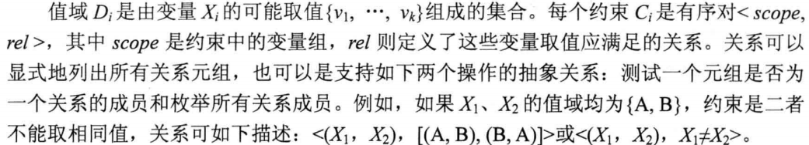

为求解 CSP，需要定义状态空间和解的概念。

问题的状态由对部分或全部变量的一个 **赋值** 来定义

一个不违反任何约束条件的赋值 称作 **相容的** 或者合法的赋值

**完整赋值**：每个变量都已赋值

**部分赋值**：只有部分变量赋值

CSP的解是相容的、完整的赋值

- 相容的：不违反任何约束条件
- 完整的：每个变量都以赋值

#### 6.1.1 实例：地图着色问题

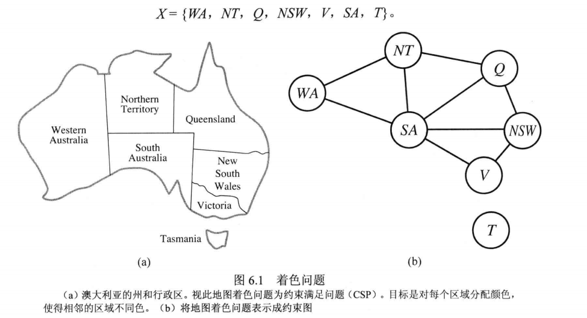

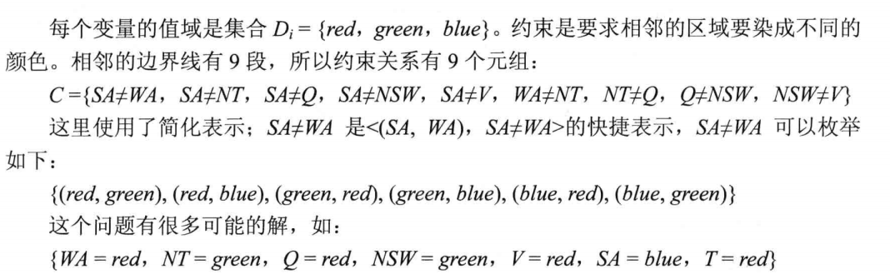

把CSP可视化的表示为 **约束图**

- 结点对应问题的变量
- 变量间的连线表示两者之间有约束

把问题形式转化为 CSP的原因

- 表示各种问题更自然，
- 用CSP求解系统求解问题比其他搜索技术简单
- CSP求解比状态空间搜索更快，因为CSP求解能快速消除庞大的搜索空间

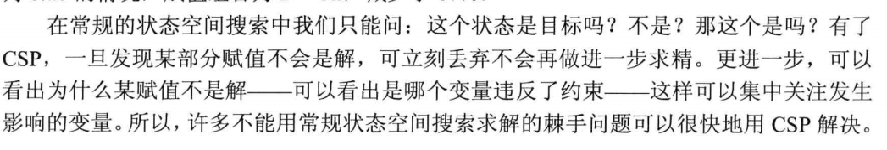

#### 6.1.2 实例：作业调度问题

##### 问题描述

##### 形式化成CSP问题

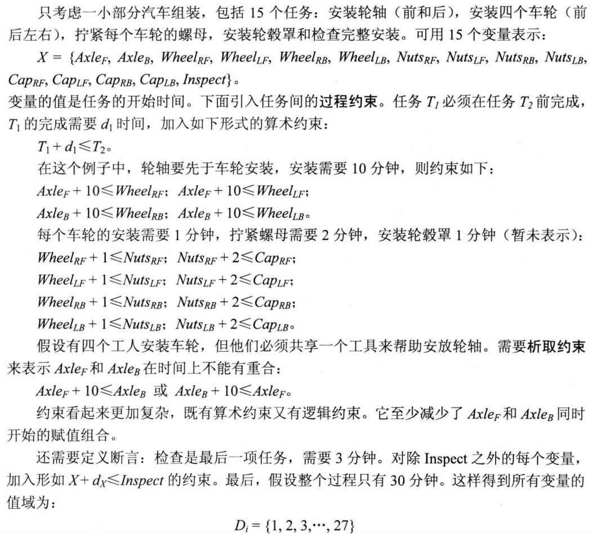

#### 6.1.3 CSP的形式化

最简单的CSP是指，涉及的变量是 **离散的有限值域** 的。

- 地图着色和有时间限制的调度问题就是此类

离散值域可能是 **无限的**，如整数集合或字符串集合

如果是无限值域，就不再可能用枚举所有可能取指来描述约束条件了，就只能直接用 **约束语言** 代替

可以证明，没有算法能够求解整数变量的**非线性约束**问题

**连续值域** 的约束满足问题

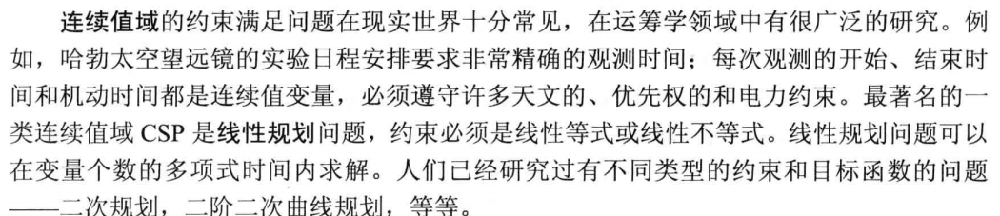

除了出现在CSP中的变量的种类，考察约束的类型也是有用的

类型是：

- 一元约束：它只限制单个变量的取值
- 二元约束：与两个变量有关，二元CSP只包含二元约束，它可以表示为约束图
- 全局约束：变量个数为任意的约束

>一个全局约束问题
>
>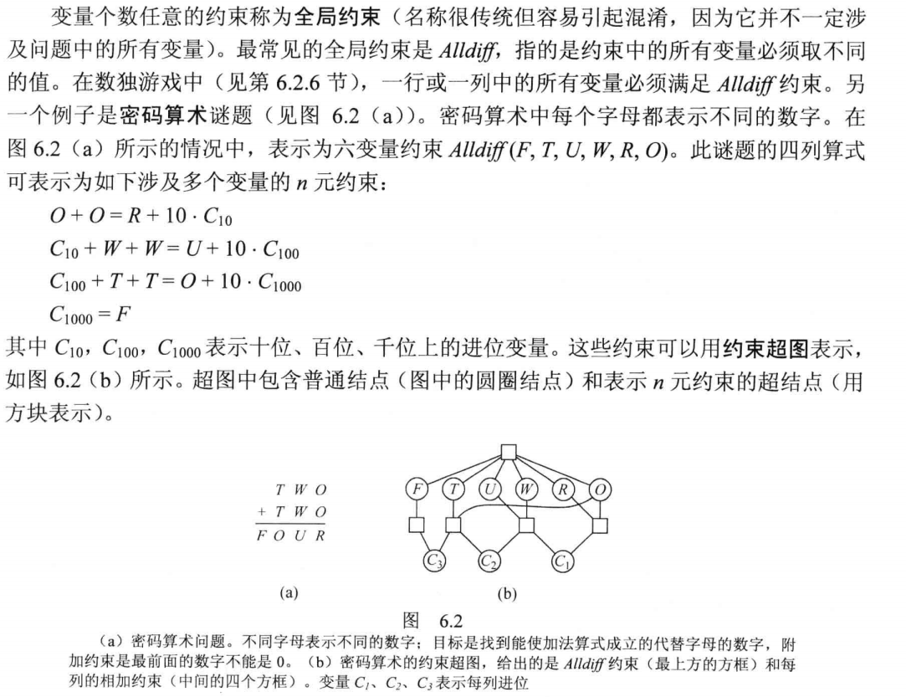

任何有限值域的约束都可以通过引入足够的约束变量而转化为 二元约束

所以可以转换任何CSP成只含二元约束的

另一种将n元CSP转换成二元CSP的方法是：**对偶图** 转换：

- 创建一个新图，原图中的每个约束用一个变量表示
- 原图中每对有同样变量的约束用一个二元约束表示

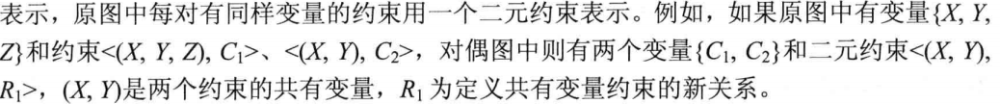

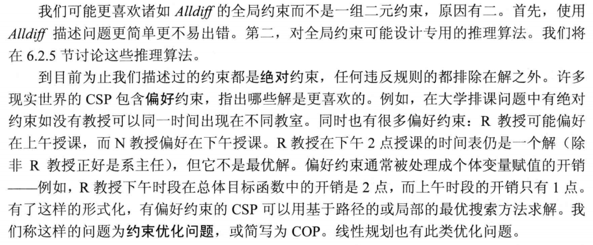

### 6.2 约束传播：CSP中的推理

在常规的状态空间搜索中，算法只能做一件事：搜索

在CSP中，算法可以搜索，也可以做一种称为 **约束传播** 的特殊 **推理**

- 使用约束来减小一个变量的合法取值范围，从而影响到跟此变量有约束关系的另一变量的取值
- 约束传播与搜索可以交替进行，或者也可以把它作为搜索前的预处理步骤
- 有时这个预处理就可以解决整个问题，不需要搜索了

核心是：**局部相容性**

#### 6.2.1 结点相容

如果单个变量（对应CSP网络中的结点）值域中的所有取值满足它的一元约束，就称此变量是 **结点相容** 的

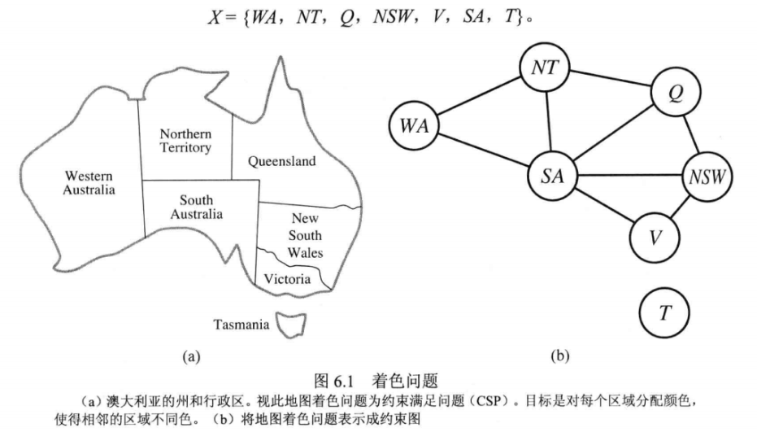

- 地图着色问题中比如南澳洲中不喜欢绿色，变量SA原来值域为 $\{red,green,blue\}$，删除green此结点即为结点相容的，此时SA的值域空间为 $\{red,blue\}$
- 如果网络中每个变量都是结点相容的，则此网络是结点相容的

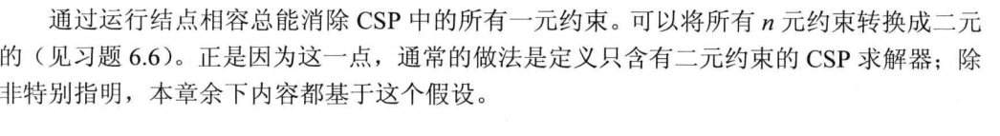

#### 6.2.2 弧相容

如果CSP中某变量值域中的所有取值满足改变量

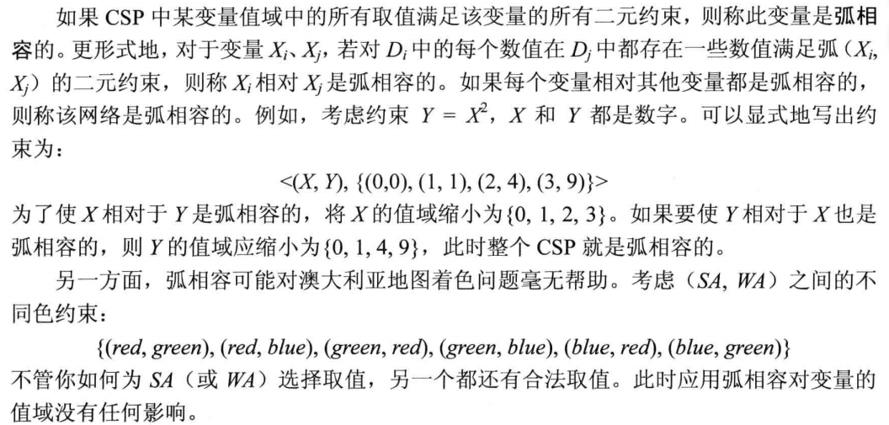