## Chapter 7 现代卷积神经网络

>notes：
>
>这一章主要是几种CNN网络的结构及相关代码复现，大多数结构在现在的研究中已经不实用的，只有ResNet和batch normalization 还有用武之地
>
>我的主要思路就是，整理相关的结构具体是怎么样的，和一定的提出原因还有可解释性
>
>然后只着重实现一下 LeNet的代码，其他的只需要替换nn.Sequential的内容和修改一下相关参数就可以了

### 7.1 卷积神经网络（LeNet）

用卷积层代替全连接层的好处是

- 模型更简洁、所需的参数更少

LeNet是最早发布的卷积神经网络之一

#### 7.1.1 LeNet 结构

LeNet（LeNet-5）由两个部分组成

- 卷积编码器：由两个卷积层组成
- 全连接层密集块：由三个全连接层组成

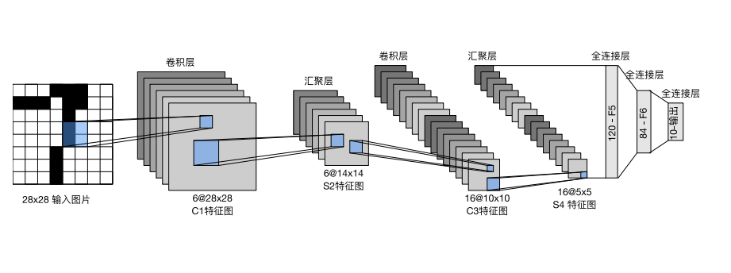

输入是一个 $28 \times 28 $的图像tensor

输出是一个分类器，因为手写数字识别有0-9十种可能，因此是一个$10$的一维tensor

每个卷积块的基本单元是一个卷积层、一个sigmoid激活函数和平均汇聚层

这些层将输入映射到多个二位特征输出，通常同时增加通道的数量。

- 第一卷积层由6个输出通道
- 第二个卷积层由16个输出通道

每个 $2\times 2$的池化操作（步幅为2（，通过空间下采样将维数减少4倍

为了将卷积块的输出传递给稠密块，我们必须在小批量中展平每个样本

我们将这个四维输入转换成全连接层所期望的二维输入。这里的二维表示的第一个维度索引小批量中的样本，第二个维度给出每个样本的平面向量表示。

LeNet的稠密块有三个全连接层，分别有 120、84和10个输出

简化版结构如下

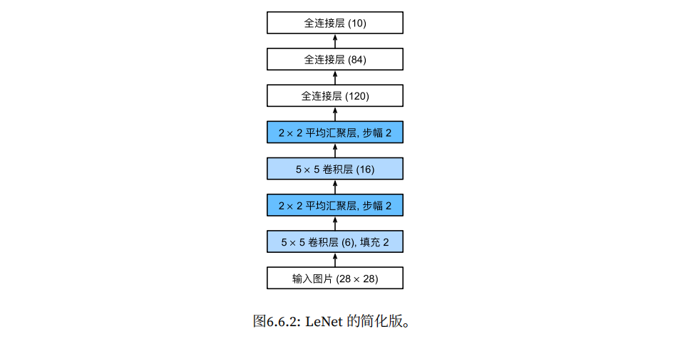

>去掉了最后一层的高斯激活

#### 7.1.2 模型训练

下面是代码实现

- 下载数据集，做特征提取等预处理
- 实例化network
- 设置超参数
- 训练
- 测试，并绘制测试图像

下面是具体代码

### 7.2 深度卷积神经网络（AlexNet）

>notes：
>
>从AlexNet开始，大部分网络架构的提出都是为了 ImageNet服务的，是在ImageNet的数据集上得到的很好的结果。但实际运行的代码尊重原书d2l，还是用MNIST（也就是手写体识别）的数据集
>
>- 才不是因为我没有多卡训练群（
>- ImageNet + GoogleNet我感觉用我的3050得练上好几天

从LeNet到AlexNet

- AlexNet比相对较小的LeNet5要深得多。AlexNet由八层组成：五个卷积层、两个全连接隐藏层和一个全连接输出层
- AlexNet使用ReLU而不是sigmoid作为其激活函数

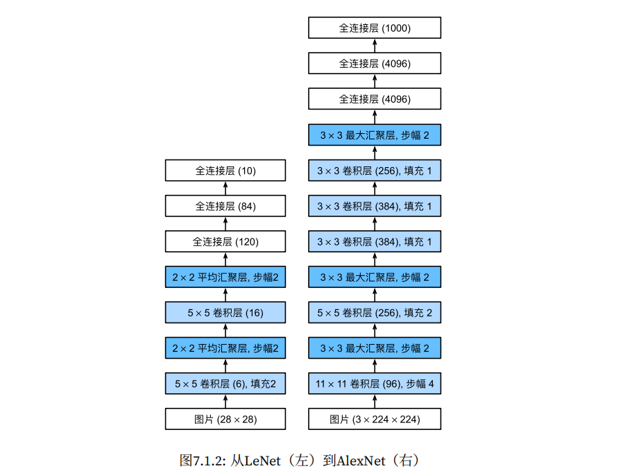

#### 7.2.1 模型设计

在AlexNet的第一层，卷积窗口的形状是 $11 \times 11$。由于ImageNet中大多数图像的宽和高比MNIST图像的多10倍以上，因此需要一个更大的卷积窗口来捕获目标

第二层中的卷积窗口形状被缩减为 $5 \times 5$。然后是 $3 \times 3$

此外，在第一层、第二层和第五层卷积层之后，加入窗口形状为 $3\times 3$、步幅为2的最大汇聚层呢个

最后一个卷积层后有两个全连接层，分别有4096个输出。

这两个巨大的全连接层拥有将近 1GB 的模型参数

AlexNet将sigmoid激活函数改为更简单的ReLU激活函数

- ReLU的计算更简单，不需要求幂运算
- 使用不同的参数初始化方法时，ReLU激活函数使训练模型更加容易

>notes：
>
>激活函数在每个layer之后使用

##### 容量控制和预处理

AlexNet通过暂退法控制全连接层的模型复杂度，而LeNet只使用了权重衰减。

为了进一步扩充数据，AlexNet在训练时增加了大量的图像增强数据，如翻转、裁剪和变色。

##### 数据集读取

采用Fashion-MNIST数据集。我们将 $28 \times 28$ 增加到 $224 \times 224$

#### 7.2.2 代码实现

### 7.3 使用块的网络（VGG）

>notes：
>
>这会介绍一些常用于设计深层神经网络的启发式概念
>
>我们希望神经网络架构的设计是模块化的，有一些比较有效的结构可以重复化，因此提出了VGG, NiN，ResNet等

#### 7.3.1 VGG

经典卷积神经网络的基本组成部分是

- 带填充以保持分辨率的卷积层
- 非线性激活函数，如ReLU
- 汇聚层，如最大汇聚层

而一个VGG块与之类似，由一系列卷积层组成，后面再加上用于空间下采样的最大汇聚层

最初的VGG作者使用

- $3\times 3$卷积核、填充为1的卷积层
- 带有 $2\times 2$的汇聚窗口，步幅为2的最大汇聚层呢个

##### VGG网络

VGG网络分为两部分

- 第一部分主要由 卷积层和汇聚层组成
- 第二部分由全连接层组成

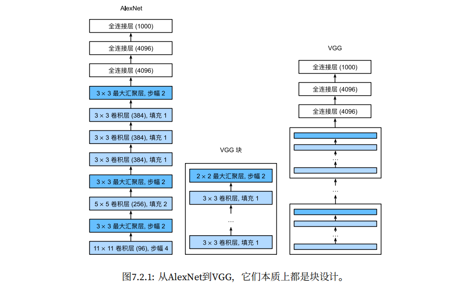

最原始的VGG网络有5个卷积块

前两个块各有一个卷积层

后三个块包含两个卷积层

第一个模块有64个

输出通道，每个后续模块将输出通道数量翻倍，直到该数字达到512。由于该网络使用8个卷积层和3个全连接层，因此它通常被称为VGG‐11

>notes：
>
>VGG论文中，作者发现，深层且窄的卷积比浅层且宽的卷积更有效。这也导致后来很多CNN的工作是纯在堆深度，但现在这个时代似乎又在宽度上做文章了

#### 7.3.2 代码实现

### 7.4 网络中的网络（NiN)

>notes：
>
>LeNet、AlexNet和VGG都有一个共同的设计模式：
>
>通过一系列的卷积层与汇聚层来提取空间结构特征，然后通过全连接层对特征的表征进行处理
>
>AlexNet和VGG对LeNet的改进主要在于如何扩大和加深这两个模块
>
>如果使用了全连接层，可能会完全放弃表征的空间结构。网络中的网络（*NiN*）提供了一个非常简单的解决方案：在每个像素的通道上分别使用多层感知机

#### 7.4.1 NiN块

卷积层的输入和输出由 4-dimension tensors组成，分别表示

- 样本数
- 通道数
- 高度
- 宽度

全连接层的输入和输出通常是分别对应于样本和特征的二维张量

NiN的想法是

- 在每个像素位置应用一个全连接层

>说人话就是用 $1\times 1$的卷积核对每一个像素点的所有通道做一个汇聚，相当于把不同通道视为不同的特征，和多个输出通道做一个全连接操作

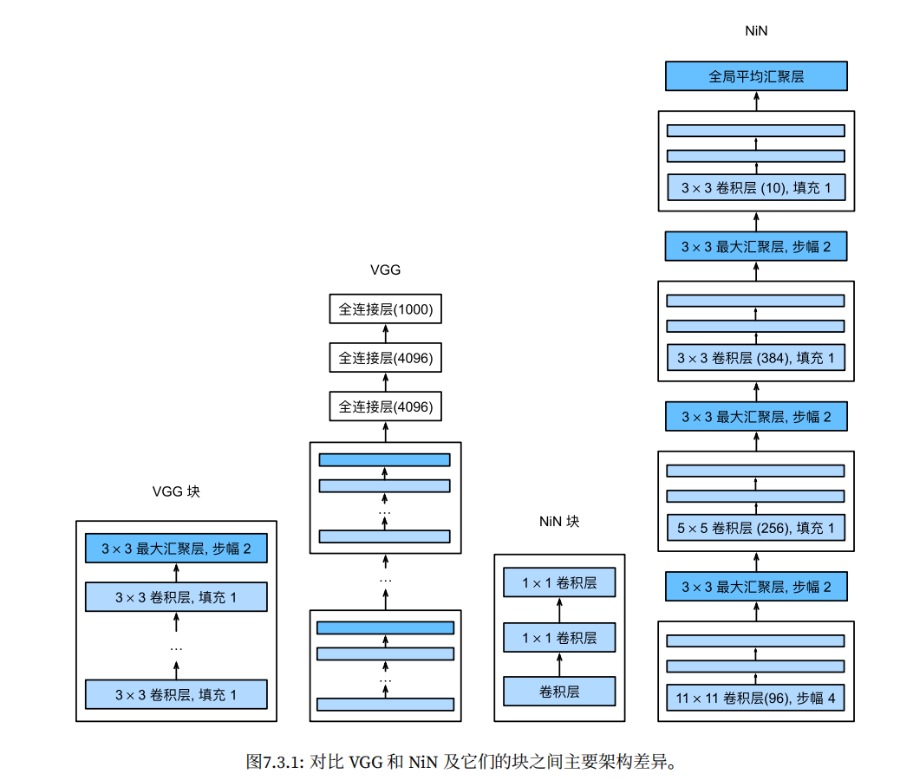

NiN块以一个普通卷积层开始，后面是两个 $1\times 1$的卷积层，这两个 $1\times 1$的卷积层充当带有ReLU激活函数的逐像素全连接层

最初的NiN网络是在AlexNet后不久提出的，显然从中得到了一些启示。NiN使用窗口形状为11*×*11、5*×*5和3*×*3的卷积层，输出通道数量与AlexNet中的相同。每个NiN块后有一个最大汇聚层，汇聚窗口形状为3 *×* 3，步幅为2。

>notes：
>
>NiN网络彻底取消了全连接层，最后放一个全局平均汇聚层呢个，生成一个对数几率
>
>由于减少了全连接层，所以大大降低了模型所需参数的数量

### 7.5 含并行连接的网络（GoogLeNet）

>notes：
>
>获得高质量模型正常的做法是
>
>- 增加模型的深度（网络的层数）
>- 增加模型的宽度（卷积层层的核大小，神经元的数量）
>
>但这样会导致
>
>- 参数太多，如果训练集数据有限，容易过拟合
>- 网络越大计算复杂度越大，很难应用
>- 网络越深，梯度越容易在深层计算消失，难以有效对模型进行梯度更新的优化
>
>解决这个问题的方法是将全连接转化为稀疏连接。
>
>但稀疏连接的计算效率很差
>
>如何保持网络结构的稀疏性（参数量少），由利用好密集矩阵的高计算性能呢？
>
>Inception块的提出旨在解决这个问题

#### 7.5.1 Inception块

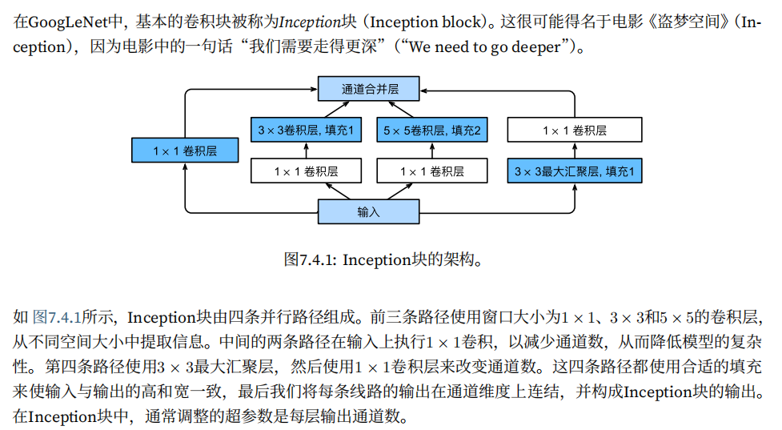

>notes：
>
>这个过程就像，用不同的滤波器去处理输出（你也可以理解为不同的模式），得到不同的结果。
>
>不同的模式会识别不同范围，不同尺寸的一些图像特征，然后再把这信息组合，就可以得到我们期望的结果
>
>这种思想有些像并行化，如果我能将一个任务分割成四个计算独立的子任务，然后再合并，我就可以同时计算这四个任务（利用强大的计算能力），并且单个任务的开销很小
>
>同时，由于每一个模式都很小，并不会导致参数量很大

#### 7.5.2 GoogleNet模型

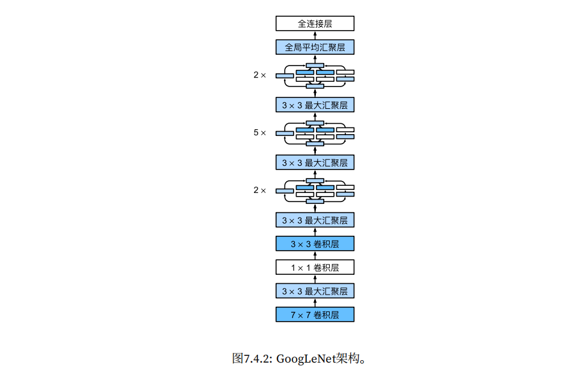

#### 7.5.3 代码

### 7.6 残差网络（ResNet）

#### 7.6.1 函数类

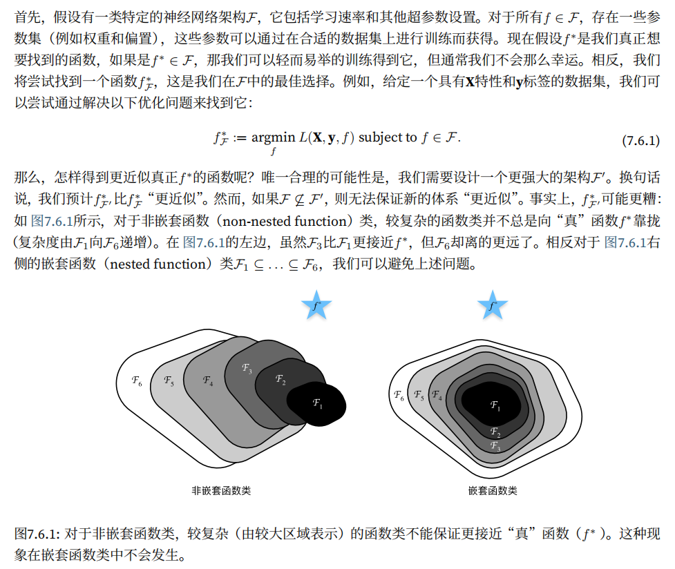

>如果我们希望用一个更大结构去近似到最优解，那么至少我们需要保证更大的结构不会比原先的小结构差，否则单纯的增大结构是没有意义的，反而使得结果越来越差
>
>那么怎么保证我们增大参数量就一定能获得更接近最优解的结构呢？
>
>- 一种思路是用嵌套函数类，只要我们现有的结构完全包含了原先的结构，那么至少增大参数量不会导致新的函数比原先的函数差
>- 这是一种避免过拟合的方法（但有点像一种保底机制）

用学术一些的话语来描述

- 只有当复杂的函数类包含较小的函数类时，我们才能确保提高它们的性能
- 对于深度神经网络，如果我们能将新添加的层训练成 恒等映射（identity function） f(x) = x，则新模型和原模型将同样有效

>notes：
>
>$f(x) = x$的意思是说，经过新函数，我们还能保留原先结果的特性，这样至少不会导致新的模型（也就是函数）作用之后结果更差了
>
>实际上对于最初的输入x，我们将很多个连续的神经网络层，也就是多个函数 $f_1(x),f_2(x),f_3(x)$ 都作用到x上，每一次的作用效果都能被下一次作用效果覆盖
>
>但是只是简单的恒等映射会导致，这个网络层作用和没作用没啥区别。所以不能只是恒等映射，还需要有其他的效果

Resnet（残差网络）的核心思想是：

- 每个附加层都应该更容易地包含原始函数作为其元素之一

#### 7.6.2 残差块

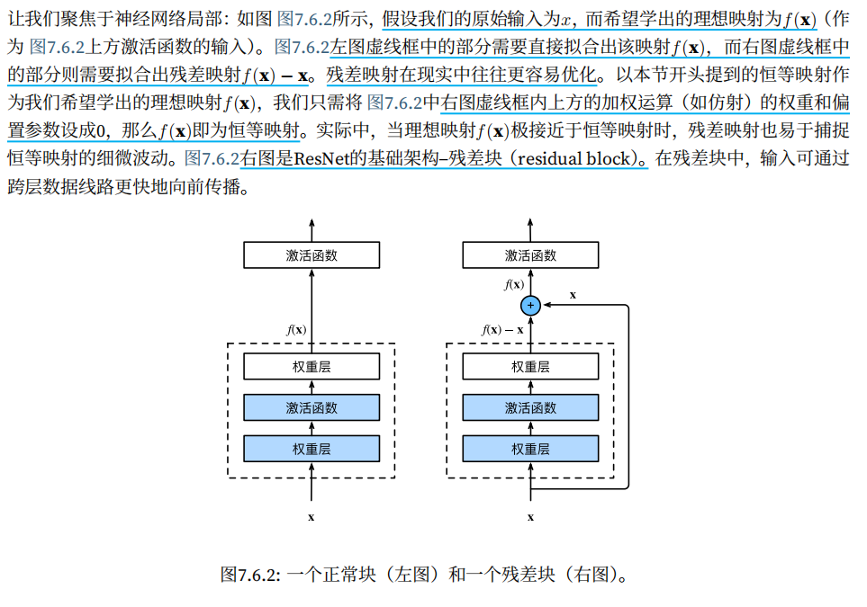

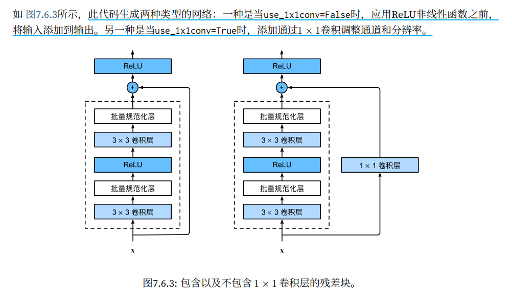

#### 7.6.3 ResNet 模型

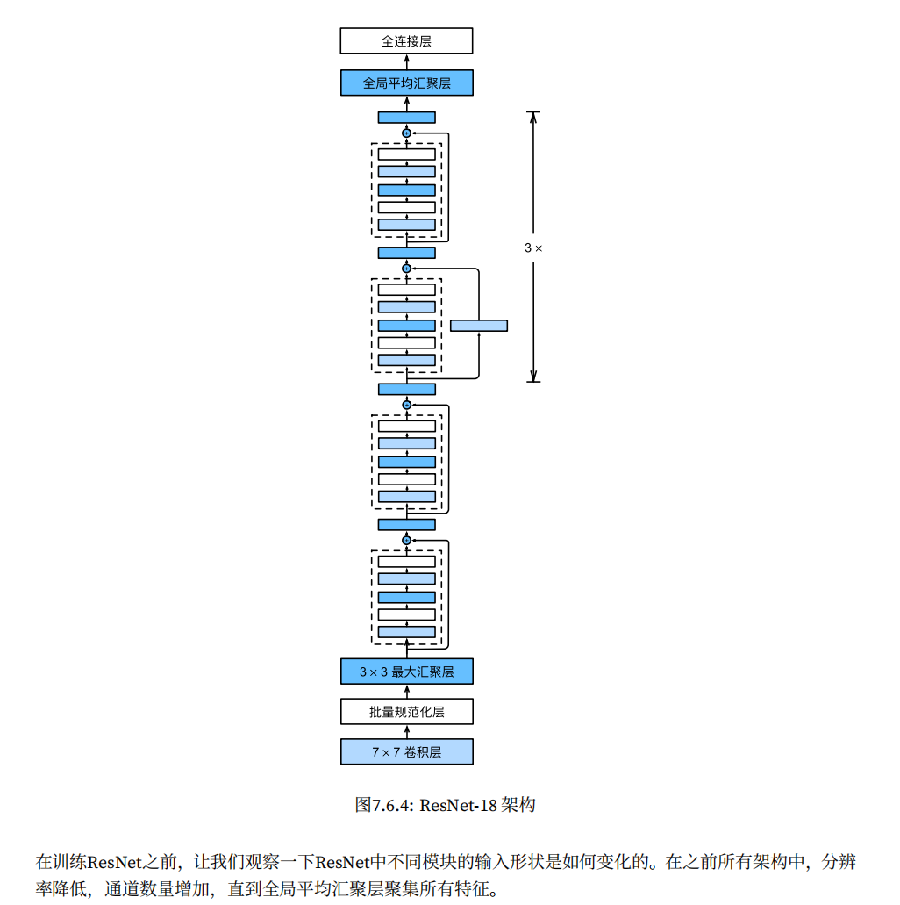

### 7.7 稠密连接网络（DenseNet）

#### 7.7.1 从ResNet到DenseNet

ResNet将f分解为两部分

- 一个简单的线性项
- 一个复杂的非线性项

$f(x) = x + g(x)$

如果把f拓展成超过两部分的信息，一种方案就是 DenseNet

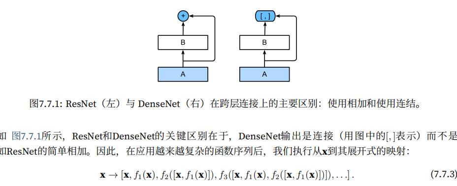

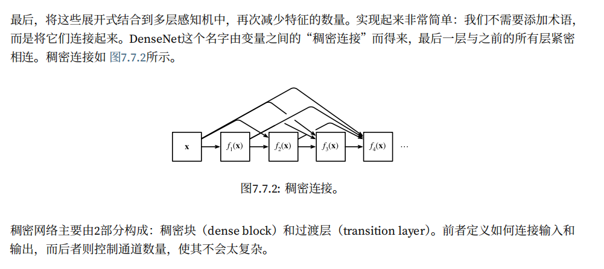

#### 7.7.2 稠密块体

DenseNet使用了ResNet改良版的“批量规范化、激活和卷积”架构

一个稠密块由多个卷积块组成，每个卷积块使用相同数量的输出通道。然而，在前向传播中，我们将每个卷积块的输入和输出在通道维上连结

#### 7.7.3 过渡层

由于每个稠密块都会带来通道数的增加，使用过多则会过于复杂化模型。而过渡层可以用来控制模型复杂度。

它通过1 *×* 1卷积层来减小通道数，并使用步幅为2的平均汇聚层减半高和宽，从而进一步降低模型复杂度。

#### 7.7.4 DenseNet 模型

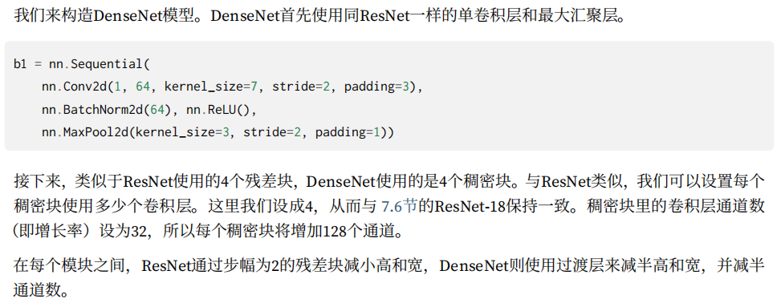