## Chapter 4 多层感知机

### 4.1 多层感知机

#### mlp defination

线性模型可能会出错，可以在网络中加入一个或多个隐藏层来克服线性模型的限制，使其能处理更普遍的函数关系类型

**多层感知机（multilayer perceptron）MLP**：将许多全连接层堆叠在一起，每一层都输出到上面的层，直到生成最后的输出

- 把前L-1层看作表示，把最后一层看作线性预测器

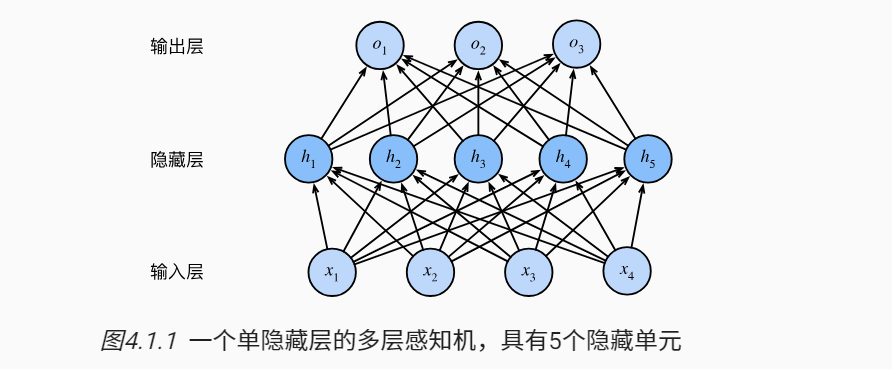

- 输入层不涉及任何计算，因此使用网络产生输出只需要实现hidden layer和output layer的计算
- 当前mlp的层数为2，都是全连接的

对于n个输入样本，每个样本有d个输入特征，因此输入矩阵为 $X \in R^{n \times d}$，对于具有h个隐藏单元的单隐藏层mlp

$H = XW^{(1)} + b^{(1)}$

$O = HW^{(2)} + b^{(2)}$

- $H$是隐藏层变量，是一个 $H \in R^{n \times h}$
- $W^{(1)} \in R^{d \times h}$
- $b^{(1)} \in R^{1 \times h}$
- 这里用到了广播机制，将$b^{(1)}$广播到n行

为了发挥多层架构的潜力，我们还需要一个额外的关键要素：

- 在仿射变换之后对每个隐藏单元应用 非线性的 **激活函数（activation function） $\sigma$** 
- 激活函数的输出被称为 **活性值（activations）**
- 一般来说，有了激活函数，就不可能将MLP退化成线性模型

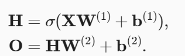

#### 激活函数

**激活函数（activation function）** 通过计算加权和并加上偏置来确定神经元是否应该被激活

- 将输入信号转换为输出的可微运算

##### ReLU

最受欢迎的激活函数是*修正线性单元*（Rectified linear unit，*ReLU*）， 因为它实现简单，同时在各种预测任务中表现良好。 ReLU提供了一种非常简单的非线性变换。 给定元素x，ReLU函数被定义为该元素与0的最大值：
$$
ReLU(x) = max(x,0)
$$
ReLU函数通过将相应的活性值设为0，仅保留正元素并丢弃所有负元素。

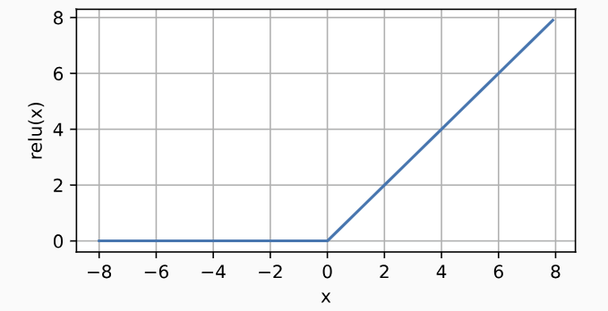

使用ReLU的原因是，它求导表现得特别好：要么让参数消失，要么让参数通过。 这使得优化表现得更好，并且ReLU减轻了困扰以往神经网络的梯度消失问题

>参数化ReLU
>$$
>pReLU(x) = max(0,x) + \alpha min(0,x)
>$$

##### sigmoid函数

对于一个定义域在R中的输入，sigmoid函数将输入变换为区间(0,1)上的输出。因此，sigmoid通常称为 **挤压函数（squashing function）**，它将范围（-inf，inf）中的任意输入压缩到区间(0,1)中的某个值：

$sigmoid(x) = \frac{1}{1 + e^{-x}}$

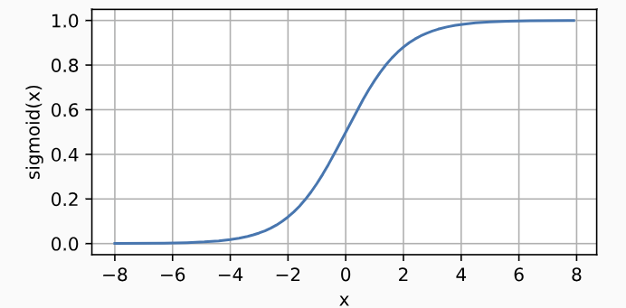
$$
\frac{d}{dx} sigmoid(x) = sigmoid(x)(1-sigmoid(x))
$$

##### tanh函数

$$
tanh(x) = \frac{1 - exp(-2x)}{1 + exp(-2x)}
$$

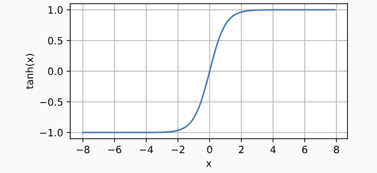

### 4.2 mlp从零开始实现

- 数据集读取
- 初始化模型参数
- 激活函数
- 模型
- 损失函数
- 训练

### 4.3 mlp的简洁实现

### 4.4模型选择、欠拟合和过拟合

机器学习的目标是：发现某些 **模式（pattern）**，这些模式捕捉到了我们训练集潜在总体的规律

#### 训练误差和泛化误差

**训练误差（training error）**是指，模型在训练数据集上计算得到的误差

**泛化误差（generalization error）**是指，模型应用在同样从原始样本的分布中抽取的无限多数据样本时，模型误差的期望

>问题是，我们永远不能准确地计算出泛化误差。 这是因为无限多的数据样本是一个虚构的对象。 在实际中，我们只能通过将模型应用于一个独立的测试集来估计泛化误差， 该测试集由随机选取的、未曾在训练集中出现的数据样本构成。

#### 模型复杂性

模型复杂性由什么构成是一个复杂的问题。 一个模型是否能很好地泛化取决于很多因素。 例如，具有更多参数的模型可能被认为更复杂， 参数有更大取值范围的模型可能更为复杂。 通常对于神经网络，我们认为需要更多训练迭代的模型比较复杂， 而需要*早停*（early stopping）的模型（即较少训练迭代周期）就不那么复杂。

#### 训练集、验证集、测试集

训练集是模型实际用来训练的数据集

验证集是估计云线数据的泛化误差的数据集

测试集知恩阁用一次，不能通过测试集训练数据

#### K-fold交叉验证

当训练数据稀缺时，我们甚至可能无法提供足够的数据来构成一个合适的验证集。 这个问题的一个流行的解决方案是采用K*折交叉验证*。 这里，原始训练数据被分成K个不重叠的子集。 然后执行K次模型训练和验证，每次在K−1个子集上进行训练， 并在剩余的一个子集（在该轮中没有用于训练的子集）上进行验证。 最后，通过对K次实验的结果取平均来估计训练和验证误差。

#### 欠拟合和过拟合

**欠拟合（underfitting）**：训练误差和验证误差都很严重，但差距很小。

**过拟合（overfitting）**：训练误差明显低于验证误差

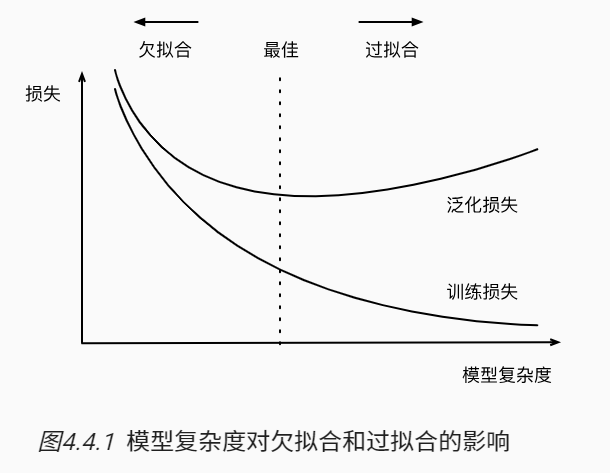

原因

- 模型复杂性
- 数据集大小，训练数据集中的样本越少，越有可能过拟合

### 4.5 权重衰减

在训练参数化机器学习模型时， *权重衰减*（weight decay）是最广泛使用的正则化的技术之一， 它通常也被称为L2*正则化*。 这项技术通过函数与零的距离来衡量函数的复杂度， 因为在所有函数f中，函数f=0（所有输入都得到值0） 在某种意义上是最简单的

训练数据集

验证数据集

非大数据集上通常使用功能k-折交叉验证

过拟合和欠拟合

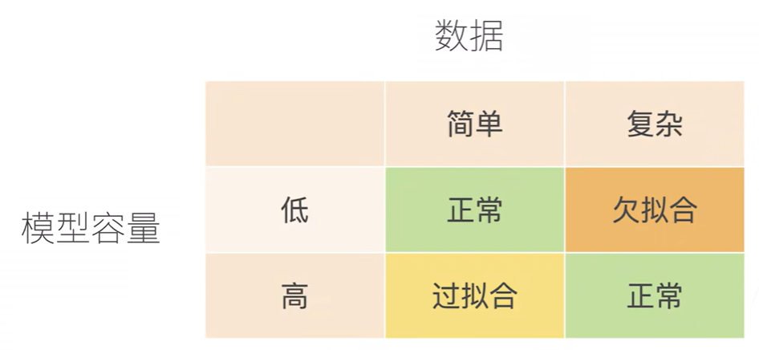

- 模型容量（模型复杂程度）

  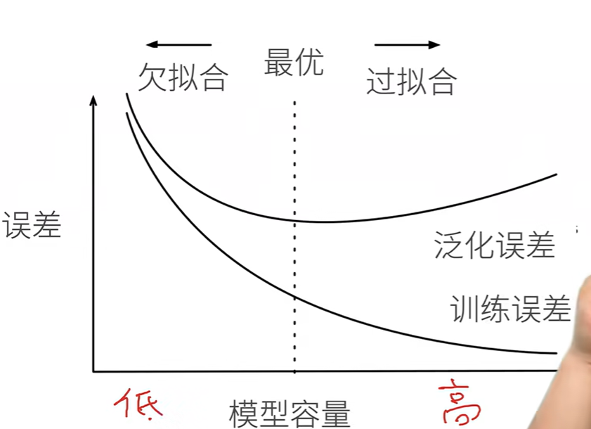

- 数据复杂程度

  - 样本个数
  - 每个样本的元素个数
  - 时间、空间结构
  - 多样性

总结：模型容量需要匹配数据复杂度，否则可能导致欠拟合和过拟合

#### 4.5 权重衰减

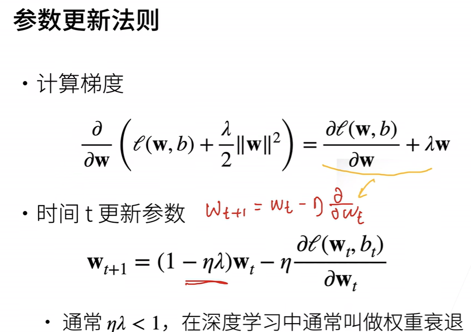

权重衰退通过L2正则项使得模型参数不会过大，从而控制模型复杂度

正则项权重是控制模型复杂度的超参数

#### 4.6 dropout

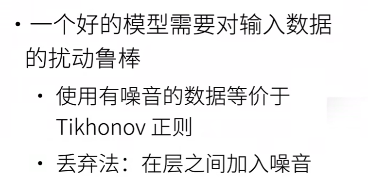

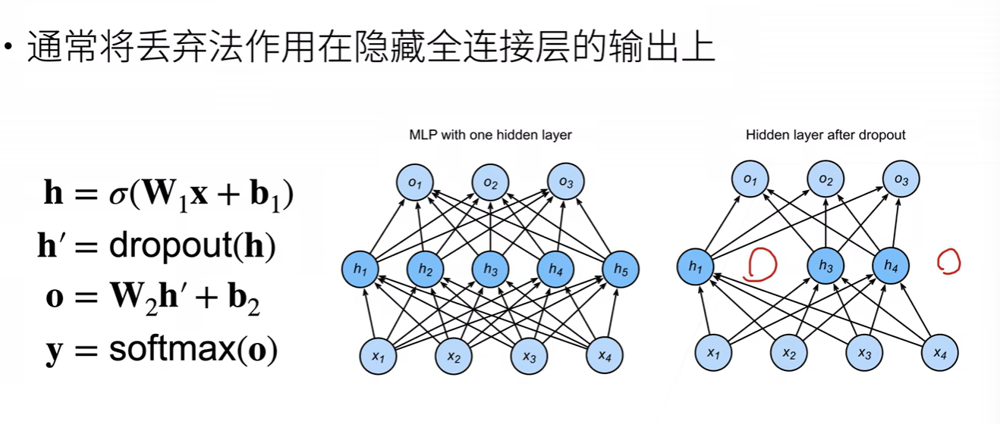

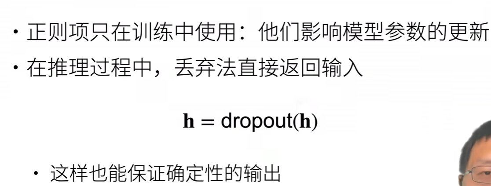

