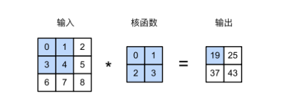

## Chapter 6 卷积神经网络

### 6.1 从全连接层到卷积

#### 6.1.1 不变性

1. 平移不变性（translation invariance）：不管检测对象出现在图像中的哪个位置，神经网络的前面几层应该对相同的图像区域有相似的反应
2. 局部性（locality）：神经网络的前面几层应该只探索输入图像中的局部区域，而不过渡在意图像中相隔较远区域的关系。

>notes：
>
>图像问题更多是，在一张完整的图像中识别某个特定的小图像（这种小图像可以称为模式），因此，当我们聚集在一个像素点的时候，我们更关注离它最近的周围一些像素点，而并不着重考虑离它很远的哪些。
>
>这种联系，在数学上就是，这个像素点输出的结果只需要周围一小块区域对它有一个权重weight，然后通过权重求和得到输出。而对于其他比较远的像素点，对这个像素点的权重很小，甚至没有。
>
>可以发现，全连接层是指，对于我们想要聚焦的某个像素点，上一层的所有像素点对它都有影响（也就是都有一个参数），那么这个参数量是很恐怖的，这种locality的特性能够大大降低参数量，也为更深的神经网络构建提供了帮助

#### 6.1.2 多层感知机的限制

我们先来看多层感知机（mlp）是怎么处理图像问题的

假设 输入一张**二维图像 X**（数学上表示为一个二维矩阵，deep learning中我们称为二维张量tensor）

>notes：
>
>这里的张量tensor和传统数学上定义的张量不同，而且图像是二维的说明只有长和宽两个维度，并没有颜色通道这个维度，因此是黑白图。
>
>对于一张图像，应该有三个维度：
>
>- 颜色通道数：通常是3个，红蓝绿，通过红蓝绿三个颜色通道叠加可以得到任何一种rgb颜色
>- 行宽：比如1080$\times$ 760分辨率的图像，行宽是1080，也就说明每张图像有1080行
>- 列宽：760列
>
>上面这个例子中，一共有 3$\times$ 1080 $\times$ 760个像素点

**隐藏表示H（即输出）**也是一个二维张量

使用 $[X]_{i,j}$和 $[Y]_{i,j}$分别表示输入图像和隐藏表示中位置 (i,j)处的像素

如果我们需要用mlp去解决问题，那么权重应该是一个四维的tensor

>notes：
>
>四维的原因是，权重是把任何一个输入的位置(i,j)映射到输出位置(k,l)的值，一共有 $i\times j \times k \times l$组映射，因此是一个四维的tensor

加上偏移（bias）矩阵 U后，形式化表示为


>notes：
>
>重新索引下标 k = i + a， l = j + b，可以得到新的权重矩阵 V，移动索引a和b就可以覆盖整个图像

对于隐藏表示中任意给定位置 (i,j)处的像素值 $[H]_{i,j}$，可以通过在输入x中以 (i,j)为中心对像素进行加权求和得到

##### 平移不变性

检测对象在输入X中的平移，应该仅导致隐藏表示H中的平移，即 V和U并不依赖于 (i,j)

$[V]_{i,j,a,b} = [V]_{a,b}$

形式化定义为


>notes:
>
>这里的意思是说，对一个原图像固定的位置(i,j)，我们想要识别它周围这个局部图像信息，那么我们的权重矩阵（即模式）不应该根据它的位置(i,j)变化而变化
>
>比如我们想要统计一张照片中乒乓球的个数，那么识别乒乓球这个模式不应该随着位置变动而改变，所以在数学上表现为权重矩阵V和位置(i,j)无关，只跟输出的位置有关(a,b)

这就是卷积（convolution）。我们是在使用系数[**V**]*a,b*对位置(*i, j*)附近的像素(*i* + *a, j* + *b*)进行加权得到[**H**]*i,j*。

注意，[**V**]*a,b*的系数比[V]*i,j,a,b*少很多，因为前者不再依赖于图像中的位置。

##### 局部性

局部性是说，为了收集用来训练参数 $[H]_{i,j}$的信息，我们不应该偏离到距离(i,j)很远的地方，只在一个小范围内收集就可以了

数学上就意味着，我们的权重矩阵范围可以比较小


这就是一个卷积层（convolution kernel）或者滤波器（filter）

这个权重是可以学习的参数。因为处理的局部区域比较小，所以参数量相比于mlp很少很多

#### 6.1.3 卷积

数学上的卷积

在两个函数（比如 f，g：$R^d \rightarrow R$ 之间的 卷积 被定义为

$f * g(x) = \int f(z) g(x-z) dz$

卷积是当把一个函数 “翻转”并移位x时，测量f和g之间的重叠。当为离散对象时，积分就变成求和


对于二维向量，则为f的索引(a, b)和g的索引（i-a，j-b）上的对应加和


#### 6.1.4 ”沃尔多在哪里“ 回顾

##### 通道

之前的二维张量忽略了图像一般包含是哪个通道（三种原色）。实际上，图像不是二维张量，而是一个由高度、宽度和颜色组成的三维张量

因此将X索引为 $[X]_{i,j,k}$，相应的卷积调整为 $[V]_{a,b,c}$

由于输入图像是三维的，我们的隐藏表示H也最好采用三维张量tensor。换句话说，对于每一个空间位置，我们想要一组而不是一个隐藏表示

我们可以把隐藏表示想象为一系列具有二维张量的通道（channel）。这些通道有时也被称为特征映射（feature maps），因为每个通道都向后续层提供一组空间化的学习特征


>notes：
>
>V新增的两个下标分别表示输入通道c映射到输出通道d的位置
>
>比如输入有3个通道，输出期望是4个通道，那么c是3，d是4。
>
>这两个新加的维度也表示一种映射比如输出通道2，需要输入的三个通道各有一个权重，然后求和映射到输出通道2

#### 6.1.5 小结

- 图像的平移不变性使我们以相同的方式处理局部图像，而不在乎它的位置。

- 局部性意味着计算相应的隐藏表示只需一小部分局部图像像素。

- 在图像处理中，卷积层通常比全连接层需要更少的参数，但依旧获得高效用的模型。

- 卷积神经网络（CNN）是一类特殊的神经网络，它可以包含多个卷积层。

- 多个输入和输出通道使模型在每个空间位置可以获取图像的多方面特征。

### 6.2 图像卷积

#### 6.2.1 互相关运算

卷积层的运算实际上并不是数学上的 卷积（指连续变量的积分或离散变量的求和），这种运算实际上是一种 **互相关运算（cross-correlation）**

>notes：
>
>但anyway，数学系的人甚至极力嘲讽深度学习中的张量（tensor）并不是真正的张量

在卷积层中，输入张量和核张量通过互相关运算产生输出张量

下面是一个不考虑图像的第三维颜色通道，只考虑宽和高两个维度的互相关运算计算案例


>notes：
>
>我们观察一下发生了什么，核函数像是一个模式（pattern），一次读取输入tensor的核大小的一个位置（比如这里核函数是 $2\times 2$的，那么一次从输入读取一个 $2\times 2$的位置）
>
>然后将读到的位置和核函数做一次矩阵乘法，得到的值放入输出的一个位置
>
>每次将输入向左移动一个位置，然后再按行移动（步长也是1）
>
>这个过程有些像矩阵乘法，但是和矩阵乘法的区别在于，矩阵乘法是要求 A（m $\times n$ ) 和 B( $n \times k$)，两个维度相同才能乘
>
>而互相关是在一个张量上滑动另一个张量并计算点积来衡量相似性
>
>- 这种相似性是通过计算两个信号在不同位置上的匹配程度，从而找到两个信号在各个位置上的相似性程度，从而找到最佳匹配位置和最大相似性
>- 所以输出实际上的一层意义是，输入图像的各个位置在和这个给定模式（核函数）的相似性

下面来看一些数学上的小结论

对于 输入大小 $n_h \times n_w$的tensor X 和 卷积核大小 $k_h \times k_w$ 的K

输出tensor大小为

$(n_h -k_h + 1) \times (n_w - k_w + 1)$

- 我们可以发现，其实输出tensor是减小了的，每次在两个维度上分别减小了 $k_h -1$和 $k_w - 1$
- 这种减小显然是有意义的，卷积操作本质上是通过卷积核（模式pattern）做了一次特征提取，我们通过卷积操作提取到了一些关键信息（输入和模式的相似度），忽略了一些无关信息，从而使得**传入后续layer的输入变小，需要的参数量减少，同时特征也更突出**
- 说一些非人话，这是一种**泛化（generalization）**的过程

>thinking：
>
>那么大小为 $1\times 1$的卷积核有什么意义呢？
>
>请听下回分解(\*╹▽╹\*)
>
>（这事儿跟输入通道数有关）

##### 代码

手动模拟一次二维互相关运算

```python
import torch 
from torch import nn
def corr2d(X, K):
    '''
    计算二维互相关运算
    X是输入矩阵，K是卷积核
    '''
    h, w = K.shape
    Y = torch.zeros((X.shape[0] - h + 1),X.shape[1] - w + 1)
    for i in range(Y.shape[0]):
        for j in range(Y.shape[1]):
            Y[i, j] = (X[i: i + h, j: j + w] * K).sum()
    return Y
# test
X = torch.tensor([[0.0, 1.0, 2.0], [3.0, 4.0, 5.0], [6.0, 7.0, 8.0]])
K = torch.tensor([[0.0, 1.0], [2.0, 3.0]])
corr2d(X, K)
```

输出

```python
tensor([[19., 25.],
	[37., 43.]])
```

#### 6.2.2 卷积层

卷积层实际上就是对输入和卷积核（一个权重tensor）做一次互相关运算，然后添加一个bias，产生输出

所以卷积层的参数来自

- 卷积核tensor每个位置的权重值
- 标量偏置的每个位置的值

高度和宽度分别为 h 和 w的卷积核可以被称为 $h \times w$卷积核，也将带有 $h \times w$卷积核的卷积层称为 $h \times w$卷积层

##### 代码

手动实现的一个二维卷积层

```python
class Conv2D(nn.Module):
    def __init__(self, kernel_size):
        super().__init__()
        self.weight = nn.Parameter(torch.rand(kernel_size))
        self.bias = nn.Parameter(torch.zeros(1))
       
    def forward(self, x):
        return corr2d(x, self.weight) + self.bias
```

#### 6.2.3 图像中目标的边缘检测

下面是一个卷积层的简单应用，可以帮助理解卷积核和卷积运算

我们希望通过找到像素变化的位置（黑白图像是二维tensor，每个位置的值表示像素的值，0表示黑色，1表示白色）

比如我们构造一个 $6 \times 8$的黑白图像


然后用一个卷积核K去检测这个图像的像素变化的位置

- 就是去检测0和1突变的那一列

相关逻辑如下


>notes：
>
>很显然，这样的卷积核只能检测垂直边缘，至于原因可以观察卷积核的数值，其实是将每次匹配到输入tensor中相邻两列的值相减，不为0说明渐变了，为1说明 白色 $\rightarrow $黑色，为0说明 黑色 $\rightarrow $白色
>
>对于转置后的矩阵，不同列之间没什么渐变

那么问题来了，如果我想要构造一个识别水平边缘的卷积核，如何构造？

#### 6.2.4 学习卷积核

其实也不困难，只要我们给出了目标的情况，也就是识别后的结果，然后通过卷积层去训练学习就可以了

以下是去学习一个检测垂直边缘的卷积核

具体代码如下

```python
# 构造一个二维卷积层，它具有1个输出通道和形状为 (1, 2)的卷积核
conv2d = nn.Conv2d(1, 1, kernel_size=(1,2), bias = False)

# 这个二维卷积层使用四维输入和输出格式(批量大小，通道数，高度，宽度)
# 批量大小和通道数都为1
X = X.reshape(1, 1, 6, 8)
Y = Y.reshape(1, 1, 6, 7)
lr = 3e-2 	#学习率

for i in range(10):
    Y_hat = conv2d(X)	# 预测结果
    l = (Y_hat - Y) ** 2	# loss function
    conv2d.zero_grad()
    l.sum().backward()	#反向传播
    # 梯度更新
    con2vd.weight.data[:] -= lr * conv2d.weight.grad
    if(i + 2) % 2 == 0:
        printf(f'epoch {i+1}, loss {l.sum(): .3f}' )
```

输出如下


>这个结果就比较接近我们定义的卷积核K

#### 6.2.5 互相关和卷积

6.2.1 节已经详细说过

#### 6.2.6 特征映射和感受野

卷积层有时被称为 **特征映射（feature map）**，因为它可以被视为一个输入映射到下一层的空间维度的转换器

在卷积神经网络中，对于某一层的任意元素x，其**感受野 （receptive field）**是指在前向传播期间可能影响x计算的所有元素

>notes:
>
>人话，特征映射意思就是一个函数映射，把一个输入通过一种模式映射到了一个输出，这个输出反应了这个模式的某些特征
>
>感受野其实就是卷积核每次识别的范围，比如 $2\times 2$卷积核，一次识别输入的一个 $2\times 2$的部分，感受野越大意味着这个卷积核每次能识别一个更大的范围
>
>
>
>这个核函数的感受野就是输入tensor的深色部分

#### 6.2.7 小结

- 二维卷积层的核心计算是二维互相关运算。最简单的形式是，对二维输入数据和卷积核执行互相关操作，然后添加一个偏置
- 我们可以设计一个卷积核来检测图像的边缘
- 我们可以从数据中学习卷积核的参数
- 学习卷积核时，无论用严格卷积运算或互相关运算，卷积层的输出不会受太大影响
- 当需要检测输入特征中更广区域时，我们可以构建一个更深的卷积网络

### 6.3 填充和步幅

#### background

之前有提到，每次通过一个kernel_size不为1的卷积层，就会导致输出的维度减少，如果一个神经网络很深，有很多层卷积层，那么经过多次卷积层后，输出的维度会变得很小。

在这个过程中，由于维度降低，原始图像的很多边界信息都丢掉了，所以我们想要尝试保持一些输出的维度不变，或者变化小一些，尽可能多留下一些边界信息

同时，卷积核每次识别的步长是1，比如对现在一个常见分辨率 $2800\times 1800$的背景，一个kernel_size比如是 $3 \times 3$，那要识别的次数（即互相关中每个位置的运算次数）太多了，冗余度太大，我们是否可以让kernel一次多移动一些步长，从而减少这样的冗余

>notes：
>
>为什么是冗余的：
>
>图像识别经常关注一小块区域的信息，步长很小的时候，观察到的信息太连续了，比如一张全是动物的图片里，我们希望识别一个小哈基米，如果步长很短，意味着某个局部可能有一个小哈基米，但是一次向左向右平移的一点点，这种重复的信息太冗余了，如果步长大一点，也许下一次识别这个小哈基米就不存在于目标区域了，目标区域变成一只鼠鼠了

这两个问题的出现也是 **填充和步幅**出现的原因

>我们伟大的lc老师常说，要讲好一件事的storyline，所以请不要对我这种啰嗦的类比和解释感到烦躁，这是在训练我组会不被骂的一种方式

#### 6.3.1 填充

**填充（padding）**：

- 在输入图像的便捷填充元素（通常填充元素是0）

一个例子


- 比如我们在 $3\times 3$的输入上下左右做0的填充，填充为 $5\times 5$ ，这样经过卷积核，输出就变成 $4 \times 4$的了

一些数学上的结论

如果我们添加 $p_h$填充（一半在顶部，一半在底部）和 $p_w$列填充（左侧一半，右侧一半）

则输出的tensor形状变为

$(n_h - k_h + p_h + 1) \times (n_w - k_w + p_w + 1)$

- 这意味着输出的高度和宽度分别增加 $p_h$和 $p_w$

一些tips

- 通常设置 $p_h = k_h -1$, $ p_w = k_w - 1$，这样可以使得输出和输入大小不变，从而最大程度上保留图像边缘信息，也可以在构建网络的时候，更容易预测每个图层的输出形状

- 通常 $k_h,k_w$即卷积核的维度都是奇数，这样填充的大小都是偶数，上下左右各填充一半即可

- 但如果$k_h和k_w$如果是偶数，那么通常是在输入顶部填充 $\lceil p_h/2\rceil$行，输入底部填充$\lfloor p_h /2\rfloor$行，宽度同理

  >

- 一般情况下用奇数kernel_size的效果好

一个填充的例子

```python
import torch
from torch import nn
# 为了方便起见，我们定义了一个计算卷积层的函数。
# 此函数初始化卷积层权重，并对输入和输出提高和缩减相应的维数
def comp_conv2d(conv2d, X):
    # 这里的（1，1）表示批量大小和通道数都是1
    X = X.reshape((1, 1) + X.shape)
    Y = conv2d(X)
    # 省略前两个维度：批量大小和通道
    return Y.reshape(Y.shape[2:])
# 请注意，这里每边都填充了1行或1列，因此总共添加了2行或2列
conv2d = nn.Conv2d(1, 1, kernel_size=3, padding=1)
```


#### 6.3.2 步幅

**步幅(stride)**就是卷积核每次滑动元素的数量

一个垂直步幅为3，水平步幅为2的例子


数学上的小结论

当垂直步幅为 $s_h$、水平步幅为 $s_w$时，输出形状为

$\lfloor (n_h - k_h + p_h + s_h)/s_h \rfloor \times \lfloor (n_w - k_w + p_w + s_w/s_w) \rfloor$

- 注意是下取整而不是所谓四舍五入什么的
- 注意那个1变成$s_h$了

如果设置 $p_h = k_h -1$ 和 $p_w = k_w - 1$，且输入的高度和宽度可以被垂直和水平步幅整除，则输出形状为

$(n_h/s_h) \times (n_w/s_w)$

下面是一个例子


>第二个例子计算如下
>
>输入是 $8 \times 8$的
>
>$y_h = \lfloor (8  -3 + 0 + 3)/3\rfloor = \lfloor 8/3 \rfloor=3 $
>
>另一个类似

#### 6.3.3 小结

- 填充可以增加输出的高度和宽度。这常用来使输出与输入具有相同的高和宽
- 步幅可以减小输出的高和宽，例如输出的高和宽仅为输入的高和宽的1/*n*（*n*是一个大于1的整数）
- 填充和步幅可用于有效地调整数据的维度

### 6.4 多输入多输出通道

#### background

实际上图像并不是一个二维的tensor，而是一个三维的tensor，其中一个维度代表颜色通道数量

- 比如经典的rgb图像就是三个颜色通道

  rgb三个颜色通道的不同取值叠加可以表示几乎所有的颜色，本质上就是三原色原理（reg，green，blue）

对于目前的图像，我们都默认为 黑白的图像

- 区分一下黑白图和灰度图，黑白图使用单bit表示每个像素值，只有两种可能的状态，白色为1，黑色为0
- 灰度图每个像素值从0到255,0表示黑色，255表示白色，两者之间都是不同程度的灰
- 但这两者都只有一个颜色通道

如果我们要处理一个三维张量，即输入rgb图像是 $3 \times h \times w$的tensor

- 3称为**通道（channel）维度**

我们就需要能够处理多个输入通道的卷积核，而不是一个简单的2维卷积核

同理，如果我们希望输出的也是多个通道的，那么卷积核还需要增加一个维度来处理多个输出通道

>notes:
>
>卷积核实际上是一种映射，把输入的位置(i,j)映射到一个输出位置(a,b)
>
>这样的映射本来应该是4维的，但是之前说过根据平移不变性原理，我们不希望输入的位置对权重矩阵有影响，所以降成二维的了
>
>如果我们希望将一个输入通道c映射到输出通道d，应该额外增加卷积核的两个维度，表示这种映射关系
>
>所以卷积核应该变成一个四维的tensor

#### 6.4.1 多输入通道

当输入包含多个通道时，需要构造一个与输入数据具有相同输入通道数的卷积核，以便与输入数据进行互相关运算

假设输入的通道数为$c_i$，那么卷积核的输入通道数也需要为$c_i$。如果卷积核的窗口形状是$k_h×k_w$，那么当$c_i$ = 1时，我们可以把卷积核看作形状为$k_h × k_w$的二维张量。

当 $c_i>1$时，我们的每个卷积核的输入通道将包含形状为 $k_h \times k_w$的张量，将这多个不同输入通道的张量连结在一起可以得到形状为 $c_i \times k_h \times h_w$的卷积核

由于输入和卷积核都有 $c_i$通道，我们可以对每个通道输入的二维张量和卷积核的二维张量进行互相关运算，再对通道求和（将$c_i$相加）得到二维张量

一个运算示例如下


>notes：
>
>为什么要将每个通道 输入的二维张量和卷积核的二维张量进行互相关运算，再求和呢？
>
>实际上这可以看做是，每个通道都对输出的唯一颜色通道有一个权重，将所有的权重求和就可以得到对应输出的颜色通道的结果
>
>这样就可以自然地推广到多个输出通道，如果我们要有多个输出通道，就在卷积核加一维$c_j$，新加的$c_i,c_j$相当于把第i个颜色通道映射到第j个输出的颜色通道，新加的两维就是代表输入通道和输出通道的一个映射关系

##### 代码

```python
import torch
from d2l import torch as d2l
def corr2d_multi_in(X, K):
    # 先遍历“X”和“K”的第0个维度（通道维度），再把它们加在一起
    return sum(d2l.corr2d(x, k) for x, k in zip(X, K))
X = torch.tensor([[[0.0, 1.0, 2.0], [3.0, 4.0, 5.0], [6.0, 7.0, 8.0]],
                  [[1.0, 2.0, 3.0], [4.0, 5.0, 6.0], [7.0, 8.0, 9.0]]])
K = torch.tensor([[[0.0, 1.0], [2.0, 3.0]], [[1.0, 2.0], [3.0, 4.0]]])
corr2d_multi_in(X, K)
```


#### 6.4.2 多输出通道

如果我们希望有多个输出通道

- 随着神经网络层数的加深，我们常会增加输出通道的维数，通过减少空间分辨率以获得更大的通道深度
- 我们可以将每个通道看做不同特征的响应

用 $c_i$和 $c_o$分别表示输入和输出通道的数目，并让 $k_h$和 $k_w$为卷积核的高度和宽度

我们为每个输出通道创建一个形状为 $c_i \times k_h \times k_w$的卷积核张量，这样卷积核的形状是 

$c_i\times c_o \times k_h \times k_w$

每个输出通道先获取所有输入通道，再以对应该输出通道的卷积核计算出结果

```python
def corr2d_multi_in_out(X, K):
    # 迭代“K”的第0个维度，每次都对输入“X”执行互相关运算。
    # 最后将所有结果都叠加在一起
    return torch.stack([corr2d_multi_in(X, k) for k in K], 0)
K = torch.stack((K, K + 1, K + 2), 0)
K.shape
```


下面是一个例子


#### 6.4.3 $1\times 1 $卷积层

卷积的本质是有效提取 相邻像素间的相关特征，$1\times 1$特征确实不能提取相关特征，但是它有别的作用

$1\times 1$卷积核实际上只是宽度和高度为1，对于 $c_i$和 $c_o$并不一定是1，而通常对于多个输入通道和多个输出通道，这种卷积核可以实现一种通道间的线性组合


>notes：
>
>输出中的每个元素都是从输入图像中同一位置元素的线性组合，这种方式很像全连接层（本质上也是一种线性组合）
>
>这种线性组合实际上是说，对于输入tensor不同颜色通道的同一个位置，我用相应核函数的值作为权重进行线性组合，得到对应的输出，这样可以实现在不同颜色通道的同一位置的一个全连接层的作用
>
>但是与全连接层相比，它的参数量少了很多很多，而且它更关注不同通道之间的相关性，而不是同一个通道的不同位置的相关性

#### 6.4.4 小结

- 多输入多输出通道可以用来扩展卷积层的模型
- 当以每像素为基础应用时，1 *×* 1卷积层相当于全连接层
- 1 *×* 1卷积层通常用于调整网络层的通道数量和控制模型复杂性

### 6.5 汇聚层

#### background

汇聚层（又称池化层），它从思想上也来自于平移不变性

首先，我们希望逐渐降低输出的空间分辨率，汇聚信息，从结果上讲，我们希望输出的tensor变小，这样就可以让卷积核的感受野（能识别的部分相对于输入的大小）变大，从而逐渐将期望的信息有效的提取出来

但是只是通过填充来保留图像边缘信息并不能降低输出大小，如果不填充，就会丢失一些边缘信息

如何即保留边缘的信息，又降低输出大小呢？

池化（pooling）应运而生

其次，如果输出对输入的位置太敏感了，比如左右移动一个像素，输出就有很大的变化，那么其实是没必要的，因为一个像素的位置差距太小了（除了一些边缘）

- 做个类比，用三脚架拍摄一个静止的物体，由于快门的移动引起的振动可能会使所有物理左右移动一个像素，这种移动导致的不同输入图像的输出变化其实是不必要的

所以我们想要降低

- 卷积层对位置的敏感性
- 对空间降采样的敏感性

因此提出了汇聚层（池化层）

#### 6.5.1 最大汇聚层和平均汇聚层

汇聚层运算符由一个固定的窗口组成，该窗口根据步幅大小在输入的所有区域上滑动，为固定形状窗口，遍历的每个位置计算一个输出

- 不同于卷积层，汇聚层不包含参数，池运算时确定性的，比如计算汇聚窗口的所有元素的均值或最大值等

这分为

- 最大汇聚层（maximum pooling）
- 平均汇聚层（average pooling）


代码

```python
import torch
from torch import nn
from d2l import torch as d2l
def pool2d(X, pool_size, mode='max'):
    p_h, p_w = pool_size
    Y = torch.zeros((X.shape[0] - p_h + 1, X.shape[1] - p_w + 1))
    for i in range(Y.shape[0]):
        for j in range(Y.shape[1]):
            if mode == 'max':
                Y[i, j] = X[i: i + p_h, j: j + p_w].max()
            elif mode == 'avg':
                Y[i, j] = X[i: i + p_h, j: j + p_w].mean()
                return Y
X = torch.tensor([[0.0, 1.0, 2.0], [3.0, 4.0, 5.0], [6.0, 7.0, 8.0]])
            pool2d(X, (2, 2))
```


#### 6.5.2 填充和步幅

汇聚层同样可以改变输出形状，通过填充和步幅以获得所需的输出形状即可


#### 6.5.3 多个通道

在处理多通道输入数据时，汇聚层在每个输入通道上单独运算，而不是像卷积层一样在通道上对输入进行汇总。

这意味着汇聚层的输出通道数和输入通道数相同


>notes：
>
>这里没什么特别可说的，直接截图了，开摆了
