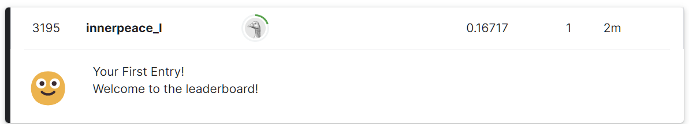

## Kaggle： House Prices - Advanced Regression Techniques

### competition description

predict sales prices and practice feature engineering，RFs，and gradient boosting

- 特征提取：我们将输入的数据称为特征（features），目标输出为标签（labels），对于房价预测问题，所有和house price相关的属性，比如房屋面积等等，都是一个feature，对于每个房子的所有features构成了一个输入向量x，对于每一个这样的输入向量x，我们期望预测一个合理的价格（label）

  这次比赛的数据集每个输入向量的features个数为80，即一个80维的**张量（tensor）**，label只有房价自己，因此期望的输出向量y是1维的

  对于房价的某些特征来说，比如原房子的主人名称等等，对预测模型的影响很小甚至没有影响，我们需要将这部分特征去除。

  对于特征是字符串类型，我们可能需要将其转变为离散值，比如对于一个特征 **MSZoing** 它的值为 `RL` 或者 `Rm`，我们的预测模型对这种string的处理能力有限，我们需要通过 独热编码等方式，将其转变为离散化的数值，便于模型处理

  >对于这个例子， `MSZoing` 可以通过创建两个新的特征 `MSZoing_RL` 和`MSZoing_RM`，对于一个输入向量x，如果`x.MSZoing = RL`，则处理后的新向量中，`x.MSZoing_RL =1,x.MSZoing_RM = 0`，反之亦然。
  >
  >通过类似的方式，可以用离散表示完全代替原先的MSZoing这个特征

- RFs：随机森林（Random Forests）：一种机器学习算法，我并没有采用这种算法，只是简单的采用linear_model，甚至没有选择mlp（多层感知机），出于练习d2l的缘故，如果想要在competition上卷更多的score，建议选择更好的network

- gradient boosting：梯度提升，迭代训练的过程必然有梯度更新，这里选用的optimizer优化器是Adam

Ask a home buyer to describe their dream house, and they probably won't begin with the height of the basement ceiling or the proximity to an east-west railroad. But this playground competition's dataset proves that much more influences price negotiations than the number of bedrooms or a white-picket fence.

With 79 explanatory variables describing (almost) every aspect of residential homes in Ames, Iowa, this competition challenges you to predict the final price of each home.

- 大致描述了一下竞赛的background information

### evaluation of the competition

#### goal

It is your job to predict the sales price for each house. For each Id in the test set, you must predict the value of the SalePrice variable. 

- 对每个房子预测一个房价

#### metric

这次比赛的采用的评价标准为 **RMSE(Root-Mean-Squared-Error)**

>房价关心的是相对数量，而不是绝对数量，也就是说，即使预测房价 $\hat{y}$ 与实际房价$y$的差值 为 10w \$，对于不同的 $y$，其准确度也是不一样的
>
>- 比如如果实际房价 $y = 4000 w \$$， 误差 $\epsilon = |\hat{y} - y| = 10 w \$$听上去还能接受
>- 如果实际房价 $y = 20w \$$，误差 $\epsilon = \hat{y} - y = 10w \$$ ，那你可以去应聘王多鱼的私人经济顾问了
>
>因此我们关注的是相对误差 $\frac{y - \hat{y}}{y}$
>
>这次比赛官方用来评价提交质量的误差指标是通过价格预测的对数来衡量差异（和相对误差相像）
>
>采用均方根误差，将 $|\log y - \log \hat{y}| \leq \delta$ 转化为 $e^{-\delta} \leq \frac{\hat{y}}{y} \leq e^{\delta}$
>
>
>
>上式也是这次评估模型准确率的标准，值越小越好

#### submission file format

提交的文件需要包含一个头部然后是以下的格式

```
Id,SalePrice
1461,169000.1
1462,187724.1233
1463,175221
etc.
```

我会将训练的结果通过一个函数自动输出成类似的格式（`'submission.csv'`），方便提交kaggle

### problem analysis

okay，一次训练基本可以分为以下几个步骤

- 数据集下载/创建+读取
- 数据预处理（feature engineering）
- 定义network（即训练的模型）
- 定义loss function，这里简单采用L2平方损失函数了，既没有用到交叉信息熵也没有用一些更complex的loss function，表现了我摆烂的欲望（好耶！）
- model训练
- 验证：将训练的结果放到验证集上测试，通过测试结果调整参数并选择合适的模型，这里的验证方式选择了 k-fold交叉验证
- 调参，模型选择：通过验证的结果，适当调整参数，找到一个预测准确率（也就是rsme尽可能小）的一组参数作为最终选择的模型参数
- 输出结果

### make dataset

#### 数据集下载

`DATA_HUB`是一个字典（dictionary），存储了所有数据集的名称和对应网址的键值对

>字典是一个常见的python数据结构
>
>- 每一个元素由一个 `键（key）`和一个对应的 `值（value）`，组成，键值之间通过冒号 `:`分割
>- 键必须是唯一的，而值可以是任意类型的对象
>- 字典中的元素是无序的，不可以通过索引访问
>- 字典是可变的，可以添加、修改和删除元素
>
>一个chatgpt的例子
>
>```python
># 创建一个字典
>person = {
>    'name': 'John',
>    'age': 30,
>    'city': 'New York'
>}
>
># 访问字典中的值
>print(person['name'])  # 输出: John
>print(person['age'])   # 输出: 30
>
># 修改字典中的值
>person['age'] = 35
>print(person['age'])   # 输出: 35
>
># 添加新的键-值对
>person['occupation'] = 'Engineer'
>print(person)          # 输出: {'name': 'John', 'age': 35, 'city': 'New York', 'occupation': 'Engineer'}
>
># 删除键-值对
>del person['city']
>print(person)          # 输出: {'name': 'John', 'age': 35, 'occupation': 'Engineer'}
>
># 检查键是否存在
>if 'occupation' in person:
>    print("Occupation:", person['occupation'])  # 输出: Occupation: Engineer
>
># 获取字典的键和值
>keys = person.keys()
>values = person.values()
>print("Keys:", keys)      # 输出: Keys: dict_keys(['name', 'age', 'occupation'])
>print("Values:", values)  # 输出: Values: dict_values(['John', 35, 'Engineer'])
>
># 遍历字典的键-值对
>for key, value in person.items():
>    print(key + ":", value)
># 输出:
># name: John
># age: 35
># occupation: Engineer
>```
>
>字典的实现方式是基于 hash table（哈希表）实现的，这也是对于无序查找表最便捷的实现方式了，例如c++的`unorder_map`也是基于hash table实现，而我们伟大的C语言为了锻炼使用者的编程能力，把这个实现的任务交给了使用者本身

`DATA_URL`是数据来源的网址，由于我是通过d2l入手这个比赛，所以自然是从d2l的网站上下载的数据集

定义三个下载数据集的函数接口

- `download`：将给定数据集下载到本地某个路径下保存，返回本地文件名

  参数为 `name`和 `cache_dir`

  - name：数据集的名称
  - cache_dir：下载后在本地缓存的目录位置，默认为 `../data`,即当前python文件的上一级目录的data文件夹下

- `download_extract`：下载并解压zip/tar文件，只支持解压zip和tar类型的压缩包，返回本地文件名

  zip在windows上很常见，而tar/gz是linux系统下压缩包的一种格式

  - name：数据集名称
  - folder：默认为None

- `download_all`：下载DATA_HUB中的所有文件到本地

下载数据集，分别将训练集和测试集命名为

- `kaggle_house_train`
- `kaggle_house_test`

```python
DATA_HUB['kaggle_house_train'] = (
    DATA_URL + 'kaggle_house_pred_train.csv', '585e9cc93e70b39160e7921475f9bcd7d31219ce'
)
DATA_HUB['kaggle_house_test'] = (
    DATA_URL + 'kaggle_house_pred_test.csv', 'fa19780a7b011d9b009e8bff8e99922a8ee2eb90'
)
```

#### 数据集读取

```python
train_data = pd.read_csv(download('kaggle_house_train'))
test_data = pd.read_csv(download('kaggle_house_test'))
```

将读取到的数据通过 `pandas`库的 `read_csv`函数，将csv文件存储到 `train_data`和 `test_data`变量

`train_data`和 `test_data`是两个DataFrame对象，可以被认为是一个二维数组

- 每一列代表一个特征或者属性
- 每一行代表一个样本或观测值

我们可以看一下训练集和测试集的样本是什么样子的

```python
# 训练集共1460个样本，每个样本80个features和1个labels
# 测试集共1459个样本，每个样本80个features
print(train_data.shape)
print(test_data.shape)
```


- 训练集一共1460个样本，每个样本80个features和1个labels
- 测试集一共1459个样本，每个样本80个features

我们也可以大概看一下样本长什么亚子，比如打印训练集的前4行的某几个特征和label

```python
# 每个样本的第一个特征是id，对模型训练没有作用，可以删除
print(train_data.iloc[0:4, [0, 1, 2, 3, -3, -2, -1]])
```


可以发现

- 有的特征值是字符串，这种可能需要通过独热编码预处理成离散型的数值变量
- 诸如Id这样的特征对训练没有任何帮助，反而可能会有一些负提升，需要在预处理阶段直接扔掉
- 如果某个feature的值是缺省值（NaN），需要将其替换成数值
- 我们的这个简单线性模型实际上只有对 数值处理比较好，即便是如今热门的nlp领域（natural language processing），对于自然语言的处理，我们需要通过word embedding等等方式转换成机器容易识别的输入再通过模型处理

### data pre-processing

#### 数据集合并和裁剪

我们不仅需要对训练集数据进行处理，也需要对测试集数据做同样的处理，所以可以先将数据集和测试集合并

```python
all_features = pd.concat((train_data.iloc[:, 1:-1], test_data.iloc[:, 1:]))
```

- iloc是 pandas的一个索引方法，这里从第一列开始索引而不是第0列是为了将Id这一行去掉
- 合并后的数据集存放于 `all_features`

#### 数值列的处理

将所有数值列的特征做标准化

> 所谓标准化即，每个特征的所有取值构成了一个概率分布，而每个概率分布都有一个均值$\mu$和一个方差 $\sigma$，标准化即对每个分布中的数据做一个映射（本质上是一个平移+放缩），由此把所有的特征放在同一个尺度上来训练，会减少误差
>
> $x \leftarrow \frac{x - \mu}{\sigma}$
>
> 做标准化后，新的特征构成的分布的均值和方差为 $\mu = 0, \sigma = 1$
>
> 标准化数据的原因
>
> - 方便优化
> - 我们并不知道哪些特征对house_price这个结果影响更大（即相关性更大），所以初始情况下我们将所有的特征放在同等地位（消除量纲差异），不会由于其原先数值绝对值更大导致在相同的权重下对训练结果的影响更大

```python
numeric_features = all_features.dtypes[all_features.dtypes != 'object'].index
```

首先取出所有数值列的下表索引，记为 `numeric_features`

而后对所有这样的列做一个标准化

```python
all_features[numeric_features] = all_features[numeric_features].apply(lambda x: (x - x.mean()) / (x.std()))
```

在标准化数据之后，所有的均值消失，对其缺省值填0处理

```python
all_features[numeric_features] = all_features[numeric_features].fillna(0)
```

#### 离散值的处理

处理完所有的数值列，接下来对所有的字符类型的列处理，这里处理的方式是调用 pandas的一个库函数 `get_dummies`，这个库函数会自动帮我们完成处理

>

```python
all_features = pd.get_dummies(all_features, dummy_na=True,dtype=int)
```

- 注意，需要加上 `dtype=int`这一句，因为某些IDE（代码开发环境，比如pycharm）在都热编码时会将数据处理成boolean（布尔）类型，而后续一些算法需要处理数值类型的变量而无法处理布尔类型，因此需要手动指定数值类型，来规避这个问题

#### 类型转换

我们的训练是跑在 `torch`深度学习框架中，而目前得到的数据集是 pandas格式中提取到numpy库下的 narray，我们需要转化为 tensor（张量，其实就是一个多维数组），便于后续训练

```python
# n_train是训练集个数
n_train = train_data.shape[0]
# 将预处理后的数据集切分成训练集和测试集，并转化为torch框架中的tensor，而非numpy中的narray，设置类型为float32(这是现有gpu上训练效果比较好的类型)
train_features = torch.tensor(all_features[:n_train].values, dtype=torch.float32)
test_features = torch.tensor(all_features[n_train:].values, dtype=torch.float32)
# 训练集的标签变量
train_labels = torch.tensor(train_data.SalePrice.values.reshape(-1,1), dtype=torch.float32)
```

### training

#### model network definition

##### first version

我最初采用的网络是很简单的单层线性网络，无他，唯懒耳，后续如果感觉训练结果太烂了再说

定义网络用到了 `nn`（neural network）库下的`Sequenital`类，这个类是一个顺序容器，允许将多个神经网络层按顺序组合在一起

```python
net = nn.Sequential(nn.Linear(in_features, 1))
```

- 这表示定义一个单层的linear（线性神经网络层），接收330个输入（in_features的值），1个输出
- 这个网络层是全连接的，由于只有输出需要进行运算，所以是单层的

>至于什么是linear network，建议阅读
>
>[d2l]:https://zh-v2.d2l.ai/chapter_linear-networks/index.html

定义了一个接口 `get_net`用于获取模型网络，也方便训练

#### loss function

模型训练的更新方式是，通过计算loss function的梯度（即对各个输入特征分量的偏导），进行梯度更新，争取达到使得loss function最小，因此我们需要先定义 loss function是什么

>loss function（即损失函数）：量度预期的参数值和当前的参数值之间的误差，训练本质上就是在自动找到一组好的参数，使得loss funciton最小

这次我使用的loss function是比较简单的平方损失函数L2-loss

```python
loss = nn.MSELoss()
```

##### 评价函数

官方采用的是`RMSE`作为衡量模型好坏的标准，因此我们在看测试集上测试训练结果的时候，应该需要用 RMSE来测试，这里给出了一个 RMSE的简单实现

```python
def log_rmse(net, features, labels):
    """为了在取对数时进一步稳定该值，将小于1的值设置为1"""
    clipped_preds = torch.clamp(net(features), 1, float('inf'))
    rmse = torch.sqrt(loss(torch.log(clipped_preds), torch.log(labels)))
    return rmse.item()
```

- 对训练后的结果做截断处理，小于1的值设置为1，保证结果在1到 $\infty$
- rmse即测试的误差
- 将其转化为一个python的标量值返回，便于在图像上输出

#### training

定义了模型训练的接口函数 `train`

train有如下参数

- net：神经网络，也即模型对象

- train_features：训练集的输入特征向量的集合

- train_labels：训练集的输出标签向量的集合（即期望结果）

- test_features：测试集的输入特征向量集合

- test_labels：测试集的输出标签向量结合

- num_epochs：迭代训练的次数

- learning_rate：一个hyperparameter（超参数），学习率，量度梯度下降的步长

- weight_decay：一个hyperparameter（超参数），权重衰退

- batch_size：每次训练是将一个大的数据集分成多个小的批次进行训练，这个表示batch（批次）的大小

  >例如一个训练集有1000个数据，batch_size为20，表示把训练集划分为50个批次，每个批次的大小是20，所有批次训练完后再对参数做更新
  >
  >而另一个值num_epochs表示经过多少轮训练，比如num_epochs = 10表示需要迭代训练10轮，每一轮训练都需要将这1000个数据划分为50个batch分别训练
  >
  >**题外话：**
  >
  >batch的基本意义是，如果数据集很大，一次性对全部数据进行训练会很慢，因此切分成了一个个mini-batch
  >
  >batch的一个更大的意义是，对于如今大模型（LLM）训练数据的海量数据，即便切分成了一个个micro-batch也很很大，每个micro-batch可能能占用一块GPU的全部训练资源，这时候就需要用多块GPU同步训练，同时也意味着每一个batch的训练是可以同时进行的，这极大提高了训练效率，这也是 **分布式训练的范畴**
  >
  >但分布式训练也有很严重的通讯问题，既然我们的训练任务被切分成了多个小的子任务，就像分割成batch一样，我们需要在每个batch训练完之后将每个batch的训练结果组合起来，这就是分布式训练中的**梯度同步（gradient synchronization）**
  >
  >梯度同步要求每个独立的gpu将其计算结果传递给其他的gpu，这就意味着，我们需要将每次的训练结果（是一个很大的量，比如好几个G甚至更大）通过网络传递给其他训练节点。这会占用大量的网络带宽，且这部分传递数据的时间（**通讯时间**）占整体模型训练时间的很大一部分，远超模型训练时间本身。
  >
  >如何降低这部分通讯时间也是 ML Sys方向目前致力于做的事
  >
  >一个常用的手段是 **梯度压缩（gradient compression）**，梯度压缩将每次训练结果通过稀疏矩阵和一系列压缩算法，将本来占用数十个G的训练结果降低到 1-2个G，从而降低了网络通讯的带宽需求和通讯时间
  >
  >这听上去相当nice，但实际远没有这么简单，如何将一个gradient compression的算法嵌入现在的gradient synchronization系统，是一个复杂的工程问题
  >
  >以上是我自己想要做的方向，因此扯的多了一点（）

`train`函数

```python
def train(net, train_features, train_labels, test_features, test_labels, num_epochs, learning_rate, weight_decay, batch_size):
    train_ls, test_ls = [], []
    # 将训练集读取
    train_iter = d2l.load_array((train_features, train_labels), batch_size)
    # 优化,采用Adam优化算法
    optimizer = torch.optim.Adam(net.parameters(), lr=learning_rate,weight_decay=weight_decay)
    # 迭代训练
    for epoch in range(num_epochs):
        for X, y in train_iter:
            optimizer.zero_grad()
            l = loss(net(X), y)
            l.backward()
            optimizer.step()
            train_ls.append(log_rmse(net, train_features, train_labels))
            if test_labels is not None:
                test_ls.append(log_rmse(net, test_features, test_labels))
                return train_ls, test_ls
```

- train_ls，test_ls是训练集和测试集的两个loss function的列表，我们想要通过图像把训练曲线绘制出来，因此需要在每个epoch下把loss function的值计算出来，每一轮的值都添加到这个列表中

- `load_array`是d2l库中的一个函数，这个函数实现如下

  ```python
  def load_array(data_arrays, batch_size, is_train=True):
      """构造一个Pytorch数据迭代器"""
      dataset = data.TensorDataset(*data_arrays)
      return data.DataLoader(dataset, batch_size, shuffle=is_train)
  ```

  这个函数返回一个迭代器，即把一个数据集分成多个batch之后，相当于需要一个循环来读取，这个循环的迭代器就通过`load_array`得到

- 得到迭代器后，确定优化算法为 Adam算法

  >Adam优化器算法的主要好处在于：对初始学习率并不敏感，因为它会动态调整学习率
  >
  >Adam算法
  >
  >Adam算法根据梯度的一阶矩估计（均值）和二阶矩估计（方差）来自适应地调整学习率。它通过计算梯度的指数移动平均值和平方梯度的指数移动平均值来更新参数。以下是Adam算法的更新步骤：
  >
  >1. 初始化参数：初始化模型的参数和累积变量（一阶矩和二阶矩估计）。
  >2. 计算梯度：对于每个训练批次，计算模型参数的梯度。
  >3. 更新一阶矩估计：使用指数移动平均计算梯度的一阶矩估计（均值），通常称为动量。它衡量了梯度的平均方向和速度。
  >4. 更新二阶矩估计：使用指数移动平均计算梯度的二阶矩估计（方差），用于衡量梯度的变化范围。
  >5. 偏差修正：由于一阶矩估计和二阶矩估计在初始阶段会有偏差，需要进行偏差修正，以提高更新的准确性。
  >6. 参数更新：使用修正后的一阶矩估计和二阶矩估计来更新模型的参数。更新公式为：参数 = 参数 - 学习率 × 修正后的一阶矩估计 / (sqrt(修正后的二阶矩估计) + epsilon)，其中 epsilon 是一个很小的常数，用于避免除以零的情况。
  >7. 重复步骤2至步骤6，直到达到停止条件（例如达到最大迭代次数或损失函数收敛）。
  >
  >同时Adam算法也结合了momentum的优势（动量，可以将参数更新，也就是梯度下降的过程理解为一次物理运动，下降之后还会再往前冲一段（某种意义上比较像惯性））

- 迭代训练 `num_epochs`个周期，每次迭代，从已经分好batch的迭代器中取出一个batch的数据

  - 现将之前的梯度清空，用于下一次迭代计算梯度
  - 将输入数据x通过神经网络模型net进行前向传播（相当于计算预测结果y），并把预测结果和真实结果y进行比较，计算loss
  - backward是对loss function求梯度，求梯度的过程又称为反向传播，反向传播可以通过剪枝等方式优化计算开销（这个说起来有一点点复杂），调用这个函数可以得到每个参数对应的梯度值
  - `step()`方法根据计算得到的梯度更新模型参数

>常用的优化器还有 SGD（随机梯度下降）等等，SGD甚至可能是最常用，也是最普遍的优化器，这里采用Adam的原因主要是
>
>- 尊重d2l textbook
>- 不想调learning rate

将每一轮训练集和测试集的rmse计算出来的误差存入列表，并返回，便于绘图

### validate

首先明确第一个问题

数据集有三类

- 训练集 train dataset
- 验证集 validate dataset
- 测试集 test dataset

我们在训练集上训练数据，然后根据验证集判断当前训练的好坏，并动态的调整参数，而测试集只能使用一次，用来判断我们模型的好坏

>出于尊重原著，我以考试为例，训练集是你平时的练习题，验证集是模拟考试题，我们期望通过平时的练习题锻炼我们的考试能力，并通过模拟题确定我们练习的结果，而高考就是我们的测试集，用来检测高中三年的学习情况的
>
>- 个人吐槽：恰当又不恰当的类比，这三个集合确实是这个道理，但是高中你练习学习是大体上有方向感的，直到自己的问题是什么。深度学习调参炼丹更多的感觉是没什么方向感，或者只有一个很缥缈的感觉，更像古代炼金术师也不知道各个药材的药理，反正一股脑扔进去炼
>- 吐槽2：GPA $=$ 考试能力 $\ne$ 某项能力的真实情况，虽然没有GPA确实在USTC寸步难行

明确了这一点，我们的 train_data实际上会被分为训练集和验证集两部分，用来进行模型训练，而test_data是只有一次测试机会的“高考”

分割训练集和验证集的方式在这里我选择的是 k-fold交叉验证

>k-fold交叉验证
>
>原始训练数据被分成K个不重叠的子集。 然后执行K次模型训练和验证，每次在K−1个子集上进行训练， 并在剩余的一个子集（在该轮中没有用于训练的子集）上进行验证。 最后，通过对K次实验的结果取平均来估计训练和验证误差。

得到分割的集合被封装成了函数 `get_k_fold_data`

参数列表：

- k：表示k-fold这个k的值是多少，其实这也是一个超参数
- i：表示第i个集合被用来当作验证集
- X：表示输入的原始训练集的所有特征列
- y：表示输入的原始训练集的标签列

```python
def get_k_fold_data(k, i, X, y):
    assert k > 1    # k <= 1 纯在搞笑，跑出异常退出
    # fold_size 表示每一个切分后集合的大小，切分后每个小集合被称为一个fold
    fold_size = X.shape[0] // k # //表示整除，和C语言的/效果一样，由于python没有严格区分float和int，所以/默认会生成float，这里严格要求int，所以采用//
    X_train, y_train = None, None
    # 简单的切分逻辑，如果j = i,放入测试集，否则判断当前X_train是否为空，为空说明是一个，直接赋值，否则在其后面拼接
    for j in range(k):
        idx = slice(j * fold_size, (j + 1) * fold_size)
        X_part, y_part = X[idx, :], y[idx]
        if j == i:
            X_valid, y_valid = X_part, y_part
        elif X_train is None:
            X_train, y_train = X_part, y_part
        else:
            X_train = torch.cat([X_train, X_part], 0)
            y_train = torch.cat([y_train, y_part], 0)
    return X_train, y_train, X_valid, y_valid
```

然后封装了函数 `k_fold`作为使用k-fold算法的训练函数接口

参数列表

- k：k的值，是一个超参数
- X_train：原始训练集的输入特征列
- y_train：原始训练集的输入标签
- num_epochs：训练迭代轮数，一个超参数
- learning_rate：学习率，也是一个超参数
- weight_decay：权重衰退的值，也是一个超参数
- batch_size：批量样本大小，也是一个超参数

```python
def k_fold(k, X_train, y_train, num_epochs, learning_rate, weight_decay,
           batch_size):
    train_l_sum, valid_l_sum = 0, 0
    for i in range(k):
        data = get_k_fold_data(k, i, X_train, y_train)
        net = get_net()
        train_ls, valid_ls = train(net, *data, num_epochs, learning_rate,
                                   weight_decay, batch_size)
        train_l_sum += train_ls[-1]
        valid_l_sum += valid_ls[-1]
        if i == 0:
            d2l.plot(list(range(1, num_epochs + 1)), [train_ls, valid_ls],
                     xlabel='epoch', ylabel='rmse', xlim=[1, num_epochs],
                     legend=['train', 'valid'], yscale='log')
            print(f'折{i + 1}，训练log rmse{float(train_ls[-1]):f}, '
                  f'验证log rmse{float(valid_ls[-1]):f}')
            return train_l_sum / k, valid_l_sum / k
```

### 调参

最万恶的一节，也是我觉得AI最无聊的一点，让人调参不如让张大伟去开全美巡回演唱会，每场都唱一遍《阳光彩虹小白马》

言归正传，调参其实是在调人为设定的训练过程中的一些超参数（hyperparameter），而模型本身，比如最简单的线性回归（regression）模型 $y = wx + b$的参数 $w,b$，并不是用户要调的（最多给个初值），这些参数是需要模型在训练过程中不断学习，自己去寻找一组最优的参数$w^*,b^*$，使得我们定义的误差函数loss function在这组参数上的值最小，此所谓 《机器学习》

而超参数，是人为设定的一些参数，这些参数才是我们需要去根据训练结果手动调整的

这次任务的超参数如下

- k：k-fold交叉验证中的k值

- num_epochs：迭代训练的次数，讲道理是越多越好的，但比如10->100可能会有明显的提升，但100->1000提升就很有限了，且训练时间很长，最终回收敛与一个值，所以也没必要调的特别大

- lr：学习率（learning rate），是梯度更新的步长。我们在训练中更新参数的时候实际上是用当前的参数值$w - lr *w对loss函数的梯度(\frac{\partial L}{\partial w})$，lr相当于梯度下降的步长，大一点说明降的快，小一点说明降的慢

- weight_decay：权重衰退的值，至于什么是权重衰退，建议看d2l 4.5

  我简单说明一下，权重衰退是在loss function中添加一个正则化项，来约束模型

  

  原来的loss function是前半段，加了后半段后，我们现在要最小化目前这个结果，那么后者也不能太大，w向量范数（也就是长度）没有太大相当于模型的复杂度不会特别高，weight_decay的值就是这个 $\lambda$

- batch_size：批量样本的大小

本次比赛实际上可以调整的部分有几方面

- 这些超参数
- 模型net
- 采用别的优化器和loss function
- 引入别的调参或者优化方式，比如dropout等等

>目前的这组参数是testbook中参数，应该是李沐老师通过自动训练得到的一组相对优的参数，所以我没有做太多调整，后续也可以更改模型后再调整

### 输出结果

定义了一个输出的接口 `train_and_pred`生成一个结果文件 `submission.csv`

```python
def train_and_pred(train_features, test_features, train_labels, test_data, num_epochs, lr, weight_decay, batch_size):
    net = get_net()
    # 我们不关心验证集上的误差
    train_ls, _ = train(net, train_features, train_labels, None,None, num_epochs,lr, weight_decay,batch_size)
    # d2l.plt(npy.arange(1, num_epochs + 1), [train_ls], xlabel='epoch', ylabel='log rmse', xlim=[1, num_epochs], yscale='log')
    print(f'训练log rmse：{float(train_ls[-1]):f}')
    # 将网络应用于测试集
    preds = net(test_features).detach().numpy()
    # 将其重新格式化后导出到Kaggle
    test_data['SalePrice'] = pd.Series(preds.reshape(1, -1)[0])
    submission = pd.concat([test_data['Id'], test_data['SalePrice']], axis=1)
    submission.to_csv('submission.csv', index=False)
```

我将目前的结果提交到kaggle上面的分数为


呃呃，这个分数是越低越好，但是0.16还是相对太菜了，后续调调参再看看

ranking竟然是 3195吗，那属实是有点菜了，看起来要再调一下了



好喵，第二次提交提升了0.04分和 2000多的rank


暂时不调了，改了一下网络，两层的mlp会有一定的提升，再多层的mlp提升并不明显

目前的参数情况和网络情况是

```python
net = nn.Sequential(nn.Flatten(), nn.Linear(in_features, 1024), nn.ReLU(), nn.Linear(1024, 1))
k, num_epochs, lr, weight_decay, batch_size = 5, 100, 0.05, 35, 256
```

kaggle结果是


虽然依旧乐色，但是最简单的mlp和linear model感觉真调不下去了，如果有空研究一下新的模型再试试

另，目前加入了gpu进行训练，cpu上训练调参实在是太慢了