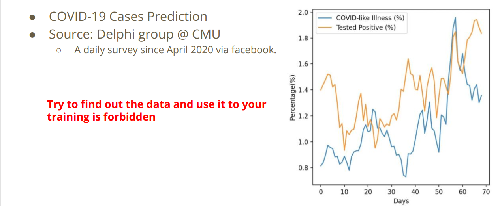

## Machine Learning HW1 COVID - 19 Cases Prediction

### Objectives

- Solve a regression problem with deep neural networks (DNN)
- Understand basic DNN training tips e.g. hyper-parameter tuning, feature selection, regularization
- Get familiar with PyTorch

### Task Desription

预测 COVID-19 每天的病例预测，用前四天的病例数量训练预测第五天的病例

训练/测试数据大小：3009/997




### Training & Testing Neural Networks - in Pytorch


- step1：将数据集读入
- step2：定义神经网络，即function with unknown parameters
- step3：计算Loss Function
- step4：Optimization algorithm
- step5：循环训练检验更新，最终测试

#### 库引用

```python
# Numerical Operations
import math
import numpy as np

# Reading/Writing Data
import pandas as pd
import os
import csv

# For Progress Bar
from tqdm import tqdm

# Pytorch
import torch
import torch.nn as nn
from torch.utils.data import Dataset, DataLoader, random_split

# For plotting learning curve
from torch.utils.tensorboard import SummaryWriter
```


#### 定义Dataset 和 Dataloader

```python
class COVID19Dataset(Dataset):
    '''
    x: Features.
    y: Targets, if none, do prediction.
    '''
    def __init__(self, x, y=None):
        if y is None:
            self.y = y
        else:
            self.y = torch.FloatTensor(y)
        self.x = torch.FloatTensor(x)

    def __getitem__(self, idx):
        if self.y is None:
            return self.x[idx]
        else:
            return self.x[idx], self.y[idx]

    def __len__(self):
        return len(self.x)
```


#### step1：Dataloader

```python
# Set seed for reproducibility
same_seed(config['seed'])


# train_data size: 2699 x 118 (id + 37 states + 16 features x 5 days)
# test_data size: 1078 x 117 (without last day's positive rate)
train_data, test_data = pd.read_csv('./covid.train.csv').values, pd.read_csv('./covid.test.csv').values
train_data, valid_data = train_valid_split(train_data, config['valid_ratio'], config['seed'])

# Print out the data size.
print(f"""train_data size: {train_data.shape}
valid_data size: {valid_data.shape}
test_data size: {test_data.shape}""")

# Select features
x_train, x_valid, x_test, y_train, y_valid = select_feat(train_data, valid_data, test_data, config['select_all'])

# Print out the number of features.
print(f'number of features: {x_train.shape[1]}')

train_dataset, valid_dataset, test_dataset = COVID19Dataset(x_train, y_train), \
COVID19Dataset(x_valid, y_valid), \
COVID19Dataset(x_test)

# Pytorch data loader loads pytorch dataset into batches.
train_loader = DataLoader(train_dataset, batch_size=config['batch_size'], shuffle=True, pin_memory=True)
valid_loader = DataLoader(valid_dataset, batch_size=config['batch_size'], shuffle=True, pin_memory=True)
test_loader = DataLoader(test_dataset, batch_size=config['batch_size'], shuffle=False, pin_memory=True)
```

#### step2：定义神经网络

```python
class My_Model(nn.Module):
    def __init__(self, input_dim):
        super(My_Model, self).__init__()
        # TODO: modify model's structure, be aware of dimensions.
        self.layers = nn.Sequential(
            nn.Linear(input_dim, 16),
            nn.ReLU(),
            nn.Linear(16, 8),
            nn.ReLU(),
            nn.Linear(8, 1)
        )

    def forward(self, x):
        x = self.layers(x)
        x = x.squeeze(1) # (B, 1) -> (B)
        return x
```

#### step3：特征选择

```python
def select_feat(train_data, valid_data, test_data, select_all=True):
    '''Selects useful features to perform regression'''
    y_train, y_valid = train_data[:,-1], valid_data[:,-1]
    raw_x_train, raw_x_valid, raw_x_test = train_data[:,:-1], valid_data[:,:-1], test_data

    if select_all:
        feat_idx = list(range(raw_x_train.shape[1]))
    else:
        feat_idx = [0,1,2,3,4] # TODO: Select suitable feature columns.

        return raw_x_train[:,feat_idx], raw_x_valid[:,feat_idx], raw_x_test[:,feat_idx], y_train, y_valid
```

#### step4：training loop

```python
def trainer(train_loader, valid_loader, model, config, device):

    criterion = nn.MSELoss(reduction='mean') # Define your loss function, do not modify this.

    # Define your optimization algorithm.
    # TODO: Please check https://pytorch.org/docs/stable/optim.html to get more available algorithms.
    # TODO: L2 regularization (optimizer(weight decay...) or implement by your self).
    optimizer = torch.optim.SGD(model.parameters(), lr=config['learning_rate'], momentum=0.9)

    writer = SummaryWriter() # Writer of tensoboard.

    if not os.path.isdir('./models'):
        os.mkdir('./models') # Create directory of saving models.

        n_epochs, best_loss, step, early_stop_count = config['n_epochs'], math.inf, 0, 0

        for epoch in range(n_epochs):
            model.train() # Set your model to train mode.
            loss_record = []

            # tqdm is a package to visualize your training progress.
            train_pbar = tqdm(train_loader, position=0, leave=True)

            for x, y in train_pbar:
                optimizer.zero_grad()               # Set gradient to zero.
                x, y = x.to(device), y.to(device)   # Move your data to device.
                pred = model(x)
                loss = criterion(pred, y)
                loss.backward()                     # Compute gradient(backpropagation).
                optimizer.step()                    # Update parameters.
                step += 1
                loss_record.append(loss.detach().item())

                # Display current epoch number and loss on tqdm progress bar.
                train_pbar.set_description(f'Epoch [{epoch+1}/{n_epochs}]')
                train_pbar.set_postfix({'loss': loss.detach().item()})

                mean_train_loss = sum(loss_record)/len(loss_record)
                writer.add_scalar('Loss/train', mean_train_loss, step)

                model.eval() # Set your model to evaluation mode.
                loss_record = []
                for x, y in valid_loader:
                    x, y = x.to(device), y.to(device)
                    with torch.no_grad():
                        pred = model(x)
                        loss = criterion(pred, y)

                        loss_record.append(loss.item())

                        mean_valid_loss = sum(loss_record)/len(loss_record)
                        print(f'Epoch [{epoch+1}/{n_epochs}]: Train loss: {mean_train_loss:.4f}, Valid loss: {mean_valid_loss:.4f}')
                        writer.add_scalar('Loss/valid', mean_valid_loss, step)

                        if mean_valid_loss < best_loss:
                            best_loss = mean_valid_loss
                            torch.save(model.state_dict(), config['save_path']) # Save your best model
                            print('Saving model with loss {:.3f}...'.format(best_loss))
                            early_stop_count = 0
                        else:
                            early_stop_count += 1

                            if early_stop_count >= config['early_stop']:
                                print('\nModel is not improving, so we halt the training session.')
                                return
```

### 4 phases

#### simple

>hints:
>
>sample code ，即框架代码

模型例化

```python
model = My_Model(input_dim=x_train.shape[1]).to(device) # put your model and data on the same computation device.
trainer(train_loader, valid_loader, model, config, device)
```

DataLoader

在

训练集：（2160,118）

验证集：（539,118）

#### medium

>hints:
>
>Feature selection

#### strong

>hints:
>
>Different model architectures and optimizers

#### boss

>hints：
>
>L2 regularization and try more parameters
