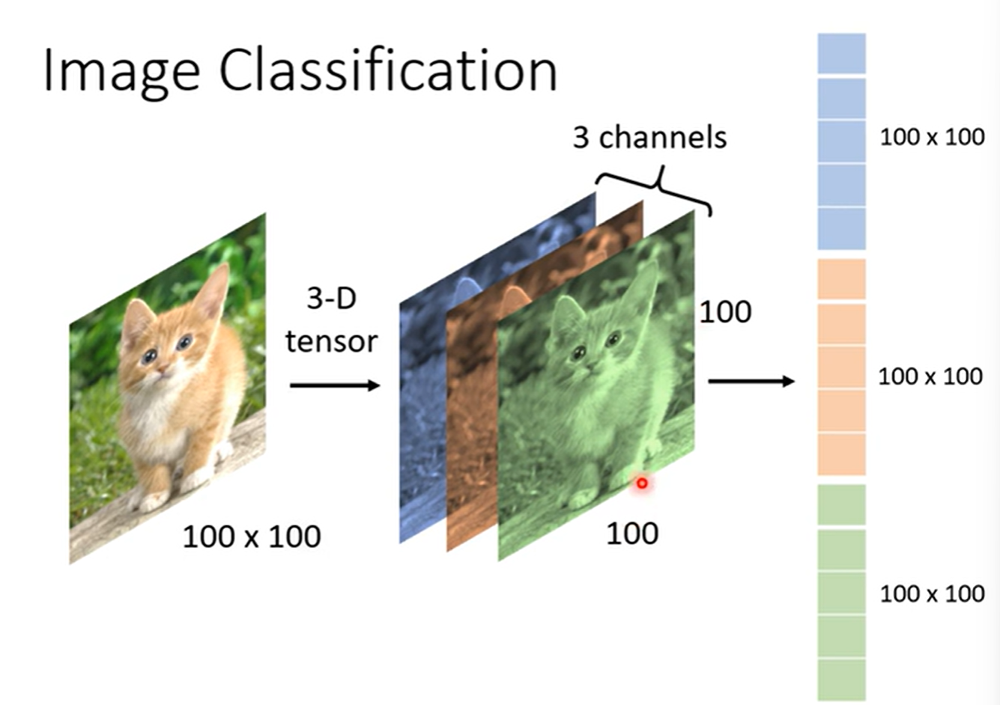

## Convolutional Neural Network(CNN)

Network Architecture designed for Image

### Image Classification

#### 输出

label 是一个根据class数量决定的 one-hot vector，比如对10000种类别的数据集，就是1个10000维的向量

#### loss

将输入经过模型得到的输出$y'$和预期结果$\hat{y}$计算cross entropy充当loss函数

#### 输入

一张图片是一个3维的tensor（有RGB三个颜色通道）

把一个3维的tensor拉直得到一个向量作为network的输入

将这个向量当作network的输入

#### network

如果采用fully-connected network，对于$100 \times 100 \times 3$的输入向量，假设有1000个神经元，则需要计算 $3 \times 10^7$次，是一个相当大的计算量，而且随着输入规模的增加，容易出现overfitting的情况，因此fully-connected并不是一个很好的选择

