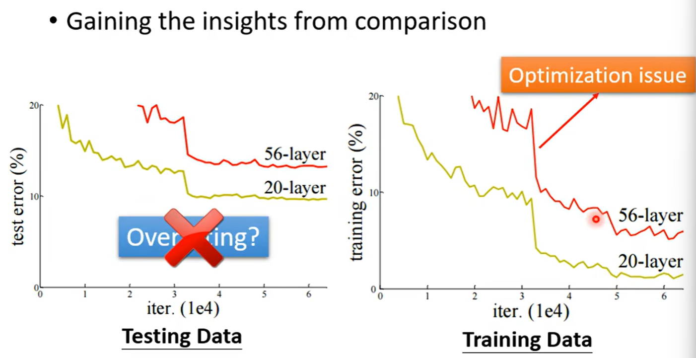
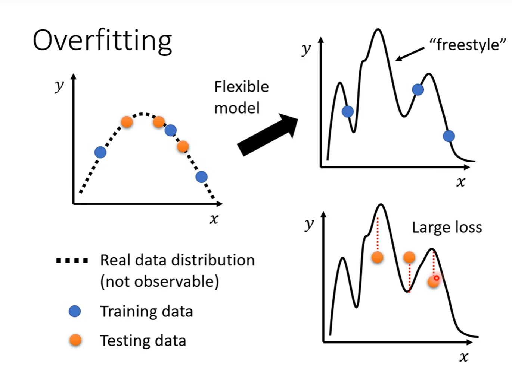
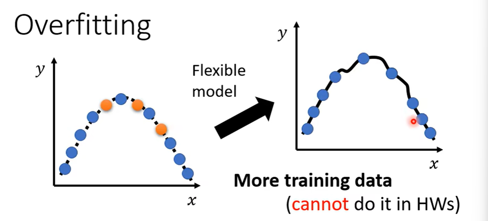

## 机器学习任务攻略

### Framework of ML

#### Training data

#### Training

#### Testing data

### General Guide to improve the result

#### Overview

通过观察loss function的结果

- 训练集上的loss

  - 大：

    - model bias

      make your model complex

    - optimization

  - 小：

    观察测试集上的loss

    - 小：good result

    - 大：

      - overfitting：

        more training data

        data augmentation

        make your model simpler

      - mismatch

        

#### Model Bias

训练集上的loss 结果太大可能是由于模型过于简单了，可以选择更复杂的模型

如上图，所有模型函数的集合太小了，拥有最小loss结果的function不在我们所选定的函数集内，则无论怎么改变参数集$\theta$都不会有一个好的结果

解决方案：

- 重新设计模型使得函数集更大，能包含我们所期望的那个最小loss的function

#### optimization issue

训练集上的loss function结果过大还可能是优化策略选择的问题

比如采用梯度下降（gradient descend）可能碰到诸如local minimal这样的情况，即便拥有最小loss的function在我们选定的函数集合内，我们的优化策略并不能找到他

#### 判断Model Bias 和 Optimization issue的方法

如果在训练集上更深的神经网络训练效果更差，说明是optimization issue

- 先比较判断是什么问题
- 从比较简单的网络开始训练，因为这些简单的网络优化策略更简单，一般不会是optimization issue
- 如果更多层的网络在训练集上得到的结果不如更少层的网络，说明是一个optimization issue
- 解决办法：用更好的优化策略（optimization technology）

#### Overfitting

function 在训练集上的效果很好，到那时在测试集上的效果比较差

##### 解决Overfitting

- 增加训练集

  

- Data augmentation

  

  要根据资料特性选择

- 限制模型

  

  - 较少的参数，让model公用参数
  - 更少的特征
  - Early stopping
  - Regularization
  - Dropout

  >CNN是一个比较没有弹性的参数（有限制），之前的network是一个Fully-connected network

  不能给太多的限制

  

##### Bias-Complexity Trade-off

#### Cross Validation

#### N-fold Cross Validation

#### Mismatch

训练资料和测试资料的分布不一样，增加寻来训练资料用处不大

