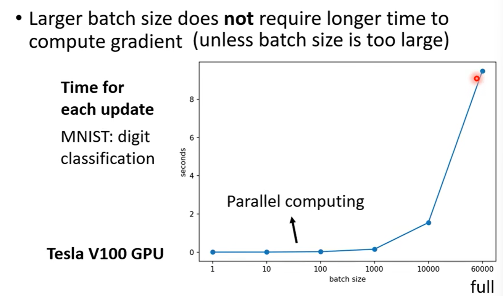

## Optimization 问题和改进

### Optimization fails reason

critical point：gradient is close to zero

- local minima
- saddle point

#### local point 和 saddle point 的区分

用Taylor展开计算某一个参数$\theta$的loss function

>本质上就是在某一个参数点附近二阶taylor展开，看其二阶偏导的正负判断其单调性，以此判断是一个local minima还是saddle point

##### Hessian矩阵

在 critical point

根据Hessian矩阵计算其特征值，根据特征值判断critical point是一个local minima还是saddle point（前提是一阶梯度为0）

计算实例

##### saddle point的解决方式

this method is seldom used in practice

##### 从一个高维的角度

>在所有的critical point里，还有一半的特征值为负的，也就是是一个saddle point

### Batch

Optimization with Batch

>shuffle：每一个epoch中batch都不一样

#### Small Batch vs Large Batch

Larger batch size does not require longer time to compute gradient

- GPU可以做平行计算（parallel computing）

### Momentum

### Adaptive Learning Rate

