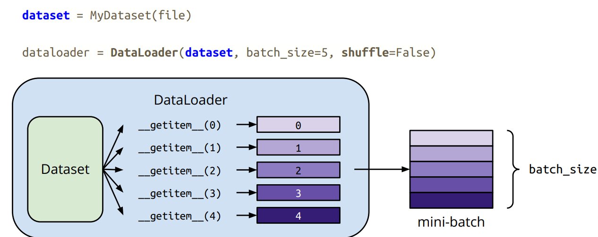

## Pytorch Tutorial 

### What is PyTorch？

An machine learning framework in Python

Two main features

- N-dimensional **Tensor** computation（like NumPy） on GPUs
- **Automatic differentiation** for training deep neural networks

#### Training Neural Networks

#### Training & Testing Neural Networks

#### Training & Neural Networks - in Pytorch

#### Dataset & Dataloader

- Dataset: stores data samples and expected values
- Dataloader: groups data in batches, enables multiprocessing

#### Tensors

