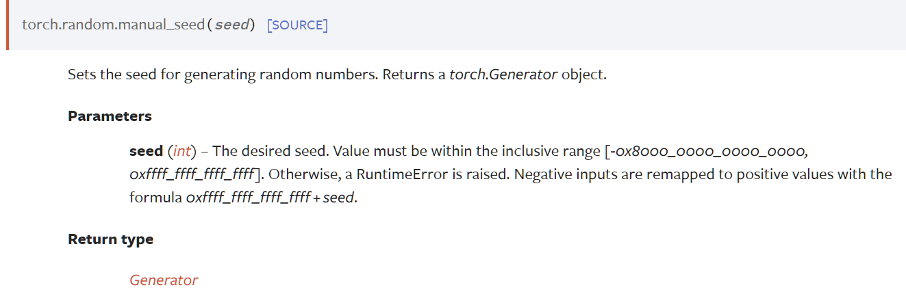

### torch.backends

**torch.backends** control the behavior of various backends that PyTorch supports.

#### torch.backends.cudnn

cuDNN是 (CUDA Deep Neural Network library) ，是NVIDIA专门针对深度神经网络中的基础操作而设计基于GPU的加速库

### torch.random

