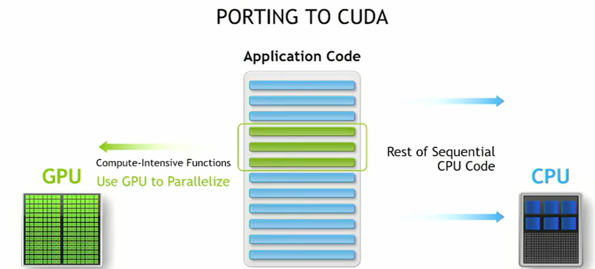
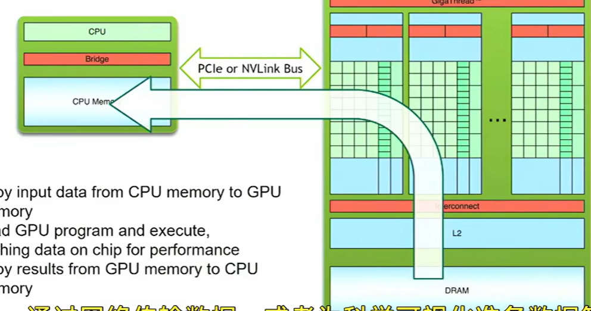

## CUDA C++ Basics

Heterogeneous Computing

- Host: The CPU and its memory (host memory)
- Device: The GPU and its memory (device memory)

Simple processing flow

- Copy input data from CPU memory to GPU memory
- Load GPU program and execute caching data on chip for performance
- Copy results from GPU memory to GPU memory

