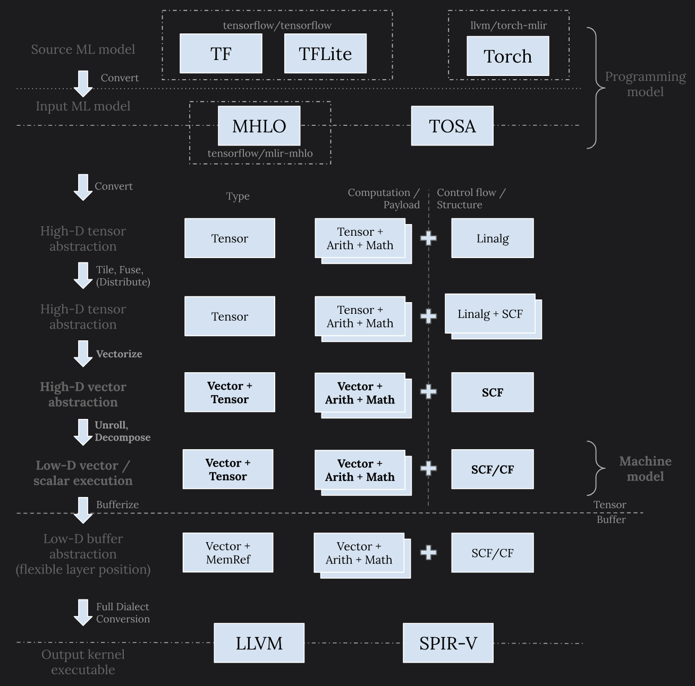
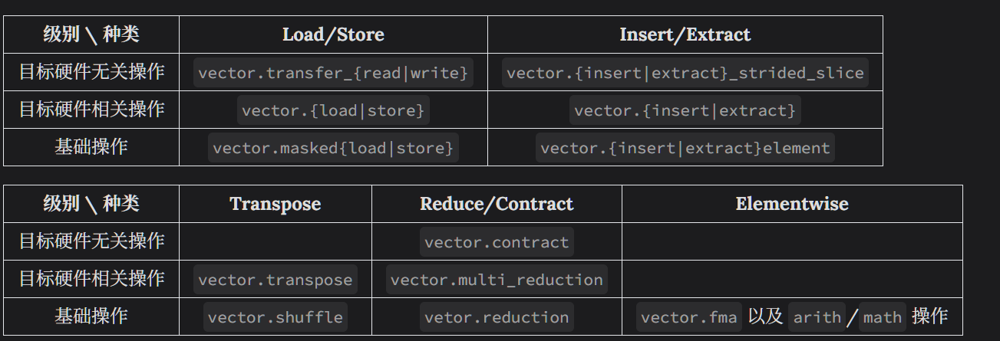

## MLIR Vector Dialect 及其 Patterns

### vector dialect 在 MLIR lowering中的位置

- 在最顶层，tf、tflite、以及torch等 dialect 用于机器学习框架的结束

  `mhlo`和 `tosa` dialect 则将来自各种框架的算子集（op set）收缩集合，转化成统一的表示，作为下层 MLIR 代码生成栈的输入程序

- 在其下一层，linalg dialect 主要用来对原问题分块（tiling）并映射到硬件计算体系（compute hierarchy）

- Memref dialect这一层主要是用来做内存规划和读写，这一层的位置比较愣货，既可以在转换成向量抽象之前，也可以在其之后

- 最底层有 `llvm` 以及 `spirv ` dialect，转换到这一层是为调用 LLVM 编译器栈做进一步的更底层的代码生成，或者产生最终的程序 SPIR-V 二进制表示

在以上流程中，转换到向量抽象发生在原问题分块以及硬件计算单元（CPU threads，GPU warps/subgroups等等）映射之后，用来在一个 SIMD/SIMT 计算单元上处理同一结构但是规模更小的问题。所以其目的是**将小规模子问题进一步分解并映射到硬件寄存器和原生向量指令**

### 特性以及方法

#### 特性

Vector dialect 的定位决定了它的一些重要特性：

- 原问题分块之后，每个子块的各个维度尺寸（dimension size）都是静态 （static）常量。因此，vector dialect 使用的全部是静态维度尺寸
- 栈上层所用高维向量和目标硬件上原生支持的低维向量有着很大的语义（semantic）差距。为实现这两者之间的转换，vector dialect 本身也必须是 “多层次的”，里面既有目标硬件无关的操作，也有目标硬件相关的操作

进一步而言，vector dialect 内的操作由上而下可以分为三级：

- **接受高维向量的目标硬件无关的操作**。这些操作（比如 `vector.transfer_read`和 `vector.transfer_write`）可以支持各种使用场景，因此比较通用和灵活。一般而言这些操作并无相对应的硬件指令，他们的存在使用从上层往下递降（lowering）变得简单，接近机械化（mechanical）
- **接受低维向量目标硬件相关的操作。**这些操作可能有直接对应的硬件指令， 在编译的过程中可能会被直接映射到对应指令。(比如有着两个二维 16x16 向量输入的 `vector.contract` 可以被转换成 NVIDIA [TensorCore wmma 指令](https://developer.nvidia.com/blog/programming-tensor-cores-cuda-9/)。)
- **接受一维向量的基础操作。**这些操作 (比如 `vector.insertelement` 和 `vector.extractelement`) 直接映射到对应的 `llvm` 或者 `spirv` 指令，通常充当向量拆分 (decomposition) 中最细粒度的指令， 有助于向 `llvm` 或者 `spirv` 操作转换的机械化。

其实各个层级之间的分界并不是非常清楚。有时候取决于输入输出向量的维度，同一个操作可以归为不同类。 举例而言，`vector.contract` 的输入如果是个四维向量，并且其 indexing map 内含转置 (transposition)， 那么该操作则应属于第一级。所以以上所述只是一种粗略划分，以便于理解。

上面表格中所列大致指明了各个操作的递降方向。当然，如前所述，有的操作可以被划分到多个层级中。 对这样的操作我将它们放在了最常见的层级中。另外，对一个操作的拆分和递降， 并不一定要严格按照以上表格一步不少，比如，对于产生 `vector<4xf32>` 的 `vector.transfer_read`/`vector.load`， 我们可以直接将其转换成 `memref.load`。所以，再次重申一下上面只是为便于理解而进行的粗略划分。

除此之外，vector dialect 里面还有一些其他的常见操作没有这么多层级划分， 比如用来复制元素的 `vector.splat` 和 `vector.broadcast`， 特殊的内存读写模式 `vector.{gather|scatter}`，以及用来对 shape 进行变换的 `vector.reshape` 和 `vector.shape_cast`

#### 方法

vector dialect的特性决定了我们在这以抽象层次应该采用的方法-静态维度尺寸使得利用向量展开（unrolling）来将高维向量拆分成低维向量成为可能。完全展开可以产生足够的向量指令来填充计算单元，并且因为无需引入循环， 流水线能够得到充分利用。 同一 dialect 内部不同的层级也让展开之后由高层抽象往低层抽象的转换变得机械化—我们只需要将这些转换写成简单的最小化的 folding 或者 canonicalization pattern 就可以了。

### 变换

vector dialect中的各种变换一般以机械化的一对一的操作转换或者最小化的 cannicalization pattern 的形态存在。

