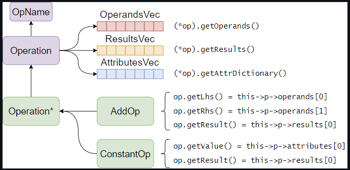
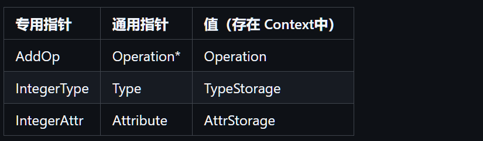
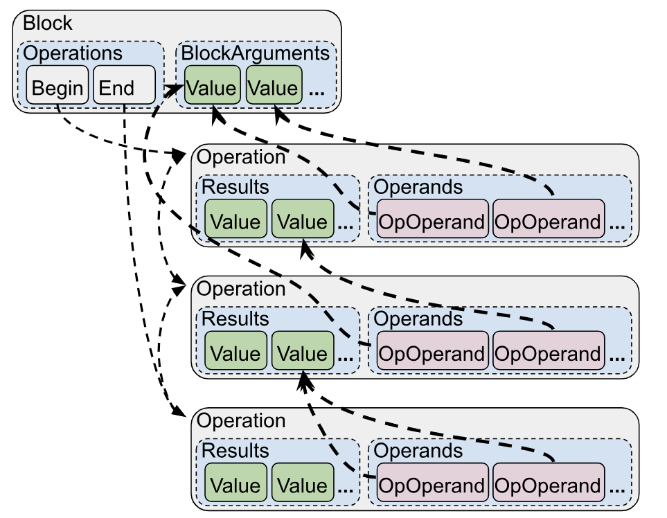
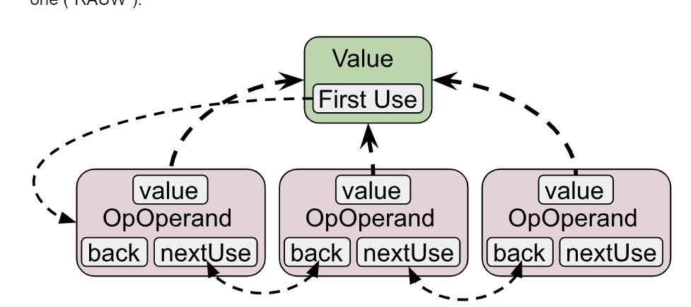

# MLIR Tutorial

## 1.MLIR 简介

### 1.1 MLIR 编译管线

MLIR在于设计一套可复用的编译管线

- IR

  多个Dialect可以混合存在

- Pass

- IO系统


### 1.2 常见的Dialect

MLIR的Dialect是相对独立的，常见的dialect如下

- func：处理函数的dialect，包括函数定义、调用、返回等基本操作
- arith：处理加减乘除移位等各种运算
  - math：更复杂的运算，如log、exp、tan等
- affine：处理循环嵌套，实现了循环展开、多面体变换等一些算法
- scf：（structured control flow）结构化控制流，保留for，if等语句
  - cf：无结构控制流，只有条件跳转命令
- llvm：LLVM IR的binding，可以直接翻译给LLVM做后续编译

MLIR的编译从高层次的 tensor 到 低层次的 scf,cf，每个阶段都是多个 dialect 的混合体，每次 lowering 往往只针对一个 dialect 进行。

### 1.3 insight：及时做优化

这里简单举例，dialect 是如何混合的。

例如，我是 pytorch，生成了一些神经网络，我想要表示这些运算：

- Tensor 是一块带 shape 的指针：使用 **tensor** dialect
- 简单的 elementwise 加减乘除：使用 **arith** dialect
- 复杂的 log、exp 等运算：使用 **math** dialect
- 矩阵线性代数运算：使用 **linalg** dialect
- 可能有一些控制流：使用 **scf** dialect
- 整个网络是一个函数：使用 **func** dialect

接下来，将其逐渐 lower 到 LLVM：

- 调用 Lowering Pass，把 **tensor** lowering 到 **linalg**，而其他的 dialect 不会改变。
- 继续调用 pass，直到把 **linalg** 转换到 **affine** -> **scf** -> **cf**，其他表示运算的 dialect 保留不变。
- 继续 Lowering，把 **memref** 转换为裸指针、**arith** 和 **func** 转换为 llvm 内置运算。
- 最后，所有非 **llvm** dialect 都被转换为了 **llvm** dialect，现在可以导出为 llvm ir 交给 llvm 继续编译。

**可见，MLIR 编译有一个特点**：不同 dialect 是独立的。

- 例如，在做循环展开等优化的时候，我不需要关心加法和减法可以合并；而在做算数表达式优化的时候，也不需要关心当前在哪个函数里边。

**MLIR 可以从各个层次优化 IR**：例如：

- 在 **affine** 层面，可以根据循环大小做展开，向量化
- 在 **scf** 层面，可以发现循环不变量
- 在 **arith** 层面，可以用算数恒等式优化代码

MLIR 的 insight 在于“**及时做优化**”。很明显，linalg 层次，我们很容易发现矩阵被转置了两次，但一旦 lower 到 scf，所有转置操作都变成循环，优化就很难进行了。

### 1.4 MLIR的用处

我们使用 MLIR，主要也是想要复用别人已经写好的代码，一般包括：

- 复用已有 dialect 作为

   

  输入

  ，不用自己写前端。

  - 如 Polygeist 能把 C 翻译成 Affine Dialect，这样我们就不用写 C Parser

- 将已有 dialect

   

  混入

  或

  作为输出

  。

  - 如 arith 等 dialect，可以直接集成起来，不需要自己写。
  - 要生成 binary 的时候，可以直接生成 LLVM Dialect，复用后端 LLVM 编译管线

- 复用已有的 Pass。

  - 常见的 Pass 如 CSE，DCE 可以复用
  - Dialect 专用 Pass，如循环展开，也可以复用

### 1.5 MLIR的缺点

- 太过笨重，编译、链接时间长（可能会连接出上百M的文件）
  - 可以用lld来加快链接速度
- Dialect定义极不灵活，定义较复杂Op时很麻烦

## 2.MLIR基本用法

### 2.1 IR基本结构

MLIR 是 树形结构，每个节点是 Operation，Op 可以组成 Block，Block 组成 Region，而 Region 又可以嵌套在 Op 内部。

- **Operation** 指单个运算，运算内可以嵌套 **Region**
- **Block** 指基本块，基本块包含一个或多个 **Operation**
- **Region** 指区域，类似于循环体或函数体，包含若干 **Block**

MLIR 的基本块使用 **“基本块参数”** 来取代“phi函数”，如下面的例子：

- **块参数**：每个基本块都带有参数，块内可以使用
- **终止符**：每个基本块的一般为跳转或返回，跳转时需要附上块参数

```c
module {
func.func @foo(%a: i32, %b: i32, %c: i32) -> i32 {
  %cmp = arith.cmpi "sge", %a, %b : i32
  cf.cond_br %cmp, ^add(%a: i32), ^add(%b: i32)
^add(%1: i32):
  %ret = llvm.add %1, %c : i32
  cf.br ^ret
^ret:
  func.return %ret : i32
}
}
```

- module：默认情况下，mlir最外层是builtin.moudle，作为IR的根

### 2.2 MLIR基本工程模版

```
mlir-tutorial
├── install       # Install Prefix，把 MLIR 编译后安装到这里
├── llvm-project  # MLIR 项目
└── mlir-toy      # 自己的 MLIR 工程
```

### 2.3 MLIR的读入、输出

测试用mlir：

```
func.func @test(%a: i32, %b: i32) -> i32 {
	%c = arith.addi %a, %b : i32
	func.return %c : i32
}
```

最简单的读入读出：

```c++
#include "mlir/IR/AsmState.h"
#include "mlir/IR/BuiltinOps.h"
#include "mlir/IR/MLIRContext.h"
#include "mlir/Parser/Parser.h"
#include "mlir/Support/FileUtilities.h"
#include "mlir/Dialect/Func/IR/FuncOps.h"
#include "mlir/Dialect/Arith/IR/Arith.h"
#include "llvm/Support/raw_ostream.h"

using namespace mlir;

int main(int argc, char ** argv)
{
	MLIRContext ctx;
	// 首先，注册需要的 dialect
	ctx.loadDialect<func::FuncDialect, arith::ArithDialect>();
	// 读入文件
	auto src = parseSourceFile<ModuleOp>(argv[1], &ctx);
	// 简单的输出，在debug的时候常用
	src->dump();
	return 0;
}
```

需要连接上所有依赖的文件：

```
target_link_libraries(
  ex1-io
  MLIRIR
  MLIRParser
  MLIRFuncDialect
  MLIRArithDialect
)
```

测试方式：

```
./ex1-io ../ex1-io/ex1.mlir
```

### 2.4 用代码生成MLIR

## 3 MLIR Op的结构

MLIR的一个Operation里可以包含下面的一些东西：

- Operand：这个Op接受的操作数
- Result：这个Op生成的新Value
- Attribute：可以理解为编译器常量
- Region：这个Op内部的Region

### 3.1 Attribute和Operand

Attribute 和 Operand 有一些区别。Attribute 指的编译器已知的量，而 Operand 指只有运行时才能知道的量。

如下面的这个Op，0 是一个 Attribute 而不是一个 Operand

```
%c0 = arith.constant 0 : i32
```

### 3.2 Attribute, Value 和Type

Value必然包含Type，Type也可以作为Attribute附加在Operation上

例如函数 Op，虽然 %a, %b 出现在了参数表里，但它们实际上是函数类型的一部分，算是 Type Attribute。

```
func.func @test(%a: i32, %b: i32) -> i32 {
  %c = arith.addi %a, %b : i32
  func.return %c : i32
}
```

- ```
  mlir-opt --mlir-print-op-generic
  ```

  来打印这里的代码，得到下面的代码。参数名被隐去，只有 function_type 作为 attribute 保留了下来。

  ```
  "builtin.module"() ({
    "func.func"() <{function_type = (i32, i32) -> i32, sym_name = "test"}> ({
    ^bb0(%arg0: i32, %arg1: i32):
      %0 = "arith.addi"(%arg0, %arg1) : (i32, i32) -> i32
      "func.return"(%0) : (i32) -> ()
    }) : () -> ()
  }) : () -> ()
  ```

这里 `mlir-opt`工具链在 `install/bin`下，使用方式为

```
mlir-opt --mlir-print-op-generic filename
```

## 4 MLIR类型的转换

### 4.1 Op的类型转换

MLIR的所有Op都有一个统一的存储格式，叫 `Operation`。`Operation`里面存了 `OpName`和所有的 operands，results，attributes和其它的东西

用户定义的 `arith.addi`等 Op，本质上都是 `Operation`的指针。但与 `Operation*`不同的是，`AddIop`定义了 `Operation` 里存储的数据的解释方式。

如 AddOp，自己是一个 `Operation`的指针，也定义了一个函数 `getLhs`用来返回第一个值，当作 lhs



`DownCast`：如何在拿到 `Operation*`的情况下，将其转换为 `AddOp`

llvm提供了一些转换函数，这些函数会检查Operation的 OpName，并进行转换

```c++
using namespace llvm;
void myCast(Operation * op) {
  auto res = cast<AddOp>(op); // 直接转换，失败报错
  auto res = dyn_cast<AddOp>(op); // 尝试转换，失败返回 null，op为null时报错
  auto res = dyn_cast_if_present<AddOp>(op); // 类似 dyn_cast，op为null时返回null
}
```

**相等关系**：两个 Operation* 相等，指的是它们指向同一个 Operation 实例，而不是这个 Operation 的 operand,result,attr 相等。

**Hashing**：在不修改 IR 的情况下，每个 `Operation` 有唯一地址。于是，可以直接用 `Operation*` 当作值建立哈系表，用来统计 IR 中数据或做分析：

### 4.2 Type / Attribute 的类型转换

MLIR 的 Type 和 Attribute 与 Op 类似。Type 是到 TypeStorage 的指针，Attribute 也是到 AttributeStorage 的指针。

- TypeStorage 里面会存 Type 的参数，如 Integer 会存 width，Array 会存 Shape。



全局单例：与Op不同的事，MLIR Context会完成 Type和 Attribute的去重工作。**Type相等，它们的TypeStorage也一定相等**

**DownCast**：Type 的 DownCast 与 Op 相同。

**Hashing**：与 Op 类似，Type 也可以作为 Key 来建哈系表，但不那么常用。

## 5.MLIR的图结构

MLIR里，有两个层次的图：

- Region嵌套构成的树，表示 **控制流**
- Op/Value构成的图，表示 **数据流**

### 5.1 MLIR数据流图结构

MLIR的数据流图由Operation和Value构成

#### Operation的连接



Operation 的连接

- Value要么来自于 Operation 的 Result要么来自于 BlockArgument
- 每个Operation的Operand都是到 Value的指针
- 要修改 Operand的时候，实际修改的应该是 OpOperand

#### Value的 use-chain



- 每个Value都将其User连接在一起了

MLIR的图是一个双向的结构，在遍历尤其是修改时需要特别小心

- 在修改`OpOperand`的时候，对应 value的 use-chain 会暗中被 MLIR改掉
- 在调用 `value->getDefiningOp()`的时候，BlockArgument会返回null

### 5.2 MLIR数据流图的遍历与修改

MLIR数据流图的遍历往往遵循一种模式：Operation调用函数找 Value，再用Value调用函数找 Operation，交替进行

#### Operation 找 Value

其中，Operation找 Value的方法有

- getOperands、getResults：这两个非常常用，如下面的代码可以用来 Op 找 Op

  ```c++
  for(auto operand: op->getOperands()) {
    if(auto def = operand.getDefiningOp()) {
      // do something
    }
    else {
      // block argument
    }
  }
  ```

- `getOpOperands`：这个在需要更改 operands 的时候非常有用，例如下面的代码将 value做替换

  ```c++
  IRMapping mapping;
  // 将 op1 的 results 映射到 op2 的 results
  mapping.map(op1->getResults(), op2->getResults());
  for(auto &opOperand: op3->getOpOperands()) {
    // 将 op3 的参数里含有 op1 results 的替换为 op2 的
    // lookupOrDefault 指找不到 mapping 就用原来的
    opOperand.set(mapping.lookupOrDefault(opOperand.get()));
  }
  ```

#### Value 找 Op

- getDefiningOp：可能返回null
- getUses：返回OpOperand的迭代器
- getUsers：返回 Operation的迭代器

**Op的getUses和getUser**：operation 也有 getUses 和 getUsers 函数，等价于把这个 op 的所有 result 的 Uses 或 Users 拼在一起

Value**的修改**：Value支持replaceAllUseWith修改，一种看起来等价的代码是

```c++
or(auto & uses: value.getUses()) {
  uses.set(new_value);
}
```

但需要注意，上面的代码是**非常危险**的。因为在 uses.set 的时候，会修改 value 的 use chain，而 value 的 use-chain 正在被遍历，可能一修改就挂了。于是，最好用 mlir 提供好的 `replaceAllUseWith` 来修改。

### 5.3 MLIR控制流图的遍历与修改

与数据流图相比，控制流图遍历更简单，常用的一些函数：

- op.getParentOp, op.getParentOfType：获取父亲Op
- op.getBlock：注意是返回父亲block，而不是函数block
- op.getBody：这个才是返回内部 block / region

遍历儿子的方法：

- op.walk：递归地遍历所有子孙op

  ```c++
  // 递归遍历所有儿子
  func.walk([](Operation * child) {
    // do something
  });
  // 递归遍历所有是 `ReturnOp` 类型的儿子
  func.walk([](ReturnOp ret) {
    // do something
  })
  ```

- block：直接一个iterator，可以直接遍历

  ```c++
  Block * block = xxx
  for(auto & item: *block) {
    // do something
  }
  ```

其他遍历方法如 getOps<xxx> 可以自行尝试

控制流图的修改主要用 `OpBuilder` 完成。强烈建议把找到 `OpBuilder` 的代码，把里面有什么函数都看一看，常见的：

- **builder.create**：创建op
- **builder.insert**：插入remove的op
- **op->remove()**：从当前块移除，但不删除，可以插入到其他块内
- **op->erase()**：从当前块移除，并且删除

**删除顺序**：在删除一个 op 的时候，这个 op 不能存在 user，否则会报错。

## 6.基本的Dialect工程

这一节会讲如何用 tablegen 定义自己的 dialect，使用 mlir 自带的通用程序入口 `MlirOptMain`，生成 `toy-opt`

### 6.1 TableGen 工程模版

文件结构

```
ex3-dialect
├── CMakeLists.txt           # 控制其他各个部分的 CMakeList
├── include
│   └── toy
│       ├── CMakeLists.txt  # 控制 Dialect 定义的 CMakeList
│       ├── ToyDialect.h    # Dialect 头文件
│       ├── ToyDialect.td   # Dialect TableGen 文件
│       ├── ToyOps.h        # Op 头文件
│       ├── ToyOps.td       # Op TableGen 文件
│       └── Toy.td          # 把 ToyDialect.td 和 ToyOps.td include 到一起，用于 tablegen
├── lib
│   ├── CMakeLists.txt
│   └── toy.cpp             # Dialect library
└── tools
    └── toy-opt
        ├── CMakeLists.txt
        └── toy-opt.cpp     # Executable Tool
```

- `include`下为 定义的dialect的tablegen文件，还有头文件
- lib：Dialect library
- tools：定义了入口函数

### 6.2 Tablegen Language Server

vscode 提供 mlir 扩展，可以为我们写 tablegen 文件提供帮助。在 `/mlir-tutorial/install/bin` 里面，有 `mlir-lsp-server`。在 vscode 的设置里找到 mlir-lsp-server 的设置，设好绝对路径，还有 database 的路径。

### 6.3 IR的默认定义与实现

#### 6.3.1 TableGen文件

1.`include/toy/ToyDialect.td`：定义 Dialect名字和cpp命名空间

```c++
include "mlir/IR/OpBase.td"
def ToyDialect : Dialect {
  let name = "toy";
  let cppNamespace = "::toy";
  let summary = "Toy Dialect";
}
```

- `OpBase.td`是MLIR中定义操作基础结构的文件。提供了定义操作（operation）和方言（dialect）所需的基本工具和工嗯呢
- `let name = “toy”`：指定了方言在MLIR中的名称为 `“toy”`，这是用户在IR（中间表示）代码中看到的名称。当创建与该方言相关的操作时，操作符会以 `toy.`作为前缀
- `let cppNamespace = "::toy";`：指令流在生成的C++代码中，该方言被放置在 `toy`命名空间中。这样，所有与 `ToyDialect`相关的类和函数都会被包含在 `::toy`命名空间下，确保代码组织清晰，避免名称冲突

2.`include/toy/ToyOps.td`：定义Operation

```c++
include "mlir/IR/OpBase.td"
include "mlir/Interfaces/SideEffectInterfaces.td"

// mnemonic 指名字
class ToyOp<string mnemonic, list<Trait> traits = []> :
  Op<ToyDialect, mnemonic, traits>;

// Pure 是 Trait，表示没有 SideEffect 的纯函数
def AddOp : ToyOp<"add", [Pure]> {
  let summary = "add operation";
  let arguments = (ins AnyInteger:$lhs, AnyInteger:$rhs);
  let results = (outs AnyInteger:$result);
}
```

3.`include/toy/Toy.td`：把其他的td include到一起，用于交给tablegen生成

```
include "toy/ToyDialect.td"
include "toy/ToyOps.td"
```

4.`include/toy/CMakeLists.txt`

```
add_mlir_dialect(Toy toy)
```

- 调用tablegen生成代码，其中，第一个 `Toy`是Dialect的名字，第二个toy指的是 `toy.td`

#### 6.3.2 头文件

tablegen 生成的文件放在 `build/include/toy` 里，包括默认的定义和实现

- `ToyDialect.{h,cpp}.inc`：存 Dialect 的定义和实现
- `Toy.{h,cpp}.inc`：存 Op 的定义和实现

tablegen 生成到了 `build` 目录，需要额外添加 include

```
include_directories(${CMAKE_CURRENT_BINARY_DIR}/include)
```

6.`include/toy/ToyDialect.h`：把 Dialect 的定义加载进来

```c++
#pragma once
#include "mlir/IR/BuiltinDialect.h"
#include "toy/ToyDialect.h.inc" // include 进来就可以了
```

7.`include/toy/ToyOps.h`

```c++
#pragma once
#include "mlir/IR/BuiltinOps.h"
#include "mlir/IR/Builders.h"
// td 里面 include 的，这里也要 include 对应的 h 文件
#include "toy/ToyDialect.h"
#include "mlir/Interfaces/SideEffectInterfaces.h"
#define GET_OP_CLASSES
#include "toy/Toy.h.inc"
```

#### 6.3.3 库文件

8.`lib/toy.cpp`：把默认Dialect 和Op的默认实现加载进来

```c++
#include "toy/ToyDialect.h"
#include "toy/ToyOps.h"
#include "toy/ToyDialect.cpp.inc"
#define GET_OP_CLASSES
#include "toy/Toy.cpp.inc"
using namespace toy;
void ToyDialect::initialize() {
  // 下面的代码会生成 Op 的列表，专门用来初始化
  addOperations<
#define GET_OP_LIST
#include "toy/Toy.cpp.inc"
  >();
}
```

9.`lib/CMakeLists.txt`：前面的 tablegen 会生成一个 `MLIRxxxIncGen` 的 Target，library 需要依赖这个 Target，才能先生成头文件，再编译 toy.cpp。一般 Library 取名为 `MLIRToy` 或者 `Toy`。

```
add_mlir_library(Toy toy.cpp DEPENDS MLIRToyIncGen)
```

#### 6.3.4 程序入口

`tools/toy-opt/toy-opt.cpp`：mlir 提供了一个可复用的通用的程序入口，我们可以在 `MlirOptMain` 前面注册我们想要的 Dialect 和 Pass，接下来调用 `MlirOptMain`，就可以使用一些默认提供的功能。

```c++
#include "mlir/IR/DialectRegistry.h"
#include "mlir/Tools/mlir-opt/MlirOptMain.h"
// 导入 Func Dialect
#include "mlir/Dialect/Func/IR/FuncOps.h"
// 导入 MLIR 自带 Pass
#include "mlir/Transforms/Passes.h"
// 导入我们新建的 Dialect
#include "toy/ToyDialect.h"
using namespace mlir;
using namespace llvm;

int main(int argc, char ** argv) {
  DialectRegistry registry;
  // 注册 Dialect
  registry.insert<toy::ToyDialect, func::FuncDialect>();
  // 注册两个 Pass
  registerCSEPass();
  registerCanonicalizerPass();
  return asMainReturnCode(MlirOptMain(argc, argv, "toy-opt", registry));
}
```

- 注册Diaelct为自己定义的 ToyDialect还有 FuncDialect

`tools/toy-opt/CMakeLists.txt`

```c++
add_mlir_tool(toy-opt toy-opt.cpp)
target_link_libraries(toy-opt
  PRIVATE
  MLIRIR MLIRParser MLIRSupport
  Toy               # 对应 #include "toy/ToyDialect.h"
  MLIROptLib        # 对应 #include "mlir/Tools/mlir-opt/MlirOptMain.h"
  MLIRFuncDialect   # 对应 #include "mlir/Dialect/Func/IR/FuncOps.h"
  MLIRTransforms    # 对应 #include "mlir/Transforms/Passes.h"
)
```

11.简单使用 `ninja toy-opt`

- `./toy-opt --help` 可以打文档，里面应该有 cse 和 canonicalize 两个 pass
- `./toy-opt ../ex3-dialect/ex3.mlir` 读文件
- `./toy-opt -canonicalize ../ex3-dialect/ex3-cse.mlir`，可以做 dce
- `./toy-opt -cse ../ex3-dialect/ex3-cse.mlir`，可以做 cse

## 7.TableGen Op 定义详解

上一节介绍了MLIR工程的骨架，现在添加一些功能，让IR的定义、输入、输出更简单

### 7.1 Attribute、Type、Constraint

添加 Attribute 的方法与 Operand 类似，都写在 arguments 里面

```c++
def ConstantOp : ToyOp<"const">, [Pure] {
 	let summary = "const operation";
    let arguements = (ins APIntAttr:$value);
    let results = (outs AnyInteger:$result);
}
```

- `def ConstantOp`定义了一个名为 `ConstantOp`的操作，它代表一个具体的操作类
- `ToyOp<"const">`：`ToyOp`是一个操作的基类，带有泛型参数 `”const“`。泛型参数指定了该操作的名称，即在IR中，该操作将被成为 `toy.const`
- `[Pure]`：该操作被标记为 `Pure`，这意味着该操作是 "纯"的，没有副作用，这类操作可以安全地被优化掉或被重用，因为它们不会影响程序的状态或其他操作

summary：

- 定义了该操作的简要说明或注释，`summary`中的内容通常用于生成文档，帮助开发者理解这个操作的目的和功能

arguments：

- 表示该操作的输入参数
- `ins`：指定这是操作的输入（inputs）
- `APIntAttr`：表示输入的类型是一个 `APIntAttr`，这是MLIR中的属性，表示一个任意精度的整数（Arbitrary Precision Integer）
- `$value`：这是该操作的输入参数的名字。它表示该常量操作的输入将是一个整数类型的属性（常量值）

results：

- 表示该操作的输出结果
- `outs`：这是操作的输出
- `AnyInteger`：表示输出类型是任意整数类型（AnyInteger），即该操作的结果将是一个整数类型
- `$result`：这是该操作的输出结果的名字

>Operation定义的规范
>
>在MLIR中，使用TableGen定义操作时，通常要遵循以下规范：
>
>1. **操作名称**：使用`def`关键字定义，并且通常继承自某个基础操作类（例如这里的`ToyOp`）。
>2. **操作的属性**：可以通过`let`关键字定义一些元信息（如`summary`）。
>3. **输入与输出**：使用`arguments`和`results`来定义操作的输入和输出，输入用`ins`标记，输出用`outs`标记，类型和名字紧随其后。
>4. **其他修饰符**：例如`[Pure]`用于指定操作是否有副作用。

#### 7.1.1 内置Attribute

`mlir/IR/CommonAttrConstraints.td`中，常用的 Attr

- `TypeAttrOf<Type>`：将一个Type 作为 Attr
- `FlatSymbolRefAttr`：call函数的时候，函数名的Attr
- `SymbolNameAttr`：定义函数的时候，函数名的Attr
- `UnitAttr`：表示一个bool，为true的时候，它在attr表里面，为false的时候不在
- `I64SmallVectorArrayAttr`：整数数组Attr，与其他的整数数组区别的是，用SmallVector，会好用一些

#### 7.1.2 内置的Type

`mlir/IR/CommonTypeConstraint.td`，常用的：

- `I1`，`I8`，`I16`, `I32`, `I64`, `I128`
- `AnyType`：表示任何类型
- `AnyInteger`：表示任何整数

#### 7.1.3 为什么Attribute 和 Type 都是 Constraint

为 Op 定义一个 Attribute 的时候，实际上是指定了 Operation 里面 operands, results, attributes 等等 的解释方式。

像 Attribute、Type 这样的 表示了 “第 i 个位置的 operand 只能被解释为整数”、“第 j 个位置的 attr 只能被解释为Symbol” 的约定，算是限制了各个 field 的解释方式，被看作是 “Constraint”。

### 7.2 Verifier：发现IR错误

在 tablegen 里面加上 `hasVerifier=true`

```c++
def SubOp : ToyOp<"sub", [Pure]> {
    let summary = "sub operation";
    let arguments = (ins AnyInteger:$lhs, AnyInteger:$rhs);
    let results = (outs AnyInteger:$result);
    let hasVerifier = true;
}
```

然后在 `toy.cpp` 里写 verifier的实现：

```c++
using namespace mlir;
LogicalResult SubOp::verify(){
    if(getLhs().getType() != getRhs().getType())
        return this->emitError() << "Lhs Type" << getLhs().getType() 
        	<< " not equal to rhs" << getRhs().getType();
    return success();
}
```

#### 7.2.1 emitError

`emitError`是Op带有的函数。MLIR里面Op都会带 `emitError`函数，用来区分是哪个Op发生了错误。在这里，我们verify的是自己，就只需要调用自己的 `emitError` 函数

- 还有 `emitWarning`，可以输出 Warning

#### 7.2.2 LogicalResult

MLIR用 LogicalResult 用来表示类似 bool的值，它的特点是

- mlir的一些其他类型可以自动转换为 LogicalResult，如上面 emitError 就可以自动转换
- 用 success(), failure()生成 true和false
- 用 succeed(x)，failed(x)来判断是否为 true，false

### 7.3 Variadic：可变参数

使用 `Variadic<type>` 来描述可变参数：

```c++
def AddOp : ToyOp<"add", [Pure]> {
    let summary = "add operation";
    let arguments = (ins Variadic<AnyInteger>:$inputs);
    let results = (outs AnyInteger:$result);
}
```

使用 `Optionn<type>`来描述可选参数

```c++
def ReturnOp : ToyOp<"return", [Terminator, ReturnLike]> {
    let summary = "return operation";
    let arguments = (ins Optional<AnyInteger>:$data);
}
```

#### 7.3.1 多个可变参数：AttrSizedOperandSegments

当一个函数只有一个 `Variadic` 或 `Optional` 的时候，可以根据参数总数量推断有多少个可变参数。但如果有多个 `Variadic` 或 `Optional`，需要增加 `AttrSizedOperandSegments` Trait，这个 trait 会为 Op 添加一个 attribute 用来记录每个可变参数是否存在，如果存在有多少个。

与之相关的还有 `AttrSizedResultSegments` 用于返回了多个可变参数的情况，它们都在 `OpBase.td` 里面

### 7.4 AssemblyFormat：更易读的输出

例子：

```c++
def AddOp : ToyOp<"add", [Pure]> {
    let summary = "add operation";
    let arguments = (ins Variadic<AnyInteger>:$inputs);
    let results = (outs AnyInteger:$result);
    let assemblyFormat = "$inputs attr-dict ':' type($inputs) '->' type($result)";
}
```

这样会生成下面的更可读的代码：

```
%0 = toy.add %a, %b : i32, i32 -> i32
```

#### 7.4.1 常用关键字

- `$xxx` 用来表示 operand 或者 attribute
- `type($xxx)` 用来表示 xxx 的类型。
- ``keyword``： 插入 keyword
- `functional-type($inputs, results)`，生成形如 `(i32, i32) -> i32` 的函数类型
- `attr-dict`：表示额外的 attr 字典。

#### 7.4.2 额外attr字典

mlir 允许为 OP 插入任意的 attribute，允许跨 dialect 插入 attribute。所以，在定义 op 的时候，总是要把 `attr-dict` 加上，这样其他人插入的 attr 也能存下来。

#### 7.4.3 输出 type

所有没有限制死（AnyXXX，如 AnyInteger）的 operand，都需要写清楚 type，要么用 `type($xxx)`，要么用 `functional-type`。

#### 7.4.4 可选输出：Optional、UnitAttr

针对 Optional 和 UnitAttr，MLIR 提供了一种 条件分组 的语法：如下面的 HWReg

```c++
def HWRegOp : ToyOp<"reg"> {
  let summary = "hardware register";
  let arguments = (ins I1:$clock, AnyInteger:$input, Optional<I1>:$reset, UnitAttr:$is_public);
  let results = (outs AnyInteger:$result);
  let assemblyFormat = [{
    (`public` $is_public^)? $input
    `clock` $clock
    (`reset` $reset^)?
    attr-dict `:` functional-type($input, results)
  }];
}
```

可以有下面的效果：

```c++
%a = toy.reg public %b clock %clk reset %reset : (i32) -> i32
%a = toy.reg %b clock %clk reset %reset : (i32) -> i32
%a = toy.reg %b clock %clk : (i32) -> i32
```

- `[{xxx}]`，MLIR中的长文本可以用 `[{}]` 括起来。
- `(`reset` $reset^)?`，其中 `(...)?` 表示分组，`^` 表示判断依据。只有对应的 `Optional` 或 `UnitAttr` 存在的时候，才会输出这个分组。

### 7.5 Builder：自定义 create 函数

Builder会在 `builder.create<XXXOp>()`的时候被调用，一个更简单的 builder可以让创建 Op更快捷

#### 7.5.1 默认 Builder

MLIR会默认生成一些 builder。默认builder 会要求先传入 result的类型，再传入 operand，attribute的值。

```c++
build(
  $_builder, $_state,
  mlir::Type Res1Type, mlir::Type Res2Type, ...,
  mlir::Value arg1, mlir::Value arg2, ...
)
```

有时候，一些常用的 Attr，如 `StringAttr`，MLIR 会自动生成以 `StringRef` 为参数的 builder，用来方便调用。用户就不需要使用 `builder.getStringAttr(xxx)` 先把 `StringRef` 转换为 `StringAttr` 再来传参数了。

提到的 `I64SmallVectorArrayAttr` 就可以直接传一个 `SmallVector<int64_t>`，而不需要传一个 Attr 进去，会非常方便。

#### 7.5.2 自定义 builder

例如，我们可以在创建 Op 的时候，推断出结果的类型：

```c++
def SubOp : ToyOp<"sub", [Pure]> {
  let summary = "sub operation";
  let arguments = (ins AnyInteger:$lhs, AnyInteger:$rhs);
  let results = (outs AnyInteger:$result);
  let builders = [
    OpBuilder<
      (ins "mlir::Value":$lhs, "mlir::Value":$rhs),
      "build($_builder, $_state, lhs.getType(), lhs, rhs);"
    >
  ];
  let hasVerifier = true;
}
```

- 首先，mlir 会自动为我们生成 `build($_builder, $_state, ResultType, LhsValue, RhsValue)` 的 builder
- 我们的 builder 通过 `lhs.getType()` 推断 result 的类型，并调用 mlir 生成好的 builder，实现自动推断类型

如果只是为了推断类型，建议使用 MLIR 为类型推断专门实现的 Trait:

### 7.6 自定义函数

`tablegen` 允许用户为 Op 添加自定义函数，例如，我想直接获取 `ConstantOp`的类型的位宽：

```c++
def ConstantOp : ToyOp<...> {
  let extraClassDeclaration = [{
    int64_t getBitWidth() {
      return getResult().getType().getWidth();
    }
  }];
}
```

这样，之后想要获取位宽的时候，就可以更简洁了：

```c++
auto w = op.getResult().getType().getWidth();
auto w = op.getBitWidth();
```

由于 tablegen 里面没有 cpp 的语法不全，可以只在 tablegen 里下一个方法定义，然后在 `toy.cpp` 里面写实现

```c++
def ConstantOp : ToyOp<...> {
  let extraClassDeclaration = [{
    int64_t getBitWidth();
  }];
}
```

#### 7.6.1 header target

一个 trick 是在 `CMakeLists.txt` 里面添加一个 target，这样每次改了 tablegen 文件，只需要 `ninja header` 就能生成头文件。

```c++
add_custom_target(header DEPENDS MLIRToyIncGen)
```

### 7.7 使用 Trait

在MLIR的**TableGen**中，`Trait` 是一种用于**描述操作行为或属性**的机制。它允许你将一些常见的功能、约束或行为提取出来，并在多个操作（Operation）之间复用。通过使用`Trait`，可以避免在每个操作中重复实现相同的逻辑，同时也提高了操作定义的可读性和一致性。

### Trait的主要作用

1. **复用行为**：`Trait`可以定义常见的行为，例如标记某个操作是“没有副作用的”（如`Pure`），或者该操作是“可折叠的”（如`Foldable`），这样就可以在多个操作之间复用这些行为。
2. **操作的属性和约束**：`Trait`也可以用来定义操作的结构性属性和约束，比如操作数和结果的数量是否固定、输入输出是否类型一致等。
3. **自动生成代码**：MLIR框架通过`Trait`能够自动为操作生成某些特定的代码或验证逻辑。例如，如果某个操作有“无副作用”的特性（`Pure`），MLIR可以根据这个`Trait`进行优化时的安全假设

在给 Op 标记上 `Pure` 之后，就会自动被 cse, dce Pass 理解。除了 Pure Trait 之外，MLIR 为我们提供了很多好用的 Trait，这里介绍常用的 SideEffect，InferType 和 比较复杂的和函数相关的 Trait。

使用 Trait 的时候要注意：

1. Interface 可能会要求用户实现一些固定的接口，trait 里一些 `InterfaceMethod` 是没有默认实现的。
2. 在 td 里要 include trait 的 td 文件，在 h 里也要 include 对应的 h 文件

#### 7.7.1. 内存副作用：SideEffectInterfaces

`mlir/Interfaces/SideEffectInterfaces.{td,h}` 文件里定义了内存副作用的 interface

- **Pure**：纯函数，使用后可以自动 cse，dce
- `MemRead`, `MemWrite`, `MemAlloc`, `MemFree`：内存作用

#### 7.7.2. 类型推断：InferTypeOpInterface

`mlir/Interfaces/InferTypeOpInterface.{td,h}` 文件里定义了类型推断的 Interface，使用类型推断，你可以：

- 在 `assemblyFormat` 里可以少写几个 type，写出来的格式更漂亮
- 自动生成带类型推断的 builder，只需要传参数就能推断返回值类型

类型推断主要有下面几个常用的 Trait：

- **SameOperandsAndResultType**：操作数和返回值有相同的类型，使用后 assemblyFormat 里就只需要写任何某一个操作数的类型
- **InferTypeOpInterface**：通过输入和 attr 的类型推断返回值类型，自己写推断函数
- **InferTypeOpAdaptor**：与上一个相似，但封装了一个 Adaptor，写起来会更简单

推荐使用 **InferTypeOpAdaptor**：

- 在 tablegen 里面

  ```c++
  def ConstantOp : ToyOp<"const", [Pure, InferTypeOpAdaptor]> {
    let summary = "const operation";
    let arguments = (ins APIntAttr:$value);
    let results = (outs AnyInteger:$result);
    let assemblyFormat = "$value attr-dict"; // 这里不需要写 type($result) 了
  }
  ```

- 在 `toy.cpp`里面

  ```c++
  mlir::LogicalResult ConstantOp::inferReturnTypes(
    mlir::MLIRContext * context,
    std::optional<mlir::Location> location,
    Adaptor adaptor,
    llvm::SmallVectorImpl<mlir::Type> & inferedReturnType
  ) {
    // adaptor 是 “incomplete op”，表示只知道输入，不知道返回值的 Op
    auto type = adaptor.getValueAttr().getType();
    inferedReturnType.push_back(type);
    return mlir::success();
  }
  ```

### 7.8 函数：FunctionOpTrait

这里着重介绍 func、call、return，参考 `ex4-beautiful-dialect`。函数的这一套代码非常固定，每次照搬就好，没有太多的解释。按照下面的说明设置好函数Op后，应该就可以用 `./ex4-opt ../ex4-beautiful-dialect/ex4.mlir` 来读取函数了。

#### 7.8.1 定义 Return

Return 是一个终止符，需要使用 `Terminator`。同时，我们为其加上 `ReturnLike`。

```c++
def ReturnOp : ToyOp<"ret", [Terminator, ReturnLike]> {
  let summary = "return operation";
  let arguments = (ins AnyType:$data);
  let assemblyFormat = "$data attr-dict `:` type($data)";
}
```

#### 7.8.2 定义 Function

定义函数需要实现 `FunctionOpInterface`，它依赖于 `Symbol` 和 `CallableOpInterface`。 同时，因为我们定义了 Region，最好还加上 `RegionKindInterface`，它会自动为我们检查 Region 的格式是否正确。

我们的 Function 是一个全局的函数，需要加上 `IsolatedFromAbove` Trait，这表示它不会使用它所在的 Region 之前的任何值。与之相对的是 `for`，就不是 `IsolatedFromAbove`，因为它要使用上下文的值。

这里使用 `AnyRegion`，MLIR 还为我们提供了一些其他的 Region 选项，如 `SizedRegion<1>` 表示只有一个基本块的 `Region`。

为了能正确地打印函数，我们需要调用 MLIR 提供给我们的 parser 和 printer，这里选 `hasCustomAssemblyFormat=true`。

随后，要实现好每个 Interface 需要的函数，如 `extraClassDeclaration` 里面的一样。

```c++
def FuncOp : ToyOp<"func", [
  IsolatedFromAbove,
  FunctionOpInterface,
  /* Symbol, */ /* Symbol 会自动被 FunctionOpInterface 加上 */
  /* CallableOpInterface, */ /* CallOpInterface 会自动被 FunctionOpInterface 加上 */
  RegionKindInterface]> {
  let summary = "function";
  let arguments = (ins
    SymbolNameAttr:$sym_name,
    TypeAttrOf<FunctionType>:$function_type,
    // FunctionOpInterface 需要两个 Attr 来记录 arg 和 res 的名字
    OptionalAttr<DictArrayAttr>:$arg_attrs,
    OptionalAttr<DictArrayAttr>:$res_attrs
  );
  dag regions = (region AnyRegion:$body);
  let hasCustomAssemblyFormat = true;
  let extraClassDeclaration = [{
    // Method of FunctionOpInterface
    mlir::Region * getCallableRegion() {return &getBody();}
    // getFunctionType 函数会自动生成
    // mlir::FunctionType getFunctionType(); 

    // Method of CallableOpInterface
    llvm::ArrayRef<mlir::Type> getArgumentTypes() {return getFunctionType().getInputs();}
    llvm::ArrayRef<mlir::Type> getResultTypes() {return getFunctionType().getResults();}

    // Method of RegionKindInterface
    static mlir::RegionKind getRegionKind(unsigned idx) { return mlir::RegionKind::SSACFG; }
  }];
}
```

然后在 `toy.cpp`，使用 MLIR自带的 function interface 来 parse和 print

```c++
#include "mlir/Interfaces/FunctionImplementation.h"
using namespace mlir;

ParseResult FuncOp::parse(OpAsmParser &parser, OperationState &result) {
  auto buildFuncType = [](auto & builder, auto argTypes, auto results, auto, auto) {
    return builder.getFunctionType(argTypes, results);
  };
  return function_interface_impl::parseFunctionOp(
    parser, result, false, 
    getFunctionTypeAttrName(result.name), buildFuncType, 
    getArgAttrsAttrName(result.name), getResAttrsAttrName(result.name)
  );
}

void FuncOp::print(OpAsmPrinter &p) {
  function_interface_impl::printFunctionOp(
    p, *this, false, getFunctionTypeAttrName(),
    getArgAttrsAttrName(), getResAttrsAttrName());
}
```

#### 7.8.3 定义 Call

使用 CallOpInterface ，需要写一下 Interface函数

```c++
#include "mlir/Interfaces/FunctionImplementation.h"
using namespace mlir;

ParseResult FuncOp::parse(OpAsmParser &parser, OperationState &result) {
  auto buildFuncType = [](auto & builder, auto argTypes, auto results, auto, auto) {
    return builder.getFunctionType(argTypes, results);
  };
  return function_interface_impl::parseFunctionOp(
    parser, result, false, 
    getFunctionTypeAttrName(result.name), buildFuncType, 
    getArgAttrsAttrName(result.name), getResAttrsAttrName(result.name)
  );
}

void FuncOp::print(OpAsmPrinter &p) {
  function_interface_impl::printFunctionOp(
    p, *this, false, getFunctionTypeAttrName(),
    getArgAttrsAttrName(), getResAttrsAttrName());
}
```

## 8.添加Pass

### 8.1 Pass工程模版

### 8.2 Pass 定义详解

#### 8.2.1 指定 Pass在哪个 Op上运行

MLIR的Pass有下面几种

- OperationPass：在某个固定类型的Op上运行的Pass
- InterfacePass：在特定的OpInterface上运行的Pass

它们两个的区别是，Pass里面 `getOperation()`返回的是 Operation 还是 Interface

默认情况下，`Pass<"convert-toy-to-arith">` 定义了一个在任意 `Operation*` 上都能运行的 Pass，如果要定义在指定 Operation 上运行的 Pass，可以使用下面的定义。注意，此时使用了`toy::FuncOp`，在 `ToyPasses.h` 文件里需要 include 对应的头文件，防止找不到名字。

```c++
def ConvertToyToArith : Pass<"convert-toy-to-arith", "toy::FuncOp"> {
  let summary = "Convert Toy To Arith";
  let constructor = "toy::createConvertToyToArithPass()";
}
```

#### 8.2.2 带参数的 Pass

首先需要在 tablegen 文件里写上参数的定义：

```c++
def IsolateTopModule : Pass<"convert-toy-to-arith"> {
  let summary = "Convert Toy To Arith";
  let constructor = "toy::createConvertToyToArithPass()";
  let options = [
    // 代码里的名字 命令行的名字 类型    默认值   帮助
    Option<"name", "name", "std::string", "", "help">
  ];
}
```

然后，在 `ToyPasses.h`文件里，要修改 create 函数的定义：

```c++
std::unique_ptr<mlir::Pass> createConvertToyToArithPass(
  ConvertToyToArithOptions options={}
);
```

在实现 create函数的时候，也要带上参数：

```c++
struct ConvertToyToArithPass : 
    toy::impl::ConvertToyToArithBase<ConvertToyToArithPass>
{
  // 使用父类的构造函数
  using toy::impl::ConvertToyToArithBase<ConvertToyToArithPass>::ConvertToyToArithBase;
  void runOnOperation() final {
    llvm::errs() << "get name: " << name << "\n";
  }
};

std::unique_ptr<mlir::Pass> toy::createConvertToyToArithPass(
  ConvertToyToArithOptions options) {
  return std::make_unique<ConvertToyToArithPass>(options);
}
```

配置参数的方法：`ex5-opt -convert-toy-to-arith="name=xxx" ../ex5-pass/ex5.mlir`

### 8.3 简单的 DCE Pass 的实现

Pass 的实现，就是灵活使用 IR 的遍历与修改。我们弄一个简单的 DCE Pass 作为 Example

#### 8.3.1 定义

```c++
def DCE : Pass<"toy-dce", "toy::FuncOp"> {
  let summary = "dce";
  let constructor = "toy::createDCEPass()";
}
```

#### 8.3.2 实现

```c++
struct DCEPass : toy::impl::DCEBase<DCEPass> {
  void visitAll(llvm::DenseSet<Operation*> &visited, Operation * op) {
    if(visited.contains(op)) return;
    visited.insert(op);
    for(auto operand: op->getOperands()) 
      if(auto def = operand.getDefiningOp()) 
        visitAll(visited, def);
  }
  void runOnOperation() final {
    llvm::DenseSet<Operation*> visited;
    // 遍历所有 Return，把 Return 可达的加入 visited 集合
    getOperation()->walk([&](toy::ReturnOp op) {
      visitAll(visited, op);
    });
    llvm::SmallVector<Operation*> opToRemove;
    // 将不可达的加入 opToRemove 集合
    getOperation().walk([&](Operation * op) {
      if(op == getOperation()) return;
      if(!visited.contains(op)) opToRemove.push_back(op);
    });
    // 反向 erase
    for(auto v: reverse(opToRemove)) {
      v->erase();
    }
  }
};
```

## 9.Pattern Rewrite

pattern rewrite 是 MLIR 的一大特色。Pattern 会匹配 IR 的一个子图，然后将其更改为新的格式。MLIR 会为我们自动调度 pattern，让 IR 的变换更加简单。

很多 IR 的操作都可以看作是 Pattern Rewrite：

- 算术优化，如 x*2 优化为 x+x ，可以看作是对表达式做模式替换
- 表达式 Lowering，可以看作是把 HighLevel Op 替换为 LowLevel Op

在这一节，我们使用 Pattern Rewrite 来把 toy 里的 Op 转换为 Arith 里的 Op。

9.1.1 描述
