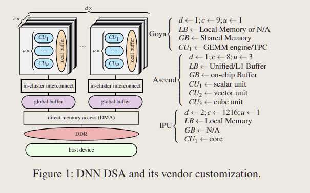

# Chimera：An Analytical Optimizing Framework for Effective Compute-intensive Operators Fusion

## back

2 types of operators in ML

- compute-intensive operators
- memory-intensive operators

DNN中的计算图框架 + 优化方法

benchmark

- TVM
- AStich
- CUTLASS

DSA platform

