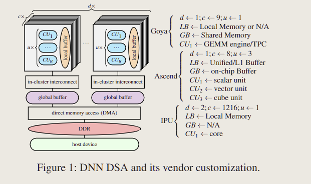
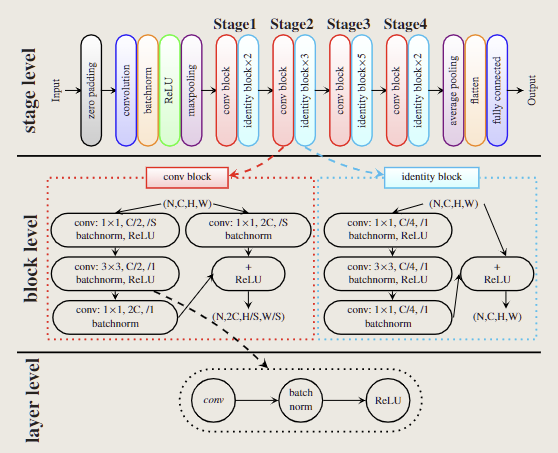
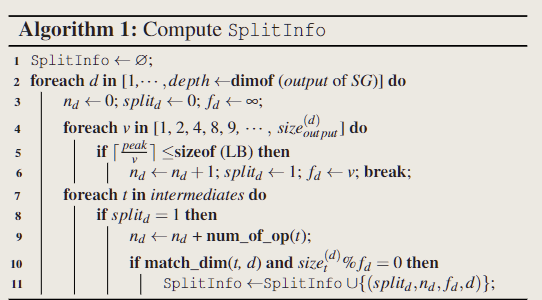
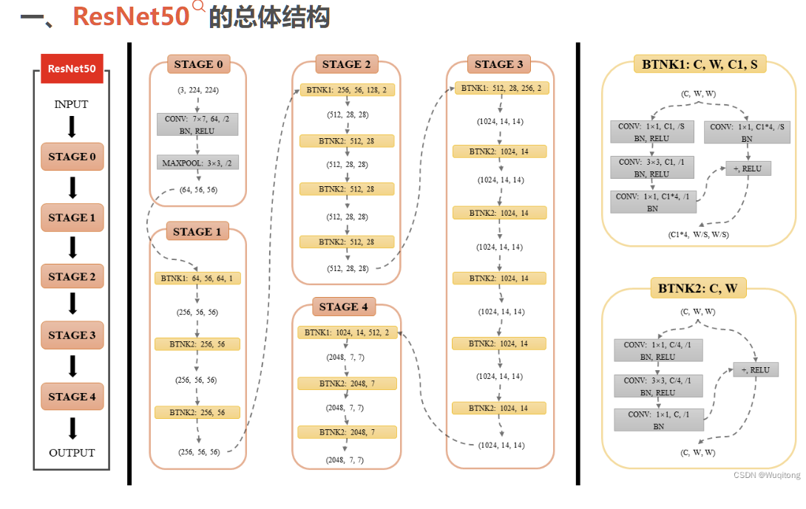
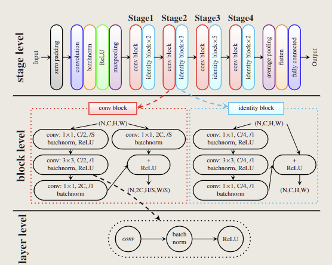
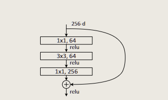
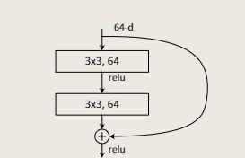

# Effectively Scheduling Computational Graphs of Deep Neural Networks toward Their Domain-Specific Accelerators

## 1 Introduction and Background

a commonly used DSA abstraction

#### DNN DSA examples:

- Habana Goya accelerator

  1个cluster，有9个cores，一片1个 GEMM engine/TPC

  - TPC: tensor-processing core with a scratchpad local buffer(LB)
  - GEMM: general matrix multiplication with no LB

  核在集群间链接，配有一个 global buffer（GB）

- Huawei Ascend 910 platform

  1个cluster，8个cores，3个计算单元

  - scalar unit：标量计算单元
  - vector unit：向量计算单元
  - cube unit：矩阵乘计算单元

- Graphcore IPU

  2个cluster，1216个核，每个核一个core

### 1.1 Concepts and Notations

#### Computational graphs

used by existing ML frameworks to represent DNN models

### 1.2 Challenges of Prior Work

### 1.3 Our Solution and the Organization of the Paper

#### existing tools to produce fine-grained sub-graphs

- TVM
- Google Xla
- Intel. onednn graph specification 1.0-alpha
- Glow: Graph Lowering Compiler Techniques for Neural Networks

#### 3 problems and promising solutions

- 细粒度子图引起的冗余核外数据移动

  解决方法：

  将细粒度子图转化为粗粒度子图，并产生更大的核，让更多的数据驻留core内部的存储器，而不是频繁与core外部进行数据交换

- 目前的优化工具虽然能够通过内存优化，循环变换，tiling，fusion等手段改进每个细粒度子图的硬件资源利用，但是没有办法充分利用层与层之间的跨层指令调度的机会

  比如可以将 跨层的内存操作和计算任务重叠。

  解决方法：

  一个新的子图必须能够组合各个层，甚至组合各个block，更好地隐藏内存延迟并利用计算单元之间的并行性
  >这个事情就像，粒度太小很难发掘更多有效信息，我们需要更大粒度做更global的优化

- 不同阶段内存的利用率显著不平衡

  寻找粗粒度子图之间的关联性

### 1.4 Contributions

- 认识到在 graph partitioning level考虑硬件架构的重要性，从而实现网络与硬件架构的协同
- 这种协同减少非核心数据移动，更好地满足有价值的本地内存，并允许跨层指令调度
- 设计并实现了一种新的调度方法 GraphTurbo，解决了DNN在DSA芯片上的部署
- 实验结果表明，GraphTurbo优于其他两个 SOTA的调度工具，并实现与供应商制作的代码相当的性能

## 2 Core Idea and Overview

exemplify the core idea and present the overview of GraphTurbo

### 2.1 Exemplifying the Core Idea

### 2.2 Overview of GraphTrubo

## 3 Scheduling  Sub-graph

constructs coarser-grained sub-graphs and schedules their instatnces

- address five issues

### 3.1 Collecting Splitting Information

GraphTurbo 依靠于 子图之间的producer-consumer联系 来组合成更大的group

这个部分收集获得子图间的硬件信息

这些信息被保存为一个 四元组 $(splid_d, n_d,f_d,d)$

`splitd`：该维度是否切分（1 代表已切分，0 代表未切分）。

`nd`：该维度上的操作数（包含切分点数和与该维度相关的中间操作）。

`fd`：找到的分块大小（决定如何沿该维度进行切分）。

`d`：当前处理的维度索引。 

### 3.2 Grouping Sub-graphs

### 理解

- 恒等块（identity block）

  

- 残差块（conv block）

  
